# Page: Monad: Project Overview

# Monad: Project Overview

<details>
<summary>Relevant source files</summary>

The following files were used as context for generating this wiki page:

- [.editorconfig](.editorconfig)
- [.monad/README.md](.monad/README.md)
- [.monad/context/README.md](.monad/context/README.md)
- [.monad/reports/README.md](.monad/reports/README.md)
- [Cargo.toml](Cargo.toml)
- [LICENSE](LICENSE)
- [README.md](README.md)
- [docs/01-project/00-vision/HOLY-GRAIL-VISION.md](docs/01-project/00-vision/HOLY-GRAIL-VISION.md)
- [docs/01-project/00-vision/PRODUCT-VISION.md](docs/01-project/00-vision/PRODUCT-VISION.md)
- [docs/01-project/01-charter/PRODUCT-CHARTER.md](docs/01-project/01-charter/PRODUCT-CHARTER.md)
- [docs/01-project/03-roadmap/MVP-ROADMAP.md](docs/01-project/03-roadmap/MVP-ROADMAP.md)
- [docs/02-product/MVP-SCOPE.md](docs/02-product/MVP-SCOPE.md)
- [docs/02-product/NON-GOALS.md](docs/02-product/NON-GOALS.md)
- [docs/02-product/PROBLEM-STATEMENT.md](docs/02-product/PROBLEM-STATEMENT.md)
- [docs/02-product/TARGET-USERS.md](docs/02-product/TARGET-USERS.md)
- [docs/02-product/VALUE-PROPOSITION.md](docs/02-product/VALUE-PROPOSITION.md)
- [docs/03-requirements/FUNCTIONAL-REQUIREMENTS.md](docs/03-requirements/FUNCTIONAL-REQUIREMENTS.md)
- [docs/03-requirements/MVP-REQUIREMENTS.md](docs/03-requirements/MVP-REQUIREMENTS.md)
- [docs/03-requirements/NONFUNCTIONAL-REQUIREMENTS.md](docs/03-requirements/NONFUNCTIONAL-REQUIREMENTS.md)
- [docs/04-domain/DOMAIN-MODEL.md](docs/04-domain/DOMAIN-MODEL.md)
- [docs/README.md](docs/README.md)
- [rust-toolchain.toml](rust-toolchain.toml)
- [work/README.md](work/README.md)

</details>


Monad is an AI-native, repo-native, local-first **Software Foundry OS** designed for understanding, verifying, and safely evolving software repositories [README.md:3-5](). It is built as a Rust-first developer tool that consolidates repository intelligence, context preservation, and supervised AI assistance into a unified workflow [docs/01-project/01-charter/PRODUCT-CHARTER.md:44-48]().

The project is currently in the **foundation phase**, focusing on establishing the repository structure, documentation architecture, and initial Rust core [README.md:9-18]().

### Core Thesis

Modern software development is often bottlenecked by scattered context, architectural drift, and low trust in generated changes [README.md:22-24](). Monad addresses these issues by treating the repository as the canonical source of truth for all durable decisions—including product, architecture, and workflow—rather than relying on external, non-versioned systems [README.md:39-50]().

The following diagram illustrates how Monad bridges the gap between high-level project intent and the underlying code entities.

**Diagram: Monad Context Bridge**
```mermaid
graph TD
    subgraph "Natural Language Space (Intent & Doctrine)"
        "Vision"["Product Vision"]
        "Charter"["Product Charter"]
        "ADRs"["Architecture Decision Records"]
    end

    subgraph "Monad Runtime (Code Entity Space)"
        "Core"["monad-core"]
        "CLI"["monad-cli"]
        "Workspace"["WorkspaceContext"]
    end

    subgraph "Repo-Native Artifacts"
        "Manifest"["monad.toml"]
        "ContextPack"["RepositoryContextPack"]
        "WorkDir"["work/"]
    end

    "Vision" --> "Charter"
    "Charter" --> "Manifest"
    "Manifest" --> "Workspace"
    "Workspace" --> "Core"
    "Core" --> "ContextPack"
    "CLI" -- "Commands" --> "Core"
    "ADRs" -- "Governs" --> "Core"
    "WorkDir" -- "Records" --> "ContextPack"
```
Sources: [README.md:3-35](), [docs/01-project/01-charter/PRODUCT-CHARTER.md:44-58](), [docs/05-architecture/SYSTEM-OVERVIEW.md]()

---

## Product Vision and Goals

The high-level ambition for Monad is to turn a software repository into a self-understanding and self-verifying system [docs/01-project/00-vision/HOLY-GRAIL-VISION.md:40-41](). The product is optimized for **trust** on real-world repositories rather than impressive demos on toy projects [docs/01-project/00-vision/HOLY-GRAIL-VISION.md:98-99]().

Key goals include:
*   **Repo-native truth:** Decisions live in versioned files [docs/01-project/00-vision/PRODUCT-VISION.md:90-95]().
*   **Verification over vibes:** Producing evidence-backed results instead of blind trust in AI [docs/01-project/00-vision/PRODUCT-VISION.md:108-113]().
*   **Human-in-command:** AI assists and recommends, but risky actions require explicit approval [docs/01-project/00-vision/PRODUCT-VISION.md:102-106]().

For details, see [Product Vision and Goals](#1.1).

Sources: [docs/01-project/00-vision/HOLY-GRAIL-VISION.md:31-55](), [docs/01-project/00-vision/PRODUCT-VISION.md:29-55]()

---

## Repository Structure and Navigation

The repository is organized to ensure that humans and AI assistants can navigate the project in a stable, predictable order [docs/README.md:29-30]().

| Directory | Purpose |
| :--- | :--- |
| `crates/` | Rust source code for `monad-cli` and `monad-core` [Cargo.toml:3-6](). |
| `docs/` | Canonical project documentation organized by area (00-16) [docs/README.md:31-49](). |
| `work/` | Repo-native work planning, epics, and delivery records [work/README.md:21-34](). |
| `.monad/` | Local state, generated context packs, and verification reports [README.md:58](), [.monad/README.md:21-36](). |
| `tools/` | Scripts for verification and GitHub integration [README.md:130-134](). |

**Diagram: Repository Organization**
```mermaid
graph LR
    "Root"["monad-workspace/"] --> "crates/"
    "Root" --> "docs/"
    "Root" --> "work/"
    "Root" --> ".monad/"
    
    subgraph "Code (Rust Workspace)"
        "crates/" --> "monad-cli/"
        "crates/" --> "monad-core/"
    end
    
    subgraph "Doctrine"
        "docs/" --> "05-architecture/"
        "docs/" --> "06-adrs/"
    end
    
    subgraph "Execution State"
        ".monad/" --> "context/"
        ".monad/" --> "reports/"
    end
```
For details, see [Repository Structure and Navigation](#1.2).

Sources: [README.md:52-65](), [Cargo.toml:1-6](), [.monad/README.md:29-36](), [work/README.md:28-34]()

---

## Getting Started (Local Development)

Monad is built using the **Rust 2024 edition** [Cargo.toml:10]() and follows a "Rust Apprenticeship Mode" to ensure the codebase remains beginner-readable and well-documented [docs/01-project/01-charter/PRODUCT-CHARTER.md:211-228]().

Development requires the following toolchain:
*   **Rust:** `cargo`, `rustup`, `clippy`, `rustfmt` [README.md:121-128]().
*   **Python 3:** Used for documentation and record verification scripts [README.md:127]().
*   **GitHub CLI (`gh`):** Used for issue and project automation [README.md:133]().

Standard verification is performed via `cargo test` and the provided `verify.sh` baseline script [README.md:136-142]().

For details, see [Getting Started (Local Development)](#1.3).

Sources: [README.md:117-150](), [Cargo.toml:8-27]()

---

# Page: Product Vision and Goals

# Product Vision and Goals

<details>
<summary>Relevant source files</summary>

The following files were used as context for generating this wiki page:

- [docs/01-project/00-vision/HOLY-GRAIL-VISION.md](docs/01-project/00-vision/HOLY-GRAIL-VISION.md)
- [docs/01-project/00-vision/PRODUCT-VISION.md](docs/01-project/00-vision/PRODUCT-VISION.md)
- [docs/01-project/01-charter/PRODUCT-CHARTER.md](docs/01-project/01-charter/PRODUCT-CHARTER.md)
- [docs/01-project/03-roadmap/MVP-ROADMAP.md](docs/01-project/03-roadmap/MVP-ROADMAP.md)
- [docs/02-product/MVP-SCOPE.md](docs/02-product/MVP-SCOPE.md)
- [docs/02-product/NON-GOALS.md](docs/02-product/NON-GOALS.md)
- [docs/02-product/PROBLEM-STATEMENT.md](docs/02-product/PROBLEM-STATEMENT.md)
- [docs/02-product/TARGET-USERS.md](docs/02-product/TARGET-USERS.md)
- [docs/02-product/VALUE-PROPOSITION.md](docs/02-product/VALUE-PROPOSITION.md)
- [docs/03-requirements/FUNCTIONAL-REQUIREMENTS.md](docs/03-requirements/FUNCTIONAL-REQUIREMENTS.md)
- [docs/03-requirements/MVP-REQUIREMENTS.md](docs/03-requirements/MVP-REQUIREMENTS.md)
- [docs/03-requirements/NONFUNCTIONAL-REQUIREMENTS.md](docs/03-requirements/NONFUNCTIONAL-REQUIREMENTS.md)
- [docs/04-domain/DOMAIN-MODEL.md](docs/04-domain/DOMAIN-MODEL.md)

</details>


This page defines the high-level ambition, core problem statement, and strategic goals for Monad. It outlines the transition from a repository as a collection of files to a **Software Foundry OS**—a self-understanding, self-verifying, and safely evolvable system.

## The Software Foundry OS Concept

Monad is defined as an AI-native, repo-native, local-first **Software Foundry OS** [docs/01-project/01-charter/PRODUCT-CHARTER.md:43-47](). The "Holy Grail" vision for the product is to move beyond autocomplete or task runners toward a system that can understand, verify, and safely evolve real-world repositories [docs/01-project/00-vision/HOLY-GRAIL-VISION.md:31-36]().

The core thesis is that software development is blocked not by the speed of code generation, but by scattered context, toolchain complexity, and architectural drift [docs/01-project/00-vision/PRODUCT-VISION.md:37-53](). Monad acts as the "connective tissue" across intent, requirements, architecture, and delivery [docs/01-project/00-vision/HOLY-GRAIL-VISION.md:202-221]().

### The Trust Contract
To achieve this vision, Monad adheres to a strict trust contract:
1. **Human-in-Command**: AI may assist, but risky actions (writes, commits, pushes) require explicit approval [docs/01-project/01-charter/PRODUCT-CHARTER.md:136-141]().
2. **Verification over "Vibes"**: The system must produce evidence (checks run, results observed) rather than asking for blind trust in generated output [docs/01-project/00-vision/PRODUCT-VISION.md:108-113]().
3. **Repo-Native Truth**: The repository is the canonical source of truth. Decisions, work packets, and context artifacts must be versioned and reviewable [docs/01-project/00-vision/PRODUCT-VISION.md:90-95]().

**Sources:** [docs/01-project/00-vision/HOLY-GRAIL-VISION.md:31-36](), [docs/01-project/01-charter/PRODUCT-CHARTER.md:43-47](), [docs/01-project/00-vision/PRODUCT-VISION.md:37-53](), [docs/01-project/01-charter/PRODUCT-CHARTER.md:136-141]()

---

## Problem Statement and Target Users

### The Problem
Software projects become difficult to change because knowledge is fragmented across code, docs, issues, and individual memory [docs/01-project/01-charter/PRODUCT-CHARTER.md:53-59](). Existing AI tools often lack the project-specific context or architectural awareness needed to make safe changes [docs/02-product/PROBLEM-STATEMENT.md:55-70]().

### Target Users
Monad is initially built for:
*   **Solo Builders**: Developers needing production-grade discipline without a large platform team [docs/02-product/TARGET-USERS.md:39-54]().
*   **AI-Assisted Developers**: Users seeking to turn ad-hoc AI chat into a repo-native, reviewable workflow [docs/02-product/TARGET-USERS.md:55-70]().
*   **Repo Maintainers & Auditors**: People needing to quickly understand unfamiliar codebases or perform health audits [docs/02-product/TARGET-USERS.md:71-102]().

**Sources:** [docs/01-project/01-charter/PRODUCT-CHARTER.md:53-59](), [docs/02-product/PROBLEM-STATEMENT.md:55-70](), [docs/02-product/TARGET-USERS.md:31-102]()

---

## MVP Scope and Success Criteria

The MVP (Minimum Viable Product) is focused on proving the core foundation: inspection, context generation, and verification.

### MVP Goals
| Goal | Description | Requirement |
| :--- | :--- | :--- |
| **Inspect** | Detect basic toolchains (Cargo, npm) and workspace structure. | `FR-007`, `FR-008` |
| **Context** | Generate repo-native artifacts for AI session continuity. | `FR-012`, `FR-013` |
| **Verify** | Run local checks and produce evidence packets. | `FR-018`, `FR-020` |
| **Evolve** | Plan safe file operations with dry-run support. | `FR-022`, `FR-024` |

### Non-Goals (Scope Protection)
Monad is **not** intended to be an IDE replacement, a CI/CD platform, or a fully autonomous coding agent [docs/02-product/NON-GOALS.md:35-89](). It coordinates native tools (like `cargo` or `npm`) rather than replacing them [docs/02-product/NON-GOALS.md:61-71]().

**Sources:** [docs/01-project/03-roadmap/MVP-ROADMAP.md:37-48](), [docs/03-requirements/FUNCTIONAL-REQUIREMENTS.md:98-237](), [docs/02-product/NON-GOALS.md:35-89]()

---

## Domain Model and System Flow

The following diagrams illustrate how Monad bridges the gap between high-level developer intent (Natural Language Space) and concrete code entities (Code Entity Space).

### Concept Mapping: Intent to Execution
This diagram shows how abstract concepts in the product vision map to specific modules and structures in `monad-core`.

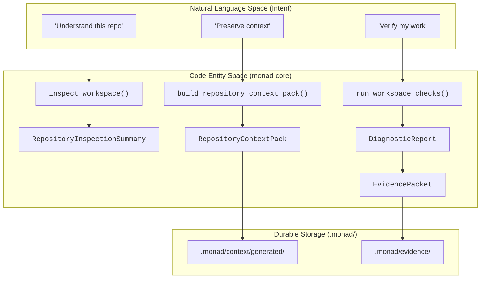
**Sources:** [docs/04-domain/DOMAIN-MODEL.md:38-59](), [docs/01-project/03-roadmap/MVP-ROADMAP.md:184-209](), [docs/03-requirements/FUNCTIONAL-REQUIREMENTS.md:98-237]()

### Domain Entity Relationships
The relationship between core domain objects as defined in the `monad-core` logic.

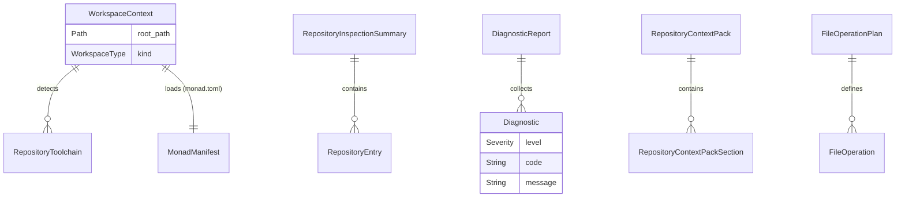
**Sources:** [docs/04-domain/DOMAIN-MODEL.md:61-100](), [docs/04-domain/DOMAIN-MODEL.md:229-277](), [docs/03-requirements/FUNCTIONAL-REQUIREMENTS.md:77-96]()

---

## Operating Model

Monad work follows a disciplined sequence to ensure that the repository remains the source of truth. Every change should move through these stages:

1.  **Intent**: Defined as a requirement or user request.
2.  **Context Retrieval**: Using `monad context` to gather repo-native state [docs/01-project/00-vision/HOLY-GRAIL-VISION.md:102-119]().
3.  **Work Packet**: The primary delivery unit, stored in `work/` [docs/01-project/01-charter/PRODUCT-CHARTER.md:194-210]().
4.  **Plan & Draft**: Created via the Evolution Engine with `--dry-run` [docs/03-requirements/FUNCTIONAL-REQUIREMENTS.md:249-257]().
5.  **Verification**: Executing `monad check` to produce an **Evidence Packet** [docs/04-domain/DOMAIN-MODEL.md:278-294]().
6.  **Handoff**: Updating context artifacts to reflect the new state [docs/08-context/CONTEXT-BRIDGE.md]().

**Sources:** [docs/01-project/00-vision/HOLY-GRAIL-VISION.md:102-119](), [docs/01-project/01-charter/PRODUCT-CHARTER.md:194-210](), [docs/04-domain/DOMAIN-MODEL.md:278-294]()

---

# Page: Repository Structure and Navigation

# Repository Structure and Navigation

<details>
<summary>Relevant source files</summary>

The following files were used as context for generating this wiki page:

- [.editorconfig](.editorconfig)
- [.monad/README.md](.monad/README.md)
- [.monad/context/README.md](.monad/context/README.md)
- [.monad/reports/README.md](.monad/reports/README.md)
- [Cargo.toml](Cargo.toml)
- [LICENSE](LICENSE)
- [README.md](README.md)
- [docs/00-meta/DOCUMENTATION-MAP.md](docs/00-meta/DOCUMENTATION-MAP.md)
- [docs/00-meta/DOCUMENTATION-STANDARD.md](docs/00-meta/DOCUMENTATION-STANDARD.md)
- [docs/00-meta/FRONTMATTER-STANDARD.md](docs/00-meta/FRONTMATTER-STANDARD.md)
- [docs/00-meta/NAMING-STANDARD.md](docs/00-meta/NAMING-STANDARD.md)
- [docs/00-meta/STATUS-STANDARD.md](docs/00-meta/STATUS-STANDARD.md)
- [docs/README.md](docs/README.md)
- [rust-toolchain.toml](rust-toolchain.toml)
- [work/README.md](work/README.md)

</details>


Monad is an AI-native, repo-native, local-first Software Foundry OS [README.md:3-3](). As a repo-native tool, Monad treats the repository itself as the canonical source of truth for durable product, architecture, workflow, and context decisions [README.md:37-41](). This page describes the top-level directory layout and the functional relationship between these directories.

## Top-Level Layout Overview

The repository is organized to support both human developers and AI assistants by providing stable, predictable locations for different types of information.

| Directory | Purpose | Visibility |
| :--- | :--- | :--- |
| `crates/` | Rust source code for the CLI and Core runtime. | Committed |
| `docs/` | Canonical project documentation (Vision, Architecture, Standards). | Committed |
| `work/` | Durable planning records (Epics, Work Packets, Tasks). | Committed |
| `.monad/` | Local state, generated context artifacts, and reports. | Mixed (See below) |
| `tools/` | Utility scripts and integration helpers (e.g., GitHub seeding). | Committed |
| `assets/` | Static assets, branding, and binary blobs. | Committed |

**Sources:** [README.md:52-65](), [Cargo.toml:3-6]()

### System Data Flow and Directory Relationships

The following diagram illustrates how information flows between the core implementation and the repository's organizational directories.

**Repository Entity Interaction**
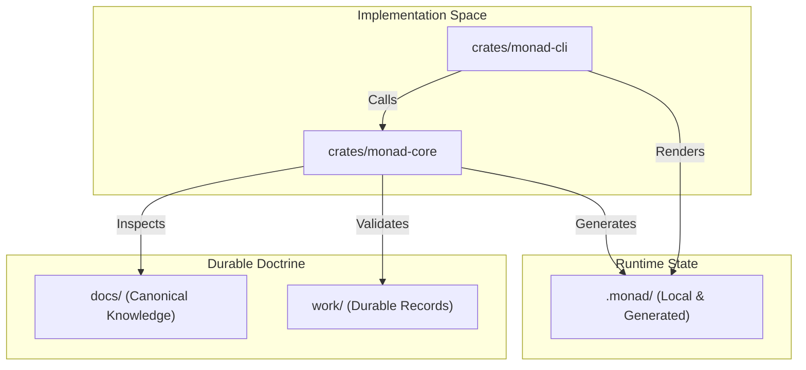
**Sources:** [docs/05-architecture/SYSTEM-OVERVIEW.md (referenced)](), [README.md:37-51]()

---

## 1. `crates/` (Source Code)

Monad is built as a Rust workspace [Cargo.toml:1-6](). It strictly separates the user interface from the business logic.

*   **`monad-cli`**: The thin interface layer responsible for argument parsing, command dispatch, and output formatting [docs/00-meta/NAMING-STANDARD.md:315-315]().
*   **`monad-core`**: The durable runtime library containing all intelligence, verification, and evolution logic [docs/00-meta/NAMING-STANDARD.md:316-316]().

**Sources:** [Cargo.toml:1-6](), [docs/00-meta/NAMING-STANDARD.md:308-327]()

## 2. `docs/` (Canonical Documentation)

Documentation is organized into numbered areas to preserve reading order and simplify AI context bootstrapping [docs/00-meta/NAMING-STANDARD.md:57-81]().

| Area | Name | Description |
| :--- | :--- | :--- |
| `00-meta/` | Documentation Meta | Standards for frontmatter, naming, and status [docs/00-meta/DOCUMENTATION-MAP.md:46-57](). |
| `01-project/` | Project Identity | Vision, Charter, and Roadmap [docs/01-project/ (referenced)](). |
| `05-architecture/` | Technical Design | System overview, module boundaries, and data flow [docs/05-architecture/ (referenced)](). |
| `06-adrs/` | Architecture Decisions | Formal Architecture Decision Records (ADRs) [docs/06-adrs/README.md:1-148](). |
| `07-workflow/` | Operating Model | Standards for Epics, Work Packets, and Commits [docs/07-workflow/ (referenced)](). |

**Sources:** [docs/README.md:27-49](), [docs/00-meta/DOCUMENTATION-MAP.md:44-306]()

## 3. `work/` (Durable Work Records)

While GitHub Issues are used for active execution tracking, the `work/` directory stores records that must be versioned with the code or used for handoffs [work/README.md:21-25]().

*   **`work/epics/`**: High-level capability goals (e.g., E1, E2) [work/README.md:30-30]().
*   **`work/packets/`**: Discrete units of work (e.g., WP-E1-001) [work/README.md:31-31]().
*   **`work/records/`**: Closeout notes and delivery summaries [work/README.md:33-33]().

**Sources:** [work/README.md:18-45](), [docs/00-meta/NAMING-STANDARD.md:154-193]()

## 4. `.monad/` (Local and Generated State)

This directory is the primary location for Monad-maintained state. It distinguishes between machine-local data and shareable context [ .monad/README.md:21-26]().

| Sub-directory | Content | Git Policy |
| :--- | :--- | :--- |
| `context/` | Current state, handoffs, and context packs. | Mixed (Handoffs often committed) |
| `reports/` | Verification and inspection reports. | Committed for review |
| `cache/` | Local performance cache. | Ignored |
| `local/` | Machine-specific state. | Ignored |

**Sources:** [.monad/README.md:27-36](), [.monad/context/README.md:18-30](), [.monad/reports/README.md:20-31]()

---

## Code Entity Mapping

This diagram maps repository directories to the specific Rust modules and logic that interact with them.

**Code to Directory Mapping**
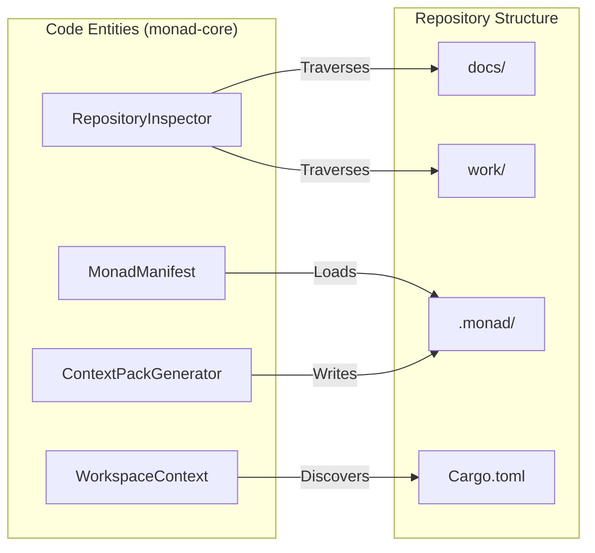
**Sources:** [Cargo.toml:1-6](), [.monad/README.md:21-26](), [docs/00-meta/NAMING-STANDARD.md:308-327]()

## 5. `tools/` and `assets/`

*   **`tools/`**: Contains verification scripts (e.g., `verify.sh`) and automation for GitHub (e.g., `tools/github/seed-e*.sh`) [README.md:130-134]().
*   **`assets/`**: Reserved for non-textual project artifacts, such as architecture diagrams or branding.

**Sources:** [README.md:117-151](), [docs/14-integrations/ (referenced)]()

---

# Page: Getting Started (Local Development)

# Getting Started (Local Development)

<details>
<summary>Relevant source files</summary>

The following files were used as context for generating this wiki page:

- [.editorconfig](.editorconfig)
- [.monad/README.md](.monad/README.md)
- [.monad/context/README.md](.monad/context/README.md)
- [.monad/reports/README.md](.monad/reports/README.md)
- [Cargo.lock](Cargo.lock)
- [Cargo.toml](Cargo.toml)
- [LICENSE](LICENSE)
- [README.md](README.md)
- [crates/monad-core/Cargo.toml](crates/monad-core/Cargo.toml)
- [docs/12-verification/CHECK-REGISTRY-STANDARD.md](docs/12-verification/CHECK-REGISTRY-STANDARD.md)
- [docs/12-verification/EVIDENCE-PACKET-STANDARD.md](docs/12-verification/EVIDENCE-PACKET-STANDARD.md)
- [docs/12-verification/EXIT-CODE-STANDARD.md](docs/12-verification/EXIT-CODE-STANDARD.md)
- [docs/12-verification/VERIFICATION-MODEL.md](docs/12-verification/VERIFICATION-MODEL.md)
- [docs/13-operations/LOCAL-DEVELOPMENT.md](docs/13-operations/LOCAL-DEVELOPMENT.md)
- [docs/13-operations/TOOLCHAIN-SETUP.md](docs/13-operations/TOOLCHAIN-SETUP.md)
- [docs/README.md](docs/README.md)
- [rust-toolchain.toml](rust-toolchain.toml)
- [work/README.md](work/README.md)

</details>


This page provides a step-by-step guide for setting up a local development environment for Monad. Monad is a Rust-first, local-first developer tool, and its build process is designed to be reproducible and straightforward.

## Prerequisites

Monad requires a set of standard development tools. Ensure these are installed and available in your system `PATH`.

### Required Toolchain
*   **Git**: For version control and repository management.
*   **Rustup**: The recommended installer for the Rust programming language.
*   **Cargo**: The Rust package manager and build system.
*   **Rust Components**: `rustfmt` (formatting) and `clippy` (linting).
*   **Python 3**: Used for lightweight repository scripts and documentation verification.
*   **GitHub CLI (gh)**: Required for issue and project automation.

Sources: [README.md:117-134](), [docs/13-operations/TOOLCHAIN-SETUP.md:28-45]()

### Rust Version Pinning
Monad uses a `rust-toolchain.toml` file at the repository root to ensure all developers use the same toolchain version and components.

| Field | Value | Description |
| :--- | :--- | :--- |
| **Channel** | `stable` | Ensures builds use the latest stable Rust release. |
| **Profile** | `default` | Standard set of tools. |
| **Components** | `rustfmt`, `clippy` | Mandatory linting and formatting tools. |

Sources: [rust-toolchain.toml:1-5](), [Cargo.toml:10-10]()

---

## Initial Setup

### 1. Clone the Repository
```bash
git clone https://github.com/thomascarter613/monad-workspace
cd monad-workspace
```

### 2. Configure Rust Components
Ensure the required components defined in `rust-toolchain.toml` are installed:
```bash
rustup component add rustfmt clippy
```
Sources: [docs/13-operations/TOOLCHAIN-SETUP.md:77-83]()

### 3. Verify GitHub CLI
If you intend to use the issue seeding scripts or project automation, authenticate with GitHub:
```bash
gh auth login
# For project automation, refresh scopes:
gh auth refresh -s project
```
Sources: [docs/13-operations/TOOLCHAIN-SETUP.md:104-125]()

---

## Building and Running

Monad is organized as a Rust workspace with two primary crates: `monad-cli` and `monad-core`.

### Build the Workspace
To compile both the library and the CLI:
```bash
cargo build
```
Sources: [Cargo.toml:1-6]()

### Running the CLI
During development, you can run the CLI directly using `cargo run`. Note that the CLI delegates logic to the core library.
```bash
# General help
cargo run --package monad-cli -- --help

# Check workspace status
cargo run --package monad-cli -- info
```
Sources: [README.md:102-104](), [Cargo.toml:3-6]()

---

## Verification and Quality Gates

Monad enforces strict quality standards through a multi-layered verification approach. Before submitting changes, you must run the following verification suite.

### Rust Verification Suite
```bash
# 1. Check formatting
cargo fmt --check

# 2. Run all tests
cargo test

# 3. Run lints (denying warnings)
cargo clippy --all-targets --all-features -- -D warnings
```
Sources: [README.md:136-142](), [docs/13-operations/TOOLCHAIN-SETUP.md:166-175]()

### Linting Policy
The workspace enforces specific lints in `Cargo.toml` to prevent common pitfalls in the codebase:
*   `unsafe_code = "forbid"`: No unsafe Rust allowed.
*   `unwrap_used = "warn"`: Prefer explicit error handling.
*   `panic = "warn"`: Avoid crashing the runtime.

Sources: [Cargo.toml:17-27]()

### Documentation Verification
Because Monad is "repo-native," documentation is a first-class citizen. Verify that all docs follow the [docs/00-meta/FRONTMATTER-STANDARD.md]() by running the Python-based verification:
```bash
# Basic file check
find docs -type f | sort
```
Sources: [README.md:144-150](), [docs/README.md:78-86]()

---

## Implementation Data Flow

The following diagram illustrates how the local development environment interacts with the codebase entities to produce a running system.

### Development Environment to Code Mapping
"This diagram maps the developer's local tools to the internal crate structure of Monad."

```mermaid
graph TD
    subgraph "Local_Environment"
        "cargo_bin[cargo]"
        "python_bin[python3]"
        "gh_bin[gh CLI]"
    end

    subgraph "Monad_Workspace[Cargo.toml]"
        subgraph "monad_cli_crate[crates/monad-cli]"
            "main_rs[src/main.rs]"
        end
        subgraph "monad_core_crate[crates/monad-core]"
            "lib_rs[src/lib.rs]"
            "workspace_rs[src/workspace.rs]"
        end
    end

    subgraph "Data_Artifacts[.monad/]"
        "context_dir[context/]"
        "reports_dir[reports/]"
    end

    "cargo_bin" -- "builds/runs" --> "main_rs"
    "main_rs" -- "calls" --> "lib_rs"
    "lib_rs" -- "manages" --> "workspace_rs"
    "workspace_rs" -- "reads/writes" --> "context_dir"
    "python_bin" -- "verifies" --> "Data_Artifacts"
```
Sources: [Cargo.toml:1-6](), [.monad/README.md:21-36](), [docs/13-operations/TOOLCHAIN-SETUP.md:28-39]()

### Verification Pipeline Flow
"This diagram bridges the natural language 'Verification' concept to the specific commands and files that execute it."

```mermaid
graph LR
    subgraph "Verification_Logic"
        "fmt_check[cargo fmt --check]"
        "clippy_check[cargo clippy]"
        "test_check[cargo test]"
        "frontmatter_check[check-markdown-frontmatter.py]"
    end

    subgraph "Standards_Doctrine[docs/]"
        "fmt_std[rust-toolchain.toml]"
        "lint_std[Cargo.toml workspace.lints]"
        "doc_std[docs/00-meta/FRONTMATTER-STANDARD.md]"
    end

    subgraph "Evidence_Generation[.monad/reports/]"
        "evidence_md[latest-verification.md]"
    end

    "fmt_std" --> "fmt_check"
    "lint_std" --> "clippy_check"
    "doc_std" --> "frontmatter_check"
    
    "fmt_check" --> "evidence_md"
    "clippy_check" --> "evidence_md"
    "test_check" --> "evidence_md"
    "frontmatter_check" --> "evidence_md"
```
Sources: [docs/12-verification/EVIDENCE-PACKET-STANDARD.md:48-61](), [docs/13-operations/TOOLCHAIN-SETUP.md:166-175](), [Cargo.toml:17-27]()

---

# Page: Core Architecture

# Core Architecture

<details>
<summary>Relevant source files</summary>

The following files were used as context for generating this wiki page:

- [.editorconfig](.editorconfig)
- [.monad/README.md](.monad/README.md)
- [.monad/context/README.md](.monad/context/README.md)
- [.monad/context/work-packet-handoffs/WP-E2-004.md](.monad/context/work-packet-handoffs/WP-E2-004.md)
- [.monad/reports/README.md](.monad/reports/README.md)
- [Cargo.toml](Cargo.toml)
- [LICENSE](LICENSE)
- [README.md](README.md)
- [docs/05-architecture/ARCHITECTURE-PRINCIPLES.md](docs/05-architecture/ARCHITECTURE-PRINCIPLES.md)
- [docs/05-architecture/MODULE-BOUNDARIES.md](docs/05-architecture/MODULE-BOUNDARIES.md)
- [docs/05-architecture/SYSTEM-OVERVIEW.md](docs/05-architecture/SYSTEM-OVERVIEW.md)
- [docs/06-adrs/ADR-0000-template.md](docs/06-adrs/ADR-0000-template.md)
- [docs/06-adrs/ADR-0001-use-rust-for-core-runtime.md](docs/06-adrs/ADR-0001-use-rust-for-core-runtime.md)
- [docs/06-adrs/ADR-0002-use-monad-as-unified-product-name.md](docs/06-adrs/ADR-0002-use-monad-as-unified-product-name.md)
- [docs/06-adrs/ADR-0003-use-repo-native-context-as-source-of-truth.md](docs/06-adrs/ADR-0003-use-repo-native-context-as-source-of-truth.md)
- [docs/06-adrs/ADR-0004-use-work-packets-as-primary-delivery-unit.md](docs/06-adrs/ADR-0004-use-work-packets-as-primary-delivery-unit.md)
- [docs/06-adrs/ADR-0005-use-multi-crate-rust-workspace.md](docs/06-adrs/ADR-0005-use-multi-crate-rust-workspace.md)
- [docs/06-adrs/ADR-0006-keep-cli-thin-and-core-durable.md](docs/06-adrs/ADR-0006-keep-cli-thin-and-core-durable.md)
- [docs/06-adrs/README.md](docs/06-adrs/README.md)
- [docs/README.md](docs/README.md)
- [rust-toolchain.toml](rust-toolchain.toml)
- [work/README.md](work/README.md)

</details>


The Monad architecture is designed to provide a trustworthy, local-first foundation for repository intelligence and safe software evolution. It follows a strict separation between user-facing interfaces and durable product logic, ensuring that the system remains deterministic, verifiable, and provider-agnostic.

## Architectural Principles

Monad is governed by a set of core principles that prioritize repository integrity and human agency. These principles guide all implementation decisions and are codified in the project's Architecture Decision Records (ADRs).

*   **Local-First:** Core value must be delivered without requiring cloud connectivity or hosted accounts [docs/05-architecture/ARCHITECTURE-PRINCIPLES.md:49-60]().
*   **Repo-Native:** The repository is the canonical source of truth for docs, ADRs, and context [docs/05-architecture/ARCHITECTURE-PRINCIPLES.md:29-41]().
*   **Human in Command:** Monad plans and recommends, but the human approves all consequential or destructive actions [docs/05-architecture/ARCHITECTURE-PRINCIPLES.md:68-80]().
*   **Verification Over Vibes:** Trust is earned through structured evidence and explicit check results rather than heuristic confidence [docs/05-architecture/ARCHITECTURE-PRINCIPLES.md:89-101]().
*   **Durable Core, Thin Surfaces:** Long-lived logic resides in a reusable library, keeping interfaces lightweight [docs/05-architecture/ARCHITECTURE-PRINCIPLES.md:127-138]().

For a full list of principles and accepted ADRs, see [Architecture Principles and ADRs](#2.1).

**Sources:** [docs/05-architecture/ARCHITECTURE-PRINCIPLES.md:21-245](), [docs/06-adrs/README.md:95-108]()

## Two-Crate Workspace Design

Monad is implemented as a Rust workspace to enforce physical boundaries between the interface and the engine [ADR-0001; ADR-0005]. This structure ensures that the core logic can eventually support multiple frontends (CLI, MCP, Daemon, or Desktop) without duplication.

### Workspace Structure
| Crate | Role | Key Responsibilities |
| :--- | :--- | :--- |
| `monad-cli` | Interface | Argument parsing, terminal rendering, command dispatch, exit codes. |
| `monad-core` | Runtime | Workspace discovery, manifest parsing, repository inspection, diagnostics, file operation planning. |

**Sources:** [Cargo.toml:1-6](), [docs/05-architecture/SYSTEM-OVERVIEW.md:69-75](), [docs/05-architecture/MODULE-BOUNDARIES.md:44-52]()

### Mapping Code Entities to Architectural Space

The following diagram illustrates how specific Rust entities in the codebase map to the high-level architectural boundaries.

**Diagram: Interface vs Runtime Boundaries**
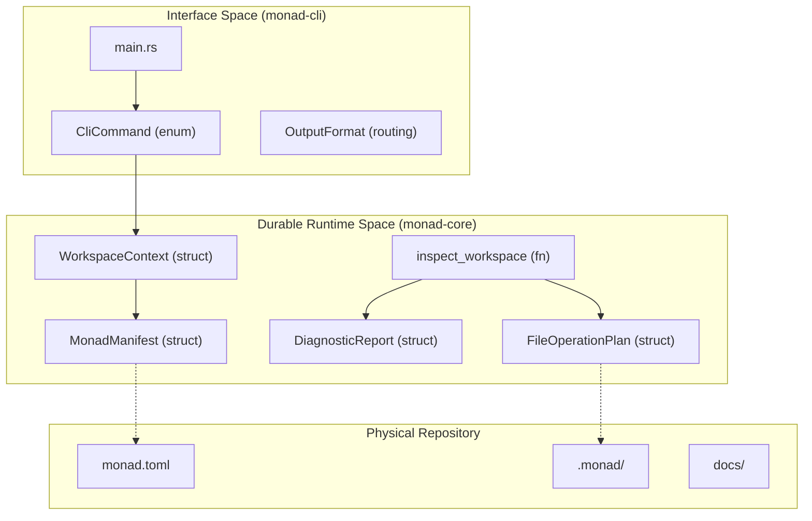
**Sources:** [docs/05-architecture/MODULE-BOUNDARIES.md:54-133](), [docs/05-architecture/SYSTEM-OVERVIEW.md:132-285]()

## Key Module Boundaries

The boundary between `monad-cli` and `monad-core` is the most critical interface in the system. The CLI is forbidden from owning any logic related to workspace discovery or repository intelligence [docs/05-architecture/MODULE-BOUNDARIES.md:77-87]().

### monad-core: The Durable Runtime
`monad-core` is a library crate that returns structured results. It is designed to be agnostic of terminal styling or shell-specific UX [docs/05-architecture/MODULE-BOUNDARIES.md:130-133](). Its internal modules handle specific domain concerns:
*   **`workspace`**: Root discovery and path normalization.
*   **`manifest`**: Loading and validating `monad.toml`.
*   **`repo_intelligence`**: Detecting toolchains, languages, and dependencies.
*   **`diagnostics`**: Standardized error and warning reporting.

For details, see [monad-core: The Durable Runtime Library](#2.2).

### monad-cli: The Thin Interface
`monad-cli` is a thin wrapper around the core library. It uses `clap` for argument parsing and routes user intent to core functions [docs/05-architecture/MODULE-BOUNDARIES.md:58-67](). It is responsible for translating `monad-core`'s structured outputs into human-readable terminal text or machine-readable JSON.

For details, see [monad-cli: The Thin Interface Layer](#2.3).

**Diagram: System Data Flow**
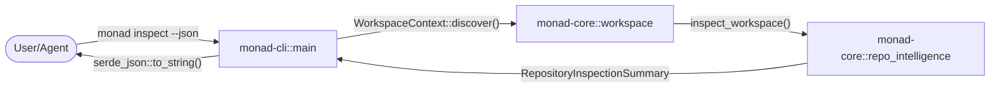
**Sources:** [docs/05-architecture/SYSTEM-OVERVIEW.md:39-48](), [docs/05-architecture/MODULE-BOUNDARIES.md:32-40]()

## Child Pages
*   [Architecture Principles and ADRs](#2.1) — Detailed coverage of the ten principles and the ADR registry.
*   [monad-core: The Durable Runtime Library](#2.2) — Deep dive into the core library's internal modules and API.
*   [monad-cli: The Thin Interface Layer](#2.3) — Technical overview of the CLI's command dispatch and rendering logic.

---

# Page: Architecture Principles and ADRs

# Architecture Principles and ADRs

<details>
<summary>Relevant source files</summary>

The following files were used as context for generating this wiki page:

- [.monad/context/work-packet-handoffs/WP-E2-004.md](.monad/context/work-packet-handoffs/WP-E2-004.md)
- [docs/05-architecture/ARCHITECTURE-PRINCIPLES.md](docs/05-architecture/ARCHITECTURE-PRINCIPLES.md)
- [docs/05-architecture/MODULE-BOUNDARIES.md](docs/05-architecture/MODULE-BOUNDARIES.md)
- [docs/05-architecture/SYSTEM-OVERVIEW.md](docs/05-architecture/SYSTEM-OVERVIEW.md)
- [docs/06-adrs/ADR-0000-template.md](docs/06-adrs/ADR-0000-template.md)
- [docs/06-adrs/ADR-0001-use-rust-for-core-runtime.md](docs/06-adrs/ADR-0001-use-rust-for-core-runtime.md)
- [docs/06-adrs/ADR-0002-use-monad-as-unified-product-name.md](docs/06-adrs/ADR-0002-use-monad-as-unified-product-name.md)
- [docs/06-adrs/ADR-0003-use-repo-native-context-as-source-of-truth.md](docs/06-adrs/ADR-0003-use-repo-native-context-as-source-of-truth.md)
- [docs/06-adrs/ADR-0004-use-work-packets-as-primary-delivery-unit.md](docs/06-adrs/ADR-0004-use-work-packets-as-primary-delivery-unit.md)
- [docs/06-adrs/ADR-0005-use-multi-crate-rust-workspace.md](docs/06-adrs/ADR-0005-use-multi-crate-rust-workspace.md)
- [docs/06-adrs/ADR-0006-keep-cli-thin-and-core-durable.md](docs/06-adrs/ADR-0006-keep-cli-thin-and-core-durable.md)
- [docs/06-adrs/README.md](docs/06-adrs/README.md)

</details>


This page documents the formal architecture principles and Architecture Decision Records (ADRs) that govern the Monad workspace. These standards ensure the system remains local-first, repo-native, and deterministic while providing a trustworthy foundation for AI-assisted software evolution.

## Architecture Principles

Monad is guided by twelve core principles designed to prevent architectural drift and maintain a high standard of safety and verification.

### Core Principles Summary

| Principle | Description | Key Implication |
| :--- | :--- | :--- |
| **Repo-Native Truth** | The repository is the canonical home for knowledge. | Docs, ADRs, and context live in `docs/`, `work/`, or `.monad/` [docs/05-architecture/ARCHITECTURE-PRINCIPLES.md:29-38](). |
| **Local-First** | Core value must work without cloud dependencies. | Inspection and verification run on local files [docs/05-architecture/ARCHITECTURE-PRINCIPLES.md:49-60](). |
| **Human in Command** | Humans are responsible for consequential actions. | Risky writes and commits require explicit human approval [docs/05-architecture/ARCHITECTURE-PRINCIPLES.md:68-80](). |
| **Verification Over Vibes** | Trust is earned through structured evidence. | Checks produce `DiagnosticReport` and evidence packets [docs/05-architecture/ARCHITECTURE-PRINCIPLES.md:89-100](). |
| **Tool Coordination** | Coordinate native tools rather than replacing them. | Monad orchestrates `cargo`, `npm`, `go`, etc., instead of reimplementing them [docs/05-architecture/ARCHITECTURE-PRINCIPLES.md:109-120](). |
| **Durable Core, Thin Surfaces** | Logic lives in core; interfaces stay thin. | `monad-cli` delegates all domain logic to `monad-core` [docs/05-architecture/ARCHITECTURE-PRINCIPLES.md:127-138](). |
| **Safe File Operations** | Model planned writes before applying them. | Dry-run mode and preview summaries are mandatory for evolution [docs/05-architecture/ARCHITECTURE-PRINCIPLES.md:146-159](). |
| **Context as Infrastructure** | Context is core infrastructure, not a convenience. | Handoffs and context packs are reviewable repository artifacts [docs/05-architecture/ARCHITECTURE-PRINCIPLES.md:168-182](). |
| **Provider-Agnostic AI** | Design for AI without provider lock-in. | Explicit abstractions for LLM providers; MVP works without paid APIs [docs/05-architecture/ARCHITECTURE-PRINCIPLES.md:189-200](). |
| **Explicit State** | Prefer explicit state over implicit assumptions. | Work status, check results, and config must be inspectable [docs/05-architecture/ARCHITECTURE-PRINCIPLES.md:207-218](). |

**Sources:** [docs/05-architecture/ARCHITECTURE-PRINCIPLES.md:21-245](), [docs/05-architecture/SYSTEM-OVERVIEW.md:50-65]()

---

## Architecture Decision Records (ADRs)

Monad uses ADRs to preserve consequential project decisions. These records are permanent and reside in `docs/06-adrs/` [docs/06-adrs/README.md:20-28]().

### ADR-0001: Use Rust for Core Runtime
Monad's durable core is implemented in Rust to ensure filesystem safety, performance, and the ability to distribute as a single binary [docs/06-adrs/ADR-0001-use-rust-for-core-runtime.md:49-58]().
*   **Rationale:** Strong compile-time safety, explicit error handling, and a robust ecosystem for CLI tools [docs/06-adrs/ADR-0001-use-rust-for-core-runtime.md:64-78]().
*   **Requirement:** Must use "Rust Apprenticeship Mode" (small slices, clear comments, beginner-readable) [docs/06-adrs/ADR-0001-use-rust-for-core-runtime.md:162-173]().

### ADR-0002: Monad as Unified Product Name
The project consolidates previous concepts (AionX, Foundry, Charon) under the single umbrella name **Monad** [docs/06-adrs/ADR-0002-use-monad-as-unified-product-name.md:47-53]().
*   **Subsystem Mapping:** "Charon" becomes the Context Bridge; "Foundry" becomes the Evolution Engine [docs/06-adrs/ADR-0002-use-monad-as-unified-product-name.md:115-125]().

### ADR-0005 & ADR-0006: Multi-Crate Workspace and Thin CLI
The system is structured as a Cargo workspace to enforce the "Durable Core, Thin Surface" principle [docs/05-architecture/MODULE-BOUNDARIES.md:44-52]().

#### System Entity Mapping
The following diagram bridges the high-level architectural components to the specific Rust entities and file locations.

**Logic Distribution and Data Flow**
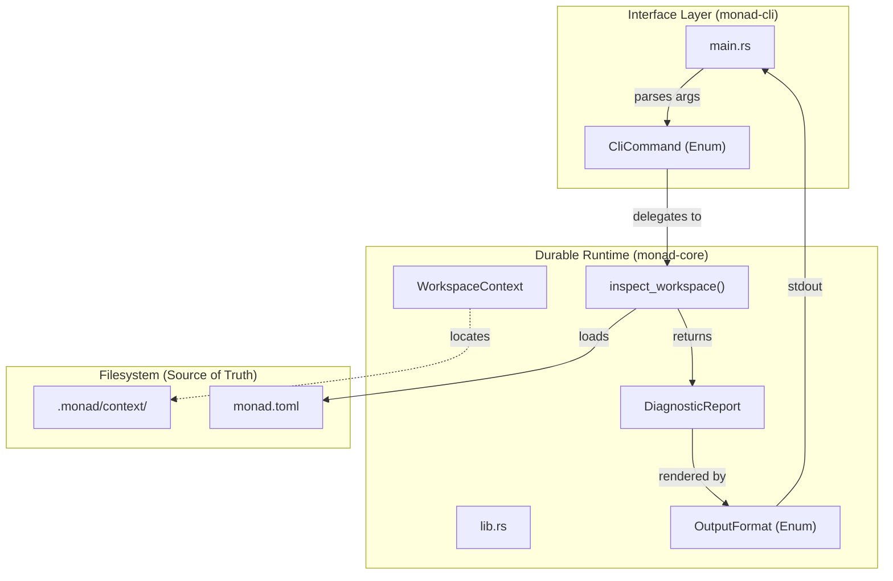
**Sources:** [docs/05-architecture/SYSTEM-OVERVIEW.md:69-107](), [docs/05-architecture/MODULE-BOUNDARIES.md:54-132](), [docs/06-adrs/ADR-0001-use-rust-for-core-runtime.md:53-63]()

---

## Crate and Module Boundaries

The architecture enforces strict boundaries between crates to ensure `monad-core` remains agnostic of the user interface.

### Crate Responsibilities

| Crate | Responsibility | Prohibited Logic |
| :--- | :--- | :--- |
| `monad-cli` | Arg parsing, command dispatch, terminal styling, exit codes [docs/05-architecture/MODULE-BOUNDARIES.md:58-67](). | Workspace discovery, file operation planning, AI provider logic [docs/05-architecture/MODULE-BOUNDARIES.md:77-87](). |
| `monad-core` | Domain models, manifest parsing, repo intelligence, verification, evolution planning [docs/05-architecture/MODULE-BOUNDARIES.md:96-113](). | Terminal-only rendering, CLI-specific assumptions, dependency on `monad-cli` [docs/05-architecture/MODULE-BOUNDARIES.md:121-129](). |

### Core Module Layout
`monad-core` is organized into functional areas that map to the product's major capabilities:

**Module-to-Entity Mapping**
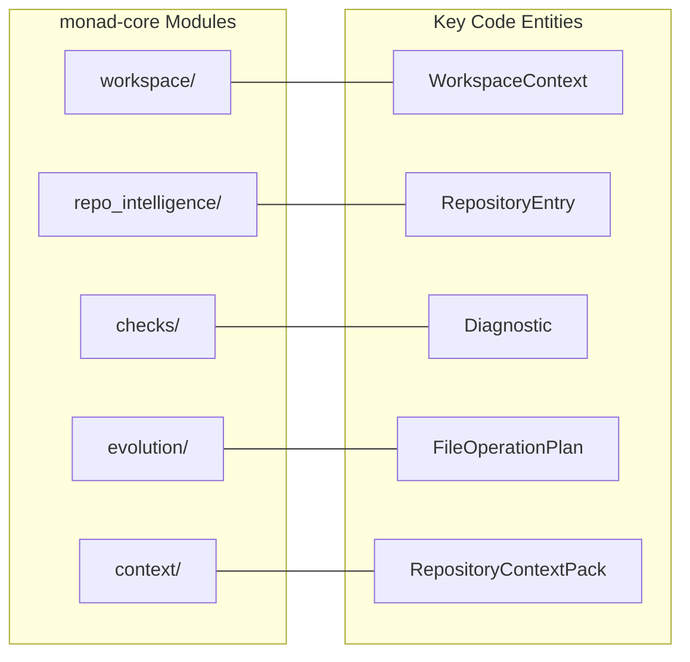
**Sources:** [docs/05-architecture/MODULE-BOUNDARIES.md:134-156](), [docs/05-architecture/SYSTEM-OVERVIEW.md:161-271]()

---

## Implementation Standards for ADRs

To maintain the integrity of the architecture, all new implementations must adhere to the following:

1.  **Deterministic Output:** Results from `monad-core` (like graphs and inspection reports) must be deterministic to ensure reviewability [docs/05-architecture/MODULE-BOUNDARIES.md:256]().
2.  **Structured Results:** Core functions must return structured data (Enums, Structs) rather than formatted strings. The interface layer determines the final presentation via `OutputFormat` [docs/05-architecture/MODULE-BOUNDARIES.md:132]().
3.  **Fail-Fast Verification:** All changes must pass the `verify.sh` baseline, which includes `cargo clippy` with `-D warnings` and CLI smoke tests [docs/06-adrs/ADR-0001-use-rust-for-core-runtime.md:186-193]().
4.  **No Hidden State:** Every decision or context artifact must be written to the repository. Chat history is never the source of truth [docs/05-architecture/ARCHITECTURE-PRINCIPLES.md:40-48]().

**Sources:** [docs/06-adrs/README.md:109-125](), [docs/05-architecture/ARCHITECTURE-PRINCIPLES.md:207-226](), [.monad/context/work-packet-handoffs/WP-E2-004.md:45-51]()

---

# Page: monad-core: The Durable Runtime Library

# monad-core: The Durable Runtime Library

<details>
<summary>Relevant source files</summary>

The following files were used as context for generating this wiki page:

- [crates/monad-cli/src/main.rs](crates/monad-cli/src/main.rs)
- [crates/monad-core/src/checks.rs](crates/monad-core/src/checks.rs)
- [crates/monad-core/src/dependency_detection.rs](crates/monad-core/src/dependency_detection.rs)
- [crates/monad-core/src/lib.rs](crates/monad-core/src/lib.rs)
- [crates/monad-core/src/manifest.rs](crates/monad-core/src/manifest.rs)
- [crates/monad-core/src/output.rs](crates/monad-core/src/output.rs)
- [crates/monad-core/src/repository_context_pack.rs](crates/monad-core/src/repository_context_pack.rs)
- [crates/monad-core/src/repository_policy.rs](crates/monad-core/src/repository_policy.rs)
- [crates/monad-core/src/toolchain_detection.rs](crates/monad-core/src/toolchain_detection.rs)
- [work/deliverables/E1/D-WP-E1-005-004-manifest-model-handoff.md](work/deliverables/E1/D-WP-E1-005-004-manifest-model-handoff.md)
- [work/deliverables/E1/README.md](work/deliverables/E1/README.md)
- [work/epics/E1-runtime-foundation.md](work/epics/E1-runtime-foundation.md)
- [work/packets/E1/README.md](work/packets/E1/README.md)
- [work/packets/E1/WP-E1-001-establish-rust-workspace-runtime-foundation.md](work/packets/E1/WP-E1-001-establish-rust-workspace-runtime-foundation.md)
- [work/tasks/E1/README.md](work/tasks/E1/README.md)
- [work/tasks/E1/T-WP-E1-001-004-add-rust-verification-to-baseline.md](work/tasks/E1/T-WP-E1-001-004-add-rust-verification-to-baseline.md)

</details>


The `monad-core` crate is the central engine of the Monad system. It is designed as a durable, reusable library that contains all repository intelligence, policy evaluation, and product logic [crates/monad-core/src/lib.rs:6-7](). By keeping this logic in a library rather than the CLI, Monad ensures that its core capabilities remain deterministic, testable, and accessible to future interfaces beyond the terminal.

## Core Module Structure

The library is organized into specialized modules that handle specific aspects of the repository lifecycle, from discovery to AI-ready context generation [crates/monad-core/src/lib.rs:9-21]().

| Module | Responsibility | Key Entities |
| :--- | :--- | :--- |
| `workspace` | Root discovery and context | `WorkspaceContext` |
| `manifest` | Configuration loading (`monad.toml`) | `MonadManifest` |
| `repository_inspection` | Filesystem traversal and classification | `inspect_workspace`, `RepositoryEntry` |
| `repository_graph` | Relationship modeling | `RepositoryGraph` |
| `toolchain_detection` | Ecosystem identification (Rust, JS, etc.) | `RepositoryToolchainKind` |
| `dependency_detection` | Manifest and lockfile identification | `RepositoryDependencySignal` |
| `repository_policy` | Advisory hygiene and safety checks | `RepositoryPolicyReport` |
| `repository_context_pack` | AI-readable artifact generation | `RepositoryContextPack` |
| `diagnostics` / `error` | Structured reporting and error handling | `Diagnostic`, `MonadError` |
| `output` | Deterministic formatting (Text/JSON) | `OutputFormat`, `WorkspaceSummary` |

**Sources:** [crates/monad-core/src/lib.rs:1-66]().

## From Filesystem to Code Entities

The following diagram illustrates how `monad-core` maps physical repository structures to internal code representations during the initialization and inspection phases.

### Workspace Initialization Flow
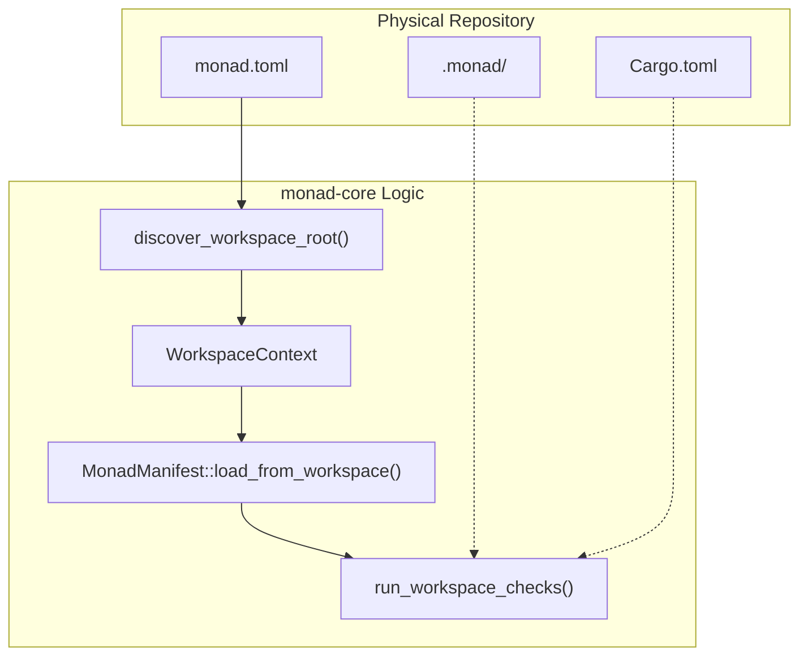
**Sources:** [crates/monad-core/src/workspace.rs:66-66](), [crates/monad-core/src/manifest.rs:127-129](), [crates/monad-core/src/checks.rs:21-36]().

## Intelligence Pipeline

The primary function of `monad-core` is to transform a raw repository into a structured intelligence model. This pipeline is deterministic and flows from shallow inspection to high-level policy evaluation.

1.  **Discovery:** `WorkspaceContext` identifies the repository root [crates/monad-core/src/workspace.rs:66-66]().
2.  **Inspection:** `inspect_workspace` performs a shallow scan of top-level entries [crates/monad-core/src/repository_inspection.rs:59-59]().
3.  **Traversal:** `traverse_workspace_bounded` performs a deeper, rule-based walk of the tree [crates/monad-core/src/repository_inspection.rs:59-59]().
4.  **Detection:** Toolchains and dependency signals are extracted from the traversal [crates/monad-core/src/toolchain_detection.rs:249-249](), [crates/monad-core/src/dependency_detection.rs:26-27]().
5.  **Modeling:** `RepositoryGraph` builds a node-edge model of the repository [crates/monad-core/src/repository_graph.rs:51-51]().
6.  **Policy:** `evaluate_repository_intelligence_policy` checks for hygiene issues like missing READMEs or lockfile drift [crates/monad-core/src/repository_policy.rs:182-195]().

### Intelligence Entity Mapping
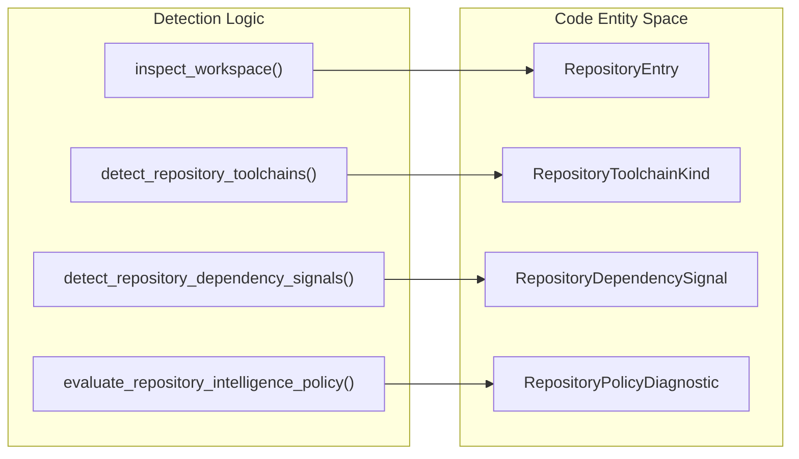
**Sources:** [crates/monad-core/src/repository_inspection.rs:55-59](), [crates/monad-core/src/toolchain_detection.rs:62-65](), [crates/monad-core/src/dependency_detection.rs:24-27](), [crates/monad-core/src/repository_policy.rs:61-62]().

## Runtime Identity and Manifests

`monad-core` defines the `RuntimeIdentity` which provides the "banner" and startup diagnostics for the system [crates/monad-core/src/lib.rs:68-95](). It also manages the `MonadManifest` (the `monad.toml` file), which defines project metadata and runtime execution models [crates/monad-core/src/manifest.rs:30-33]().

For details on how these configurations are enforced, see [Workspace, Manifest, and Repository Contract](#2.2.1).

## Structured Output and Errors

To support the "Thin CLI" principle, `monad-core` owns the `OutputFormat` (Text or JSON) and the logic for rendering complex summaries like `WorkspaceSummary` or `RepositoryInspectionSummary` [crates/monad-core/src/output.rs:24-38](), [crates/monad-core/src/output.rs:56-79]().

Errors are unified under the `MonadError` type, which can be converted into `Diagnostic` objects for consistent user reporting [crates/monad-core/src/error.rs:29-29]().

For details on the diagnostic system, see [Diagnostics, Errors, and Output Formatting](#2.2.2).

## Child Pages

- [Workspace, Manifest, and Repository Contract](#2.2.1) — Explains `WorkspaceContext`, `MonadManifest` loading, and the `RepositoryContract` check system.
- [Diagnostics, Errors, and Output Formatting](#2.2.2) — Covers structured diagnostics, the `MonadError` model, and the rendering layer.

---

# Page: Workspace, Manifest, and Repository Contract

# Workspace, Manifest, and Repository Contract

<details>
<summary>Relevant source files</summary>

The following files were used as context for generating this wiki page:

- [crates/monad-core/src/checks.rs](crates/monad-core/src/checks.rs)
- [crates/monad-core/src/manifest.rs](crates/monad-core/src/manifest.rs)
- [work/deliverables/E1/D-WP-E1-005-004-manifest-model-handoff.md](work/deliverables/E1/D-WP-E1-005-004-manifest-model-handoff.md)
- [work/deliverables/E1/D-WP-E1-006-004-manifest-loading-handoff.md](work/deliverables/E1/D-WP-E1-006-004-manifest-loading-handoff.md)
- [work/packets/E1/WP-E1-005-establish-manifest-model-foundation.md](work/packets/E1/WP-E1-005-establish-manifest-model-foundation.md)
- [work/packets/E1/WP-E1-006-establish-manifest-loading-foundation.md](work/packets/E1/WP-E1-006-establish-manifest-loading-foundation.md)
- [work/packets/E1/WP-E1-009-establish-repository-contract-check-foundation.md](work/packets/E1/WP-E1-009-establish-repository-contract-check-foundation.md)

</details>


The core of Monad's repository-native intelligence relies on three foundational components: the **WorkspaceContext**, the **MonadManifest**, and the **RepositoryContract**. Together, these systems provide a deterministic way to discover the repository root, load user intent from a configuration file, and enforce structural requirements on the repository's layout.

### Workspace Discovery and Context

The `WorkspaceContext` is the entry point for all Monad operations. It is responsible for identifying the repository root and providing canonical paths to essential files and directories.

#### Workspace Discovery Logic
Discovery is driven by "root markers"—specific files or directories that indicate the top level of a Monad-managed project [crates/monad-core/src/manifest.rs:130-132](). By default, Monad looks for:
* `monad.toml`
* `Cargo.toml`
* `.monad/`
* `work/`

#### Key Structure: WorkspaceContext
Defined in `workspace.rs`, this struct holds the absolute path to the discovered root and provides methods to derive standard sub-paths.

| Method | Purpose |
| :--- | :--- |
| `root()` | Returns the absolute path to the workspace root. |
| `monad_manifest_path()` | Returns the path to the `monad.toml` file. |
| `cargo_manifest_path()` | Returns the path to the `Cargo.toml` file. |
| `monad_dir()` | Returns the path to the `.monad/` internal directory. |

**Sources:** [crates/monad-core/src/workspace.rs](), [crates/monad-core/src/manifest.rs:143-152]()

---

### Monad Manifest (monad.toml)

The `monad.toml` file is the "repo-native intent file" [crates/monad-core/src/manifest.rs:3](). It defines the project's identity, workspace configuration, and runtime requirements.

#### Manifest Schema Versioning
Monad implements explicit schema versioning via the `ManifestSchemaVersion` newtype [crates/monad-core/src/manifest.rs:25](). This ensures the runtime can gracefully handle or reject manifests created for different versions of the Monad specification.
* **Current Version:** `1` [crates/monad-core/src/manifest.rs:18]().
* **Validation:** The `is_supported()` method checks if the manifest version matches the runtime's capability [crates/monad-core/src/manifest.rs:48-50]().

#### Data Model
The manifest is divided into three primary sections:
1.  **Project (`ManifestProject`):** Identity metadata including `name`, `display_name`, and `description` [crates/monad-core/src/manifest.rs:70-79]().
2.  **Workspace (`ManifestWorkspace`):** Configuration for root discovery markers [crates/monad-core/src/manifest.rs:129-132]().
3.  **Runtime (`ManifestRuntime`):** Specifies the crates used for `core` and `cli`, and the `execution_model` (e.g., "local-first") [crates/monad-core/src/manifest.rs:190-199]().

#### Loading and Validation
Manifests are loaded using `serde` for TOML deserialization [crates/monad-core/src/manifest.rs:12](). The `MonadManifest::load_from_workspace` function bridges the `WorkspaceContext` and the file system to produce a validated manifest [crates/monad-core/src/manifest.rs:78]().

**Sources:** [crates/monad-core/src/manifest.rs:1-245](), [work/packets/E1/WP-E1-005-establish-manifest-model-foundation.md](), [work/packets/E1/WP-E1-006-establish-manifest-loading-foundation.md]()

---

### Repository Contract and Checks

The Repository Contract is a machine-checkable statement of what files and directories are expected to exist within a workspace [work/packets/E1/WP-E1-009-establish-repository-contract-check-foundation.md:31-33]().

#### Required Paths
The system defines `RequiredPath` entities, which consist of a relative path and a `RequiredPathKind` (File or Directory). The `initial_monad()` contract enforces the existence of:
* `docs/`
* `work/`
* `.monad/`
* `crates/`
* `monad.toml`

#### Check Execution Flow
The `run_workspace_checks` function in `checks.rs` aggregates multiple diagnostic passes into a single `DiagnosticReport` [crates/monad-core/src/checks.rs:21-36](). This allows the system to report all structural failures at once rather than exiting on the first error.

#### Workspace Check Sequence Diagram
"Natural Language Space" to "Code Entity Space" mapping for the check pipeline.

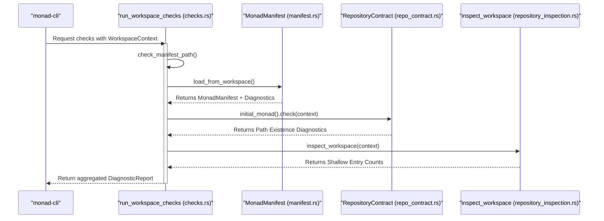
**Sources:** [crates/monad-core/src/checks.rs:21-36](), [crates/monad-core/src/repo_contract.rs](), [work/packets/E1/WP-E1-009-establish-repository-contract-check-foundation.md]()

---

### Data Flow: Discovery to Diagnostics

The following diagram illustrates how the system transitions from a raw file system path to a structured diagnostic report used by the CLI.

#### Workspace Entity Relationship
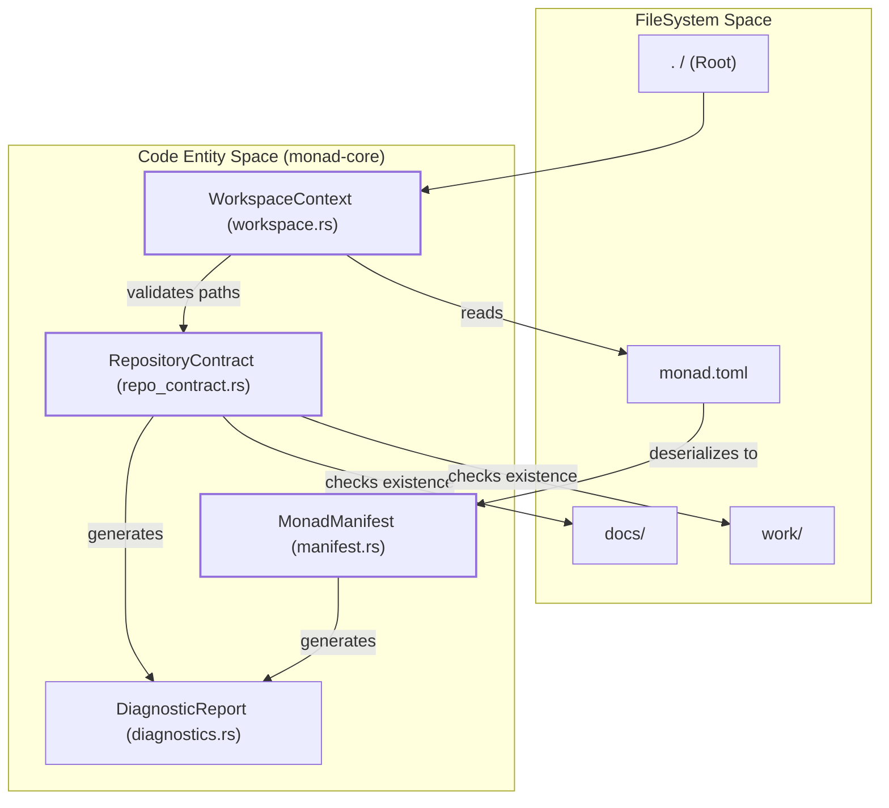

### Diagnostic Codes Reference
During the check process, the following codes are commonly generated:

| Code | Severity | Meaning |
| :--- | :--- | :--- |
| `MONAD4000` | INFO | Workspace root successfully detected [crates/monad-core/src/checks.rs:25](). |
| `MONAD4401` | ERROR | The `monad.toml` manifest is missing [crates/monad-core/src/checks.rs:49](). |
| `MONAD3001` | ERROR | Manifest `project.name` is empty [crates/monad-core/src/manifest.rs:103](). |
| `MONAD4500` | INFO | Repository contract check started/passed [work/packets/E1/WP-E1-009-establish-repository-contract-check-foundation.md:79](). |
| `MONAD4600` | INFO | Shallow repository inspection completed [crates/monad-core/src/checks.rs:124](). |

**Sources:** [crates/monad-core/src/checks.rs:39-137](), [crates/monad-core/src/manifest.rs:98-123](), [work/packets/E1/WP-E1-009-establish-repository-contract-check-foundation.md]()

---

# Page: Diagnostics, Errors, and Output Formatting

# Diagnostics, Errors, and Output Formatting

<details>
<summary>Relevant source files</summary>

The following files were used as context for generating this wiki page:

- [.monad/context/work-packet-handoffs/WP-E1-001.md](.monad/context/work-packet-handoffs/WP-E1-001.md)
- [.monad/context/work-packet-handoffs/WP-E2-002.md](.monad/context/work-packet-handoffs/WP-E2-002.md)
- [crates/monad-cli/src/main.rs](crates/monad-cli/src/main.rs)
- [crates/monad-core/src/dependency_detection.rs](crates/monad-core/src/dependency_detection.rs)
- [crates/monad-core/src/lib.rs](crates/monad-core/src/lib.rs)
- [crates/monad-core/src/output.rs](crates/monad-core/src/output.rs)
- [crates/monad-core/src/repository_context_pack.rs](crates/monad-core/src/repository_context_pack.rs)
- [crates/monad-core/src/repository_policy.rs](crates/monad-core/src/repository_policy.rs)
- [crates/monad-core/src/toolchain_detection.rs](crates/monad-core/src/toolchain_detection.rs)
- [work/deliverables/E1/D-WP-E1-002-003-diagnostics-context-handoff.md](work/deliverables/E1/D-WP-E1-002-003-diagnostics-context-handoff.md)
- [work/deliverables/E1/D-WP-E1-010-003-output-formatting-handoff.md](work/deliverables/E1/D-WP-E1-010-003-output-formatting-handoff.md)
- [work/deliverables/E2/D-WP-E2-002-001-inspection-summary-rendering.md](work/deliverables/E2/D-WP-E2-002-001-inspection-summary-rendering.md)
- [work/deliverables/E2/D-WP-E2-002-002-cli-inspect-command.md](work/deliverables/E2/D-WP-E2-002-002-cli-inspect-command.md)
- [work/deliverables/E2/D-WP-E2-002-003-inspect-json-output.md](work/deliverables/E2/D-WP-E2-002-003-inspect-json-output.md)
- [work/deliverables/E2/D-WP-E2-002-004-inspect-verification.md](work/deliverables/E2/D-WP-E2-002-004-inspect-verification.md)
- [work/packets/E1/WP-E1-010-establish-runtime-output-formatting-foundation.md](work/packets/E1/WP-E1-010-establish-runtime-output-formatting-foundation.md)

</details>


This page describes the systems responsible for error handling, diagnostic reporting, and structured output rendering in Monad. These systems ensure that durable logic in `monad-core` can communicate rich, formatted information to the `monad-cli` and external consumers (such as LLMs) in a consistent and deterministic manner.

## Error Handling with MonadResult

Monad utilizes a custom error type, `MonadError`, and a corresponding `MonadResult` alias to handle failures across the workspace. This pattern ensures that all errors originating in the core library carry sufficient context for the CLI to report them effectively.

### Key Entities
*   **`MonadError`**: An enum-backed struct that categorizes failures (e.g., IO, Manifest, Validation) [crates/monad-core/src/error.rs:12-29]().
*   **`MonadResult<T>`**: A type alias for `Result<T, MonadError>` [crates/monad-core/src/error.rs:10-10]().

### Sources
Sources: [crates/monad-core/src/error.rs:10-29](), [crates/monad-core/src/lib.rs:29-29]()

---

## Diagnostics and Severity

The Diagnostic system provides a structured way to report information, warnings, and errors that are not necessarily fatal to the process execution. Diagnostics are identified by stable codes (e.g., `MONAD0001`) to allow for machine-readable filtering and documentation mapping.

### Diagnostic Structure
A `Diagnostic` consists of:
*   **`Severity`**: Categorizes the impact (Info, Warning, Error) [crates/monad-core/src/diagnostics.rs:12-17]().
*   **`code`**: A stable string identifier [crates/monad-core/src/diagnostics.rs:21-21]().
*   **`message`**: A human-readable description [crates/monad-core/src/diagnostics.rs:22-22]().

### Diagnostic Flow: Core to CLI
The following diagram illustrates how a diagnostic is generated in `monad-core` and rendered by `monad-cli`.

**Diagnostic Generation and Rendering Flow**
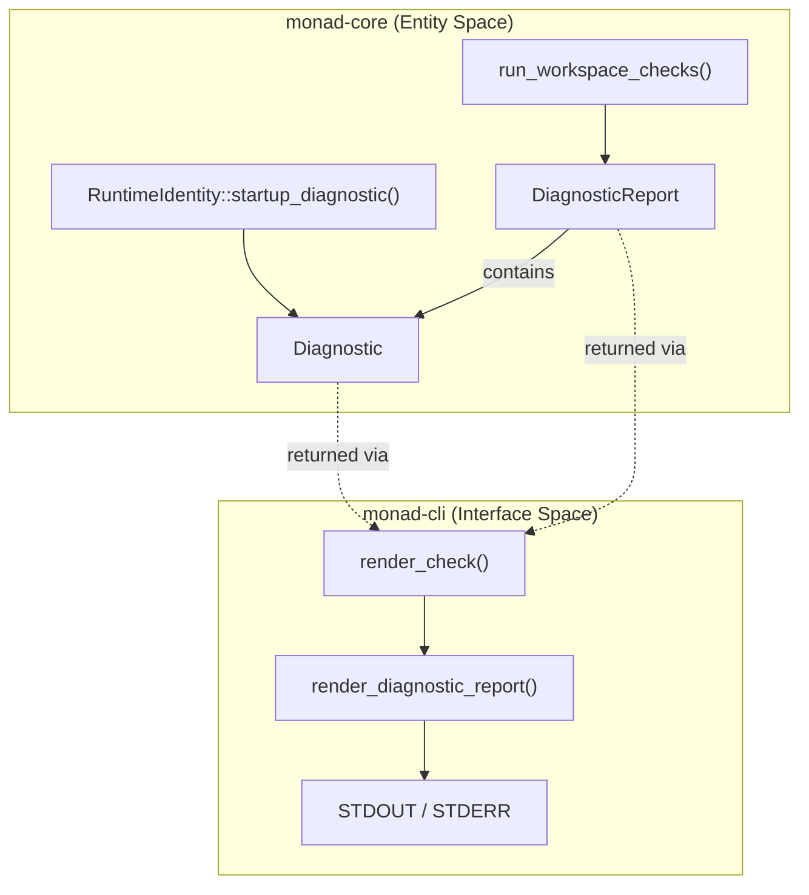
Sources: [crates/monad-core/src/lib.rs:93-95](), [crates/monad-core/src/diagnostics.rs:20-25](), [crates/monad-cli/src/main.rs:177-177](), [crates/monad-core/src/output.rs:310-315]()

---

## Output Formatting Layer

The output layer in `monad-core/src/output.rs` decouples the internal data models from their presentation. This allows the thin CLI to support multiple formats (Text, JSON) without owning the rendering logic.

### Supported Formats
The `OutputFormat` enum defines the primary rendering modes:
*   **`Text`**: Human-readable console output [crates/monad-core/src/output.rs:25-25]().
*   **`Json`**: Machine-readable structured data [crates/monad-core/src/output.rs:26-26]().

### Rendering Pipeline
The CLI parses the `--format` flag and passes the resulting `OutputFormat` back into core functions like `render_workspace_summary` or `render_repository_inspection_summary`.

| Feature | Data Structure | Rendering Function |
| :--- | :--- | :--- |
| Workspace Info | `WorkspaceSummary` | `render_workspace_summary` |
| Health Checks | `DiagnosticReport` | `render_diagnostic_report` |
| Inspection | `RepositoryInspectionSummary` | `render_repository_inspection_summary` |

### Code Entity Association
This diagram bridges the CLI command intent to the specific core rendering entities.

**CLI Command to Core Renderer Mapping**
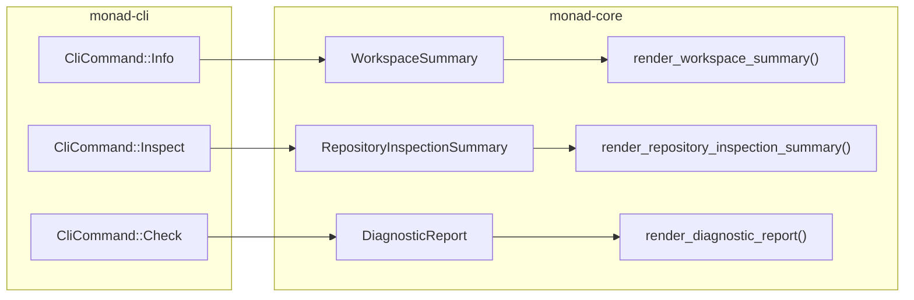
Sources: [crates/monad-cli/src/main.rs:35-50](), [crates/monad-core/src/output.rs:56-64](), [crates/monad-core/src/output.rs:111-163](), [crates/monad-core/src/output.rs:271-285](), [crates/monad-core/src/output.rs:310-315]()

---

## Repository Intelligence Policy Engine

The policy engine (`repository_policy.rs`) consumes repository intelligence and produces advisory diagnostics. These diagnostics follow the standard `Severity` and `Diagnostic` patterns but are specifically focused on repository hygiene and AI-readiness.

### Policy Diagnostic Codes
*   **`MONAD-RI-0001`**: Missing README [crates/monad-core/src/repository_policy.rs:207-207]().
*   **`MONAD-RI-0002`**: Missing License [crates/monad-core/src/repository_policy.rs:219-219]().
*   **`MONAD-RI-0301`**: Missing lockfile for a detected manifest [crates/monad-core/src/repository_policy.rs:236-236]().

### Integration with Context Packs
Policy reports are integrated into the `RepositoryContextPack`, allowing LLMs to receive structured feedback on the state of the repository during a session [crates/monad-core/src/repository_context_pack.rs:123-124]().

### Sources
Sources: [crates/monad-core/src/repository_policy.rs:113-115](), [crates/monad-core/src/repository_policy.rs:182-195](), [crates/monad-core/src/repository_context_pack.rs:107-128]()

---

# Page: monad-cli: The Thin Interface Layer

# monad-cli: The Thin Interface Layer

<details>
<summary>Relevant source files</summary>

The following files were used as context for generating this wiki page:

- [crates/monad-cli/src/main.rs](crates/monad-cli/src/main.rs)
- [crates/monad-core/src/dependency_detection.rs](crates/monad-core/src/dependency_detection.rs)
- [crates/monad-core/src/lib.rs](crates/monad-core/src/lib.rs)
- [crates/monad-core/src/output.rs](crates/monad-core/src/output.rs)
- [crates/monad-core/src/repository_context_pack.rs](crates/monad-core/src/repository_context_pack.rs)
- [crates/monad-core/src/repository_policy.rs](crates/monad-core/src/repository_policy.rs)
- [crates/monad-core/src/toolchain_detection.rs](crates/monad-core/src/toolchain_detection.rs)
- [docs/14-integrations/GITHUB-ISSUES-WORKFLOW.md](docs/14-integrations/GITHUB-ISSUES-WORKFLOW.md)
- [docs/14-integrations/GITHUB-PROJECTS-WORKFLOW.md](docs/14-integrations/GITHUB-PROJECTS-WORKFLOW.md)
- [docs/14-integrations/NATIVE-TOOL-ADAPTERS.md](docs/14-integrations/NATIVE-TOOL-ADAPTERS.md)
- [docs/16-reference/COMMAND-CATALOG.md](docs/16-reference/COMMAND-CATALOG.md)
- [docs/16-reference/TERMINOLOGY.md](docs/16-reference/TERMINOLOGY.md)
- [work/deliverables/E1/D-WP-E1-007-003-cli-info-handoff.md](work/deliverables/E1/D-WP-E1-007-003-cli-info-handoff.md)
- [work/packets/E1/WP-E1-007-establish-cli-info-command-foundation.md](work/packets/E1/WP-E1-007-establish-cli-info-command-foundation.md)

</details>


The `monad-cli` crate serves as the user-facing entry point for the Monad Software Foundry OS. Following the project's core architectural principles, it is designed as a "thin" layer responsible only for argument parsing, command dispatch, and final output presentation. All durable product logic, repository intelligence, and complex data transformations are delegated to the `monad-core` library.

### Architectural Purpose
The separation between `monad-cli` and `monad-core` ensures that Monad's intelligence can eventually be consumed by other interfaces (such as an MCP server or a GUI) without duplicating logic [crates/monad-cli/src/main.rs:1-8]().

## Command Dispatch and Implementation

The CLI uses a centralized `CliCommand` enum to represent user intent. This enum is the source of truth for all implemented operations [crates/monad-cli/src/main.rs:26-66]().

### Command Flow: Intent to Core
The lifecycle of a CLI execution follows a deterministic path:
1. **Argument Parsing**: `CliCommand::parse` processes `std::env::args` into a `CliCommand` variant [crates/monad-cli/src/main.rs:70-153]().
2. **Dispatch**: The `run` function matches the command and calls a specialized render function [crates/monad-cli/src/main.rs:170-185]().
3. **Core Delegation**: Render functions (e.g., `render_inspect`) invoke `monad-core` functions to perform the actual work [crates/monad-cli/src/main.rs:10-18]().
4. **Formatting**: The CLI receives structured data or a `MonadResult` and uses `monad-core` output primitives to generate the final string [crates/monad-core/src/output.rs:3-5]().

### CLI Execution Logic
Title: CLI Command Processing Pipeline
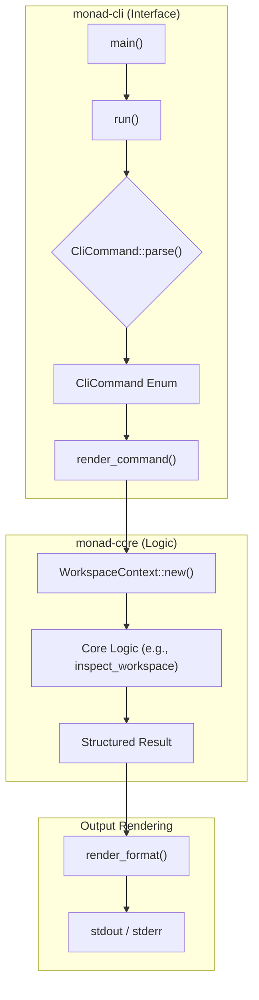
Sources: [crates/monad-cli/src/main.rs:156-185](), [crates/monad-core/src/lib.rs:139-157](), [crates/monad-core/src/output.rs:1-5]()

## Command Reference

The following table details the commands currently implemented in `monad-cli` and their corresponding core delegations.

| Command | Argument / Flag | Core Delegation Function | Purpose |
| :--- | :--- | :--- | :--- |
| `info` | `--format` | `workspace_summary_from_manifest` | Shows workspace root and manifest metadata. |
| `check` | `--format` | `run_workspace_checks` | Runs repository contract and diagnostic checks. |
| `inspect` | `--format` | `repository_inspection_summary_from_workspace` | Performs shallow and bounded traversal of the repo. |
| `graph` | `--format` | `render_repository_graph` | Generates text, JSON, Mermaid, or DOT graphs. |
| `context` | `--write`, `--format` | `export_repository_context_pack_from_workspace` | Generates AI-readable context packs. |
| `version` | N/A | `checked_runtime_identity` | Displays product name and execution model. |

Sources: [crates/monad-cli/src/main.rs:27-66](), [crates/monad-core/src/lib.rs:23-66]()

## Argument Parsing and Format Routing

The CLI implements a custom parser to handle flags like `--format` and `--write`. It enforces strict validation rules, such as rejecting the `--write` flag for any command other than `context` [crates/monad-cli/src/main.rs:188-194]().

### Format Routing Logic
Format flags are routed to specific enums in `monad-core` depending on the command context:
*   **Standard Output**: Uses `OutputFormat` (Text, Json) [crates/monad-core/src/output.rs:23-27]().
*   **Graph Output**: Uses `RepositoryGraphRenderFormat` (Text, Json, Mermaid, Dot) [crates/monad-core/src/repository_graph.rs:51-52]().
*   **Context Output**: Uses `RepositoryContextPackRenderFormat` (Markdown, Json) [crates/monad-core/src/repository_context_pack.rs:59-66]().

### Data Flow: From Input to Core Entity
Title: CLI Argument Mapping to Core Types
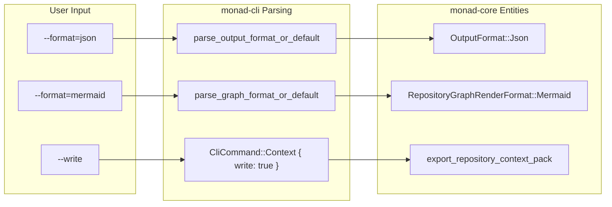
Sources: [crates/monad-cli/src/main.rs:199-225](), [crates/monad-core/src/output.rs:24-47](), [crates/monad-core/src/repository_graph.rs:51-53](), [crates/monad-core/src/repository_context_pack.rs:59-97]()

## Error Handling and Exit Codes

The CLI follows a standard exit code protocol:
*   **ExitCode::SUCCESS (0)**: Returned when the command completes and all internal core logic returns `Ok` [crates/monad-cli/src/main.rs:158-161]().
*   **ExitCode::FAILURE (1)**: Returned for parsing errors, workspace discovery failures, or core logic errors [crates/monad-cli/src/main.rs:162-165]().

Diagnostics produced by `monad-core` are rendered using `render_diagnostic_report`, ensuring that even when errors occur, the output remains structured and informative [crates/monad-cli/src/main.rs:10-18]().

Sources: [crates/monad-cli/src/main.rs:156-167](), [crates/monad-core/src/diagnostics.rs:1-11]()

---

# Page: Repository Intelligence Pipeline

# Repository Intelligence Pipeline

<details>
<summary>Relevant source files</summary>

The following files were used as context for generating this wiki page:

- [.monad/context/work-packet-handoffs/WP-E2-001.md](.monad/context/work-packet-handoffs/WP-E2-001.md)
- [crates/monad-cli/src/main.rs](crates/monad-cli/src/main.rs)
- [crates/monad-core/src/dependency_detection.rs](crates/monad-core/src/dependency_detection.rs)
- [crates/monad-core/src/lib.rs](crates/monad-core/src/lib.rs)
- [crates/monad-core/src/output.rs](crates/monad-core/src/output.rs)
- [crates/monad-core/src/repository_context_pack.rs](crates/monad-core/src/repository_context_pack.rs)
- [crates/monad-core/src/repository_policy.rs](crates/monad-core/src/repository_policy.rs)
- [crates/monad-core/src/toolchain_detection.rs](crates/monad-core/src/toolchain_detection.rs)
- [work/deliverables/E2/D-WP-E2-001-001-repository-inspection-module.md](work/deliverables/E2/D-WP-E2-001-001-repository-inspection-module.md)
- [work/epics/E2-repository-intelligence-foundation.md](work/epics/E2-repository-intelligence-foundation.md)
- [work/tasks/E2/T-WP-E2-001-001-add-repository-inspection-module.md](work/tasks/E2/T-WP-E2-001-001-add-repository-inspection-module.md)

</details>


The Repository Intelligence Pipeline is the core analytical engine of Monad. It transforms a raw directory structure into a high-fidelity, AI-readable model of the software repository. The pipeline operates as a series of deterministic stages, moving from shallow filesystem metadata to deep structural and policy analysis.

The pipeline is implemented entirely within `monad-core` [crates/monad-core/src/lib.rs:6-7](), ensuring that repository intelligence is durable and independent of the CLI interface.

### Pipeline Architecture

The pipeline follows a linear progression where each stage enriches the data collected by the previous one.

Title: Repository Intelligence Data Flow
```mermaid
graph TD
    subgraph "Filesystem Space"
        ROOT["Workspace Root"]
    end

    subgraph "monad-core Intelligence Pipeline"
        INSPECT["inspect_workspace()"]
        TRAVERSE["traverse_workspace_bounded()"]
        GRAPH["build_repository_graph()"]
        TOOLCHAIN["detect_repository_toolchains()"]
        DEPS["detect_repository_dependency_signals()"]
        POLICY["evaluate_repository_intelligence_policy()"]
    end

    subgraph "Artifact Space"
        PACK["RepositoryContextPack"]
        MD[".monad/context/generated/repository-context-pack.md"]
    end

    ROOT --> INSPECT
    INSPECT --> TRAVERSE
    TRAVERSE --> GRAPH
    TRAVERSE --> TOOLCHAIN
    TRAVERSE --> DEPS
    GRAPH & TOOLCHAIN & DEPS --> POLICY
    POLICY --> PACK
    PACK --> MD
```
**Sources:** [crates/monad-core/src/lib.rs:139-157](), [crates/monad-core/src/repository_context_pack.rs:15-23]()

---

### 3.1 Repository Inspection and Bounded Traversal
The pipeline begins with `inspect_workspace`, which performs a shallow scan of the workspace root to classify top-level entries [crates/monad-core/src/repository_inspection.rs:59](). This is followed by `traverse_workspace_bounded`, which explores the repository tree according to strict `RepositoryTraversalGuardrails` to prevent resource exhaustion in massive repositories.

Entries are classified into categories (e.g., `Source`, `BuildSystem`, `Documentation`) and roles (e.g., `Readme`, `Manifest`, `Lockfile`) [crates/monad-core/src/repository_inspection.rs:54-57]().

For details, see [Repository Inspection and Bounded Traversal](#3.1).

**Sources:** [crates/monad-core/src/repository_inspection.rs:54-60]()

### 3.2 Repository Graph Model and Rendering
Once the traversal is complete, `build_repository_graph` constructs a `RepositoryGraph` [crates/monad-core/src/repository_graph.rs:51](). This model represents the repository as a set of `RepositoryGraphNode` entities connected by `RepositoryGraphEdge` relationships.

The graph supports multiple deterministic rendering formats, including `mermaid` and `dot`, allowing for both human visualization and programmatic analysis [crates/monad-core/src/repository_graph.rs:51-53]().

For details, see [Repository Graph Model and Rendering](#3.2).

**Sources:** [crates/monad-core/src/repository_graph.rs:49-53]()

### 3.3 Toolchain and Dependency Detection
Monad uses signal-based detection to identify the technologies used within a repository without invoking external package managers or parsing file contents.
* **Toolchains:** Detects ecosystems like `Rust`, `TypeScript`, or `Go` via `detect_repository_toolchains` [crates/monad-core/src/toolchain_detection.rs:64]().
* **Dependencies:** Identifies `Manifest`, `Lockfile`, and `BuildFile` signals via `detect_repository_dependency_signals` [crates/monad-core/src/dependency_detection.rs:24-27]().

For details, see [Toolchain and Dependency Detection](#3.3).

**Sources:** [crates/monad-core/src/toolchain_detection.rs:62-65](), [crates/monad-core/src/dependency_detection.rs:24-27]()

### 3.4 Repository Intelligence Policy Engine
The final analytical stage is the `evaluate_repository_intelligence_policy` function [crates/monad-core/src/repository_policy.rs:182](). This engine evaluates the gathered intelligence against a set of best-practice rules. It generates a `RepositoryPolicyReport` containing advisory diagnostics, such as missing READMEs (`MONAD-RI-0001`) or lockfile drift [crates/monad-core/src/repository_policy.rs:202-212]().

For details, see [Repository Intelligence Policy Engine](#3.4).

**Sources:** [crates/monad-core/src/repository_policy.rs:61](), [crates/monad-core/src/repository_policy.rs:113-116]()

---

### Context Pack Assembly
The culmination of the pipeline is the assembly of the `RepositoryContextPack`. This structure aggregates all previous stages into a unified, AI-native "Read Model" of the repository [crates/monad-core/src/repository_context_pack.rs:15-23]().

Title: Pipeline to Code Entity Mapping
```mermaid
graph LR
    subgraph "Pipeline Stage"
        S1["Inspection"]
        S2["Graphing"]
        S3["Detection"]
        S4["Policy"]
    end

    subgraph "Code Entities (monad-core)"
        E1["inspect_workspace()"]
        E2["RepositoryGraph"]
        E3["RepositoryToolchainKind"]
        E4["RepositoryPolicyReport"]
    end

    subgraph "CLI Command (monad-cli)"
        C1["monad inspect"]
        C2["monad graph"]
        C3["monad check"]
    end

    S1 --> E1 --> C1
    S2 --> E2 --> C2
    S3 --> E3 --> C1
    S4 --> E4 --> C3
```
**Sources:** [crates/monad-cli/src/main.rs:10-18](), [crates/monad-core/src/lib.rs:139-157]()

The `RepositoryContextPack` can be rendered to Markdown or JSON and exported to the `.monad/context/generated/` directory using the `monad context --write` command [crates/monad-core/src/repository_context_pack.rs:42-48]().

**Sources:** [crates/monad-core/src/repository_context_pack.rs:42-48](), [crates/monad-cli/src/main.rs:59-65]()

---

# Page: Repository Inspection and Bounded Traversal

# Repository Inspection and Bounded Traversal

<details>
<summary>Relevant source files</summary>

The following files were used as context for generating this wiki page:

- [.monad/context/work-packet-handoffs/WP-E2-003.md](.monad/context/work-packet-handoffs/WP-E2-003.md)
- [.monad/context/work-packet-handoffs/WP-E2-005.md](.monad/context/work-packet-handoffs/WP-E2-005.md)
- [.monad/context/work-packet-handoffs/WP-E2-006.md](.monad/context/work-packet-handoffs/WP-E2-006.md)
- [crates/monad-core/src/repository_inspection.rs](crates/monad-core/src/repository_inspection.rs)
- [work/deliverables/E2/D-WP-E2-003-001-expanded-repository-entry-roles.md](work/deliverables/E2/D-WP-E2-003-001-expanded-repository-entry-roles.md)
- [work/deliverables/E2/D-WP-E2-003-002-expanded-classification-rules.md](work/deliverables/E2/D-WP-E2-003-002-expanded-classification-rules.md)
- [work/deliverables/E2/D-WP-E2-003-003-traversal-policy-hardening.md](work/deliverables/E2/D-WP-E2-003-003-traversal-policy-hardening.md)
- [work/deliverables/E2/D-WP-E2-003-004-classification-handoff.md](work/deliverables/E2/D-WP-E2-003-004-classification-handoff.md)
- [work/deliverables/E2/D-WP-E2-005-001-traversal-planning-types.md](work/deliverables/E2/D-WP-E2-005-001-traversal-planning-types.md)
- [work/deliverables/E2/D-WP-E2-005-002-conservative-traversal-guardrails.md](work/deliverables/E2/D-WP-E2-005-002-conservative-traversal-guardrails.md)
- [work/deliverables/E2/D-WP-E2-005-003-traversal-plan-output.md](work/deliverables/E2/D-WP-E2-005-003-traversal-plan-output.md)
- [work/deliverables/E2/D-WP-E2-005-004-traversal-guardrails-handoff.md](work/deliverables/E2/D-WP-E2-005-004-traversal-guardrails-handoff.md)
- [work/deliverables/E2/D-WP-E2-006-001-bounded-traversal-model.md](work/deliverables/E2/D-WP-E2-006-001-bounded-traversal-model.md)
- [work/deliverables/E2/D-WP-E2-006-002-bounded-traversal-implementation.md](work/deliverables/E2/D-WP-E2-006-002-bounded-traversal-implementation.md)
- [work/deliverables/E2/D-WP-E2-006-003-basic-ignore-rule-support.md](work/deliverables/E2/D-WP-E2-006-003-basic-ignore-rule-support.md)
- [work/deliverables/E2/D-WP-E2-006-004-bounded-traversal-output.md](work/deliverables/E2/D-WP-E2-006-004-bounded-traversal-output.md)
- [work/packets/E2/WP-E2-001-establish-repository-inspection-foundation.md](work/packets/E2/WP-E2-001-establish-repository-inspection-foundation.md)
- [work/packets/E2/WP-E2-003-enrich-repository-inspection-classification.md](work/packets/E2/WP-E2-003-enrich-repository-inspection-classification.md)
- [work/packets/E2/WP-E2-005-add-recursive-traversal-plan-and-guardrails.md](work/packets/E2/WP-E2-005-add-recursive-traversal-plan-and-guardrails.md)
- [work/packets/E2/WP-E2-006-implement-bounded-repository-traversal-foundation.md](work/packets/E2/WP-E2-006-implement-bounded-repository-traversal-foundation.md)
- [work/tasks/E2/T-WP-E2-003-001-expand-repository-entry-roles.md](work/tasks/E2/T-WP-E2-003-001-expand-repository-entry-roles.md)
- [work/tasks/E2/T-WP-E2-003-002-expand-classification-rules.md](work/tasks/E2/T-WP-E2-003-002-expand-classification-rules.md)
- [work/tasks/E2/T-WP-E2-003-003-harden-traversal-policy.md](work/tasks/E2/T-WP-E2-003-003-harden-traversal-policy.md)
- [work/tasks/E2/T-WP-E2-003-004-update-e2-classification-records.md](work/tasks/E2/T-WP-E2-003-004-update-e2-classification-records.md)
- [work/tasks/E2/T-WP-E2-005-001-add-traversal-planning-types.md](work/tasks/E2/T-WP-E2-005-001-add-traversal-planning-types.md)
- [work/tasks/E2/T-WP-E2-005-002-add-conservative-traversal-guardrails.md](work/tasks/E2/T-WP-E2-005-002-add-conservative-traversal-guardrails.md)
- [work/tasks/E2/T-WP-E2-006-001-add-bounded-traversal-model.md](work/tasks/E2/T-WP-E2-006-001-add-bounded-traversal-model.md)
- [work/tasks/E2/T-WP-E2-006-002-implement-bounded-traversal.md](work/tasks/E2/T-WP-E2-006-002-implement-bounded-traversal.md)
- [work/tasks/E2/T-WP-E2-006-003-add-basic-ignore-rule-support.md](work/tasks/E2/T-WP-E2-006-003-add-basic-ignore-rule-support.md)

</details>


This page provides a deep dive into the repository intelligence primitives of Monad. It covers the mechanisms for classifying repository entries, the conservative guardrails governing filesystem exploration, and the implementation of bounded recursive traversal.

## Overview

The repository inspection system, located in `crates/monad-core/src/repository_inspection.rs`, transforms raw filesystem paths into a structured, typed model [crates/monad-core/src/repository_inspection.rs:1-14](). The system operates on two primary levels:
1.  **Shallow Inspection**: A top-level scan of the workspace root to identify major project boundaries and configuration files.
2.  **Bounded Traversal**: A recursive, guardrail-constrained walk of the directory tree to build a more comprehensive view of the repository structure [crates/monad-core/src/repository_inspection.rs:7-14]().

### Repository Inspection Logic Flow

The following diagram illustrates the transition from raw filesystem data to the typed `RepositoryEntry` model used throughout the intelligence pipeline.

**Diagram: Filesystem to Typed Entry Flow**
```mermaid
graph TD
    subgraph "Natural Language Space"
        A["Project Files & Folders"]
    end

    subgraph "Code Entity Space: repository_inspection.rs"
        B["inspect_workspace"]
        C["classify_path"]
        D["RepositoryEntryKind"]
        E["RepositoryEntryRole"]
        F["RepositoryEntryCategory"]
        G["RepositoryEntry"]
    end

    A --> B
    B --> C
    C --> D
    C --> E
    E --> F
    D & E & F --> G
```
Sources: [crates/monad-core/src/repository_inspection.rs:16-162](), [crates/monad-core/src/repository_inspection.rs:201-220]()

---

## Entry Classification and Taxonomy

Monad uses a three-tier taxonomy to describe every file and directory discovered in a workspace.

### RepositoryEntryKind
Represents the fundamental filesystem type [crates/monad-core/src/repository_inspection.rs:41-47]().
*   `File`
*   `Directory`
*   `Symlink` (Note: Monad does not follow symlinks by default [crates/monad-core/src/repository_inspection.rs:11]())
*   `Other`

### RepositoryEntryRole
A high-granularity classification identifying the specific purpose of an entry [crates/monad-core/src/repository_inspection.rs:131-162](). Examples include:
*   `MonadManifest`: The `monad.toml` file [crates/monad-core/src/repository_inspection.rs:168]().
*   `RustWorkspaceManifest`: `Cargo.toml` at the root [crates/monad-core/src/repository_inspection.rs:169]().
*   `WorkRoot`: The `work/` directory containing project management records [crates/monad-core/src/repository_inspection.rs:182]().
*   `GeneratedOrExternal`: Directories like `target/` or `node_modules/` [crates/monad-core/src/repository_inspection.rs:195]().

### RepositoryEntryCategory
A mid-level grouping derived automatically from the `RepositoryEntryRole` [crates/monad-core/src/repository_inspection.rs:75-98]().
*   `MonadControl`: Core Monad configuration and state [crates/monad-core/src/repository_inspection.rs:104]().
*   `RustRuntime`: Cargo manifests, lockfiles, and toolchain configs [crates/monad-core/src/repository_inspection.rs:108]().
*   `WorkManagement`: Epics, work packets, and tasks [crates/monad-core/src/repository_inspection.rs:107]().

Sources: [crates/monad-core/src/repository_inspection.rs:41-220]()

---

## Traversal Guardrails and Safety

To prevent Monad from descending into massive external dependency trees (like `node_modules`) or getting stuck in infinite symlink loops, the system employs strict `RepositoryTraversalGuardrails` [work/tasks/E2/T-WP-E2-005-002-add-conservative-traversal-guardrails.md:14-31]().

### Default Guardrail Configuration
The default settings are designed for safety and performance [work/packets/E2/WP-E2-005-add-recursive-traversal-plan-and-guardrails.md:40-47]():

| Guardrail | Default Value | Purpose |
| :--- | :--- | :--- |
| `max_depth` | `3` | Limits the depth of recursive directory walking [.monad/context/work-packet-handoffs/WP-E2-005.md:42](). |
| `follow_symlinks` | `false` | Prevents escaping the workspace or infinite loops [crates/monad-core/src/repository_inspection.rs:11](). |
| `include_generated` | `false` | Skips directories known to contain build artifacts or external code [crates/monad-core/src/repository_inspection.rs:12](). |
| `respect_ignore` | `true` | Honors `.gitignore` and Monad-specific ignore rules [crates/monad-core/src/repository_inspection.rs:13](). |
| `deterministic` | `true` | Ensures child entries are sorted by name for stable output [crates/monad-core/src/repository_inspection.rs:14](). |

### Generated or External Paths
The system maintains a hardcoded list of `GENERATED_OR_EXTERNAL_TOP_LEVEL_DIRS` that are skipped by default [crates/monad-core/src/repository_inspection.rs:21-39](). This includes `.git`, `target`, `node_modules`, `venv`, and `.cache`.

Sources: [crates/monad-core/src/repository_inspection.rs:21-39](), [work/packets/E2/WP-E2-005-add-recursive-traversal-plan-and-guardrails.md:40-47](), [.monad/context/work-packet-handoffs/WP-E2-005.md:40-47]()

---

## Bounded Traversal Implementation

The function `traverse_workspace_bounded` implements the recursive logic [work/packets/E2/WP-E2-006-implement-bounded-repository-traversal-foundation.md:29](). It uses the guardrails to decide whether to descend into a directory or record it as a skipped entry.

### Traversal Decision Logic
For every directory encountered, the system makes a `RepositoryTraversalDecision` [.monad/context/work-packet-handoffs/WP-E2-005.md:34]():
1.  **Candidate**: The directory is safe and within depth limits; it will be traversed.
2.  **Skip (Depth)**: The directory is safe but exceeds the `max_depth`.
3.  **Skip (Generated/External)**: The directory matches the external directory list [work/deliverables/E2/D-WP-E2-006-002-bounded-traversal-implementation.md:37-38]().
4.  **Skip (Ignored)**: The directory matches a pattern in the root `.gitignore` [work/deliverables/E2/D-WP-E2-006-003-basic-ignore-rule-support.md:37-38]().

### Bounded Traversal Execution

**Diagram: Traversal Decision and Execution**
```mermaid
flowchart TD
    subgraph "Execution: traverse_workspace_bounded"
        START["Start Traversal"] --> ROOT["Inspect Workspace Root"]
        ROOT --> LOOP["For each DirectoryEntry"]
        LOOP --> DEPTH{Depth < Max?}
        DEPTH -- No --> SKIP_D["Mark Skip: Depth"]
        DEPTH -- Yes --> GEN{Is Generated/External?}
        GEN -- Yes --> SKIP_G["Mark Skip: Generated"]
        GEN -- No --> IGN{Is Ignored?}
        IGN -- Yes --> SKIP_I["Mark Skip: Ignored"]
        IGN -- No --> WALK["Recurse into Directory"]
        WALK --> LOOP
    end

    subgraph "Result: RepositoryBoundedTraversal"
        SKIP_D & SKIP_G & SKIP_I & WALK --> COLL["Collect RepositoryTraversalEntry"]
        COLL --> FINAL["Final Traversal Report"]
    end
```
Sources: [crates/monad-core/src/repository_inspection.rs:7-14](), [work/packets/E2/WP-E2-006-implement-bounded-repository-traversal-foundation.md:27-34](), [.monad/context/work-packet-handoffs/WP-E2-006.md:37-45]()

### RepositoryIgnoreRules
Monad implements a conservative foundation for ignore-file semantics. In the current phase, it supports simple root `.gitignore` patterns, specifically exact-name matches and directory-only patterns [work/tasks/E2/T-WP-E2-006-003-add-basic-ignore-rule-support.md:22-31](). This ensures that even if a directory is not in the hardcoded `GENERATED_OR_EXTERNAL` list, user-defined ignores are respected during the recursive walk.

Sources: [work/deliverables/E2/D-WP-E2-006-003-basic-ignore-rule-support.md:14-38](), [work/tasks/E2/T-WP-E2-006-003-add-basic-ignore-rule-support.md:14-42]()

---

## Output and Metrics

The results of a bounded traversal are exposed via the `monad inspect` command. The output includes a `bounded_traversal` section containing [work/deliverables/E2/D-WP-E2-006-004-bounded-traversal-output.md:37-38]():
*   **Total Entries**: Count of all files and directories discovered.
*   **Depth Reached**: The maximum depth actually reached during the walk.
*   **Skip Counts**: Metrics on how many entries were skipped due to depth, ignore rules, or being generated/external [work/packets/E2/WP-E2-006-implement-bounded-repository-traversal-foundation.md:43-46]().

Sources: [work/deliverables/E2/D-WP-E2-006-004-bounded-traversal-output.md:14-42](), [.monad/context/work-packet-handoffs/WP-E2-006.md:47-48]()

---

# Page: Repository Graph Model and Rendering

# Repository Graph Model and Rendering

<details>
<summary>Relevant source files</summary>

The following files were used as context for generating this wiki page:

- [.monad/context/work-packet-handoffs/WP-E2-007.md](.monad/context/work-packet-handoffs/WP-E2-007.md)
- [.monad/context/work-packet-handoffs/WP-E2-008.md](.monad/context/work-packet-handoffs/WP-E2-008.md)
- [.monad/context/work-packet-handoffs/WP-E2-009.md](.monad/context/work-packet-handoffs/WP-E2-009.md)
- [crates/monad-core/src/repository_graph.rs](crates/monad-core/src/repository_graph.rs)
- [work/deliverables/E2/D-WP-E2-007-001-repository-graph-model.md](work/deliverables/E2/D-WP-E2-007-001-repository-graph-model.md)
- [work/deliverables/E2/D-WP-E2-007-002-graph-construction.md](work/deliverables/E2/D-WP-E2-007-002-graph-construction.md)
- [work/deliverables/E2/D-WP-E2-007-003-graph-metrics-output.md](work/deliverables/E2/D-WP-E2-007-003-graph-metrics-output.md)
- [work/deliverables/E2/D-WP-E2-007-004-graph-model-handoff.md](work/deliverables/E2/D-WP-E2-007-004-graph-model-handoff.md)
- [work/deliverables/E2/D-WP-E2-008-001-graph-render-format-type.md](work/deliverables/E2/D-WP-E2-008-001-graph-render-format-type.md)
- [work/deliverables/E2/D-WP-E2-008-002-text-json-graph-renderers.md](work/deliverables/E2/D-WP-E2-008-002-text-json-graph-renderers.md)
- [work/deliverables/E2/D-WP-E2-008-003-mermaid-dot-graph-renderers.md](work/deliverables/E2/D-WP-E2-008-003-mermaid-dot-graph-renderers.md)
- [work/deliverables/E2/D-WP-E2-008-004-graph-rendering-handoff.md](work/deliverables/E2/D-WP-E2-008-004-graph-rendering-handoff.md)
- [work/deliverables/E2/D-WP-E2-009-001-graph-cli-command.md](work/deliverables/E2/D-WP-E2-009-001-graph-cli-command.md)
- [work/deliverables/E2/D-WP-E2-009-002-graph-format-routing.md](work/deliverables/E2/D-WP-E2-009-002-graph-format-routing.md)
- [work/deliverables/E2/D-WP-E2-009-003-graph-smoke-verification.md](work/deliverables/E2/D-WP-E2-009-003-graph-smoke-verification.md)
- [work/deliverables/E2/D-WP-E2-009-004-graph-command-handoff.md](work/deliverables/E2/D-WP-E2-009-004-graph-command-handoff.md)
- [work/packets/E2/WP-E2-007-add-repository-graph-model-foundation.md](work/packets/E2/WP-E2-007-add-repository-graph-model-foundation.md)
- [work/packets/E2/WP-E2-008-add-graph-rendering-format-foundation.md](work/packets/E2/WP-E2-008-add-graph-rendering-format-foundation.md)
- [work/packets/E2/WP-E2-009-add-monad-graph-command-foundation.md](work/packets/E2/WP-E2-009-add-monad-graph-command-foundation.md)
- [work/tasks/E2/T-WP-E2-007-001-add-repository-graph-model.md](work/tasks/E2/T-WP-E2-007-001-add-repository-graph-model.md)
- [work/tasks/E2/T-WP-E2-007-002-build-graph-from-bounded-traversal.md](work/tasks/E2/T-WP-E2-007-002-build-graph-from-bounded-traversal.md)
- [work/tasks/E2/T-WP-E2-007-003-render-graph-metrics-in-inspect-summary.md](work/tasks/E2/T-WP-E2-007-003-render-graph-metrics-in-inspect-summary.md)
- [work/tasks/E2/T-WP-E2-008-001-add-graph-render-format-type.md](work/tasks/E2/T-WP-E2-008-001-add-graph-render-format-type.md)
- [work/tasks/E2/T-WP-E2-008-002-add-text-and-json-graph-renderers.md](work/tasks/E2/T-WP-E2-008-002-add-text-and-json-graph-renderers.md)
- [work/tasks/E2/T-WP-E2-008-003-add-mermaid-and-dot-graph-renderers.md](work/tasks/E2/T-WP-E2-008-003-add-mermaid-and-dot-graph-renderers.md)
- [work/tasks/E2/T-WP-E2-009-001-add-graph-cli-command.md](work/tasks/E2/T-WP-E2-009-001-add-graph-cli-command.md)
- [work/tasks/E2/T-WP-E2-009-002-add-graph-format-routing.md](work/tasks/E2/T-WP-E2-009-002-add-graph-format-routing.md)
- [work/tasks/E2/T-WP-E2-009-003-add-graph-smoke-verification.md](work/tasks/E2/T-WP-E2-009-003-add-graph-smoke-verification.md)

</details>


The Repository Graph Model provides a structured, directed-graph representation of the workspace filesystem. It transforms the linear results of a bounded traversal into a hierarchical model suitable for visualization and machine analysis. This system separates the concerns of graph construction from deterministic rendering across multiple formats, including human-readable text, JSON, Mermaid, and DOT.

## Graph Data Model

The core model is defined in `repository_graph.rs` and centers around the `RepositoryGraph` struct. It utilizes stable identifiers and metadata-rich nodes to represent the repository structure.

### Node and Edge Primitives

The graph consists of nodes representing filesystem entries and edges representing containment relationships.

*   **`RepositoryGraphNode`**: Represents a single entry. It stores the relative path, depth, and classification metadata (Kind, Category, Role) derived during inspection [crates/monad-core/src/repository_graph.rs:111-122]().
*   **`RepositoryGraphNodeKind`**: Distinguishes between the synthetic `WorkspaceRoot` and standard `RepositoryEntry` nodes [crates/monad-core/src/repository_graph.rs:25-32]().
*   **`RepositoryGraphEdge`**: Represents a "contains" relationship between a parent directory and its children [crates/monad-core/src/repository_graph.rs:223-228]().

### Deterministic Construction

The `build_repository_graph` function constructs the model from a `RepositoryBoundedTraversal` [crates/monad-core/src/repository_graph.rs:323-324](). To ensure output stability (crucial for AI context and version control), the graph is built using `BTreeMap` and `BTreeSet` to maintain a sorted order of nodes and edges [crates/monad-core/src/repository_graph.rs:14]().

#### Data Flow: Traversal to Graph
The following diagram illustrates how the `RepositoryBoundedTraversal` is transformed into the `RepositoryGraph` entity.

```mermaid
graph TD
    subgraph "Natural Language Space"
        "Workspace Structure" --> "File/Folder Hierarchy"
        "Hierarchy" --> "Visual Representation"
    end

    subgraph "Code Entity Space"
        [RepositoryBoundedTraversal] -- "passed to" --> [build_repository_graph]
        [build_repository_graph] -- "creates" --> [RepositoryGraphNode::workspace_root]
        [build_repository_graph] -- "iterates entries" --> [RepositoryGraphNode::repository_entry]
        [RepositoryGraphNode] -- "identified by" --> [graph_node_id_for_path]
        [RepositoryGraph] -- "stores" --> [BTreeMap<String, RepositoryGraphNode>]
        [RepositoryGraph] -- "stores" --> [BTreeSet<RepositoryGraphEdge>]
    end
```
Sources: [crates/monad-core/src/repository_graph.rs:111-122](), [crates/monad-core/src/repository_graph.rs:323-350]()

## Path Normalization and ID Generation

To maintain consistency across different operating systems and rendering engines, the graph uses normalized identifiers:

1.  **ID Generation**: The function `graph_node_id_for_path` converts filesystem paths into stable string IDs. It replaces separators and special characters (like `.`, `/`, `\`) with underscores [crates/monad-core/src/repository_graph.rs:658-668]().
2.  **Labeling**: Nodes use the relative path as their display label, ensuring the graph remains readable regardless of where the workspace is cloned [crates/monad-core/src/repository_graph.rs:152-156]().

## Rendering Formats

Monad supports four distinct rendering formats via the `RepositoryGraphRenderFormat` enum [crates/monad-core/src/repository_graph.rs:63-76]().

| Format | Purpose | Implementation Detail |
| :--- | :--- | :--- |
| **Text** | Human-readable tree summary | Uses `render_as_text` with indentation based on node depth [crates/monad-core/src/repository_graph.rs:431-450](). |
| **JSON** | Machine-to-machine exchange | Uses `render_as_json` to produce a schema containing `nodes` and `edges` arrays [crates/monad-core/src/repository_graph.rs:452-480](). |
| **Mermaid** | Markdown-native visualization | Uses `render_as_mermaid` to generate `flowchart TD` syntax with escaped labels [crates/monad-core/src/repository_graph.rs:482-510](). |
| **DOT** | Advanced Graphviz analysis | Uses `render_as_dot` to generate `digraph` syntax [crates/monad-core/src/repository_graph.rs:512-540](). |

### Format-Specific Escaping
For Mermaid and DOT formats, labels are wrapped in double quotes to prevent syntax errors caused by special characters (e.g., dashes in filenames or directory slashes) [crates/monad-core/src/repository_graph.rs:498-500](), [crates/monad-core/src/repository_graph.rs:528-530]().

## CLI Integration: monad graph

The `monad graph` command (introduced in WP-E2-009) serves as the primary interface for this system [work/packets/E2/WP-E2-009-add-monad-graph-command-foundation.md:13-21]().

Unlike other commands that rely on a global output format, `monad graph` implements its own format parsing via `RepositoryGraphRenderFormat::parse` to support visualization-specific formats like `mmd` and `graphviz` [crates/monad-core/src/repository_graph.rs:91-101]().

### Rendering Pipeline
The following diagram shows the transition from CLI invocation to the rendered output.

```mermaid
graph TD
    subgraph "Natural Language Space"
        "User Command" -- "wants Mermaid" --> "CLI Flag"
        "CLI Flag" --> "Rendered Diagram"
    end

    subgraph "Code Entity Space"
        [monad_cli::CliCommand::Graph] -- "extracts" --> [RepositoryGraphRenderFormat]
        [RepositoryGraphRenderFormat::parse] -- "validates" --> [format_str]
        [monad_core::WorkspaceContext] -- "provides" --> [RepositoryGraph]
        [RepositoryGraph::render] -- "dispatches to" --> [render_as_mermaid]
        [render_as_mermaid] -- "produces" --> [String]
    end
```
Sources: [crates/monad-core/src/repository_graph.rs:91-101](), [work/packets/E2/WP-E2-009-add-monad-graph-command-foundation.md:25-32](), [.monad/context/work-packet-handoffs/WP-E2-009.md:48-49]()

## Verification and Stability

Graph rendering is subject to smoke tests in the verification baseline to ensure no regressions in format syntax [work/tasks/E2/T-WP-E2-009-003-add-graph-smoke-verification.md:28-30]().

*   **Mermaid Verification**: Checks that output starts with `flowchart TD` [work/tasks/E2/T-WP-E2-009-002-add-graph-format-routing.md:43]().
*   **DOT Verification**: Checks that output starts with `digraph repository` [work/tasks/E2/T-WP-E2-009-002-add-graph-format-routing.md:44]().
*   **JSON Verification**: Ensures the presence of the `repository_graph` key [work/tasks/E2/T-WP-E2-009-002-add-graph-format-routing.md:42]().

Sources: [crates/monad-core/src/repository_graph.rs:1-12](), [crates/monad-core/src/repository_graph.rs:323-350](), [work/packets/E2/WP-E2-009-add-monad-graph-command-foundation.md:13-32](), [.monad/context/work-packet-handoffs/WP-E2-009.md:44-51]()

---

# Page: Toolchain and Dependency Detection

# Toolchain and Dependency Detection

<details>
<summary>Relevant source files</summary>

The following files were used as context for generating this wiki page:

- [.monad/context/work-packet-handoffs/WP-E2-010.md](.monad/context/work-packet-handoffs/WP-E2-010.md)
- [.monad/context/work-packet-handoffs/WP-E2-011.md](.monad/context/work-packet-handoffs/WP-E2-011.md)
- [crates/monad-cli/src/main.rs](crates/monad-cli/src/main.rs)
- [crates/monad-core/src/dependency_detection.rs](crates/monad-core/src/dependency_detection.rs)
- [crates/monad-core/src/lib.rs](crates/monad-core/src/lib.rs)
- [crates/monad-core/src/output.rs](crates/monad-core/src/output.rs)
- [crates/monad-core/src/repository_context_pack.rs](crates/monad-core/src/repository_context_pack.rs)
- [crates/monad-core/src/repository_policy.rs](crates/monad-core/src/repository_policy.rs)
- [crates/monad-core/src/toolchain_detection.rs](crates/monad-core/src/toolchain_detection.rs)
- [work/deliverables/E2/D-WP-E2-010-001-toolchain-detection-model.md](work/deliverables/E2/D-WP-E2-010-001-toolchain-detection-model.md)
- [work/deliverables/E2/D-WP-E2-010-002-common-toolchain-detection.md](work/deliverables/E2/D-WP-E2-010-002-common-toolchain-detection.md)
- [work/deliverables/E2/D-WP-E2-010-003-toolchain-inspect-output.md](work/deliverables/E2/D-WP-E2-010-003-toolchain-inspect-output.md)
- [work/deliverables/E2/D-WP-E2-010-004-toolchain-detection-handoff.md](work/deliverables/E2/D-WP-E2-010-004-toolchain-detection-handoff.md)
- [work/deliverables/E2/D-WP-E2-011-001-dependency-detection-model.md](work/deliverables/E2/D-WP-E2-011-001-dependency-detection-model.md)
- [work/deliverables/E2/D-WP-E2-011-002-dependency-signal-detection.md](work/deliverables/E2/D-WP-E2-011-002-dependency-signal-detection.md)
- [work/deliverables/E2/D-WP-E2-011-003-dependency-inspect-output.md](work/deliverables/E2/D-WP-E2-011-003-dependency-inspect-output.md)
- [work/deliverables/E2/D-WP-E2-011-004-dependency-detection-handoff.md](work/deliverables/E2/D-WP-E2-011-004-dependency-detection-handoff.md)
- [work/packets/E2/WP-E2-010-add-toolchain-detection-foundation.md](work/packets/E2/WP-E2-010-add-toolchain-detection-foundation.md)
- [work/packets/E2/WP-E2-011-add-dependency-signal-detection-foundation.md](work/packets/E2/WP-E2-011-add-dependency-signal-detection-foundation.md)
- [work/tasks/E2/T-WP-E2-010-001-add-toolchain-detection-model.md](work/tasks/E2/T-WP-E2-010-001-add-toolchain-detection-model.md)
- [work/tasks/E2/T-WP-E2-010-002-detect-common-toolchains.md](work/tasks/E2/T-WP-E2-010-002-detect-common-toolchains.md)
- [work/tasks/E2/T-WP-E2-011-001-add-dependency-detection-model.md](work/tasks/E2/T-WP-E2-011-001-add-dependency-detection-model.md)
- [work/tasks/E2/T-WP-E2-011-002-detect-dependency-signals.md](work/tasks/E2/T-WP-E2-011-002-detect-dependency-signals.md)

</details>


The Toolchain and Dependency Detection layer provides conservative, signal-based intelligence about a repository's technical stack without executing external package managers or parsing file contents [crates/monad-core/src/toolchain_detection.rs:5-19](). By identifying specific file patterns and source extensions within a `RepositoryBoundedTraversal`, Monad builds a structured understanding of the ecosystem which then feeds into the policy engine and AI-readable context packs [crates/monad-core/src/repository_context_pack.rs:15-23]().

## Detection Philosophy: Signal-Based Inspection

Unlike traditional security scanners or build tools, Monad's detection is **non-parsing** and **local-first** [crates/monad-core/src/dependency_detection.rs:5-18](). It treats the presence of specific files (e.g., `Cargo.toml`, `package.json`, `go.mod`) as "signals" that strongly indicate the presence of a toolchain or dependency management surface [crates/monad-core/src/toolchain_detection.rs:5-16]().

### Data Flow Overview

The detection process is a downstream consumer of the `RepositoryBoundedTraversal` produced during the inspection phase [crates/monad-core/src/lib.rs:142-146]().

Title: Toolchain and Dependency Detection Data Flow
```mermaid
graph TD
    subgraph "Inspection Phase"
        "WorkspaceContext" --> "inspect_workspace()"
        "inspect_workspace()" --> "RepositoryInspection"
        "RepositoryInspection" --> "traverse_workspace_bounded()"
        "traverse_workspace_bounded()" --> "RepositoryBoundedTraversal"
    end

    subgraph "Detection Phase"
        "RepositoryBoundedTraversal" --> "detect_repository_toolchains()"
        "RepositoryBoundedTraversal" --> "detect_repository_dependency_signals()"
        
        "detect_repository_toolchains()" --> "RepositoryToolchainDetection"
        "detect_repository_dependency_signals()" --> "RepositoryDependencyDetection"
    end

    subgraph "Downstream Consumers"
        "RepositoryToolchainDetection" --> "RepositoryInspectionSummary"
        "RepositoryDependencyDetection" --> "RepositoryInspectionSummary"
        "RepositoryToolchainDetection" --> "build_repository_context_pack()"
        "RepositoryDependencyDetection" --> "evaluate_repository_intelligence_policy()"
    end
```
Sources: [crates/monad-core/src/lib.rs:139-157](), [crates/monad-core/src/repository_policy.rs:182-186](), [crates/monad-core/src/repository_context_pack.rs:30-34]()

---

## Toolchain Detection

Toolchain detection identifies the programming languages and ecosystems present in the repository [crates/monad-core/src/toolchain_detection.rs:1-3]().

### Key Entities
- **`RepositoryToolchainKind`**: An enum representing supported ecosystems such as `Rust`, `JavaScript`, `TypeScript`, `Python`, `Go`, `Java`, `Php`, and `Ruby` [crates/monad-core/src/toolchain_detection.rs:27-52]().
- **`RepositoryToolchainSignalKind`**: Categorizes why a toolchain was detected, using variants like `Manifest`, `Lockfile`, `SourceFile`, `ConfigFile`, or `BuildFile` [crates/monad-core/src/toolchain_detection.rs:73-88]().
- **`RepositoryToolchainSignal`**: Associates a `RepositoryToolchainKind` with a specific `PathBuf` and `RepositoryToolchainSignalKind` [crates/monad-core/src/toolchain_detection.rs:105-110]().

### Implementation: `detect_repository_toolchains`
The function `detect_repository_toolchains` iterates over the entries in a `RepositoryBoundedTraversal` [crates/monad-core/src/toolchain_detection.rs:249-252](). It applies pattern matching to file names and extensions to generate signals:
- **Rust**: Matches `Cargo.toml` (Manifest) and `.rs` (SourceFile) [crates/monad-core/src/toolchain_detection.rs:266-285]().
- **JavaScript/TypeScript**: Matches `package.json` (Manifest), `tsconfig.json` (ConfigFile), and `.js`/`.ts` extensions [crates/monad-core/src/toolchain_detection.rs:287-327]().
- **Python**: Matches `pyproject.toml`, `requirements.txt` (Manifests), and `.py` (SourceFile) [crates/monad-core/src/toolchain_detection.rs:329-354]().

Sources: [crates/monad-core/src/toolchain_detection.rs:27-110](), [crates/monad-core/src/toolchain_detection.rs:249-354]()

---

## Dependency Detection

Dependency detection focuses specifically on files that manage external libraries and versioning [crates/monad-core/src/dependency_detection.rs:1-7]().

### Signal Categories
Signals are classified into four `RepositoryDependencySignalKind` variants [crates/monad-core/src/dependency_detection.rs:27-39]():
1.  **`Manifest`**: Primary declaration files (e.g., `Cargo.toml`, `package.json`).
2.  **`Lockfile`**: Deterministic resolution files (e.g., `Cargo.lock`, `pnpm-lock.yaml`).
3.  **`PackageManagerConfig`**: Tool configuration (e.g., `.npmrc`).
4.  **`BuildFile`**: Files that carry dependency info (e.g., `build.gradle`).

### Detection Logic
The `detect_repository_dependency_signals` function processes the traversal and groups signals by their associated toolchain [crates/monad-core/src/dependency_detection.rs:239-242]().

| Toolchain | Manifest Signals | Lockfile Signals |
| :--- | :--- | :--- |
| **Rust** | `Cargo.toml` | `Cargo.lock` |
| **JS/TS** | `package.json` | `package-lock.json`, `yarn.lock`, `pnpm-lock.yaml` |
| **Python** | `pyproject.toml`, `requirements.txt` | `poetry.lock`, `pdm.lock` |
| **Go** | `go.mod` | `go.sum` |

Sources: [crates/monad-core/src/dependency_detection.rs:27-39](), [crates/monad-core/src/dependency_detection.rs:256-320]()

---

## Policy Integration and Diagnostics

Detected signals are fed into the `evaluate_repository_intelligence_policy` function to identify repository hygiene issues [crates/monad-core/src/repository_policy.rs:182-195]().

### Lockfile Drift and Presence
The policy engine uses `RepositoryDependencyDetection` to check for missing lockfiles. For example, if a `Manifest` is detected for a toolchain but no corresponding `Lockfile` exists, an advisory diagnostic (`MONAD-RI-0101`) is generated [crates/monad-core/src/repository_policy.rs:227-254]().

Title: Signal to Policy Mapping
```mermaid
classDiagram
    class RepositoryBoundedTraversal {
        +entries: Vec<RepositoryTraversalEntry>
    }
    class RepositoryToolchainDetection {
        +signals: Vec<RepositoryToolchainSignal>
        +detected_toolchains: BTreeSet<RepositoryToolchainKind>
    }
    class RepositoryDependencyDetection {
        +signals: Vec<RepositoryDependencySignal>
        +has_toolchain(kind) bool
    }
    class RepositoryPolicyReport {
        +diagnostics: Vec<RepositoryPolicyDiagnostic>
    }

    RepositoryBoundedTraversal ..> RepositoryToolchainDetection : input to detect_repository_toolchains()
    RepositoryBoundedTraversal ..> RepositoryDependencyDetection : input to detect_repository_dependency_signals()
    RepositoryDependencyDetection ..> RepositoryPolicyReport : input to evaluate_dependency_lockfile_policy()
```
Sources: [crates/monad-core/src/dependency_detection.rs:144-146](), [crates/monad-core/src/repository_policy.rs:182-195](), [crates/monad-core/src/repository_policy.rs:227-231]()

---

## Output and Summarization

The detection results are aggregated into the `RepositoryInspectionSummary` for display via `monad inspect` [crates/monad-core/src/lib.rs:139-157]().

### Summary Structures
- **`RepositoryToolchainSummaryEntry`**: Contains the toolchain name, signal count, and paths [crates/monad-core/src/output.rs:93-97]().
- **`RepositoryDependencySummaryEntry`**: Provides a breakdown of signal kinds (manifests vs lockfiles) per toolchain [crates/monad-core/src/output.rs:100-108]().

### CLI Representation
When running `monad inspect --format=json`, these signals appear in the `toolchains` and `dependencies` keys of the JSON object [crates/monad-core/src/output.rs:145-158](). In text mode, they are rendered as structured lists showing the detected ecosystems and their respective signal files [crates/monad-core/src/output.rs:1062-1110]().

Sources: [crates/monad-core/src/output.rs:93-108](), [crates/monad-core/src/output.rs:1062-1110](), [crates/monad-core/src/lib.rs:139-157]()

---

# Page: Repository Intelligence Policy Engine

# Repository Intelligence Policy Engine

<details>
<summary>Relevant source files</summary>

The following files were used as context for generating this wiki page:

- [.gitignore](.gitignore)
- [.monad/context/work-packet-handoffs/WP-E2-012.md](.monad/context/work-packet-handoffs/WP-E2-012.md)
- [.monad/context/work-packet-handoffs/WP-E2-017.md](.monad/context/work-packet-handoffs/WP-E2-017.md)
- [crates/monad-cli/src/main.rs](crates/monad-cli/src/main.rs)
- [crates/monad-core/src/dependency_detection.rs](crates/monad-core/src/dependency_detection.rs)
- [crates/monad-core/src/lib.rs](crates/monad-core/src/lib.rs)
- [crates/monad-core/src/output.rs](crates/monad-core/src/output.rs)
- [crates/monad-core/src/repository_context_pack.rs](crates/monad-core/src/repository_context_pack.rs)
- [crates/monad-core/src/repository_policy.rs](crates/monad-core/src/repository_policy.rs)
- [crates/monad-core/src/toolchain_detection.rs](crates/monad-core/src/toolchain_detection.rs)
- [work/deliverables/E2/D-WP-E2-012-001-repository-policy-model.md](work/deliverables/E2/D-WP-E2-012-001-repository-policy-model.md)
- [work/deliverables/E2/D-WP-E2-012-002-advisory-policy-checks.md](work/deliverables/E2/D-WP-E2-012-002-advisory-policy-checks.md)
- [work/deliverables/E2/D-WP-E2-012-003-policy-inspect-output.md](work/deliverables/E2/D-WP-E2-012-003-policy-inspect-output.md)
- [work/deliverables/E2/D-WP-E2-012-004-policy-check-handoff.md](work/deliverables/E2/D-WP-E2-012-004-policy-check-handoff.md)
- [work/deliverables/E2/D-WP-E2-017-001-generated-context-ignore-rule.md](work/deliverables/E2/D-WP-E2-017-001-generated-context-ignore-rule.md)
- [work/deliverables/E2/D-WP-E2-017-002-generated-context-policy-diagnostics.md](work/deliverables/E2/D-WP-E2-017-002-generated-context-policy-diagnostics.md)
- [work/deliverables/E2/D-WP-E2-017-003-generated-context-policy-verification.md](work/deliverables/E2/D-WP-E2-017-003-generated-context-policy-verification.md)
- [work/deliverables/E2/D-WP-E2-017-004-generated-context-policy-handoff.md](work/deliverables/E2/D-WP-E2-017-004-generated-context-policy-handoff.md)
- [work/packets/E2/WP-E2-012-add-repository-intelligence-policy-check-foundation.md](work/packets/E2/WP-E2-012-add-repository-intelligence-policy-check-foundation.md)
- [work/packets/E2/WP-E2-017-add-generated-context-artifact-policy-foundation.md](work/packets/E2/WP-E2-017-add-generated-context-artifact-policy-foundation.md)
- [work/tasks/E2/T-WP-E2-012-001-add-repository-policy-model.md](work/tasks/E2/T-WP-E2-012-001-add-repository-policy-model.md)
- [work/tasks/E2/T-WP-E2-012-002-add-advisory-policy-checks.md](work/tasks/E2/T-WP-E2-012-002-add-advisory-policy-checks.md)
- [work/tasks/E2/T-WP-E2-017-001-add-generated-context-ignore-rule.md](work/tasks/E2/T-WP-E2-017-001-add-generated-context-ignore-rule.md)
- [work/tasks/E2/T-WP-E2-017-002-add-generated-context-policy-diagnostics.md](work/tasks/E2/T-WP-E2-017-002-add-generated-context-policy-diagnostics.md)
- [work/tasks/E2/T-WP-E2-017-003-add-generated-context-policy-verification.md](work/tasks/E2/T-WP-E2-017-003-add-generated-context-policy-verification.md)

</details>


The Repository Intelligence Policy Engine provides a durable layer for evaluating repository hygiene, toolchain health, and context artifact state. It consumes intelligence produced by the inspection and traversal stages to generate non-blocking advisory diagnostics. These diagnostics are intended to improve repository quality and ensure that AI-native context artifacts are managed according to Monad's safety standards.

## Core Policy Architecture

The policy engine is implemented in `repository_policy.rs`. It operates by consuming the outputs of the intelligence pipeline—`RepositoryInspection`, `RepositoryBoundedTraversal`, and `RepositoryDependencyDetection`—to produce a `RepositoryPolicyReport` containing structured diagnostics.

### Data Flow: Intelligence to Policy

The policy evaluation is the final stage of the intelligence pipeline before context pack assembly.

```mermaid
graph TD
    subgraph "Intelligence Space"
        A["RepositoryInspection"] --> D["evaluate_repository_intelligence_policy"]
        B["RepositoryBoundedTraversal"] --> D
        C["RepositoryDependencyDetection"] --> D
    end

    subgraph "Code Entity Space (repository_policy.rs)"
        D --> E["RepositoryPolicyReport"]
        E --> F["Vec<RepositoryPolicyDiagnostic>"]
    end

    subgraph "Diagnostic Codes"
        F --> G["MONAD-RI-000x (Hygiene)"]
        F --> H["MONAD-RI-030x (Lockfiles)"]
        F --> I["MONAD-RI-040x (Traversal)"]
        F --> J["MONAD-RI-050x (Context)"]
    end
```
Sources: [crates/monad-core/src/repository_policy.rs:182-195](), [crates/monad-core/src/lib.rs:139-157]()

## Policy Evaluation Logic

The primary entry point is `evaluate_repository_intelligence_policy`. It orchestrates several specialized evaluation functions:

| Function | Responsibility |
| :--- | :--- |
| `evaluate_basic_repository_presence_policy` | Checks for essential files like `README` and `LICENSE`. |
| `evaluate_dependency_lockfile_policy` | Detects "lockfile drift" where a manifest exists without a lockfile. |
| `evaluate_traversal_safety_policy` | Identifies potential risks in the repository traversal (e.g., symlink cycles). |
| `evaluate_generated_context_artifact_policy` | Ensures generated AI context files are correctly ignored by VCS. |

Sources: [crates/monad-core/src/repository_policy.rs:182-225]()

### Diagnostic Severity Levels
Policy diagnostics use a dedicated `RepositoryPolicySeverity` enum:
*   `Info`: General information about repository state.
*   `Advisory`: Suggestions for improving repository quality.
*   `Warning`: Stronger recommendations, typically regarding safety or consistency.

Sources: [crates/monad-core/src/repository_policy.rs:36-58]()

## Repository Intelligence Diagnostics (MONAD-RI Series)

The engine produces specific diagnostic codes to identify policy violations or observations.

### Hygiene and Toolchain Signals
*   **MONAD-RI-0001**: Missing top-level `README` signal. [crates/monad-core/src/repository_policy.rs:202-212]()
*   **MONAD-RI-0002**: Missing top-level `LICENSE` signal. [crates/monad-core/src/repository_policy.rs:214-224]()

### Lockfile Drift Detection (MONAD-RI-0300 Series)
The engine identifies scenarios where a toolchain manifest (e.g., `package.json`) is present but its corresponding lockfile (e.g., `package-lock.json`) is missing. This is critical for ensuring deterministic builds and context.

*   **MONAD-RI-0301**: Manifest exists without a corresponding lockfile. [crates/monad-core/src/repository_policy.rs:228-245]()

### Traversal Safety (MONAD-RI-0400 Series)
These diagnostics report on the health of the bounded traversal.
*   **MONAD-RI-0401**: Reported when the traversal encounters depth limits or safety guardrails.

## Generated Context Artifact Policy

Monad generates deterministic context artifacts in `.monad/context/generated/`. To maintain repository hygiene, these artifacts should be reviewable but not committed to version control by default.

### Implementation Details
The engine enforces this via the `GENERATED_CONTEXT_ARTIFACT_IGNORE_RULE` constant, which is expected to be present in the repository's `.gitignore`.

| Code Entity | Value / Role |
| :--- | :--- |
| `GENERATED_CONTEXT_ARTIFACT_DIR` | `.monad/context/generated` |
| `GENERATED_CONTEXT_ARTIFACT_IGNORE_RULE` | `.monad/context/generated/` |
| `evaluate_generated_context_artifact_policy` | Checks if the ignore rule exists in `.gitignore`. |

Sources: [crates/monad-core/src/repository_policy.rs:30-33](), [.gitignore:71-73]()

### Diagnostic Codes for Context
*   **MONAD-RI-0501**: Advisory issued if `.monad/context/generated/` is missing from `.gitignore`. [crates/monad-core/src/repository_policy.rs:310-325]()
*   **MONAD-RI-0502**: Informational diagnostic confirming the ignore rule is correctly configured. [crates/monad-core/src/repository_policy.rs:327-336]()
*   **MONAD-RI-0503**: Informational diagnostic confirming that generated context artifacts currently exist on disk. [crates/monad-core/src/repository_policy.rs:338-347]()

## Repository Policy Report Structure

The `RepositoryPolicyReport` aggregates all findings and provides helper methods for the CLI and context pack to summarize the repository's policy health.

```mermaid
classDiagram
    class RepositoryPolicyReport {
        +Vec~RepositoryPolicyDiagnostic~ diagnostics
        +diagnostic_count() usize
        +severity_count(severity) usize
        +has_warnings() bool
    }
    class RepositoryPolicyDiagnostic {
        +&str code
        +RepositoryPolicySeverity severity
        +String message
        +Vec~String~ related_paths
    }
    class RepositoryPolicySeverity {
        <<enumeration>>
        Info
        Advisory
        Warning
    }
    RepositoryPolicyReport "1" *-- "many" RepositoryPolicyDiagnostic
    RepositoryPolicyDiagnostic --> RepositoryPolicySeverity
```
Sources: [crates/monad-core/src/repository_policy.rs:113-176](), [crates/monad-core/src/repository_policy.rs:61-109]()

## Integration with Context Packs

The results of the policy engine are embedded into the `RepositoryContextPack` under the `Policy` section. This allows AI assistants to be aware of repository hygiene issues (like missing lockfiles) before suggesting changes that might exacerbate toolchain drift.

Sources: [crates/monad-core/src/repository_context_pack.rs:124-125](), [crates/monad-core/src/repository_context_pack.rs:41-43]()

---

# Page: Context Pack and Context Bridge

# Context Pack and Context Bridge

<details>
<summary>Relevant source files</summary>

The following files were used as context for generating this wiki page:

- [.monad/context/current-state.md](.monad/context/current-state.md)
- [.monad/context/decision-log.md](.monad/context/decision-log.md)
- [.monad/context/decision-records/README.md](.monad/context/decision-records/README.md)
- [.monad/context/latest-context-pack.md](.monad/context/latest-context-pack.md)
- [.monad/context/latest-handoff.md](.monad/context/latest-handoff.md)
- [.monad/context/session-chronicles/README.md](.monad/context/session-chronicles/README.md)
- [.monad/context/work-packet-handoffs/README.md](.monad/context/work-packet-handoffs/README.md)
- [docs/08-context/CONTEXT-BRIDGE.md](docs/08-context/CONTEXT-BRIDGE.md)
- [docs/08-context/CONTEXT-PACK-STANDARD.md](docs/08-context/CONTEXT-PACK-STANDARD.md)
- [docs/08-context/HANDOFF-STANDARD.md](docs/08-context/HANDOFF-STANDARD.md)
- [docs/09-ai/BOOTSTRAP-PROMPT.md](docs/09-ai/BOOTSTRAP-PROMPT.md)
- [docs/09-ai/CURRENT-STATE.md](docs/09-ai/CURRENT-STATE.md)
- [docs/09-ai/FRESH-CHAT-HANDOFF.md](docs/09-ai/FRESH-CHAT-HANDOFF.md)
- [tools/scripts/check-context-records.py](tools/scripts/check-context-records.py)

</details>


Monad is designed as an AI-native platform, which requires a robust mechanism for synchronizing the state of a repository with the mental model of an AI assistant. The **Context Pack** and **Context Bridge** systems provide the structured data and handoff artifacts necessary for an AI to orient itself within a workspace, understand current objectives, and resume work without relying on ephemeral chat history.

The system bridges the gap between the "Natural Language Space" (intent, status, handoffs) and the "Code Entity Space" (files, types, dependencies, and graphs).

### System Overview: Natural Language to Code Entity Bridge

The following diagram illustrates how Monad bridges high-level project intent with low-level repository structure using the Context Pack and Bridge artifacts.

**Figure 1: Context Bridge Architecture**
```mermaid
graph TD
    subgraph "Natural Language Space (Intent & Status)"
        [CS] "current-state.md"
        [LH] "latest-handoff.md"
        [DL] "decision-log.md"
    end

    subgraph "Context Bridge (.monad/context/)"
        [CB] "Context Bridge Logic"
        [SC] "session-chronicles/"
        [WP] "work-packet-handoffs/"
    end

    subgraph "Code Entity Space (Structure & Intelligence)"
        [RCP] "RepositoryContextPack"
        [RG] "RepositoryGraph"
        [TD] "Toolchain/Dependency Signals"
    end

    [CS] --> [CB]
    [LH] --> [CB]
    [DL] --> [CB]
    [CB] <--> [RCP]
    [RCP] --> [RG]
    [RCP] --> [TD]
```
**Sources:** [.monad/context/current-state.md:1-47](), [.monad/context/latest-handoff.md:1-40](), [.monad/context/decision-log.md:1-47](), [docs/08-context/HANDOFF-STANDARD.md:21-41]()

---

## 4.1 RepositoryContextPack Model and Rendering

The `RepositoryContextPack` is the primary data structure used to aggregate repository intelligence into a format consumable by AI models. It organizes information into discrete sections such as workspace traversal results, the dependency graph, detected toolchains, and policy reports.

This model supports multiple rendering formats, primarily Markdown for human/AI readability and JSON for programmatic consumption by agentic workflows.

*   **Key Components:** `RepositoryContextPack`, `RepositoryContextPackSectionKind`, and `build_repository_context_pack`.
*   **Section Types:** Overview, Traversal, Graph, Toolchains, Dependencies, and Policy.

For details, see [RepositoryContextPack Model and Rendering](#4.1).

**Sources:** [.monad/context/latest-context-pack.md:1-78](), [docs/09-ai/FRESH-CHAT-HANDOFF.md:55-65]()

---

## 4.2 Context Pack Export and the --write Flag

Monad ensures that context is deterministic and repo-native by providing an export pipeline. The `monad context` command, specifically when used with the `--write` flag, persists these generated artifacts into the `.monad/context/generated/` directory.

The export process is governed by the `export_repository_context_pack_from_workspace` function, which enforces path normalization and ensures that generated context does not pollute the primary source tree.

*   **Default Export Directory:** `.monad/context/generated/`.
*   **Safety:** The CLI includes validation logic to prevent accidental overwrites and ensures the `--write` flag is only used with appropriate context commands.

For details, see [Context Pack Export and the --write Flag](#4.2).

**Sources:** [.monad/context/latest-context-pack.md:70-78](), [tools/scripts/check-context-records.py:9-18]()

---

## 4.3 Context Bridge: AI Handoff and Session Continuity

The **Context Bridge** is the operational layer of the context system. It manages the lifecycle of a development session by maintaining a "Current State" and providing "Handoff" artifacts. This allows an AI assistant to "cross the bridge" from a previous session into a new one with full awareness of recent decisions, completed tasks, and next steps.

### Context Bridge Entity Mapping

The following diagram maps specific files and directories in the `.monad/context/` hierarchy to the roles they play in maintaining session continuity.

**Figure 2: Handoff and Session Artifacts**
```mermaid
graph LR
    subgraph "Session Management"
        [CH] "latest-handoff.md"
        [SC] "session-chronicles/"
    end

    subgraph "Work State"
        [CS] "current-state.md"
        [WP] "work-packet-handoffs/"
    end

    subgraph "Decision Tracking"
        [DL] "decision-log.md"
        [DR] "decision-records/"
    end

    [CH] -.-> [SC]
    [CS] -.-> [WP]
    [DL] -.-> [DR]
```

*   **`current-state.md`**: Tracks the active Epic and Work Packet [docs/09-ai/CURRENT-STATE.md:19-51]().
*   **`latest-handoff.md`**: Provides the "Read First" instructions for a new session [docs/09-ai/FRESH-CHAT-HANDOFF.md:42-54]().
*   **`decision-log.md`**: A chronological record of accepted architectural and project decisions [.monad/context/decision-log.md:20-39]().
*   **`session-chronicles/`**: Records specific changes and verification results for individual work sessions [.monad/context/session-chronicles/README.md:20-33]().

For details, see [Context Bridge: AI Handoff and Session Continuity](#4.3).

**Sources:** [docs/08-context/HANDOFF-STANDARD.md:43-93](), [docs/09-ai/BOOTSTRAP-PROMPT.md:38-58](), [tools/scripts/check-context-records.py:32-39]()

---

# Page: RepositoryContextPack Model and Rendering

# RepositoryContextPack Model and Rendering

<details>
<summary>Relevant source files</summary>

The following files were used as context for generating this wiki page:

- [.monad/context/work-packet-handoffs/WP-E2-013.md](.monad/context/work-packet-handoffs/WP-E2-013.md)
- [.monad/context/work-packet-handoffs/WP-E2-014.md](.monad/context/work-packet-handoffs/WP-E2-014.md)
- [crates/monad-cli/src/main.rs](crates/monad-cli/src/main.rs)
- [crates/monad-core/src/dependency_detection.rs](crates/monad-core/src/dependency_detection.rs)
- [crates/monad-core/src/lib.rs](crates/monad-core/src/lib.rs)
- [crates/monad-core/src/output.rs](crates/monad-core/src/output.rs)
- [crates/monad-core/src/repository_context_pack.rs](crates/monad-core/src/repository_context_pack.rs)
- [crates/monad-core/src/repository_policy.rs](crates/monad-core/src/repository_policy.rs)
- [crates/monad-core/src/toolchain_detection.rs](crates/monad-core/src/toolchain_detection.rs)
- [work/deliverables/E2/D-WP-E2-013-001-context-pack-model.md](work/deliverables/E2/D-WP-E2-013-001-context-pack-model.md)
- [work/deliverables/E2/D-WP-E2-013-002-context-pack-construction.md](work/deliverables/E2/D-WP-E2-013-002-context-pack-construction.md)
- [work/deliverables/E2/D-WP-E2-013-003-context-pack-rendering.md](work/deliverables/E2/D-WP-E2-013-003-context-pack-rendering.md)
- [work/deliverables/E2/D-WP-E2-013-004-context-pack-handoff.md](work/deliverables/E2/D-WP-E2-013-004-context-pack-handoff.md)
- [work/deliverables/E2/D-WP-E2-014-001-context-cli-command.md](work/deliverables/E2/D-WP-E2-014-001-context-cli-command.md)
- [work/deliverables/E2/D-WP-E2-014-002-context-format-routing.md](work/deliverables/E2/D-WP-E2-014-002-context-format-routing.md)
- [work/deliverables/E2/D-WP-E2-014-003-context-smoke-verification.md](work/deliverables/E2/D-WP-E2-014-003-context-smoke-verification.md)
- [work/deliverables/E2/D-WP-E2-014-004-context-command-handoff.md](work/deliverables/E2/D-WP-E2-014-004-context-command-handoff.md)
- [work/packets/E2/WP-E2-013-add-repository-context-pack-foundation.md](work/packets/E2/WP-E2-013-add-repository-context-pack-foundation.md)
- [work/packets/E2/WP-E2-014-add-monad-context-command-foundation.md](work/packets/E2/WP-E2-014-add-monad-context-command-foundation.md)
- [work/tasks/E2/T-WP-E2-013-001-add-context-pack-model.md](work/tasks/E2/T-WP-E2-013-001-add-context-pack-model.md)
- [work/tasks/E2/T-WP-E2-013-002-build-context-pack-from-repository-intelligence.md](work/tasks/E2/T-WP-E2-013-002-build-context-pack-from-repository-intelligence.md)
- [work/tasks/E2/T-WP-E2-013-003-render-context-pack.md](work/tasks/E2/T-WP-E2-013-003-render-context-pack.md)
- [work/tasks/E2/T-WP-E2-014-001-add-context-cli-command.md](work/tasks/E2/T-WP-E2-014-001-add-context-cli-command.md)
- [work/tasks/E2/T-WP-E2-014-002-add-context-format-routing.md](work/tasks/E2/T-WP-E2-014-002-add-context-format-routing.md)
- [work/tasks/E2/T-WP-E2-014-003-add-context-smoke-verification.md](work/tasks/E2/T-WP-E2-014-003-add-context-smoke-verification.md)

</details>


The `RepositoryContextPack` is the primary AI-readable artifact produced by Monad. It aggregates repository intelligence from multiple stages—inspection, traversal, graph construction, toolchain detection, dependency analysis, and policy evaluation—into a structured "read model" designed for both human and Large Language Model (LLM) consumption [crates/monad-core/src/repository_context_pack.rs:1-23]().

## Core Data Model

The context pack model is defined in `monad-core` and follows a hierarchical structure of sections and facts [crates/monad-core/src/repository_context_pack.rs:6-8](). It uses a dedicated schema versioning system, `CURRENT_REPOSITORY_CONTEXT_PACK_SCHEMA_VERSION`, which evolves independently of the `monad.toml` manifest [crates/monad-core/src/repository_context_pack.rs:45-50]().

### RepositoryContextPack
The root container for the context pack. It tracks the schema version, the repository root path, and a collection of structured sections [crates/monad-core/src/repository_context_pack.rs:237-242]().

### RepositoryContextPackSection
Represents a thematic grouping of intelligence data. Each section has a `RepositoryContextPackSectionKind`, a title, a list of `RepositoryContextPackFact` entries, and optional free-text notes [crates/monad-core/src/repository_context_pack.rs:177-183]().

### RepositoryContextPackFact
A simple key-value pair representing a specific metric or discovery (e.g., "toolchain_count: 5") [crates/monad-core/src/repository_context_pack.rs:147-151]().

### Section Kinds
The system categorizes data into stable sections defined by the `RepositoryContextPackSectionKind` enum [crates/monad-core/src/repository_context_pack.rs:106-128]():

| Kind | Description |
| :--- | :--- |
| `Overview` | High-level repository metadata and identity. |
| `Traversal` | Summary of the bounded traversal (counts, depth, guardrails). |
| `Graph` | Repository graph metrics (nodes, edges, connectivity). |
| `Toolchains` | Detected programming languages and ecosystems. |
| `Dependencies` | Discovered manifests, lockfiles, and package managers. |
| `Policy` | Advisory diagnostics and hygiene reports. |
| `TopLevelEntries` | Classification of entries in the repository root. |

**Sources:** [crates/monad-core/src/repository_context_pack.rs:106-242]()

## Context Pack Assembly Pipeline

The construction of a context pack is a deterministic process that consumes the output of the entire Repository Intelligence Pipeline. The primary entry point is `build_repository_context_pack` [crates/monad-core/src/repository_context_pack.rs:45]().

### Data Flow: Intelligence to Context Pack
The diagram below illustrates how code entities from various modules are aggregated into the `RepositoryContextPack`.

**Context Pack Construction Flow**
```mermaid
graph TD
    subgraph "Intelligence_Pipeline"
        A["inspect_workspace()"] --> B["RepositoryInspection"]
        B --> C["traverse_workspace_bounded()"]
        C --> D["RepositoryBoundedTraversal"]
    end

    subgraph "Aggregation_Logic"
        D --> E["build_repository_graph()"]
        D --> F["detect_repository_toolchains()"]
        D --> G["detect_repository_dependency_signals()"]
        
        E --> H["RepositoryGraph"]
        F --> I["RepositoryToolchainDetection"]
        G --> J["RepositoryDependencyDetection"]
        
        B & D & H & I & J --> K["evaluate_repository_intelligence_policy()"]
        K --> L["RepositoryPolicyReport"]
    end

    subgraph "Model_Assembly"
        B & D & H & I & J & L --> M["build_repository_context_pack()"]
        M --> N["RepositoryContextPack"]
    end
```
**Sources:** [crates/monad-core/src/lib.rs:139-157](), [crates/monad-core/src/repository_context_pack.rs:30-43]()

## Rendering and Formats

Monad supports two primary render formats for the context pack, managed by `RepositoryContextPackRenderFormat` [crates/monad-core/src/repository_context_pack.rs:59-66]().

1.  **Markdown (`md`, `text`)**: Optimized for LLM context windows and human readability. It uses headers, tables for facts, and lists for notes [crates/monad-core/src/repository_context_pack.rs:88-96]().
2.  **JSON**: A machine-readable representation of the entire `RepositoryContextPack` struct, suitable for programmatic consumption by other tools [crates/monad-core/src/repository_context_pack.rs:64-65]().

### CLI Routing
The `monad context` command handles format routing. It supports aliases like `md` for Markdown and `text` for the default view [crates/monad-cli/src/main.rs:59-65]().

**Format Routing Implementation**
```mermaid
graph LR
    subgraph "monad-cli"
        A["CliCommand::Context"] --> B["parse_context_format_or_default()"]
        B --> C["RepositoryContextPackRenderFormat::parse()"]
    end

    subgraph "monad-core"
        C --> D["render_repository_context_pack()"]
        D --> E["Markdown_Output"]
        D --> F["JSON_Output"]
    end
```
**Sources:** [crates/monad-cli/src/main.rs:143-149](), [crates/monad-core/src/repository_context_pack.rs:88-97]()

## Implementation Details

### Key Functions
*   `repository_context_pack_from_workspace`: The high-level orchestrator that runs inspection, traversal, and detection before calling the builder [crates/monad-core/src/lib.rs:47]().
*   `build_repository_context_pack`: Takes the raw intelligence structures and maps them into `RepositoryContextPackSection` and `RepositoryContextPackFact` instances [crates/monad-core/src/repository_context_pack.rs:45]().
*   `render_repository_context_pack`: Dispatches to specific internal renderers based on the requested `RepositoryContextPackRenderFormat` [crates/monad-core/src/lib.rs:47]().

### Policy Integration
The `Policy` section of the context pack is populated by `evaluate_repository_intelligence_policy` [crates/monad-core/src/repository_policy.rs:182-195](). This function generates `RepositoryPolicyDiagnostic` entries with codes like `MONAD-RI-0001` (missing README) [crates/monad-core/src/repository_policy.rs:206-212](). These are converted into facts within the context pack to provide the AI with immediate feedback on repository hygiene.

**Sources:** [crates/monad-core/src/repository_context_pack.rs:1-100](), [crates/monad-core/src/repository_policy.rs:1-115](), [crates/monad-cli/src/main.rs:1-153]()

---

# Page: Context Pack Export and the --write Flag

# Context Pack Export and the --write Flag

<details>
<summary>Relevant source files</summary>

The following files were used as context for generating this wiki page:

- [.gitignore](.gitignore)
- [.monad/context/work-packet-handoffs/WP-E2-015.md](.monad/context/work-packet-handoffs/WP-E2-015.md)
- [.monad/context/work-packet-handoffs/WP-E2-016.md](.monad/context/work-packet-handoffs/WP-E2-016.md)
- [.monad/context/work-packet-handoffs/WP-E2-017.md](.monad/context/work-packet-handoffs/WP-E2-017.md)
- [work/deliverables/E2/D-WP-E2-015-001-context-pack-export-model.md](work/deliverables/E2/D-WP-E2-015-001-context-pack-export-model.md)
- [work/deliverables/E2/D-WP-E2-015-002-context-pack-file-export.md](work/deliverables/E2/D-WP-E2-015-002-context-pack-file-export.md)
- [work/deliverables/E2/D-WP-E2-015-003-workspace-context-pack-export-helper.md](work/deliverables/E2/D-WP-E2-015-003-workspace-context-pack-export-helper.md)
- [work/deliverables/E2/D-WP-E2-015-004-context-export-handoff.md](work/deliverables/E2/D-WP-E2-015-004-context-export-handoff.md)
- [work/deliverables/E2/D-WP-E2-016-001-context-write-cli-flag.md](work/deliverables/E2/D-WP-E2-016-001-context-write-cli-flag.md)
- [work/deliverables/E2/D-WP-E2-016-002-context-write-validation.md](work/deliverables/E2/D-WP-E2-016-002-context-write-validation.md)
- [work/deliverables/E2/D-WP-E2-016-003-context-write-verification.md](work/deliverables/E2/D-WP-E2-016-003-context-write-verification.md)
- [work/deliverables/E2/D-WP-E2-016-004-context-write-handoff.md](work/deliverables/E2/D-WP-E2-016-004-context-write-handoff.md)
- [work/deliverables/E2/D-WP-E2-017-001-generated-context-ignore-rule.md](work/deliverables/E2/D-WP-E2-017-001-generated-context-ignore-rule.md)
- [work/deliverables/E2/D-WP-E2-017-002-generated-context-policy-diagnostics.md](work/deliverables/E2/D-WP-E2-017-002-generated-context-policy-diagnostics.md)
- [work/deliverables/E2/D-WP-E2-017-003-generated-context-policy-verification.md](work/deliverables/E2/D-WP-E2-017-003-generated-context-policy-verification.md)
- [work/deliverables/E2/D-WP-E2-017-004-generated-context-policy-handoff.md](work/deliverables/E2/D-WP-E2-017-004-generated-context-policy-handoff.md)
- [work/packets/E2/WP-E2-015-add-repository-context-pack-export-foundation.md](work/packets/E2/WP-E2-015-add-repository-context-pack-export-foundation.md)
- [work/packets/E2/WP-E2-016-add-monad-context-write-foundation.md](work/packets/E2/WP-E2-016-add-monad-context-write-foundation.md)
- [work/packets/E2/WP-E2-017-add-generated-context-artifact-policy-foundation.md](work/packets/E2/WP-E2-017-add-generated-context-artifact-policy-foundation.md)
- [work/tasks/E2/T-WP-E2-015-001-add-context-pack-export-model.md](work/tasks/E2/T-WP-E2-015-001-add-context-pack-export-model.md)
- [work/tasks/E2/T-WP-E2-015-002-add-deterministic-context-pack-export.md](work/tasks/E2/T-WP-E2-015-002-add-deterministic-context-pack-export.md)
- [work/tasks/E2/T-WP-E2-015-003-add-workspace-export-helper.md](work/tasks/E2/T-WP-E2-015-003-add-workspace-export-helper.md)
- [work/tasks/E2/T-WP-E2-016-001-add-context-write-cli-flag.md](work/tasks/E2/T-WP-E2-016-001-add-context-write-cli-flag.md)
- [work/tasks/E2/T-WP-E2-016-002-add-write-flag-validation.md](work/tasks/E2/T-WP-E2-016-002-add-write-flag-validation.md)
- [work/tasks/E2/T-WP-E2-016-003-add-context-write-smoke-verification.md](work/tasks/E2/T-WP-E2-016-003-add-context-write-smoke-verification.md)
- [work/tasks/E2/T-WP-E2-017-001-add-generated-context-ignore-rule.md](work/tasks/E2/T-WP-E2-017-001-add-generated-context-ignore-rule.md)
- [work/tasks/E2/T-WP-E2-017-002-add-generated-context-policy-diagnostics.md](work/tasks/E2/T-WP-E2-017-002-add-generated-context-policy-diagnostics.md)

</details>


This page describes the deterministic export pipeline for repository context packs. It covers the transition from in-memory context models to physical artifacts stored within the repository, the CLI interface for triggering these exports, and the safety policies governing generated context data.

## The Export Pipeline

The context pack export pipeline is a deterministic process that transforms a `RepositoryContextPack` into physical files. This process is managed by `monad-core` to ensure consistency across different interfaces.

### Key Export Entities

The export logic centers on three primary components:

1.  **`export_repository_context_pack_from_workspace`**: The high-level orchestrator that builds the context pack and writes it to disk.
2.  **`RepositoryContextPackExportResult`**: A structured result type returned after an export operation, containing metadata about the files created.
3.  **Default Export Directory**: By default, artifacts are written to `.monad/context/generated/`.

### Data Flow: Export Execution

The following diagram illustrates how a request from the CLI flows through the core logic to produce physical artifacts.

**Context Pack Export Sequence**

```mermaid
sequenceDiagram
    participant CLI as "monad-cli (monad context --write)"
    participant Core as "monad-core (workspace.rs)"
    participant Pack as "repository_context_pack.rs"
    participant FS as "File System"

    CLI->>Core: "export_repository_context_pack_from_workspace(ctx)"
    Core->>Pack: "build_repository_context_pack(ctx)"
    Pack-->>Core: "RepositoryContextPack"
    
    Note over Core: "Determine target directory (.monad/context/generated/)"
    
    Core->>FS: "Write repository-context-pack.md"
    Core->>FS: "Write repository-context-pack.json"
    
    Core-->>CLI: "RepositoryContextPackExportResult"
    CLI->>CLI: "render_export_summary()"
```

**Sources:**
- `crates/monad-core/src/workspace.rs` (Export orchestrator)
- `crates/monad-core/src/repository_context_pack.rs` (Pack construction)
- [work/packets/E2/WP-E2-015-add-repository-context-pack-export-foundation.md:1-54]()

---

## The --write Flag and Validation

The `monad context` command supports a `--write` flag that triggers the physical export of context artifacts. To maintain the "Thin CLI" principle, the CLI layer is responsible for parsing this flag and validating its appropriate use before delegating to `monad-core`.

### CLI Validation Logic

The CLI enforces strict validation rules for the `--write` flag:
1.  **Command Association**: The `--write` flag is only valid for the `context` command.
2.  **Rejection**: If `--write` is provided to other commands (e.g., `monad info` or `monad inspect`), the CLI must reject the execution with an error.

**CLI Entity Association**

```mermaid
graph TD
    subgraph "monad-cli (main.rs / commands.rs)"
        CMD_ENUM["CliCommand Enum"]
        WRITE_FLAG["--write Flag (bool)"]
        VAL_LOGIC["Validation Logic"]
    end

    subgraph "monad-core (workspace.rs)"
        EXPORT_FN["export_repository_context_pack_from_workspace"]
    end

    WRITE_FLAG --> VAL_LOGIC
    CMD_ENUM --> VAL_LOGIC
    
    VAL_LOGIC -- "Valid (Command is Context)" --> EXPORT_FN
    VAL_LOGIC -- "Invalid (Command is Info/Inspect)" --> ERR["Error: --write only valid for context"]
```

**Sources:**
- [work/packets/E2/WP-E2-016-add-monad-context-write-foundation.md:13-45]()
- [work/tasks/E2/T-WP-E2-016-002-add-write-flag-validation.md:1-50]()

---

## Artifact Policy and Hygiene

Monad treats generated context packs as ephemeral but reviewable artifacts. To prevent repository bloat and accidental commits of large generated files, a specific ignore policy is enforced.

### Generated Context Policy Constants

The system defines specific constants in `repository_policy.rs` to manage these artifacts:
*   `GENERATED_CONTEXT_ARTIFACT_DIR`: Points to `.monad/context/generated/`.
*   `GENERATED_CONTEXT_ARTIFACT_IGNORE_RULE`: The string `.monad/context/generated/` used for `.gitignore` validation.

### Policy Diagnostics

The Policy Engine (`repository_policy.rs`) issues diagnostics regarding the state of generated artifacts:

| Code | Severity | Description |
| :--- | :--- | :--- |
| `MONAD-RI-0300` | Advisory | Generated context artifact directory exists. |
| `MONAD-RI-0301` | Warning | Generated context artifacts should be ignored by default (rule missing in `.gitignore`). |
| `MONAD-RI-0302` | Info | Generated context artifacts are correctly ignored by default. |

### .gitignore Integration

The `.monad/context/generated/` directory is ignored by default in the repository's root `.gitignore` file. This ensures that while the `monad context --write` command produces files for AI consumption, they do not enter the version control history unless explicitly forced.

**Sources:**
- [.gitignore:71-72]()
- [.monad/context/work-packet-handoffs/WP-E2-017.md:33-45]()
- [work/tasks/E2/T-WP-E2-017-002-add-generated-context-policy-diagnostics.md:1-55]()

---

## Verification and Smoke Testing

The export pipeline is verified through the `tools/scripts/verify.sh` baseline.

1.  **Write Smoke Test**: The verifier executes `monad context --write` to ensure the command succeeds and the files are physically created.
2.  **Ignore Rule Check**: The verifier uses `grep` to ensure the `.gitignore` contains the required ignore rule for generated context.
3.  **Cleanup**: After verifying the presence of the smoke-test artifacts, the verifier removes the `.monad/context/generated/` directory to return the workspace to a clean state.

**Sources:**
- [work/deliverables/E2/D-WP-E2-016-003-context-write-verification.md:1-47]()
- [work/tasks/E2/T-WP-E2-016-003-add-context-write-smoke-verification.md:1-56]()
- [tools/scripts/verify.sh:1-100]() (Referenced via deliverable D-WP-E2-016-003)

---

# Page: Context Bridge: AI Handoff and Session Continuity

# Context Bridge: AI Handoff and Session Continuity

<details>
<summary>Relevant source files</summary>

The following files were used as context for generating this wiki page:

- [.monad/context/2026-05-23-session-001.md](.monad/context/2026-05-23-session-001.md)
- [.monad/context/current-state.md](.monad/context/current-state.md)
- [.monad/context/decision-log.md](.monad/context/decision-log.md)
- [.monad/context/decision-records/README.md](.monad/context/decision-records/README.md)
- [.monad/context/latest-context-pack.md](.monad/context/latest-context-pack.md)
- [.monad/context/latest-handoff.md](.monad/context/latest-handoff.md)
- [.monad/context/session-chronicles/README.md](.monad/context/session-chronicles/README.md)
- [.monad/context/work-packet-handoffs/README.md](.monad/context/work-packet-handoffs/README.md)
- [docs/07-workflow/BRANCHING-STANDARD.md](docs/07-workflow/BRANCHING-STANDARD.md)
- [docs/07-workflow/COMMIT-STANDARD.md](docs/07-workflow/COMMIT-STANDARD.md)
- [docs/07-workflow/CONTEXT-UPDATE-STANDARD.md](docs/07-workflow/CONTEXT-UPDATE-STANDARD.md)
- [docs/07-workflow/DELIVERABLE-STANDARD.md](docs/07-workflow/DELIVERABLE-STANDARD.md)
- [docs/07-workflow/EPIC-STANDARD.md](docs/07-workflow/EPIC-STANDARD.md)
- [docs/07-workflow/REVIEW-STANDARD.md](docs/07-workflow/REVIEW-STANDARD.md)
- [docs/07-workflow/TASK-STANDARD.md](docs/07-workflow/TASK-STANDARD.md)
- [docs/07-workflow/VERIFICATION-STANDARD.md](docs/07-workflow/VERIFICATION-STANDARD.md)
- [docs/08-context/CONTEXT-BRIDGE.md](docs/08-context/CONTEXT-BRIDGE.md)
- [docs/08-context/CONTEXT-PACK-STANDARD.md](docs/08-context/CONTEXT-PACK-STANDARD.md)
- [docs/08-context/HANDOFF-STANDARD.md](docs/08-context/HANDOFF-STANDARD.md)
- [docs/09-ai/BOOTSTRAP-PROMPT.md](docs/09-ai/BOOTSTRAP-PROMPT.md)
- [docs/09-ai/CURRENT-STATE.md](docs/09-ai/CURRENT-STATE.md)
- [docs/09-ai/FRESH-CHAT-HANDOFF.md](docs/09-ai/FRESH-CHAT-HANDOFF.md)
- [tools/scripts/check-context-records.py](tools/scripts/check-context-records.py)

</details>


The **Context Bridge** is Monad's repository-native mechanism for maintaining state across disconnected AI development sessions. It ensures that any AI assistant—whether a chat-based LLM or an autonomous agent—can instantly resume work by reading a deterministic set of artifacts stored within the repository itself. This approach eliminates "context drift" and prevents the loss of architectural intent between sessions.

## The Context Bridge Concept

Monad operates on the principle that the repository is the single source of truth [docs/09-ai/2026-05-23-session-001.md:8-8](). The Context Bridge bridges the gap between the static code and the active development narrative. It consists of a structured directory at `.monad/context/` containing machine-readable and human-readable state files.

### Data Flow: Natural Language to Code Entity Space

The following diagram illustrates how the Context Bridge translates high-level project goals (Natural Language Space) into specific technical constraints and code entities (Code Entity Space) used by AI assistants.

**Context Resumption Flow**
```mermaid
graph TD
    subgraph "Natural Language Space"
        A["Project Goals & Vision"] --> B["Epic Standard (E#)"]
        B --> C["Work Packet (WP-E#-#)"]
    end

    subgraph "Context Bridge (.monad/context/)"
        C --> D["current-state.md"]
        D --> E["latest-handoff.md"]
        E --> F["latest-context-pack.md"]
        G["decision-log.md"] -.-> D
    end

    subgraph "Code Entity Space"
        F --> H["WorkspaceContext"]
        F --> I["MonadManifest"]
        F --> J["RepositoryInspection"]
        H --> K["crates/monad-core/src/workspace.rs"]
        I --> L["crates/monad-core/src/manifest.rs"]
        J --> M["crates/monad-core/src/repository_inspection.rs"]
    end

    style D stroke-width:2px
    style E stroke-width:2px
    style F stroke-width:2px
```
Sources: [docs/07-workflow/EPIC-STANDARD.md:50-54](), [docs/09-ai/2026-05-23-session-001.md:83-94](), [.monad/context/current-state.md:39-47](), [crates/monad-core/src/lib.rs:51-53]()

---

## Directory Structure and Artifacts

The `.monad/context/` directory is the heart of the bridge. It contains several specialized files designed to be read by AI assistants at the start of a session.

| File | Role | Key Contents |
| :--- | :--- | :--- |
| `current-state.md` | **Snapshot** | Current Epic, Active Work Packet, and completed foundation milestones [.monad/context/current-state.md:21-30](). |
| `latest-handoff.md` | **Transition** | High-level summary of what was just finished and what is next [.monad/context/latest-handoff.md:20-33](). |
| `decision-log.md` | **Governance** | List of accepted architectural and project decisions [.monad/context/decision-log.md:20-39](). |
| `latest-context-pack.md` | **Technical Core** | Comprehensive list of available Rust types, modules, and diagnostics [.monad/context/latest-context-pack.md:40-68](). |
| `session-chronicles/` | **History** | Chronological logs of specific chat sessions or agent runs [.monad/context/2026-05-23-session-001.md:91-91](). |
| `work-packet-handoffs/` | **Delivery** | Deep-dives into specific Work Packet completions (e.g., `WP-E2-001.md`) [tools/scripts/check-context-records.py:16-17](). |

### Context State Synchronization
The relationship between these files is hierarchical. When a developer or agent finishes a task, they update the `current-state.md` and generate a `latest-handoff.md`. This process is verified by the `check-context-records.py` script [tools/scripts/check-context-records.py:9-18]().

**Artifact Interaction Diagram**
```mermaid
graph LR
    subgraph "Update Trigger"
        WP["Work Packet Completion"]
    end

    subgraph "Primary Context"
        CS["current-state.md"]
        LH["latest-handoff.md"]
        DL["decision-log.md"]
    end

    subgraph "Verification"
        V["check-context-records.py"]
    end

    WP --> CS
    WP --> LH
    CS --> V
    LH --> V
    DL --> V
    V -->|"Pass"| Commit["Atomic Commit"]
```
Sources: [tools/scripts/check-context-records.py:46-83](), [docs/07-workflow/COMMIT-STANDARD.md:130-142]()

---

## Handoff Standards

For a handoff to be valid within the Monad ecosystem, it must follow strict formatting and content rules. This ensures the AI partner can parse the intent without ambiguity.

### 1. Mandatory Metadata
All context files must contain YAML frontmatter including `document_type`, `status`, `epic`, and `work_packet` [tools/scripts/check-context-records.py:42-43]().

### 2. The "Start Here" Protocol
AI assistants are instructed via `docs/09-ai/FRESH-CHAT-HANDOFF.md` to prioritize specific files to rebuild their mental model of the repository:
1. Read `docs/09-ai/CURRENT-STATE.md` for the high-level focus [docs/09-ai/FRESH-CHAT-HANDOFF.md:44-44]().
2. Read `.monad/context/latest-context-pack.md` for technical capabilities [docs/09-ai/FRESH-CHAT-HANDOFF.md:45-45]().
3. Read `.monad/context/latest-handoff.md` for immediate next steps [docs/09-ai/FRESH-CHAT-HANDOFF.md:46-46]().

### 3. Verification as Completion
A handoff is not considered complete until the `verify.sh` script returns a success code [docs/09-ai/CURRENT-STATE.md:53-65](). This ensures the context being passed forward is based on a stable, working build.

---

## Session Continuity Implementation

Session continuity is achieved by the AI adopting a specific persona and operational mode defined in the chronicles.

### Rust Apprenticeship Mode
When resuming work on the `monad-core` or `monad-cli` crates, the AI follows "Rust Apprenticeship Mode" [.monad/context/2026-05-23-session-001.md:10-17]():
- **Small Slices:** Changes are broken into reviewable units.
- **Complete Files:** AI provides full file contents to avoid merge errors.
- **Verification:** Every output must include the exact command to verify it (e.g., `cargo test` or `tools/scripts/verify.sh`).

### Verification Baseline
The `check-context-records.py` script enforces that the "Context Corpus" contains required terms such as "Runtime Foundation" and "Repository Intelligence" [tools/scripts/check-context-records.py:20-30](). This prevents the bridge from degrading into vague summaries.

Sources:
- [.monad/context/current-state.md:1-62]()
- [.monad/context/latest-handoff.md:1-45]()
- [.monad/context/latest-context-pack.md:1-79]()
- [.monad/context/decision-log.md:1-47]()
- [docs/09-ai/FRESH-CHAT-HANDOFF.md:20-78]()
- [tools/scripts/check-context-records.py:9-83]()
- [.monad/context/2026-05-23-session-001.md:1-196]()

---

# Page: CLI Command Reference

# CLI Command Reference

<details>
<summary>Relevant source files</summary>

The following files were used as context for generating this wiki page:

- [crates/monad-cli/src/main.rs](crates/monad-cli/src/main.rs)
- [crates/monad-core/src/dependency_detection.rs](crates/monad-core/src/dependency_detection.rs)
- [crates/monad-core/src/lib.rs](crates/monad-core/src/lib.rs)
- [crates/monad-core/src/output.rs](crates/monad-core/src/output.rs)
- [crates/monad-core/src/repository_context_pack.rs](crates/monad-core/src/repository_context_pack.rs)
- [crates/monad-core/src/repository_policy.rs](crates/monad-core/src/repository_policy.rs)
- [crates/monad-core/src/toolchain_detection.rs](crates/monad-core/src/toolchain_detection.rs)
- [docs/14-integrations/GITHUB-ISSUES-WORKFLOW.md](docs/14-integrations/GITHUB-ISSUES-WORKFLOW.md)
- [docs/14-integrations/GITHUB-PROJECTS-WORKFLOW.md](docs/14-integrations/GITHUB-PROJECTS-WORKFLOW.md)
- [docs/14-integrations/NATIVE-TOOL-ADAPTERS.md](docs/14-integrations/NATIVE-TOOL-ADAPTERS.md)
- [docs/16-reference/COMMAND-CATALOG.md](docs/16-reference/COMMAND-CATALOG.md)
- [docs/16-reference/TERMINOLOGY.md](docs/16-reference/TERMINOLOGY.md)

</details>


This page provides a high-level overview of the `monad` command-line interface. The CLI is designed as a "Thin Interface Layer," where the `monad-cli` crate handles argument parsing and output formatting, while all durable repository intelligence and logic reside in the `monad-core` library [crates/monad-cli/src/main.rs:1-8]().

The CLI follows a standard command-dispatch pattern using the `CliCommand` enum [crates/monad-cli/src/main.rs:26-66](). It supports global flags for output formatting (`--format`) and deterministic file generation (`--write`).

### CLI Command Dispatch Model

The following diagram bridges the natural language commands to the internal `monad-core` functions they invoke.

**CLI to Core Mapping**
```mermaid
graph TD
    subgraph "Natural Language Space"
        UserIntent["User Command"]
    end

    subgraph "Code Entity Space (monad-cli)"
        CliMain["main()"]
        CliRun["run()"]
        CliCmd["CliCommand Enum"]
    end

    subgraph "Code Entity Space (monad-core)"
        CoreInfo["workspace_summary_from_manifest()"]
        CoreCheck["run_workspace_checks()"]
        CoreInspect["repository_inspection_summary_from_workspace()"]
        CoreGraph["render_repository_graph()"]
        CoreContext["export_repository_context_pack_from_workspace()"]
    end

    UserIntent --> CliMain
    CliMain --> CliRun
    CliRun --> CliCmd

    CliCmd -- "info" --> CoreInfo
    CliCmd -- "check" --> CoreCheck
    CliCmd -- "inspect" --> CoreInspect
    CliCmd -- "graph" --> CoreGraph
    CliCmd -- "context" --> CoreContext
```
Sources: [crates/monad-cli/src/main.rs:170-185](), [crates/monad-core/src/lib.rs:10-21]()

---

## Global Options and Behavior

All commands share a common execution model [crates/monad-cli/src/main.rs:156-167]():
*   **Success**: Returns `ExitCode::SUCCESS` (0) and prints the result to `stdout`.
*   **Failure**: Returns `ExitCode::FAILURE` (1) and prints the error message to `stderr`.
*   **Format Routing**: Most commands support `--format=text` (default) or `--format=json` [crates/monad-core/src/output.rs:23-27]().

### Command Groups

| Command Group | Purpose | Implementation Status |
| :--- | :--- | :--- |
| `info` | Basic runtime and workspace identity. | Implemented |
| `check` | Repository contract and health diagnostics. | Implemented |
| `inspect` | Deep structural and toolchain analysis. | Implemented |
| `graph` | Visualizing repository relationships. | Implemented |
| `context` | Generating AI-readable context artifacts. | Implemented |

For a complete list of planned post-MVP commands, see the [Command Catalog [docs/16-reference/COMMAND-CATALOG.md:198-216]()].

---

## Core Information and Health
The `info` and `check` commands provide the baseline orientation for both humans and AI assistants. 

*   **`monad info`**: Summarizes the `monad.toml` manifest, including project names and schema versions [crates/monad-core/src/output.rs:56-64]().
*   **`monad check`**: Executes the `run_workspace_checks` pipeline, validating the repository against the `RepositoryContract` [crates/monad-core/src/repo_contract.rs:39-41]().

For details, see [monad info and monad check](#5.1).

---

## Repository Intelligence
The `inspect` and `graph` commands expose Monad's understanding of the repository structure.

*   **`monad inspect`**: Provides metrics on file categories (Source, Build, Config), detected toolchains (Rust, Python, etc.), and dependency signals [crates/monad-core/src/output.rs:111-163]().
*   **`monad graph`**: Generates a deterministic model of the repository. It supports specialized formats including `mermaid` and `dot` for visualization [crates/monad-core/src/repository_graph.rs:49-53]().

For details, see [monad inspect](#5.2) and [monad graph](#5.3).

---

## AI Context Management
The `context` command is the primary interface for the **Context Bridge**.

*   **Rendering**: Supports `markdown` and `json` outputs designed for LLM consumption [crates/monad-core/src/repository_context_pack.rs:60-66]().
*   **Persistence**: The `--write` flag triggers the deterministic export of context artifacts to `.monad/context/generated/` [crates/monad-core/src/repository_policy.rs:30-33]().

For details, see [monad context](#5.4).

---

### Implementation Mapping: CLI to Output Primitives

The following diagram shows how the CLI maps user requests to specific output structures defined in `monad-core`.

**Command to Output Structure Mapping**
```mermaid
graph LR
    subgraph "monad-cli"
        CmdInfo["monad info"]
        CmdInspect["monad inspect"]
        CmdCheck["monad check"]
    end

    subgraph "monad-core Output Types"
        WS["WorkspaceSummary"]
        RIS["RepositoryInspectionSummary"]
        DR["DiagnosticReport"]
    end

    CmdInfo --> WS
    CmdInspect --> RIS
    CmdCheck --> DR
```
Sources: [crates/monad-core/src/output.rs:34-38](), [crates/monad-cli/src/main.rs:10-18]()

---

# Page: monad info and monad check

# monad info and monad check

<details>
<summary>Relevant source files</summary>

The following files were used as context for generating this wiki page:

- [crates/monad-cli/src/main.rs](crates/monad-cli/src/main.rs)
- [crates/monad-core/src/dependency_detection.rs](crates/monad-core/src/dependency_detection.rs)
- [crates/monad-core/src/lib.rs](crates/monad-core/src/lib.rs)
- [crates/monad-core/src/output.rs](crates/monad-core/src/output.rs)
- [crates/monad-core/src/repository_context_pack.rs](crates/monad-core/src/repository_context_pack.rs)
- [crates/monad-core/src/repository_policy.rs](crates/monad-core/src/repository_policy.rs)
- [crates/monad-core/src/toolchain_detection.rs](crates/monad-core/src/toolchain_detection.rs)
- [docs/12-verification/CHECK-REGISTRY-STANDARD.md](docs/12-verification/CHECK-REGISTRY-STANDARD.md)
- [docs/12-verification/EVIDENCE-PACKET-STANDARD.md](docs/12-verification/EVIDENCE-PACKET-STANDARD.md)
- [docs/12-verification/EXIT-CODE-STANDARD.md](docs/12-verification/EXIT-CODE-STANDARD.md)
- [docs/12-verification/VERIFICATION-MODEL.md](docs/12-verification/VERIFICATION-MODEL.md)
- [docs/13-operations/LOCAL-DEVELOPMENT.md](docs/13-operations/LOCAL-DEVELOPMENT.md)
- [docs/13-operations/TOOLCHAIN-SETUP.md](docs/13-operations/TOOLCHAIN-SETUP.md)
- [work/packets/E1/WP-E1-007-establish-cli-info-command-foundation.md](work/packets/E1/WP-E1-007-establish-cli-info-command-foundation.md)
- [work/packets/E1/WP-E1-009-establish-repository-contract-check-foundation.md](work/packets/E1/WP-E1-009-establish-repository-contract-check-foundation.md)

</details>


This page documents the `monad info` and `monad check` commands, which provide workspace summarization and repository verification. These commands serve as the primary entry points for understanding the state of a Monad workspace and ensuring its integrity against the defined repository contract.

## System Overview and Data Flow

The `monad-cli` crate acts as a thin interface that parses user intent and delegates all durable logic to `monad-core` [crates/monad-cli/src/main.rs:1-8](). Data flows from the CLI to the core library, which performs workspace discovery, manifest loading, and diagnostic evaluation before returning structured results for the CLI to render.

### Command Execution Flow
The following diagram illustrates the relationship between CLI commands and the core functions they invoke.

**Command Delegation Diagram**
```mermaid
graph TD
    subgraph "monad-cli"
        A["CliCommand::parse"] --> B{"Command Kind"}
        B -- "Info" --> C["render_info"]
        B -- "Check" --> D["render_check"]
    end

    subgraph "monad-core"
        C --> E["load_manifest_from_workspace"]
        C --> F["workspace_summary_from_manifest"]
        F --> G["WorkspaceSummary"]
        
        D --> H["run_workspace_checks"]
        H --> I["check_repository_contract"]
        H --> J["DiagnosticReport"]
    end

    G --> K["render_workspace_summary"]
    J --> L["render_diagnostic_report"]
    K --> M["Stdout (Text/JSON)"]
    L --> M
```
Sources: [crates/monad-cli/src/main.rs:170-185](), [crates/monad-core/src/lib.rs:127-137](), [crates/monad-core/src/lib.rs:23-28]()

---

## monad info

The `monad info` command provides a high-level summary of the current workspace. It is the default command executed when `monad` is run without arguments [crates/monad-cli/src/main.rs:109-114]().

### Implementation Details
The command relies on the `WorkspaceSummary` struct to aggregate data from the `WorkspaceContext` and the `MonadManifest` (`monad.toml`) [crates/monad-core/src/output.rs:56-64]().

**Key Entities:**
*   `WorkspaceContext`: Tracks the physical location of the workspace root [crates/monad-core/src/workspace.rs:66-66]().
*   `MonadManifest`: Contains project metadata, schema versions, and runtime configuration [crates/monad-core/src/manifest.rs:30-33]().
*   `render_workspace_summary`: A core function that transforms the `WorkspaceSummary` into the requested `OutputFormat` [crates/monad-core/src/output.rs:37-38]().

### Output Formats
The command supports two output formats via the `--format` flag:
1.  **Text (Default):** A human-readable summary of the project name, root path, and runtime details [crates/monad-core/src/output.rs:25-25]().
2.  **JSON:** A machine-readable representation of the `WorkspaceSummary` fields [crates/monad-core/src/output.rs:26-26]().

Sources: [crates/monad-cli/src/main.rs:35-38](), [crates/monad-core/src/output.rs:56-79](), [crates/monad-core/src/lib.rs:132-137]()

---

## monad check

The `monad check` command performs automated verification of the workspace. It currently focuses on enforcing the **Repository Contract**, ensuring that required paths and markers exist [crates/monad-core/src/repo_contract.rs:39-41]().

### Diagnostic System
The verification logic produces a `DiagnosticReport` containing individual `Diagnostic` entries [crates/monad-core/src/diagnostics.rs:28-28](). Each diagnostic includes:
*   **Severity:** `Info`, `Warning`, or `Error` [crates/monad-core/src/diagnostics.rs:28-28]().
*   **Code:** A stable identifier (e.g., `MONAD0001`) [crates/monad-core/src/lib.rs:93-95]().
*   **Message:** A human-readable description of the check result [crates/monad-core/src/lib.rs:93-95]().

### Repository Contract Verification
The `run_workspace_checks` function invokes `check_repository_contract`, which validates the presence of critical files defined in the manifest or core logic [crates/monad-core/src/lib.rs:23-23](), [crates/monad-core/src/repo_contract.rs:39-41]().

**Core Logic Entity Mapping**
```mermaid
graph LR
    subgraph "Code Entities"
        RC["RepositoryContract"]
        RP["RequiredPath"]
        CK["run_workspace_checks"]
    end

    subgraph "Filesystem / Concepts"
        MT["monad.toml"]
        DR[".monad/"]
        WC["Workspace Integrity"]
    end

    CK --> RC
    RC --> RP
    RP -- "Validates" --> MT
    RP -- "Validates" --> DR
    RC -- "Produces" --> WC
```
Sources: [crates/monad-core/src/repo_contract.rs:39-41](), [crates/monad-core/src/lib.rs:23-23]()

### Exit Codes
The `monad check` command follows a predictable exit code standard to support CI/CD integration [docs/12-verification/EXIT-CODE-STANDARD.md:20-34]():
*   **0 (Success):** All required checks passed [docs/12-verification/EXIT-CODE-STANDARD.md:51-61]().
*   **3 (Verification Failed):** One or more required checks failed [docs/12-verification/EXIT-CODE-STANDARD.md:81-91]().
*   **1 (General Failure):** The command encountered an unexpected error [docs/12-verification/EXIT-CODE-STANDARD.md:62-67]().

Sources: [crates/monad-cli/src/main.rs:156-167](), [docs/12-verification/EXIT-CODE-STANDARD.md:38-48]()

---

## Output and Rendering Logic

Both commands share a common rendering infrastructure in `monad-core::output` [crates/monad-core/src/output.rs:1-5](). This ensures consistency across different CLI interfaces and future tools.

### Output Format Handling
The `OutputFormat` enum handles the parsing and selection of text vs. JSON [crates/monad-core/src/output.rs:23-27]().

| Format | CLI Flag | Usage |
| :--- | :--- | :--- |
| Text | `--format=text` | Human inspection and terminal output. |
| JSON | `--format=json` | Piping to `jq` or external automation. |

### Diagnostic Rendering
The `render_diagnostic_report` function handles the visualization of verification results [crates/monad-core/src/output.rs:37-37](). In text mode, it produces a formatted list of pass/fail messages with severity prefixes (e.g., `[INFO]`, `[ERROR]`) [crates/monad-core/src/lib.rs:182-189]().

Sources: [crates/monad-core/src/output.rs:23-47](), [crates/monad-core/src/lib.rs:34-38]()

---

# Page: monad inspect

# monad inspect

<details>
<summary>Relevant source files</summary>

The following files were used as context for generating this wiki page:

- [.monad/context/work-packet-handoffs/WP-E1-001.md](.monad/context/work-packet-handoffs/WP-E1-001.md)
- [.monad/context/work-packet-handoffs/WP-E2-002.md](.monad/context/work-packet-handoffs/WP-E2-002.md)
- [crates/monad-cli/src/main.rs](crates/monad-cli/src/main.rs)
- [crates/monad-core/src/dependency_detection.rs](crates/monad-core/src/dependency_detection.rs)
- [crates/monad-core/src/lib.rs](crates/monad-core/src/lib.rs)
- [crates/monad-core/src/output.rs](crates/monad-core/src/output.rs)
- [crates/monad-core/src/repository_context_pack.rs](crates/monad-core/src/repository_context_pack.rs)
- [crates/monad-core/src/repository_policy.rs](crates/monad-core/src/repository_policy.rs)
- [crates/monad-core/src/toolchain_detection.rs](crates/monad-core/src/toolchain_detection.rs)
- [work/deliverables/E1/D-WP-E1-002-003-diagnostics-context-handoff.md](work/deliverables/E1/D-WP-E1-002-003-diagnostics-context-handoff.md)
- [work/deliverables/E2/D-WP-E2-002-001-inspection-summary-rendering.md](work/deliverables/E2/D-WP-E2-002-001-inspection-summary-rendering.md)
- [work/deliverables/E2/D-WP-E2-002-002-cli-inspect-command.md](work/deliverables/E2/D-WP-E2-002-002-cli-inspect-command.md)
- [work/deliverables/E2/D-WP-E2-002-003-inspect-json-output.md](work/deliverables/E2/D-WP-E2-002-003-inspect-json-output.md)
- [work/deliverables/E2/D-WP-E2-002-004-inspect-verification.md](work/deliverables/E2/D-WP-E2-002-004-inspect-verification.md)
- [work/packets/E2/WP-E2-002-establish-monad-inspect-command-foundation.md](work/packets/E2/WP-E2-002-establish-monad-inspect-command-foundation.md)
- [work/tasks/E2/T-WP-E2-002-001-add-inspection-summary-rendering.md](work/tasks/E2/T-WP-E2-002-001-add-inspection-summary-rendering.md)

</details>


The `monad inspect` command serves as the primary entry point for repository intelligence and structural analysis. It provides a comprehensive summary of a workspace's health, composition, and technical footprint by aggregating data from shallow inspection, bounded traversal, graph modeling, toolchain detection, and policy evaluation.

## Purpose and Scope

Implemented under **WP-E2-002**, `monad inspect` bridges the gap between raw file system data and structured repository intelligence [work/packets/E2/WP-E2-002-establish-monad-inspect-command-foundation.md:25-29](). It is designed to be AI-native and local-first, providing both human-readable text and machine-readable JSON for automation and AI assistance [crates/monad-core/src/output.rs:24-27]().

The command performs the following high-level operations:
1.  **Discovery**: Locates the workspace root [crates/monad-core/src/lib.rs:66-66]().
2.  **Inspection**: Performs a shallow and bounded traversal of the repository [crates/monad-core/src/lib.rs:142-143]().
3.  **Analysis**: Builds a repository graph and detects toolchains and dependencies [crates/monad-core/src/lib.rs:144-146]().
4.  **Policy Evaluation**: Runs non-blocking advisory checks against the gathered intelligence [crates/monad-core/src/repository_policy.rs:182-186]().
5.  **Aggregation**: Consolidates all metrics into a `RepositoryInspectionSummary` [crates/monad-core/src/output.rs:111-163]().

## Data Flow and Implementation

The `monad inspect` command follows the standard Monad architecture: the CLI parses intent and delegates all durable logic to the core library.

### Logic Flow Diagram

This diagram illustrates how a user request for `monad inspect` flows through the system to produce a `RepositoryInspectionSummary`.

"monad inspect Data Flow"
```mermaid
graph TD
    User["User/Agent"] -- "monad inspect --format=json" --> CLI["monad-cli (main.rs)"]
    CLI -- "parse_output_format_or_default()" --> Format["OutputFormat::Json"]
    CLI -- "repository_inspection_summary_from_workspace()" --> Core["monad-core (lib.rs)"]
    
    subgraph "monad-core Intelligence Pipeline"
        Core -- "inspect_workspace()" --> Inspect["repository_inspection.rs"]
        Inspect -- "traverse_workspace_bounded()" --> Traversal["repository_inspection.rs"]
        Traversal -- "build_repository_graph()" --> Graph["repository_graph.rs"]
        Traversal -- "detect_repository_toolchains()" --> Toolchains["toolchain_detection.rs"]
        Traversal -- "detect_repository_dependency_signals()" --> Deps["dependency_detection.rs"]
        
        Inspect & Traversal & Graph & Toolchains & Deps --> Aggregator["RepositoryInspectionSummary::from_parts()"]
    end
    
    Aggregator --> Summary["RepositoryInspectionSummary"]
    Summary -- "render_repository_inspection_summary()" --> CLI
    CLI -- "println!()" --> User
```
Sources: [crates/monad-cli/src/main.rs:133-137](), [crates/monad-core/src/lib.rs:139-157](), [crates/monad-core/src/output.rs:165-187]()

### Code Entity Association

This diagram maps the logical inspection components to their specific Rust structs and functions.

"Inspection Code Entities"
```mermaid
classDiagram
    class CliCommand {
        <<enumeration>>
        Inspect
    }
    class RepositoryInspectionSummary {
        +root: String
        +entry_count: usize
        +toolchains: Vec~RepositoryToolchainSummaryEntry~
        +dependencies: Vec~RepositoryDependencySummaryEntry~
        +graph_node_count: usize
    }
    class OutputFormat {
        <<enumeration>>
        Text
        Json
    }
    
    CliCommand ..> RepositoryInspectionSummary : "triggers creation of"
    RepositoryInspectionSummary ..> OutputFormat : "rendered via"
    
    RepositoryInspectionSummary : from_parts(inspection, traversal, graph, toolchains, deps)
    
    style RepositoryInspectionSummary fill:none,stroke-width:2px
```
Sources: [crates/monad-cli/src/main.rs:47-50](), [crates/monad-core/src/output.rs:111-163](), [crates/monad-core/src/output.rs:24-27]()

## Metrics and Exposed Data

The `RepositoryInspectionSummary` struct in `monad-core` acts as a data transfer object (DTO) that captures the state of the repository [crates/monad-core/src/output.rs:111-163]().

### 1. Core Entry Counts
Tracks the physical composition of the repository:
*   `entry_count`, `file_count`, `directory_count`, `symlink_count` [crates/monad-core/src/output.rs:113-116]().
*   Classification of `known_entry_count` vs `unknown_entry_count` [crates/monad-core/src/output.rs:118-119]().

### 2. Traversal and Graph Metrics
Details regarding the bounded walk performed by Monad:
*   `bounded_traversal_entry_count` and `bounded_traversal_max_observed_depth` [crates/monad-core/src/output.rs:134-135]().
*   `graph_node_count` and `graph_edge_count` [crates/monad-core/src/output.rs:140-141]().
*   Distribution of nodes by `graph_category_counts` [crates/monad-core/src/output.rs:143]().

### 3. Toolchain and Dependency Signals
Aggregated signals detected during traversal:
*   **Toolchains**: Counts of detected ecosystems (e.g., Rust, Python) and the specific paths (manifests, source files) that triggered detection [crates/monad-core/src/output.rs:145-149]().
*   **Dependencies**: Granular counts of `manifest_count`, `lockfile_count`, `package_manager_config_count`, and `build_file_count` [crates/monad-core/src/output.rs:152-155]().

### 4. Policy Report
Although non-blocking, the inspection summary includes the results of the `RepositoryPolicyReport` [crates/monad-core/src/repository_policy.rs:113-115](). This covers:
*   **Hygiene**: Presence of README or LICENSE files [crates/monad-core/src/repository_policy.rs:198-225]().
*   **Integrity**: Detection of dependency manifests missing corresponding lockfiles [crates/monad-core/src/repository_policy.rs:228-245]().
*   **Context Safety**: Ensuring generated artifacts in `.monad/context/generated` are correctly ignored by version control [crates/monad-core/src/repository_policy.rs:268-285]().

## Output Formats

The command supports two primary formats via the `--format` flag:

### Text Output
The default format designed for human readability. It provides a structured summary with headers and tabulated data [crates/monad-core/src/output.rs:33-33](). It is rendered using `render_repository_inspection_summary` [crates/monad-core/src/output.rs:438-448]().

### JSON Output
A machine-readable format that serializes the entire `RepositoryInspectionSummary` struct [crates/monad-core/src/output.rs:34-34](). This is intended for integration with other tools or for providing context to LLMs [crates/monad-core/src/output.rs:442-444]().

| Flag | Format | Primary Use Case |
| :--- | :--- | :--- |
| `--format=text` | Human-readable | Developer quick-check of repo state. |
| `--format=json` | Machine-readable | CI/CD pipelines, AI context injection. |

Sources: [crates/monad-cli/src/main.rs:199-204](), [crates/monad-core/src/output.rs:24-27]()

## Implementation Details: `monad-core`

The core function `repository_inspection_summary_from_workspace` orchestrates the intelligence gathering:

```rust
pub fn repository_inspection_summary_from_workspace(
    context: &WorkspaceContext,
) -> MonadResult<RepositoryInspectionSummary> {
    let inspection = inspect_workspace(context)?;
    let bounded_traversal = traverse_workspace_bounded(&inspection)?;
    let graph = build_repository_graph(&bounded_traversal);
    let toolchains = detect_repository_toolchains(&bounded_traversal);
    let dependencies = detect_repository_dependency_signals(&bounded_traversal);

    Ok(
        RepositoryInspectionSummary::from_inspection_bounded_traversal_graph_toolchains_and_dependencies(
            &inspection,
            &bounded_traversal,
            &graph,
            &toolchains,
            &dependencies,
        ),
    )
}
```
[crates/monad-core/src/lib.rs:139-157]()

This function ensures that the inspection is deterministic by utilizing the `WorkspaceContext` and following the bounded traversal rules established in the intelligence pipeline [crates/monad-core/src/repository_inspection.rs:54-60]().

Sources:
- [crates/monad-cli/src/main.rs:47-50]()
- [crates/monad-cli/src/main.rs:133-137]()
- [crates/monad-core/src/lib.rs:139-157]()
- [crates/monad-core/src/output.rs:111-163]()
- [crates/monad-core/src/output.rs:438-448]()
- [crates/monad-core/src/repository_policy.rs:182-195]()

---

# Page: monad graph

# monad graph

<details>
<summary>Relevant source files</summary>

The following files were used as context for generating this wiki page:

- [.monad/context/work-packet-handoffs/WP-E2-008.md](.monad/context/work-packet-handoffs/WP-E2-008.md)
- [.monad/context/work-packet-handoffs/WP-E2-009.md](.monad/context/work-packet-handoffs/WP-E2-009.md)
- [crates/monad-core/src/repository_graph.rs](crates/monad-core/src/repository_graph.rs)
- [work/deliverables/E2/D-WP-E2-008-001-graph-render-format-type.md](work/deliverables/E2/D-WP-E2-008-001-graph-render-format-type.md)
- [work/deliverables/E2/D-WP-E2-008-002-text-json-graph-renderers.md](work/deliverables/E2/D-WP-E2-008-002-text-json-graph-renderers.md)
- [work/deliverables/E2/D-WP-E2-008-003-mermaid-dot-graph-renderers.md](work/deliverables/E2/D-WP-E2-008-003-mermaid-dot-graph-renderers.md)
- [work/deliverables/E2/D-WP-E2-008-004-graph-rendering-handoff.md](work/deliverables/E2/D-WP-E2-008-004-graph-rendering-handoff.md)
- [work/deliverables/E2/D-WP-E2-009-001-graph-cli-command.md](work/deliverables/E2/D-WP-E2-009-001-graph-cli-command.md)
- [work/deliverables/E2/D-WP-E2-009-002-graph-format-routing.md](work/deliverables/E2/D-WP-E2-009-002-graph-format-routing.md)
- [work/deliverables/E2/D-WP-E2-009-003-graph-smoke-verification.md](work/deliverables/E2/D-WP-E2-009-003-graph-smoke-verification.md)
- [work/deliverables/E2/D-WP-E2-009-004-graph-command-handoff.md](work/deliverables/E2/D-WP-E2-009-004-graph-command-handoff.md)
- [work/packets/E2/WP-E2-008-add-graph-rendering-format-foundation.md](work/packets/E2/WP-E2-008-add-graph-rendering-format-foundation.md)
- [work/packets/E2/WP-E2-009-add-monad-graph-command-foundation.md](work/packets/E2/WP-E2-009-add-monad-graph-command-foundation.md)
- [work/tasks/E2/T-WP-E2-008-001-add-graph-render-format-type.md](work/tasks/E2/T-WP-E2-008-001-add-graph-render-format-type.md)
- [work/tasks/E2/T-WP-E2-008-002-add-text-and-json-graph-renderers.md](work/tasks/E2/T-WP-E2-008-002-add-text-and-json-graph-renderers.md)
- [work/tasks/E2/T-WP-E2-008-003-add-mermaid-and-dot-graph-renderers.md](work/tasks/E2/T-WP-E2-008-003-add-mermaid-and-dot-graph-renderers.md)
- [work/tasks/E2/T-WP-E2-009-001-add-graph-cli-command.md](work/tasks/E2/T-WP-E2-009-001-add-graph-cli-command.md)
- [work/tasks/E2/T-WP-E2-009-002-add-graph-format-routing.md](work/tasks/E2/T-WP-E2-009-002-add-graph-format-routing.md)
- [work/tasks/E2/T-WP-E2-009-003-add-graph-smoke-verification.md](work/tasks/E2/T-WP-E2-009-003-add-graph-smoke-verification.md)
- [work/tasks/E2/T-WP-E2-009-004-update-e2-graph-command-records.md](work/tasks/E2/T-WP-E2-009-004-update-e2-graph-command-records.md)

</details>


The `monad graph` command provides a visual and structural representation of the repository's filesystem hierarchy. It leverages the intelligence pipeline to build a deterministic directed graph of the workspace, supporting multiple export formats for both human inspection and automated tooling. This command was implemented as part of **WP-E2-009** [work/packets/E2/WP-E2-009-add-monad-graph-command-foundation.md:1-11]().

## Command Architecture and Routing

The `monad graph` command follows the "Thin CLI" principle [crates/monad-cli/src/main.rs:34-35](). The CLI layer is responsible only for argument parsing and format routing, while all graph construction and rendering logic resides in `monad-core` [work/packets/E2/WP-E2-009-add-monad-graph-command-foundation.md:34-35]().

### Data Flow: CLI to Core
The following diagram illustrates how a user request for a specific graph format flows through the system entities.

**Graph Command Execution Flow**
```mermaid
graph TD
    User["User/Shell"] -- "monad graph --format=mermaid" --> CLI["monad-cli::main"]
    CLI -- "parse format string" --> RGRF_Parse["RepositoryGraphRenderFormat::parse"]
    RGRF_Parse -- "returns enum" --> CLI
    CLI -- "calls" --> Core_Graph["monad_core::build_repository_graph"]
    Core_Graph -- "traverses" --> Workspace["WorkspaceContext"]
    Core_Graph -- "returns" --> Graph["RepositoryGraph"]
    CLI -- "calls" --> Render["RepositoryGraph::render"]
    Render -- "matches format" --> Mermaid["render_repository_graph_mermaid"]
    Mermaid -- "stdout" --> User
```
**Sources:** [crates/monad-core/src/repository_graph.rs:91-102](), [work/tasks/E2/T-WP-E2-009-002-add-graph-format-routing.md:21-23](), [work/deliverables/E2/D-WP-E2-009-001-graph-cli-command.md:22-23]()

## Format Flag Routing

Unlike standard commands that only support `text` and `json`, the `monad graph` command supports specialized visualization formats. This necessitated a custom parsing logic for the `--format` flag [crates/monad-core/src/repository_graph.rs:91-102]().

### Supported Formats and Aliases
The `RepositoryGraphRenderFormat::parse` function handles case-insensitive input and provides aliases for common visualization tools [crates/monad-core/src/repository_graph.rs:92-96]().

| Format Enum | CLI Flag Values | Description |
| :--- | :--- | :--- |
| `Text` | `text` | Human-readable summary of nodes and edges. |
| `Json` | `json` | Full machine-readable graph payload. |
| `Mermaid` | `mermaid`, `mmd` | Markdown-compatible flowchart (flowchart TD). |
| `Dot` | `dot`, `graphviz` | Graphviz-compatible directed graph (digraph). |

**Sources:** [crates/monad-core/src/repository_graph.rs:63-102](), [.monad/context/work-packet-handoffs/WP-E2-009.md:47-49]()

## Implementation Details

### Graph Model
The graph is composed of `RepositoryGraphNode` and `RepositoryGraphEdge` entities [crates/monad-core/src/repository_graph.rs:111-228](). Nodes are identified by a stable ID generated from their relative path [crates/monad-core/src/repository_graph.rs:155]().

**Entity Mapping: Natural Language to Code**
```mermaid
classDiagram
    class CLI_Command {
        <<Code Entity>>
        monad_cli::CliCommand::Graph
    }
    class Graph_Format {
        <<Code Entity>>
        RepositoryGraphRenderFormat
    }
    class Graph_Node {
        <<Code Entity>>
        RepositoryGraphNode
        +id: String
        +node_kind: RepositoryGraphNodeKind
    }
    class Graph_Edge {
        <<Code Entity>>
        RepositoryGraphEdge
        +from_id: String
        +to_id: String
    }

    CLI_Command --> Graph_Format : "routes to"
    Graph_Format ..> Graph_Node : "configures rendering of"
    Graph_Node "1" *-- "many" Graph_Edge : "connected by"
```
**Sources:** [crates/monad-core/src/repository_graph.rs:112-122](), [crates/monad-core/src/repository_graph.rs:224-228]()

### Key Functions
- `RepositoryGraphRenderFormat::parse(value: &str)`: Converts CLI string input into the internal format enum [crates/monad-core/src/repository_graph.rs:91-102]().
- `graph_node_id_for_path(path: &Path)`: Normalizes filesystem paths into stable graph identifiers [crates/monad-core/src/repository_graph.rs:155]().
- `RepositoryGraph::render(&self, format: RepositoryGraphRenderFormat)`: The entry point for generating formatted output strings [work/packets/E2/WP-E2-008-add-graph-rendering-format-foundation.md:34-35]().

## Smoke Verification Tests

To ensure CLI reliability across all supported formats, smoke tests are integrated into the primary verification pipeline [work/tasks/E2/T-WP-E2-009-003-add-graph-smoke-verification.md:20-22]().

The `tools/scripts/verify.sh` script executes the following checks [work/deliverables/E2/D-WP-E2-009-003-graph-smoke-verification.md:38-39]():

1.  **Text Verification**: Checks if output starts with `Monad repository graph` [.monad/context/work-packet-handoffs/WP-E2-009.md:66]().
2.  **JSON Verification**: Ensures the payload contains the `repository_graph` key [.monad/context/work-packet-handoffs/WP-E2-009.md:67]().
3.  **Mermaid Verification**: Validates that output begins with the `flowchart TD` header [.monad/context/work-packet-handoffs/WP-E2-009.md:68]().
4.  **DOT Verification**: Confirms the output starts with `digraph repository` [.monad/context/work-packet-handoffs/WP-E2-009.md:69]().

**Sources:** [tools/scripts/verify.sh](), [work/tasks/E2/T-WP-E2-009-003-add-graph-smoke-verification.md:30-31](), [.monad/context/work-packet-handoffs/WP-E2-009.md:58-62]()

---

# Page: monad context

# monad context

<details>
<summary>Relevant source files</summary>

The following files were used as context for generating this wiki page:

- [.monad/context/work-packet-handoffs/WP-E2-014.md](.monad/context/work-packet-handoffs/WP-E2-014.md)
- [.monad/context/work-packet-handoffs/WP-E2-016.md](.monad/context/work-packet-handoffs/WP-E2-016.md)
- [work/deliverables/E2/D-WP-E2-014-001-context-cli-command.md](work/deliverables/E2/D-WP-E2-014-001-context-cli-command.md)
- [work/deliverables/E2/D-WP-E2-014-002-context-format-routing.md](work/deliverables/E2/D-WP-E2-014-002-context-format-routing.md)
- [work/deliverables/E2/D-WP-E2-014-003-context-smoke-verification.md](work/deliverables/E2/D-WP-E2-014-003-context-smoke-verification.md)
- [work/deliverables/E2/D-WP-E2-014-004-context-command-handoff.md](work/deliverables/E2/D-WP-E2-014-004-context-command-handoff.md)
- [work/deliverables/E2/D-WP-E2-016-001-context-write-cli-flag.md](work/deliverables/E2/D-WP-E2-016-001-context-write-cli-flag.md)
- [work/deliverables/E2/D-WP-E2-016-002-context-write-validation.md](work/deliverables/E2/D-WP-E2-016-002-context-write-validation.md)
- [work/deliverables/E2/D-WP-E2-016-003-context-write-verification.md](work/deliverables/E2/D-WP-E2-016-003-context-write-verification.md)
- [work/deliverables/E2/D-WP-E2-016-004-context-write-handoff.md](work/deliverables/E2/D-WP-E2-016-004-context-write-handoff.md)
- [work/packets/E2/WP-E2-014-add-monad-context-command-foundation.md](work/packets/E2/WP-E2-014-add-monad-context-command-foundation.md)
- [work/packets/E2/WP-E2-016-add-monad-context-write-foundation.md](work/packets/E2/WP-E2-016-add-monad-context-write-foundation.md)
- [work/tasks/E2/T-WP-E2-014-001-add-context-cli-command.md](work/tasks/E2/T-WP-E2-014-001-add-context-cli-command.md)
- [work/tasks/E2/T-WP-E2-014-002-add-context-format-routing.md](work/tasks/E2/T-WP-E2-014-002-add-context-format-routing.md)
- [work/tasks/E2/T-WP-E2-014-003-add-context-smoke-verification.md](work/tasks/E2/T-WP-E2-014-003-add-context-smoke-verification.md)
- [work/tasks/E2/T-WP-E2-014-004-update-e2-context-command-records.md](work/tasks/E2/T-WP-E2-014-004-update-e2-context-command-records.md)
- [work/tasks/E2/T-WP-E2-016-001-add-context-write-cli-flag.md](work/tasks/E2/T-WP-E2-016-001-add-context-write-cli-flag.md)
- [work/tasks/E2/T-WP-E2-016-002-add-write-flag-validation.md](work/tasks/E2/T-WP-E2-016-002-add-write-flag-validation.md)
- [work/tasks/E2/T-WP-E2-016-003-add-context-write-smoke-verification.md](work/tasks/E2/T-WP-E2-016-003-add-context-write-smoke-verification.md)

</details>


The `monad context` command is the primary interface for generating and exporting AI-readable repository context packs. It serves as the bridge between the repository's internal intelligence (traversal, graph, toolchains, policy) and external consumers like AI assistants or CI/CD pipelines. This command supports both real-time rendering to standard output and durable artifact generation to the `.monad/` directory.

## Command Overview and Format Routing

The `monad context` command delegates the heavy lifting of context assembly to `monad-core` while managing output routing and format selection at the CLI layer [work/packets/E2/WP-E2-016-add-monad-context-write-foundation.md:34-34](). It supports multiple formats to accommodate different consumption patterns.

### Supported Formats
The CLI routes the `--format` flag to specific `monad-core` rendering logic [work/tasks/E2/T-WP-E2-014-002-add-context-format-routing.md:21-23]().

| Format | Aliases | Output Type | Content Description |
| :--- | :--- | :--- | :--- |
| `markdown` | `md`, `text` | Markdown | Hierarchical document with sections for traversal, graph, and policy [work/tasks/E2/T-WP-E2-014-002-add-context-format-routing.md:28-30](). |
| `json` | N/A | JSON | Structured data containing the `repository_context_pack` object [work/tasks/E2/T-WP-E2-014-002-add-context-format-routing.md:44-44](). |

### Format Routing Flow
The following diagram illustrates how the `monad-cli` parses arguments and dispatches to the core rendering engine.

**Context Command Dispatch Logic**
```mermaid
graph TD
    subgraph "Natural Language Space"
        User["User runs 'monad context'"]
    end

    subgraph "Code Entity Space (monad-cli)"
        CLI["main.rs"]
        Parse["CliCommand::Context"]
        Format["--format Flag"]
    end

    subgraph "Code Entity Space (monad-core)"
        Core["repository_context_pack.rs"]
        RenderMD["build_repository_context_pack() -> MD"]
        RenderJSON["build_repository_context_pack() -> JSON"]
    end

    User --> CLI
    CLI --> Parse
    Parse --> Format
    Format -- "markdown/md/text" --> RenderMD
    Format -- "json" --> RenderJSON
```
**Sources:** [work/tasks/E2/T-WP-E2-014-002-add-context-format-routing.md:34-40](), [work/deliverables/E2/D-WP-E2-014-002-context-format-routing.md:33-35]()

---

## The --write Flag and Artifact Generation

A key feature of the context command is the `--write` flag, which triggers the deterministic export of context artifacts to the repository's durable storage [work/packets/E2/WP-E2-016-add-monad-context-write-foundation.md:21-21]().

### Artifact Lifecycle
When `--write` is invoked, Monad generates both Markdown and JSON versions of the context pack regardless of the `--format` flag provided (which only controls the stdout stream) [.monad/context/work-packet-handoffs/WP-E2-016.md:56-58]().

1.  **Generation**: `monad-core` assembles the `RepositoryContextPack`.
2.  **Export**: Files are written to the canonical generated context directory [.monad/context/work-packet-handoffs/WP-E2-016.md:35-37]().
3.  **Summary**: The CLI prints a concise export summary to the user [work/packets/E2/WP-E2-016-add-monad-context-write-foundation.md:42-42]().

### Generated Paths
| Artifact | Path |
| :--- | :--- |
| Markdown Pack | `.monad/context/generated/repository-context-pack.md` |
| JSON Pack | `.monad/context/generated/repository-context-pack.json` |

**Sources:** [.monad/context/work-packet-handoffs/WP-E2-016.md:39-42](), [work/tasks/E2/T-WP-E2-016-001-add-context-write-cli-flag.md:20-22]()

---

## Validation and Safety

To prevent misuse and ensure CLI consistency, Monad implements strict validation for the `--write` flag.

### Command Rejection Logic
The `--write` flag is explicitly rejected for any command other than `context` [work/tasks/E2/T-WP-E2-016-002-add-write-flag-validation.md:21-23](). If a user attempts to use `--write` with `monad info` or `monad check`, the CLI returns an error message: `--write is only supported for the context command` [work/tasks/E2/T-WP-E2-016-002-add-write-flag-validation.md:38-40]().

**Flag Validation Sequence**
```mermaid
sequenceDiagram
    participant U as User
    participant CLI as monad-cli (main.rs)
    participant V as Validation Logic

    U->>CLI: monad <command> --write
    CLI->>V: check_write_applicability(command)
    alt command == "context"
        V-->>CLI: OK
        CLI->>CLI: Execute Context Export
    else command != "context"
        V-->>CLI: Error: --write not supported
        CLI->>U: Print Error & Exit(1)
    end
```
**Sources:** [work/deliverables/E2/D-WP-E2-016-002-context-write-validation.md:33-35](), [work/tasks/E2/T-WP-E2-016-002-add-write-flag-validation.md:28-30]()

---

## Smoke Verification

The integrity of the context generation and export pipeline is maintained through a smoke test integrated into the root verification script.

### Verification Lifecycle
The `tools/scripts/verify.sh` script performs the following steps to verify context functionality:
1.  **Execution**: Runs `monad context --write` [work/tasks/E2/T-WP-E2-016-003-add-context-write-smoke-verification.md:36-36]().
2.  **Assertion**: Confirms that both `.md` and `.json` files exist in the `.monad/context/generated/` directory [work/tasks/E2/T-WP-E2-016-003-add-context-write-smoke-verification.md:28-30]().
3.  **Cleanup**: Removes the generated smoke-test files to ensure a clean repository state after verification [work/deliverables/E2/D-WP-E2-016-003-context-write-verification.md:36-38]().

**Sources:** [work/tasks/E2/T-WP-E2-016-003-add-context-write-smoke-verification.md:38-43](), [work/packets/E2/WP-E2-016-add-monad-context-write-foundation.md:31-32]()

---

# Page: Verification and Quality System

# Verification and Quality System

<details>
<summary>Relevant source files</summary>

The following files were used as context for generating this wiki page:

- [docs/12-verification/CHECK-REGISTRY-STANDARD.md](docs/12-verification/CHECK-REGISTRY-STANDARD.md)
- [docs/12-verification/EVIDENCE-PACKET-STANDARD.md](docs/12-verification/EVIDENCE-PACKET-STANDARD.md)
- [docs/12-verification/EXIT-CODE-STANDARD.md](docs/12-verification/EXIT-CODE-STANDARD.md)
- [docs/12-verification/VERIFICATION-BASELINE.md](docs/12-verification/VERIFICATION-BASELINE.md)
- [docs/12-verification/VERIFICATION-MODEL.md](docs/12-verification/VERIFICATION-MODEL.md)
- [docs/13-operations/LOCAL-DEVELOPMENT.md](docs/13-operations/LOCAL-DEVELOPMENT.md)
- [docs/13-operations/TOOLCHAIN-SETUP.md](docs/13-operations/TOOLCHAIN-SETUP.md)
- [tools/scripts/check-required-paths.py](tools/scripts/check-required-paths.py)
- [tools/scripts/verify.sh](tools/scripts/verify.sh)
- [work/epics/E0-project-foundation.md](work/epics/E0-project-foundation.md)
- [work/packets/E0/README.md](work/packets/E0/README.md)

</details>


Monad employs a multi-layered verification approach to ensure repository integrity, code quality, and documentation consistency. The system is designed to "earn trust through evidence" rather than relying on plausible-sounding AI output or unverified changes [docs/12-verification/VERIFICATION-MODEL.md:25-28]().

The verification system spans from lightweight documentation checks to full Rust toolchain execution and CLI smoke tests. All layers are unified by the principle of **"Verification over vibes"**, ensuring that every work packet and code change is backed by reviewable evidence [docs/12-verification/VERIFICATION-MODEL.md:46-50]().

### Verification System Architecture

The following diagram illustrates how the verification layers bridge the gap between high-level documentation (Natural Language Space) and the actual binary and source code (Code Entity Space).

**Verification Bridge: Natural Language to Code Entities**

```mermaid
graph TD
    subgraph "Natural Language Space (Docs/Work)"
        A["docs/*.md"] -- "Enforced by" --> B["check-markdown-frontmatter.py"]
        C["work/packets/*.md"] -- "Validated by" --> D["check-work-records.py"]
        E["work/tasks/*.md"] -- "Validated by" --> F["check-task-records.py"]
    end

    subgraph "Code Entity Space (Rust/CLI)"
        G["crates/monad-core/"] -- "Checked by" --> H["cargo clippy/test"]
        I["crates/monad-cli/"] -- "Verified by" --> J["CLI Smoke Tests"]
    end

    B & D & F & H & J -- "Aggregated in" --> K["verify.sh"]
    K -- "Generates" --> L["Verification Baseline Result"]
```
Sources: [tools/scripts/verify.sh:1-96](), [docs/12-verification/VERIFICATION-MODEL.md:65-101]()

---

### Verification Baseline Script (`verify.sh`)

The primary entry point for repository-wide quality control is the `tools/scripts/verify.sh` script. It executes a fail-fast sequence of checks that must all pass for a work packet to be considered "Done" [docs/12-verification/VERIFICATION-BASELINE.md:38-44]().

Key responsibilities of the baseline script include:
*   **Path Integrity**: Ensures all required foundation and runtime files exist [tools/scripts/check-required-paths.py:9-102]().
*   **Record Validation**: Validates the structure of Epics, Work Packets, Tasks, and Deliverables [tools/scripts/verify.sh:28-35]().
*   **Toolchain Checks**: Executes `cargo fmt`, `cargo test`, and `cargo clippy` [tools/scripts/verify.sh:37-41]().
*   **CLI Smoke Tests**: Runs every major `monad` command (info, check, inspect, graph, context) in both text and JSON formats to ensure runtime stability [tools/scripts/verify.sh:43-86]().

For details, see [Verification Baseline Script (verify.sh)](#6.1).

---

### Verification Standards and Evidence Packets

Monad defines formal standards for what constitutes verification. This includes a `CHECK-REGISTRY-STANDARD` for defining explicit verification actions and an `EVIDENCE-PACKET-STANDARD` for recording results in a reviewable format [docs/12-verification/CHECK-REGISTRY-STANDARD.md:22-27](), [docs/12-verification/EVIDENCE-PACKET-STANDARD.md:22-26]().

**Entity Relationship: Verification Components**

```mermaid
classDiagram
    class CheckDefinition {
        +String id
        +String category
        +String severity
        +Command execution_kind
    }
    class CheckRun {
        +DateTime timestamp
        +String status
        +String stdout_summary
    }
    class EvidencePacket {
        +Metadata metadata
        +List checks_run
        +List failures
        +Conclusion conclusion
    }
    CheckDefinition "1" -- "*" CheckRun : defines
    CheckRun "*" -- "1" EvidencePacket : recorded in
```
Sources: [docs/12-verification/CHECK-REGISTRY-STANDARD.md:59-75](), [docs/12-verification/EVIDENCE-PACKET-STANDARD.md:73-93]()

For details, see [Verification Standards and Evidence Packets](#6.2).

---

### Markdown Frontmatter and Documentation Validation

Because Monad is "repo-native" and "AI-native," its documentation must be machine-readable. The verification system enforces a strict YAML frontmatter standard on all Markdown files in `docs/`, `work/`, and `.monad/` [docs/12-verification/VERIFICATION-BASELINE.md:52-56]().

Validation is performed by specialized Python scripts (e.g., `check-markdown-frontmatter.py`) that ensure every document has an owner, a status, a version, and a document type [tools/scripts/verify.sh:23](), [docs/12-verification/VERIFICATION-BASELINE.md:92-98](). This metadata allows the `monad-core` library and external AI tools to reliably parse the repository's state.

For details, see [Markdown Frontmatter and Documentation Validation](#6.3).

---

### Exit Code Standard

To support automation and CI/CD pipelines, the CLI follows a strict exit code convention. This ensures that scripts like `verify.sh` can programmatically determine the nature of a failure [docs/12-verification/EXIT-CODE-STANDARD.md:20-27]().

| Code | Meaning | Context |
| :--- | :--- | :--- |
| `0` | Success | Operation completed normally. |
| `2` | Invalid Usage | Bad arguments or unknown command. |
| `3` | Verification Failed | Checks ran, but one or more failed. |
| `5` | Workspace Error | Cannot resolve repository root. |
| `6` | Unsafe Operation | Blocked a write outside root or unapproved delete. |

Sources: [docs/12-verification/EXIT-CODE-STANDARD.md:38-47]()

---

# Page: Verification Baseline Script (verify.sh)

# Verification Baseline Script (verify.sh)

<details>
<summary>Relevant source files</summary>

The following files were used as context for generating this wiki page:

- [docs/12-verification/VERIFICATION-BASELINE.md](docs/12-verification/VERIFICATION-BASELINE.md)
- [tools/scripts/check-deliverable-records.py](tools/scripts/check-deliverable-records.py)
- [tools/scripts/check-required-paths.py](tools/scripts/check-required-paths.py)
- [tools/scripts/check-task-records.py](tools/scripts/check-task-records.py)
- [tools/scripts/check-work-records.py](tools/scripts/check-work-records.py)
- [tools/scripts/verify.sh](tools/scripts/verify.sh)
- [work/deliverables/E0/D-WP-E0-010-001-deliverable-record-index.md](work/deliverables/E0/D-WP-E0-010-001-deliverable-record-index.md)
- [work/deliverables/E0/D-WP-E0-010-002-deliverable-record-verifier.md](work/deliverables/E0/D-WP-E0-010-002-deliverable-record-verifier.md)
- [work/deliverables/E0/D-WP-E0-010-003-verification-baseline-update.md](work/deliverables/E0/D-WP-E0-010-003-verification-baseline-update.md)
- [work/deliverables/E0/README.md](work/deliverables/E0/README.md)
- [work/epics/E0-project-foundation.md](work/epics/E0-project-foundation.md)
- [work/packets/E0/README.md](work/packets/E0/README.md)
- [work/packets/E0/WP-E0-001-establish-repository-foundation.md](work/packets/E0/WP-E0-001-establish-repository-foundation.md)
- [work/packets/E0/WP-E0-002-establish-documentation-architecture.md](work/packets/E0/WP-E0-002-establish-documentation-architecture.md)
- [work/packets/E0/WP-E0-003-establish-context-bridge-foundation.md](work/packets/E0/WP-E0-003-establish-context-bridge-foundation.md)
- [work/packets/E0/WP-E0-004-establish-workflow-standards.md](work/packets/E0/WP-E0-004-establish-workflow-standards.md)
- [work/packets/E0/WP-E0-005-establish-verification-baseline.md](work/packets/E0/WP-E0-005-establish-verification-baseline.md)
- [work/packets/E0/WP-E0-009-establish-task-record-foundation.md](work/packets/E0/WP-E0-009-establish-task-record-foundation.md)
- [work/tasks/E0/README.md](work/tasks/E0/README.md)
- [work/tasks/E0/T-WP-E0-009-001-create-task-record-directory-and-index.md](work/tasks/E0/T-WP-E0-009-001-create-task-record-directory-and-index.md)
- [work/tasks/E0/T-WP-E0-009-002-add-task-record-verification.md](work/tasks/E0/T-WP-E0-009-002-add-task-record-verification.md)
- [work/tasks/E0/T-WP-E0-009-003-update-e0-planning-and-verification-records.md](work/tasks/E0/T-WP-E0-009-003-update-e0-planning-and-verification-records.md)
- [work/tasks/E0/T-WP-E0-010-001-create-deliverable-record-directory-and-index.md](work/tasks/E0/T-WP-E0-010-001-create-deliverable-record-directory-and-index.md)
- [work/tasks/E0/T-WP-E0-010-003-update-e0-planning-and-verification-records.md](work/tasks/E0/T-WP-E0-010-003-update-e0-planning-and-verification-records.md)

</details>


The Verification Baseline is a multi-layer quality assurance system designed to enforce the Monad repository contract. It ensures that foundational repository structures, documentation standards, Rust runtime integrity, and AI-native context artifacts remain consistent and valid across development sessions.

The primary entry point for this system is the `tools/scripts/verify.sh` script, which implements a fail-fast execution sequence [tools/scripts/verify.sh:1-96]().

## Verification Execution Sequence

The `verify.sh` script orchestrates a series of checks ranging from filesystem structure to compiled binary smoke tests. It is designed to be run from the repository root [tools/scripts/verify.sh:4-5]().

### 1. Repository Foundation Checks
*   **Git Hygiene**: Checks for trailing whitespace or conflict markers using `git diff --check` [tools/scripts/verify.sh:13-14]().
*   **Ignore Policy**: Verifies that the `.gitignore` file correctly excludes the generated context directory `.monad/context/generated/` [tools/scripts/verify.sh:16-17]().
*   **Required Paths**: Executes `check-required-paths.py` to ensure all core files (manifests, licenses, source roots) exist [tools/scripts/verify.sh:19-20]().

### 2. Documentation and Record Validation
Monad uses a suite of Python-based validators to enforce the structure of its repo-native work management system:
*   **Frontmatter**: `check-markdown-frontmatter.py` ensures all Markdown files in `docs/`, `work/`, and `.monad/` contain valid YAML frontmatter [tools/scripts/verify.sh:22-23]().
*   **Work Records**: `check-work-records.py`, `check-task-records.py`, and `check-deliverable-records.py` validate the hierarchy of Work Packets, Tasks, and Deliverables [tools/scripts/verify.sh:28-35]().
*   **Context Records**: `check-context-records.py` ensures AI-native context files satisfy the current Epic's intelligence baseline [tools/scripts/verify.sh:25-26]().

### 3. Rust Toolchain and Runtime
*   **Formatting**: Enforces project-wide style with `cargo fmt --check` [tools/scripts/verify.sh:37-38]().
*   **Testing**: Runs the full suite of unit and integration tests with `cargo test` [tools/scripts/verify.sh:40-41]().

### 4. CLI Smoke Tests
The script executes the `monad-cli` across all major commands and output formats to verify runtime stability:
*   `monad info` (Text and JSON) [tools/scripts/verify.sh:43-47]().
*   `monad check` (Text and JSON) [tools/scripts/verify.sh:49-53]().
*   `monad inspect` (Text and JSON) [tools/scripts/verify.sh:55-59]().
*   `monad graph` (Text, JSON, Mermaid, DOT) [tools/scripts/verify.sh:61-71]().
*   `monad context` (Markdown, JSON, Text) [tools/scripts/verify.sh:73-86]().

### 5. Context Lifecycle Verification
The script specifically tests the artifact generation lifecycle by cleaning the generated directory, running `monad context --write`, and verifying the presence of the resulting artifacts [tools/scripts/verify.sh:88-94]().

**Verification Flow Logic**

```mermaid
graph TD
    Start["Start verify.sh"] --> GitCheck["git diff --check"]
    GitCheck --> PathCheck["check-required-paths.py"]
    PathCheck --> RecordCheck["Record Validators (Work/Task/Deliv)"]
    RecordCheck --> CargoFmt["cargo fmt --check"]
    CargoFmt --> CargoTest["cargo test"]
    CargoTest --> CLISmoke["CLI Smoke Tests (info/check/inspect/graph)"]
    CLISmoke --> ContextWrite["monad context --write"]
    ContextWrite --> ArtifactVerify["Test -f .monad/context/generated/*"]
    ArtifactVerify --> End["Verification Passed"]

    subgraph "Python Validators"
        RecordCheck
        PathCheck
    end

    subgraph "Rust Toolchain"
        CargoFmt
        CargoTest
        CLISmoke
    end
```
Sources: [tools/scripts/verify.sh:1-96](), [docs/12-verification/VERIFICATION-BASELINE.md:38-71]()

## Record Structure Validation

The script `check-deliverable-records.py` serves as a template for how Monad enforces its repo-native workflow. It uses regex and string positioning to ensure that every deliverable record follows a strict schema [tools/scripts/check-deliverable-records.py:14-42]().

### Key Validation Logic
*   **Filename Enforcement**: Files must match `D-WP-E<num>-<wp-num>-<deliv-num>-kebab-case.md` [tools/scripts/check-deliverable-records.py:16-18]().
*   **Frontmatter Keys**: Checks for mandatory keys including `epic`, `work_packet`, and `deliverable` [tools/scripts/check-deliverable-records.py:20-31]().
*   **Heading Order**: Ensures the Markdown body contains specific headings in a deterministic order (e.g., `## Product Area` must precede `## Objective`) [tools/scripts/check-deliverable-records.py:33-42]().

**Data Flow: Natural Language Record to Code Validator**

```mermaid
graph LR
    subgraph "Natural Language Space (Markdown)"
        D["D-WP-E0-010-002.md"]
        F["YAML Frontmatter"]
        H["## Product Area"]
    end

    subgraph "Code Entity Space (Python)"
        V["check-deliverable-records.py"]
        RE["DELIVERABLE_FILENAME_PATTERN"]
        FK["REQUIRED_FRONTMATTER_KEYS"]
        HO["REQUIRED_HEADINGS_IN_ORDER"]
    end

    D -- "Validated by" --> RE
    F -- "Validated by" --> FK
    H -- "Order Checked by" --> HO
```
Sources: [tools/scripts/check-deliverable-records.py:14-117](), [work/deliverables/E0/D-WP-E0-010-002-deliverable-record-verifier.md:1-63]()

## Required Path Enforcement

The `check-required-paths.py` script maintains a hardcoded list of `REQUIRED_PATHS` that constitute the minimum viable repository structure [tools/scripts/check-required-paths.py:9-155]().

| Category | Key Paths Verified |
| :--- | :--- |
| **Foundation** | `README.md`, `LICENSE`, `monad.toml`, `rust-toolchain.toml` |
| **Rust Source** | `crates/monad-core/src/lib.rs`, `crates/monad-cli/src/main.rs` |
| **Context Bridge** | `.monad/context/current-state.md`, `.monad/context/decision-log.md` |
| **Workflow** | `docs/07-workflow/OPERATING-MODEL.md`, `docs/07-workflow/WORK-HIERARCHY.md` |
| **Verification** | `tools/scripts/verify.sh`, `docs/12-verification/VERIFICATION-BASELINE.md` |

**Path Mapping: Project Structure to Validator**

```mermaid
graph TD
    subgraph "Repository Structure"
        Root["/ (Root)"]
        Crates["/crates"]
        Docs["/docs"]
        Work["/work"]
    end

    subgraph "check-required-paths.py"
        RP["REQUIRED_PATHS (List)"]
    end

    Root -- "monad.toml" --> RP
    Crates -- "monad-core/src/workspace.rs" --> RP
    Docs -- "12-verification/VERIFICATION-BASELINE.md" --> RP
    Work -- "epics/E0-project-foundation.md" --> RP
```
Sources: [tools/scripts/check-required-paths.py:9-155](), [docs/12-verification/VERIFICATION-BASELINE.md:51-62]()

## Cleanup and Artifact Lifecycle

The verification script manages the lifecycle of generated artifacts through the `cleanup_generated_context` function [tools/scripts/verify.sh:9-11]().

1.  **Pre-check Cleanup**: Removes existing artifacts in `.monad/context/generated/` to ensure a clean slate [tools/scripts/verify.sh:89]().
2.  **Generation**: Executes `monad context --write`, which triggers the core `RepositoryContextPack` export logic [tools/scripts/verify.sh:90]().
3.  **Validation**: Uses the shell `test -f` command to confirm that `repository-context-pack.md` and `repository-context-pack.json` were successfully created [tools/scripts/verify.sh:91-92]().
4.  **Post-check Cleanup**: Removes the artifacts again to prevent them from being accidentally committed, enforcing the `.gitignore` policy [tools/scripts/verify.sh:93]().

Sources: [tools/scripts/verify.sh:7-11, 88-94](), [docs/12-verification/VERIFICATION-BASELINE.md:106-122]()

---

# Page: Verification Standards and Evidence Packets

# Verification Standards and Evidence Packets

<details>
<summary>Relevant source files</summary>

The following files were used as context for generating this wiki page:

- [docs/12-verification/CHECK-REGISTRY-STANDARD.md](docs/12-verification/CHECK-REGISTRY-STANDARD.md)
- [docs/12-verification/EVIDENCE-PACKET-STANDARD.md](docs/12-verification/EVIDENCE-PACKET-STANDARD.md)
- [docs/12-verification/EXIT-CODE-STANDARD.md](docs/12-verification/EXIT-CODE-STANDARD.md)
- [docs/12-verification/VERIFICATION-BASELINE.md](docs/12-verification/VERIFICATION-BASELINE.md)
- [docs/12-verification/VERIFICATION-MODEL.md](docs/12-verification/VERIFICATION-MODEL.md)
- [docs/13-operations/LOCAL-DEVELOPMENT.md](docs/13-operations/LOCAL-DEVELOPMENT.md)
- [docs/13-operations/TOOLCHAIN-SETUP.md](docs/13-operations/TOOLCHAIN-SETUP.md)
- [tools/scripts/check-required-paths.py](tools/scripts/check-required-paths.py)
- [tools/scripts/verify.sh](tools/scripts/verify.sh)
- [work/epics/E0-project-foundation.md](work/epics/E0-project-foundation.md)
- [work/packets/E0/README.md](work/packets/E0/README.md)

</details>


## Purpose and Scope

Verification is the mechanism by which Monad earns trust. The project operates under the core principle of **"Verification over vibes"**, meaning that no generated changes, AI output, or repository analysis are accepted without objective evidence [docs/12-verification/VERIFICATION-MODEL.md:25-50]().

This page defines the formal verification model, the standards for recording evidence, and the specific checks required to maintain the repository's integrity. It bridges the gap between high-level quality goals and the actual scripts and standards that enforce them.

---

## The Verification Model

Monad utilizes a multi-layered verification model to ensure that work is not considered complete until its expected results are proven [docs/12-verification/VERIFICATION-MODEL.md:30-33]().

### Verification Layers

| Layer | Focus | Example Checks |
| :--- | :--- | :--- |
| **1. Documentation** | Structure and metadata | YAML frontmatter, ADR index, required docs [docs/12-verification/VERIFICATION-MODEL.md:65-76]() |
| **2. Rust Runtime** | Code health | `cargo fmt`, `cargo test`, `cargo clippy` [docs/12-verification/VERIFICATION-MODEL.md:77-88]() |
| **3. CLI** | User interface | Smoke tests for `info`, `check`, `inspect`, `graph`, `context` [docs/12-verification/VERIFICATION-MODEL.md:89-101]() |
| **4. Intelligence** | Repo detection | Cargo workspace detection, manifest detection, graph determinism [docs/12-verification/VERIFICATION-MODEL.md:102-113]() |
| **5. Context** | AI continuity | Existence of `current-state.md`, `latest-handoff.md`, context pack generation [docs/12-verification/VERIFICATION-MODEL.md:114-126]() |
| **6. Evolution** | Safety | Dry-run no-write enforcement, conflict detection [docs/12-verification/VERIFICATION-MODEL.md:127-138]() |

**Sources:** [docs/12-verification/VERIFICATION-MODEL.md:63-138]()

---

## Check Registry Standard

A check in Monad is an explicit, structured definition of a verification action. The Check Registry is the catalog of these definitions [docs/12-verification/CHECK-REGISTRY-STANDARD.md:22-42]().

### Check Definition Structure
Each check in the registry must include:
*   **ID**: Stable, machine-readable (e.g., `rust.fmt`, `docs.frontmatter`) [docs/12-verification/CHECK-REGISTRY-STANDARD.md:77-92]().
*   **Execution Kind**: How the check is performed—`command` (external tool), `built_in` (internal logic), or `manual` [docs/12-verification/CHECK-REGISTRY-STANDARD.md:166-210]().
*   **Severity**: `info`, `warning`, `error`, or `critical` [docs/12-verification/CHECK-REGISTRY-STANDARD.md:134-146]().
*   **Applicability**: Conditions under which the check runs (e.g., "if `Cargo.toml` exists") [docs/12-verification/CHECK-REGISTRY-STANDARD.md:153-165]().

### Logic Flow: Check Execution to Result
The following diagram illustrates how the system transitions from a Check Definition to a Check Result.

**Check Execution Logic**
```mermaid
graph TD
    subgraph "Natural Language Space"
        A["Verification Goal"] -- "Defined as" --> B["Check Definition"]
    end

    subgraph "Code Entity Space"
        B -- "ID: rust.test" --> C["Execution Kind: command"]
        C -- "Invokes" --> D["cargo test"]
        D -- "Returns Status" --> E["Check Result"]
    end

    E -- "Maps to" --> F["passed"]
    E -- "Maps to" --> G["failed"]
    E -- "Maps to" --> H["skipped"]
```
**Sources:** [docs/12-verification/CHECK-REGISTRY-STANDARD.md:59-75](), [docs/12-verification/CHECK-REGISTRY-STANDARD.md:260-272]()

---

## Evidence Packet Standard

An Evidence Packet is a reviewable artifact (usually Markdown or JSON) that records the verification activity for a specific Work Packet [docs/12-verification/EVIDENCE-PACKET-STANDARD.md:24-27]().

### Core Requirements
*   **Show the Work**: It must make verification visible enough for a human or AI to understand what was checked [docs/12-verification/EVIDENCE-PACKET-STANDARD.md:28-33]().
*   **Location**: Generated packets are stored in `.monad/reports/` [docs/12-verification/EVIDENCE-PACKET-STANDARD.md:48-61]().
*   **Mandatory Sections**: Metadata, Scope, Summary, Checks Run, Command Results, Failures, and Conclusion [docs/12-verification/EVIDENCE-PACKET-STANDARD.md:73-93]().

### Evidence Lifecycle
The evidence packet bridges the gap between the raw command output and the project's durable records.

**Evidence Data Flow**
```mermaid
graph LR
    subgraph "Execution"
        V["verify.sh"] -- "runs" --> C["cargo test"]
        V -- "runs" --> P["check-markdown-frontmatter.py"]
    end

    subgraph "Evidence Packet Standard"
        C -- "stdout/exit code" --> E["Evidence Packet (.md/.json)"]
        P -- "stdout/exit code" --> E
    end

    subgraph "Work Management"
        E -- "supports" --> WP["Work Packet (WP-E*)"]
        WP -- "enables" --> DOD["Definition of Done"]
    end
```
**Sources:** [docs/12-verification/EVIDENCE-PACKET-STANDARD.md:228-270](), [tools/scripts/verify.sh:1-96](), [docs/12-verification/VERIFICATION-MODEL.md:247-257]()

---

## Exit Code Standard

Monad enforces predictable exit codes to ensure reliable integration with CI systems and scripts [docs/12-verification/EXIT-CODE-STANDARD.md:22-33]().

| Code | Meaning | Context |
| :--- | :--- | :--- |
| **0** | Success | All requested operations and required checks passed [docs/12-verification/EXIT-CODE-STANDARD.md:51-61](). |
| **2** | Invalid Usage | Unknown command, missing arguments, or invalid options [docs/12-verification/EXIT-CODE-STANDARD.md:68-80](). |
| **3** | Verification Failed | Checks ran but one or more required checks failed [docs/12-verification/EXIT-CODE-STANDARD.md:81-91](). |
| **4** | Config/Manifest Error | Invalid `monad.toml` or malformed configuration [docs/12-verification/EXIT-CODE-STANDARD.md:92-101](). |
| **5** | Workspace Error | Cannot resolve repository root or workspace context [docs/12-verification/EXIT-CODE-STANDARD.md:102-111](). |
| **6** | Unsafe Operation | Blocked write outside root or destructive action without approval [docs/12-verification/EXIT-CODE-STANDARD.md:112-122](). |
| **7** | External Tool Failure | Native tool (e.g., `cargo`) failed to spawn or crashed [docs/12-verification/EXIT-CODE-STANDARD.md:123-133](). |

**Sources:** [docs/12-verification/EXIT-CODE-STANDARD.md:34-48]()

---

## Verification Baseline Implementation

The current verification baseline is implemented via `tools/scripts/verify.sh`. This script serves as the "source of truth" for a passing repository state [docs/12-verification/VERIFICATION-BASELINE.md:32-45]().

### Execution Sequence
1.  **Git Checks**: Validates whitespace [tools/scripts/verify.sh:13-14]().
2.  **Path Enforcement**: Runs `check-required-paths.py` to ensure core files exist [tools/scripts/verify.sh:19-20]().
3.  **Metadata Validation**: Runs `check-markdown-frontmatter.py` [tools/scripts/verify.sh:22-23]().
4.  **Record Validation**: Checks the integrity of `work/` records (epics, packets, tasks, deliverables) [tools/scripts/verify.sh:25-35]().
5.  **Rust Toolchain**: Executes `cargo fmt` and `cargo test` [tools/scripts/verify.sh:37-41]().
6.  **CLI Smoke Tests**: Runs `monad-cli` with various flags (`info`, `check`, `inspect`, `graph`, `context`) in both text and JSON formats to ensure stability [tools/scripts/verify.sh:43-86]().
7.  **Context Lifecycle**: Verifies the `context --write` capability and cleans up generated artifacts [tools/scripts/verify.sh:88-94]().

**Sources:** [tools/scripts/verify.sh:1-96](), [docs/12-verification/VERIFICATION-BASELINE.md:46-71]()

---

# Page: Markdown Frontmatter and Documentation Validation

# Markdown Frontmatter and Documentation Validation

<details>
<summary>Relevant source files</summary>

The following files were used as context for generating this wiki page:

- [docs/00-meta/DOCUMENTATION-MAP.md](docs/00-meta/DOCUMENTATION-MAP.md)
- [docs/00-meta/DOCUMENTATION-STANDARD.md](docs/00-meta/DOCUMENTATION-STANDARD.md)
- [docs/00-meta/FRONTMATTER-STANDARD.md](docs/00-meta/FRONTMATTER-STANDARD.md)
- [docs/00-meta/IDEA.md](docs/00-meta/IDEA.md)
- [docs/00-meta/NAMING-STANDARD.md](docs/00-meta/NAMING-STANDARD.md)
- [docs/00-meta/STATUS-STANDARD.md](docs/00-meta/STATUS-STANDARD.md)
- [tools/scripts/check-adr-records.py](tools/scripts/check-adr-records.py)
- [tools/scripts/check-epic-records.py](tools/scripts/check-epic-records.py)
- [tools/scripts/check-markdown-frontmatter.py](tools/scripts/check-markdown-frontmatter.py)
- [work/packets/E0/WP-E0-007-establish-adr-verification.md](work/packets/E0/WP-E0-007-establish-adr-verification.md)
- [work/packets/E0/WP-E0-008-establish-epic-record-verification.md](work/packets/E0/WP-E0-008-establish-epic-record-verification.md)

</details>


This page defines the standards and automated verification mechanisms for Markdown documentation within the Monad repository. As a repo-native and AI-assisted system, Monad requires structured metadata (frontmatter) on all documentation to ensure it remains indexable, verifiable, and usable by both humans and AI agents.

## Frontmatter Standard

Every canonical Markdown document in `docs/`, `work/`, and `.monad/` must begin with a YAML frontmatter block [docs/00-meta/FRONTMATTER-STANDARD.md:27-31](). This block allows tools to index the repository's knowledge base without parsing the entire natural language body.

### Minimum Required Fields

The following fields are mandatory for all documentation files:

| Field | Type | Description |
| :--- | :--- | :--- |
| `title` | String | Human-readable title, matching the first H1 heading [docs/00-meta/FRONTMATTER-STANDARD.md:52-62](). |
| `status` | String | Maturity state (e.g., `stub`, `draft`, `accepted`) [docs/00-meta/FRONTMATTER-STANDARD.md:64-77](). |
| `owner` | String | Person or role responsible for the document [docs/00-meta/FRONTMATTER-STANDARD.md:85-99](). |
| `created` | Date | Creation date in `YYYY-MM-DD` format [docs/00-meta/FRONTMATTER-STANDARD.md:101-115](). |
| `updated` | Date | Last material update date in `YYYY-MM-DD` format [docs/00-meta/FRONTMATTER-STANDARD.md:117-131](). |
| `version` | String | SemVer-style version of the document [docs/00-meta/FRONTMATTER-STANDARD.md:133-143](). |
| `tags` | List | Short classification tags (lowercase kebab-case) [docs/00-meta/FRONTMATTER-STANDARD.md:145-158](). |
| `related` | List | Repo-relative paths to associated documents [docs/00-meta/FRONTMATTER-STANDARD.md:160-172](). |

### Document Status Values

The `status` field follows a specific maturity model defined in the Status Standard [docs/00-meta/STATUS-STANDARD.md:40-49]():
*   **`stub`**: Planned location; content is incomplete [docs/00-meta/STATUS-STANDARD.md:51-68]().
*   **`draft`**: Meaningful content exists but is subject to change [docs/00-meta/STATUS-STANDARD.md:70-81]().
*   **`review`**: Ready for formal inspection [docs/00-meta/STATUS-STANDARD.md:83-91]().
*   **`accepted`**: Canonical project guidance [docs/00-meta/STATUS-STANDARD.md:93-103]().
*   **`superseded`**: Replaced by newer guidance [docs/00-meta/STATUS-STANDARD.md:105-116]().
*   **`archived`**: Retained for historical context only [docs/00-meta/STATUS-STANDARD.md:118-122]().

**Sources:** [docs/00-meta/FRONTMATTER-STANDARD.md:33-172](), [docs/00-meta/STATUS-STANDARD.md:32-122]()

---

## Validation Logic and Data Flow

The validation system consists of several Python scripts that perform non-parsing, lightweight checks to ensure documentation integrity. These scripts are integrated into the main `verify.sh` baseline [work/packets/E0/WP-E0-007-establish-adr-verification.md:58-64]().

### Core Validation Pipeline

The diagram below illustrates how different scripts validate different layers of the documentation and work record hierarchy.

**Documentation Validation Flow**
```mermaid
graph TD
    subgraph "Natural Language Space (Filesystem)"
        DOCS["docs/**/*.md"]
        WORK["work/**/*.md"]
        ADRS["docs/06-adrs/ADR-*.md"]
        EPICS["work/epics/E*.md"]
    end

    subgraph "Code Entity Space (Validation Scripts)"
        MF_CHECK["check-markdown-frontmatter.py"]
        ADR_CHECK["check-adr-records.py"]
        EPIC_CHECK["check-epic-records.py"]
    end

    DOCS --> MF_CHECK
    WORK --> MF_CHECK
    
    ADRS --> ADR_CHECK
    EPICS --> EPIC_CHECK

    MF_CHECK -- "Ensures" --> YAML["YAML Start/End Markers"]
    ADR_CHECK -- "Enforces" --> ADR_SECTIONS["Status, Context, Decision, Consequences"]
    EPIC_CHECK -- "Enforces" --> EPIC_ORDER["Product Area -> Objective -> Rationale"]
```
**Sources:** [tools/scripts/check-markdown-frontmatter.py:12-18](), [tools/scripts/check-adr-records.py:34-39](), [tools/scripts/check-epic-records.py:35-46]()

---

## Implementation Details

### General Frontmatter Check (`check-markdown-frontmatter.py`)
This script scans `docs/`, `work/`, and `.monad/` to ensure every Markdown file starts with the `---` YAML delimiter [tools/scripts/check-markdown-frontmatter.py:12-18](). It uses the `Path.rglob("*.md")` method to traverse directories and identifies failures if the text does not start with `---\n` [tools/scripts/check-markdown-frontmatter.py:30-34]().

### ADR Record Validator (`check-adr-records.py`)
Architecture Decision Records (ADRs) require stricter structural enforcement to prevent architectural drift [work/packets/E0/WP-E0-007-establish-adr-verification.md:28-30](). 
The `check-adr-records.py` script:
1.  Verifies existence of required paths like `ADR-0000-template.md` and `ADR-0001-...` [tools/scripts/check-adr-records.py:16-21]().
2.  Matches filenames against the `ADR-\d{4}-.*\.md` pattern [tools/scripts/check-adr-records.py:23]().
3.  Ensures non-template ADRs contain mandatory sections: `## Status`, `## Context`, `## Decision`, and `## Consequences` [tools/scripts/check-adr-records.py:34-39]().

### Epic Record Validator (`check-epic-records.py`)
Epics serve as the parent containers for delivery efforts. The `check-epic-records.py` script enforces a specific heading order to ensure planning consistency [tools/scripts/check-epic-records.py:5-14]().

**Required Heading Order for Epics:**
1.  `## Product Area`
2.  `## Objective`
3.  `## Rationale`
4.  `## Scope`
5.  `## Out of Scope`
6.  `## Work Packets`
7.  `## Expected Result After Verification`
8.  `## Verification`
9.  `## Priority`
10. `## Size`

The script uses `find_heading_position` to ensure these appear in the correct relative order [tools/scripts/check-epic-records.py:64-66](), [tools/scripts/check-epic-records.py:105-117]().

**Sources:** [tools/scripts/check-adr-records.py:10-114](), [tools/scripts/check-epic-records.py:1-133]()

---

## Mapping Records to Code Logic

The following diagram bridges the natural language records found in the repository to the validation logic implemented in the Python toolchain.

**Record Type to Validator Mapping**
```mermaid
classDiagram
    class "MarkdownFile" {
        +String path
        +String content
    }

    class "check-markdown-frontmatter.py" {
        +ROOTS_TO_SCAN : List
        +main() int
    }

    class "check-adr-records.py" {
        +REQUIRED_NON_TEMPLATE_SECTIONS : List
        +split_frontmatter(text) tuple
        +main() int
    }

    class "check-epic-records.py" {
        +REQUIRED_HEADINGS_IN_ORDER : List
        +find_heading_position(text, heading) int
        +main() int
    }

    "MarkdownFile" <.. "check-markdown-frontmatter.py" : scans all
    "MarkdownFile" <.. "check-adr-records.py" : validates docs/06-adrs/
    "MarkdownFile" <.. "check-epic-records.py" : validates work/epics/
```

### Execution via `verify.sh`
These validators are not typically run in isolation. They are part of the `verify.sh` fail-fast sequence [work/packets/E0/WP-E0-007-establish-adr-verification.md:36-40](). A failure in any documentation check results in a non-zero exit code, preventing the verification baseline from passing [tools/scripts/check-markdown-frontmatter.py:40-47](), [tools/scripts/check-adr-records.py:107-114]().

**Sources:** [tools/scripts/check-markdown-frontmatter.py:21-47](), [tools/scripts/check-adr-records.py:58-114](), [tools/scripts/check-epic-records.py:68-133](), [work/packets/E0/WP-E0-007-establish-adr-verification.md:54-72]()

---

# Page: Workflow and Delivery System

# Workflow and Delivery System

<details>
<summary>Relevant source files</summary>

The following files were used as context for generating this wiki page:

- [.monad/context/2026-05-23-session-001.md](.monad/context/2026-05-23-session-001.md)
- [docs/07-workflow/BRANCHING-STANDARD.md](docs/07-workflow/BRANCHING-STANDARD.md)
- [docs/07-workflow/COMMIT-STANDARD.md](docs/07-workflow/COMMIT-STANDARD.md)
- [docs/07-workflow/CONTEXT-UPDATE-STANDARD.md](docs/07-workflow/CONTEXT-UPDATE-STANDARD.md)
- [docs/07-workflow/DEFINITION-OF-DONE.md](docs/07-workflow/DEFINITION-OF-DONE.md)
- [docs/07-workflow/DEFINITION-OF-READY.md](docs/07-workflow/DEFINITION-OF-READY.md)
- [docs/07-workflow/DELIVERABLE-STANDARD.md](docs/07-workflow/DELIVERABLE-STANDARD.md)
- [docs/07-workflow/EPIC-STANDARD.md](docs/07-workflow/EPIC-STANDARD.md)
- [docs/07-workflow/OPERATING-MODEL.md](docs/07-workflow/OPERATING-MODEL.md)
- [docs/07-workflow/REVIEW-STANDARD.md](docs/07-workflow/REVIEW-STANDARD.md)
- [docs/07-workflow/TASK-STANDARD.md](docs/07-workflow/TASK-STANDARD.md)
- [docs/07-workflow/VERIFICATION-STANDARD.md](docs/07-workflow/VERIFICATION-STANDARD.md)
- [docs/07-workflow/WORK-HIERARCHY.md](docs/07-workflow/WORK-HIERARCHY.md)
- [docs/07-workflow/WORK-PACKET-STANDARD.md](docs/07-workflow/WORK-PACKET-STANDARD.md)

</details>


The Monad workflow and delivery system is a **repo-native** work management framework designed for both human engineers and AI assistants. It ensures that every change is intentional, traceable, and verified. By treating work records as durable repository artifacts, Monad maintains project continuity across different development sessions and AI providers.

## Work Hierarchy

Monad organizes work into a canonical hierarchy that bridges high-level product strategy with atomic code changes. This structure ensures that no work is performed without a clear objective and a defined path to verification.

### Hierarchy Levels
1.  **Epic (E#):** Major outcome-oriented containers (e.g., "Repository Intelligence").
2.  **Work Packet (WP):** The primary delivery unit; a reviewable slice of progress.
3.  **Task (T):** Concrete, actionable steps within a work packet.
4.  **Deliverable:** Durable artifacts (code, docs, reports) produced by the work.
5.  **Verification Evidence:** Proof that the work meets the expected result.
6.  **Atomic Commit:** The final persistence of verified work using Conventional Commits.

For details on the specific fields and standards for each level, see [Work Hierarchy: Epics, Work Packets, Tasks, and Deliverables](#7.1).

### Logical to Physical Mapping
The following diagram illustrates how these logical work entities map to specific locations and structures within the repository.

**Diagram: Work Entity to Code Space Mapping**
```mermaid
graph TD
    subgraph "Natural Language Space (Planning)"
        E["Epic (E0, E1...)"] -- "contains" --> WP["Work Packet (WP-E#-#)"]
        WP -- "defines" --> T["Tasks (T-WP-#)"]
    end

    subgraph "Code Entity Space (Repository)"
        WP_REC["work/packets/WP-E0-004.md"]
        E_REC["work/epics/E0-foundation.md"]
        
        subgraph "Verification & Evidence"
            V_CMD["tools/scripts/verify.sh"]
            V_REP[".monad/reports/"]
        end

        subgraph "Durable Output"
            CORE["crates/monad-core/src/"]
            CLI["crates/monad-cli/src/"]
            DOCS["docs/07-workflow/"]
        end
    end

    E -.-> E_REC
    WP -.-> WP_REC
    T -.-> V_CMD
    WP_REC -- "produces" --> CORE
    WP_REC -- "produces" --> CLI
    WP_REC -- "produces" --> DOCS
    V_CMD -- "generates" --> V_REP
```
**Sources:** [docs/07-workflow/OPERATING-MODEL.md:30-48](), [docs/07-workflow/WORK-HIERARCHY.md](), [docs/07-workflow/EPIC-STANDARD.md:48-66]()

## Operating Model and Workflow Standards

Monad operates on a **trunk-based** development model where the repository is the single source of truth [docs/07-workflow/OPERATING-MODEL.md:52-54](). Work follows a disciplined lifecycle from "Ready" to "Done," governed by strict standards for AI collaboration and verification.

### Core Workflow Principles
*   **Verification-First:** Implementation is not complete without evidence [docs/07-workflow/VERIFICATION-STANDARD.md:31-35]().
*   **Atomic Commits:** Every change represents one coherent unit of work [docs/07-workflow/COMMIT-STANDARD.md:30-32]().
*   **Context Preservation:** Every session must update the "Context Bridge" to allow the next human or AI to resume work seamlessly [docs/07-workflow/CONTEXT-UPDATE-STANDARD.md:21-29]().
*   **Rust Apprenticeship Mode:** AI-generated Rust code must be delivered in small, commented, and testable slices [docs/07-workflow/OPERATING-MODEL.md:255-264]().

### Workflow Lifecycle
The status of work flows through a predictable pipeline, ensuring that "Ready" work is well-defined and "Done" work is fully verified.

**Diagram: Status Flow and Guardrails**
```mermaid
stateDiagram-v2
    [*] --> Ready: Definition of Ready
    note right of Ready
        WP ID, Objective, Scope,
        Verification Commands,
        Expected Results.
    end note

    Ready --> Active: Start Work
    Active --> Review: Definition of Done
    note right of Review
        Scope Complete,
        Verification Passed,
        Context Updated,
        Atomic Commit Ready.
    end note

    Review --> Done: Merge/Commit
    Active --> Blocked: Blocker Identified
    Blocked --> Active: Blocker Resolved
```

For details on commit formats, branching, and the Definition of Done, see [Operating Model and Workflow Standards](#7.2).

**Sources:** [docs/07-workflow/OPERATING-MODEL.md:151-170](), [docs/07-workflow/DEFINITION-OF-READY.md:38-57](), [docs/07-workflow/DEFINITION-OF-DONE.md:28-38]()

## Child Pages
- [Work Hierarchy: Epics, Work Packets, Tasks, and Deliverables](#7.1)
- [Operating Model and Workflow Standards](#7.2)

***

**Sources:**
- [docs/07-workflow/OPERATING-MODEL.md]()
- [docs/07-workflow/EPIC-STANDARD.md]()
- [docs/07-workflow/TASK-STANDARD.md]()
- [docs/07-workflow/DELIVERABLE-STANDARD.md]()
- [docs/07-workflow/VERIFICATION-STANDARD.md]()
- [docs/07-workflow/COMMIT-STANDARD.md]()
- [docs/07-workflow/BRANCHING-STANDARD.md]()
- [docs/07-workflow/CONTEXT-UPDATE-STANDARD.md]()
- [docs/07-workflow/DEFINITION-OF-READY.md]()
- [docs/07-workflow/DEFINITION-OF-DONE.md]()
- [.monad/context/2026-05-23-session-001.md]()

---

# Page: Work Hierarchy: Epics, Work Packets, Tasks, and Deliverables

# Work Hierarchy: Epics, Work Packets, Tasks, and Deliverables

<details>
<summary>Relevant source files</summary>

The following files were used as context for generating this wiki page:

- [.monad/context/work-packet-handoffs/WP-E2-001.md](.monad/context/work-packet-handoffs/WP-E2-001.md)
- [docs/07-workflow/DEFINITION-OF-DONE.md](docs/07-workflow/DEFINITION-OF-DONE.md)
- [docs/07-workflow/DEFINITION-OF-READY.md](docs/07-workflow/DEFINITION-OF-READY.md)
- [docs/07-workflow/OPERATING-MODEL.md](docs/07-workflow/OPERATING-MODEL.md)
- [docs/07-workflow/WORK-HIERARCHY.md](docs/07-workflow/WORK-HIERARCHY.md)
- [docs/07-workflow/WORK-PACKET-STANDARD.md](docs/07-workflow/WORK-PACKET-STANDARD.md)
- [tools/scripts/check-deliverable-records.py](tools/scripts/check-deliverable-records.py)
- [work/deliverables/E0/D-WP-E0-010-001-deliverable-record-index.md](work/deliverables/E0/D-WP-E0-010-001-deliverable-record-index.md)
- [work/deliverables/E0/D-WP-E0-010-002-deliverable-record-verifier.md](work/deliverables/E0/D-WP-E0-010-002-deliverable-record-verifier.md)
- [work/deliverables/E0/D-WP-E0-010-003-verification-baseline-update.md](work/deliverables/E0/D-WP-E0-010-003-verification-baseline-update.md)
- [work/deliverables/E0/README.md](work/deliverables/E0/README.md)
- [work/deliverables/E1/README.md](work/deliverables/E1/README.md)
- [work/deliverables/E2/D-WP-E2-001-001-repository-inspection-module.md](work/deliverables/E2/D-WP-E2-001-001-repository-inspection-module.md)
- [work/epics/E1-runtime-foundation.md](work/epics/E1-runtime-foundation.md)
- [work/epics/E2-repository-intelligence-foundation.md](work/epics/E2-repository-intelligence-foundation.md)
- [work/packets/E0/WP-E0-006-establish-work-packet-records.md](work/packets/E0/WP-E0-006-establish-work-packet-records.md)
- [work/packets/E0/WP-E0-009-establish-task-record-foundation.md](work/packets/E0/WP-E0-009-establish-task-record-foundation.md)
- [work/packets/E1/README.md](work/packets/E1/README.md)
- [work/tasks/E0/README.md](work/tasks/E0/README.md)
- [work/tasks/E0/T-WP-E0-010-001-create-deliverable-record-directory-and-index.md](work/tasks/E0/T-WP-E0-010-001-create-deliverable-record-directory-and-index.md)
- [work/tasks/E0/T-WP-E0-010-003-update-e0-planning-and-verification-records.md](work/tasks/E0/T-WP-E0-010-003-update-e0-planning-and-verification-records.md)
- [work/tasks/E1/README.md](work/tasks/E1/README.md)
- [work/tasks/E2/T-WP-E2-001-001-add-repository-inspection-module.md](work/tasks/E2/T-WP-E2-001-001-add-repository-inspection-module.md)

</details>


This page defines the canonical work hierarchy used in the Monad project. It explains how high-level project goals are decomposed into verifiable, repo-native records that track progress from the Program level down to atomic commits.

## Purpose and Scope

Monad uses a structured hierarchy to ensure that every change to the codebase is tied to a specific objective, verified against a standard, and recorded in a way that is readable by both humans and AI assistants. This "Software Foundry" approach ensures that the repository remains the single source of truth for both code and project management.

## The Canonical Work Hierarchy

The work hierarchy consists of eight layers, moving from broad strategic objectives to specific technical implementations.

| Level | Name | Scope | Record Location |
| :--- | :--- | :--- | :--- |
| 1 | **Program** | Long-term vision (e.g., "Monad") | `docs/01-project/` |
| 2 | **Product Area** | Major functional domains | `work/epics/` (Product Area field) |
| 3 | **Epic** | Significant milestones (E0, E1, E2...) | `work/epics/` |
| 4 | **Capability** | Grouping of related features | `work/epics/` (Scope section) |
| 5 | **Work Packet** | Smallest unit of planning (WP-EX-NNN) | `work/packets/` |
| 6 | **Task** | Execution steps (T-WP-EX-NNN-MMM) | `work/tasks/` |
| 7 | **Deliverable** | Concrete artifact (D-WP-EX-NNN-MMM) | `work/deliverables/` |
| 8 | **Atomic Commit** | Code change (Git SHA) | Git History |

### Natural Language to Code Entity Mapping

The following diagram bridges the conceptual work hierarchy with the specific files and validation scripts that manage them in the codebase.

**Work Hierarchy Implementation Model**

```mermaid
graph TD
    subgraph "Natural Language Space"
        E[Epic]
        WP[Work Packet]
        T[Task]
        D[Deliverable]
    end

    subgraph "Code Entity Space (Records)"
        ERecord["work/epics/EX-name.md"]
        WPRecord["work/packets/EX/WP-EX-NNN.md"]
        TRecord["work/tasks/EX/T-WP-EX-NNN-MMM.md"]
        DRecord["work/deliverables/EX/D-WP-EX-NNN-MMM.md"]
    end

    subgraph "Verification Logic (tools/scripts/)"
        V_Epic["check-epic-records.py"]
        V_WP["check-work-records.py"]
        V_Task["check-task-records.py"]
        V_Deliv["check-deliverable-records.py"]
    end

    E --> ERecord
    WP --> WPRecord
    T --> TRecord
    D --> DRecord

    ERecord -.-> V_Epic
    WPRecord -.-> V_WP
    TRecord -.-> V_Task
    DRecord -.-> V_Deliv

    V_Epic --> VS["verify.sh"]
    V_WP --> VS
    V_Task --> VS
    V_Deliv --> VS
```

**Sources:** [work/epics/E1-runtime-foundation.md:9-16](), [work/packets/E0/WP-E0-009-establish-task-record-foundation.md:47-58](), [tools/scripts/check-required-paths.py:126-134]()

## Current Epics (E0–E6)

The project is organized into sequential Epics that build the foundation and intelligence layers of Monad.

*   **E0 — Project Foundation (Complete):** Established the repository structure, documentation standards, and the verification baseline [work/epics/E1-runtime-foundation.md:30-30]().
*   **E1 — Runtime Foundation (Complete):** Created the Rust workspace, `monad-core`, `monad-cli`, and the initial manifest loading logic [work/epics/E1-runtime-foundation.md:38-55]().
*   **E2 — Repository Intelligence Foundation (In-Progress):** Establishing the data models for repository inspection, path classification, and graph construction [work/epics/E2-repository-intelligence-foundation.md:36-44]().
*   **E3–E6 (Planned):** Future epics covering the Policy Engine, Context Bridge expansion, Evolution Engine, and Provider Integrations.

**Sources:** [work/epics/E1-runtime-foundation.md:1-16](), [work/epics/E2-repository-intelligence-foundation.md:1-16]()

## Work Packet Standards

A **Work Packet (WP)** is the primary unit of delivery. It must be small enough to be completed in a single session or a few days, and it must result in a verifiable change to the repository.

### Record Structure
Every Work Packet record in `work/packets/` must contain:
1.  **YAML Frontmatter:** Includes `epic`, `work_packet` ID, and `status` [work/packets/E0/WP-E0-009-establish-task-record-foundation.md:1-16]().
2.  **Objective & Rationale:** Why this work is being done.
3.  **Scope:** Specific boundaries of the work.
4.  **Deliverables:** A list of artifacts created or modified [work/packets/E0/WP-E0-009-establish-task-record-foundation.md:44-58]().
5.  **Verification:** The exact command (usually `verify.sh`) to confirm completion [work/packets/E0/WP-E0-009-establish-task-record-foundation.md:63-76]().

### Maintenance Rules
In "Rust Apprenticeship Mode," work packets emphasize:
*   Small, atomic slices of functionality [work/packets/E1/README.md:46-46]().
*   Complete file contents in documentation where appropriate.
*   Beginner-readable comments and clear explanations of Rust concepts [work/packets/E1/README.md:48-52]().

**Sources:** [work/packets/E1/README.md:42-53](), [work/packets/E0/WP-E0-009-establish-task-record-foundation.md:18-80]()

## Tasks and Deliverables

Tasks and Deliverables provide granular tracking within a Work Packet.

### Task Records (`work/tasks/`)
Tasks track the "how" of execution. They are parents to one or more deliverables.
*   **ID Convention:** `T-WP-EX-NNN-MMM` (e.g., `T-WP-E1-007-001`) [work/tasks/E1/README.md:27-29]().
*   **Verification:** Tasks often have specific verification steps like `cargo test -p monad-core` [work/tasks/E2/T-WP-E2-001-001-add-repository-inspection-module.md:37-43]().

### Deliverable Records (`work/deliverables/`)
Deliverables track the "what" — the actual artifacts produced.
*   **ID Convention:** `D-WP-EX-NNN-MMM` [work/deliverables/E1/README.md:27-30]().
*   **Artifact Path:** The specific file path in the repository that was created or modified [work/deliverables/E1/D-WP-E1-007-001-cli-info-command.md:88-90]().

**Sources:** [work/tasks/E1/README.md:23-50](), [work/deliverables/E1/README.md:23-50](), [work/deliverables/E1/D-WP-E1-007-001-cli-info-command.md:52-68]()

## Data Flow: Record Storage and Verification

Records are stored in a hierarchical directory structure under `work/`. This structure is enforced by the verification system.

**Record Storage Hierarchy**

```mermaid
graph TD
    W["work/"] --> WE["epics/"]
    W --> WP["packets/"]
    W --> WT["tasks/"]
    W --> WD["deliverables/"]

    WE --> E0["E0-project-foundation.md"]
    WE --> E1["E1-runtime-foundation.md"]

    WP --> WPE0["E0/"]
    WP --> WPE1["E1/"]

    WT --> WTE0["E0/"]
    WT --> WTE1["E1/"]

    WD --> WDE0["E0/"]
    WD --> WDE1["E1/"]

    subgraph "Verification Flow"
        S_Epic["check-epic-records.py"]
        S_Task["check-task-records.py"]
        S_Deliv["check-deliverable-records.py"]
        S_Paths["check-required-paths.py"]
    end

    E1 -.-> S_Epic
    WTE1 -.-> S_Task
    WDE1 -.-> S_Deliv
    WPE1 -.-> S_Paths
```

### Verification Scripts
The following scripts in `tools/scripts/` validate the integrity of the work hierarchy:
*   `check-epic-records.py`: Validates epic frontmatter and structure [tools/scripts/check-required-paths.py:132-132]().
*   `check-work-records.py`: Validates work packet IDs and status [tools/scripts/check-required-paths.py:129-129]().
*   `check-task-records.py`: Ensures every task has a parent work packet and correct ID [tools/scripts/check-required-paths.py:130-130]().
*   `check-deliverable-records.py`: Verifies that deliverable artifact paths exist [tools/scripts/check-required-paths.py:131-131]().

**Sources:** [tools/scripts/check-required-paths.py:82-86](), [tools/scripts/check-required-paths.py:126-135](), [work/packets/E0/WP-E0-009-establish-task-record-foundation.md:44-58]()

---

# Page: Operating Model and Workflow Standards

# Operating Model and Workflow Standards

<details>
<summary>Relevant source files</summary>

The following files were used as context for generating this wiki page:

- [.monad/context/2026-05-23-session-001.md](.monad/context/2026-05-23-session-001.md)
- [.monad/context/current-state.md](.monad/context/current-state.md)
- [.monad/context/decision-log.md](.monad/context/decision-log.md)
- [.monad/context/latest-context-pack.md](.monad/context/latest-context-pack.md)
- [.monad/context/latest-handoff.md](.monad/context/latest-handoff.md)
- [docs/07-workflow/BRANCHING-STANDARD.md](docs/07-workflow/BRANCHING-STANDARD.md)
- [docs/07-workflow/COMMIT-STANDARD.md](docs/07-workflow/COMMIT-STANDARD.md)
- [docs/07-workflow/CONTEXT-UPDATE-STANDARD.md](docs/07-workflow/CONTEXT-UPDATE-STANDARD.md)
- [docs/07-workflow/DEFINITION-OF-DONE.md](docs/07-workflow/DEFINITION-OF-DONE.md)
- [docs/07-workflow/DEFINITION-OF-READY.md](docs/07-workflow/DEFINITION-OF-READY.md)
- [docs/07-workflow/DELIVERABLE-STANDARD.md](docs/07-workflow/DELIVERABLE-STANDARD.md)
- [docs/07-workflow/EPIC-STANDARD.md](docs/07-workflow/EPIC-STANDARD.md)
- [docs/07-workflow/OPERATING-MODEL.md](docs/07-workflow/OPERATING-MODEL.md)
- [docs/07-workflow/REVIEW-STANDARD.md](docs/07-workflow/REVIEW-STANDARD.md)
- [docs/07-workflow/TASK-STANDARD.md](docs/07-workflow/TASK-STANDARD.md)
- [docs/07-workflow/VERIFICATION-STANDARD.md](docs/07-workflow/VERIFICATION-STANDARD.md)
- [docs/07-workflow/WORK-HIERARCHY.md](docs/07-workflow/WORK-HIERARCHY.md)
- [docs/07-workflow/WORK-PACKET-STANDARD.md](docs/07-workflow/WORK-PACKET-STANDARD.md)
- [docs/09-ai/CURRENT-STATE.md](docs/09-ai/CURRENT-STATE.md)
- [docs/09-ai/FRESH-CHAT-HANDOFF.md](docs/09-ai/FRESH-CHAT-HANDOFF.md)
- [tools/scripts/check-context-records.py](tools/scripts/check-context-records.py)

</details>


This page defines the day-to-day operating model for the Monad project. It establishes the rigorous standards for work definition, delivery, and verification that ensure the repository remains a "Software Foundry" capable of safe, deterministic evolution by both human engineers and AI assistants.

## Purpose and Scope

Monad operates as a repo-native system where the repository is the single source of truth [docs/09-ai/2026-05-23-session-001.md:8-8](). The workflow standards defined here govern the lifecycle of a change from its initial proposal as an Epic down to its atomic commit and verification evidence. These standards are designed to be "AI-native," meaning they provide the structured context and explicit guardrails necessary for AI agents to operate as principal-level engineering partners [docs/09-ai/FRESH-CHAT-HANDOFF.md:24-27]().

## The Delivery Hierarchy

Monad work is organized into a strict hierarchy to maintain traceability and reviewability.

| Level | Entity | Purpose |
| :--- | :--- | :--- |
| **L1** | **Epic** | Major body of work (Product, Platform, or Architecture) too large for a single packet [docs/07-workflow/EPIC-STANDARD.md:23-25](). |
| **L2** | **Work Packet** | The primary delivery unit; independently reviewable and verifiable [docs/07-workflow/EPIC-STANDARD.md:140-142](). |
| **L3** | **Task** | Discrete implementation steps within a Work Packet. |
| **L4** | **Deliverable** | The tangible output (code, docs, artifacts) produced by tasks. |
| **L5** | **Evidence** | Verification output (logs, test results) proving the deliverable is correct. |

### Epic Standards
Epics must have stable identifiers (e.g., `E0`, `E1`) [docs/07-workflow/EPIC-STANDARD.md:50-54](). They are only considered complete when all work packets are verified, context files are updated, and relevant ADRs are created [docs/07-workflow/EPIC-STANDARD.md:160-168]().

### Work Packet Standards
Work packets must include a Product Area before the Objective and must specify the "Expected Result After Verification" [docs/09-ai/2026-05-23-session-001.md:23-24]().

**Sources:** [docs/07-workflow/EPIC-STANDARD.md:18-168](), [docs/09-ai/2026-05-23-session-001.md:23-25]()

## Operating Model: Definition of Ready & Done

Monad utilizes explicit "Definitions" to gate the movement of work through the pipeline.

### Definition of Ready (DoR)
A Work Packet is ready for implementation only if:
* It is mapped to an accepted Epic.
* The Product Area and Objective are clearly defined.
* Verification commands and expected results are documented.
* Dependencies are identified.

### Definition of Done (DoD)
A Work Packet is "Done" when:
* Implementation satisfies the objective.
* Verification commands pass with evidence [docs/07-workflow/VERIFICATION-STANDARD.md:32-35]().
* All Markdown files have valid YAML frontmatter [docs/09-ai/2026-05-23-session-001.md:184-185]().
* The **Context Bridge** is updated (see below).
* A self-review and/or peer review is completed [docs/07-workflow/REVIEW-STANDARD.md:132-142]().

**Sources:** [docs/07-workflow/VERIFICATION-STANDARD.md:22-35](), [docs/07-workflow/REVIEW-STANDARD.md:22-42]()

## Commit and Branching Standards

### Conventional Commits
Monad enforces the Conventional Commits standard to ensure the project history is machine-readable and human-understandable [docs/07-workflow/COMMIT-STANDARD.md:28-29]().

**Format:** `<type>(<scope>): <description>` [docs/07-workflow/COMMIT-STANDARD.md:45-47]()

* **Types:** `feat`, `fix`, `docs`, `test`, `refactor`, `chore`, `build`, `ci`, `perf`, `security` [docs/07-workflow/COMMIT-STANDARD.md:61-76]().
* **Atomicity:** Commits must contain only related changes. Do not mix formatting churn with feature changes [docs/07-workflow/COMMIT-STANDARD.md:118-128]().
* **Traceability:** The commit body should reference the Work Packet ID (e.g., `Covers WP-E2-001`) [docs/07-workflow/COMMIT-STANDARD.md:132-141]().

### Branching
Work is performed in feature branches named after the Work Packet or Task ID (e.g., `wp-e2-001-inspection-foundation`). Main branch protection is assumed, requiring verification and review for all merges.

**Sources:** [docs/07-workflow/COMMIT-STANDARD.md:20-197]()

## Verification and Review Standards

Verification is a first-class requirement. A change is merely a "proposal" until verified [docs/07-workflow/VERIFICATION-STANDARD.md:28-29]().

### Verification Sequence
Before committing, engineers (human or AI) must run the following sequence:
1. `git status --short` and `git diff --check` [docs/07-workflow/VERIFICATION-STANDARD.md:104-107]().
2. Narrowest relevant verification (e.g., a specific test).
3. Broad verification via `tools/scripts/verify.sh` [docs/09-ai/CURRENT-STATE.md:57-59]().

### AI-Assisted Review
Reviews of AI-generated code must specifically check for "hallucinations" such as:
* Invented files or commands [docs/07-workflow/REVIEW-STANDARD.md:107-108]().
* Invented dependencies [docs/07-workflow/REVIEW-STANDARD.md:109-109]().
* Architecture drift (e.g., putting durable logic in `monad-cli` instead of `monad-core`) [docs/07-workflow/REVIEW-STANDARD.md:159-160]().

### Verification Flow Diagram
The following diagram illustrates the flow from a code change to a verified commit, bridging the Natural Language (Work Packet) to Code Entities (Scripts/Commands).

**Title: Verification Workflow**
```mermaid
graph TD
    subgraph "Natural Language Space"
        WP["Work Packet (WP-E2-001)"]
        ER["Expected Result After Verification"]
    end

    subgraph "Code Entity Space"
        Code["Source Code (.rs / .md)"]
        V_Script["tools/scripts/verify.sh"]
        C_Check["tools/scripts/check-context-records.py"]
        F_Check["Markdown Frontmatter Check"]
        Git["git diff --check"]
    end

    WP -->|"Defines Objective"| Code
    Code --> Git
    Git -->|"Pass"| F_Check
    F_Check -->|"Pass"| C_Check
    C_Check -->|"Pass"| V_Script
    V_Script -->|"Matches"| ER
    ER -->|"Result"| Commit["Conventional Commit"]
```
**Sources:** [docs/07-workflow/VERIFICATION-STANDARD.md:100-137](), [tools/scripts/check-context-records.py:9-39](), [docs/09-ai/2026-05-23-session-001.md:160-182]()

## Context Update Standards (The Context Bridge)

The "Context Bridge" is the mechanism that allows AI sessions to maintain continuity. Every significant change must update the context records.

### Required Context Files
The following files must be kept in sync with the repository state:
* `docs/09-ai/CURRENT-STATE.md`: High-level status of Epics and Packets [docs/09-ai/CURRENT-STATE.md:19-51]().
* `docs/09-ai/FRESH-CHAT-HANDOFF.md`: Instructions for a new AI session [docs/09-ai/FRESH-CHAT-HANDOFF.md:20-53]().
* `.monad/context/latest-handoff.md`: Technical summary of the last completed slice [docs/01-project/01-charter/PRODUCT-CHARTER.md:1-1]().
* `.monad/context/decision-log.md`: List of accepted architectural and project decisions [docs/01-project/01-charter/PRODUCT-CHARTER.md:1-1]().

### Context Verification
The script `tools/scripts/check-context-records.py` validates that these files exist and contain the required terms for the current Epic (e.g., "E2", "Repository Inspection") [tools/scripts/check-context-records.py:9-30]().

**Title: Context Bridge Data Flow**
```mermaid
graph LR
    subgraph "Session Runtime"
        AI["AI Assistant"]
        Human["Human Engineer"]
    end

    subgraph "Context Bridge (.monad/context/)"
        CS["current-state.md"]
        LH["latest-handoff.md"]
        DL["decision-log.md"]
        CP["latest-context-pack.md"]
    end

    subgraph "Verification Tools"
        CC["check-context-records.py"]
    end

    Human & AI -->|"Update after WP completion"| CS & LH & DL
    CS & LH & DL --> CC
    CC -->|"Validate Readiness"| AI
    AI -->|"Read first"| CP
```
**Sources:** [docs/09-ai/FRESH-CHAT-HANDOFF.md:42-53](), [tools/scripts/check-context-records.py:9-39](), [docs/09-ai/2026-05-23-session-001.md:83-94]()

## AI-Assisted Session Workflow

When starting a new session with an AI (e.g., Thomas Carter), the following workflow is mandatory:

1. **Bootstrap:** The AI reads the "Fresh Chat Handoff" and "Current State" [docs/09-ai/FRESH-CHAT-HANDOFF.md:42-53]().
2. **Orientation:** The AI provides an orientation block confirming the current Epic and Work Packet [docs/09-ai/2026-05-23-session-001.md:190-192]().
3. **Plan-Before-Write:** File operations must be planned and proposed before execution [docs/09-ai/2026-05-23-session-001.md:29-29]().
4. **Rust Apprenticeship Mode:** For Rust implementation, the AI must use small slices, provide complete file contents, and explain concepts [docs/09-ai/2026-05-23-session-001.md:10-17]().
5. **Handoff:** Before the session ends, the AI updates the Context Bridge artifacts to allow the next session to resume seamlessly.

**Sources:** [docs/09-ai/2026-05-23-session-001.md:4-30](), [docs/09-ai/FRESH-CHAT-HANDOFF.md:22-53]()

---

# Page: Engineering Standards and Security

# Engineering Standards and Security

<details>
<summary>Relevant source files</summary>

The following files were used as context for generating this wiki page:

- [docs/05-architecture/ARCHITECTURE-PRINCIPLES.md](docs/05-architecture/ARCHITECTURE-PRINCIPLES.md)
- [docs/05-architecture/MODULE-BOUNDARIES.md](docs/05-architecture/MODULE-BOUNDARIES.md)
- [docs/05-architecture/SYSTEM-OVERVIEW.md](docs/05-architecture/SYSTEM-OVERVIEW.md)
- [docs/09-ai/AI-COLLABORATION-RULES.md](docs/09-ai/AI-COLLABORATION-RULES.md)
- [docs/10-engineering/RUST-CODING-STANDARD.md](docs/10-engineering/RUST-CODING-STANDARD.md)
- [docs/10-engineering/RUST-LEARNING-NOTES.md](docs/10-engineering/RUST-LEARNING-NOTES.md)
- [docs/10-engineering/RUST-VERIFICATION.md](docs/10-engineering/RUST-VERIFICATION.md)
- [docs/11-security/COMMAND-EXECUTION-SAFETY.md](docs/11-security/COMMAND-EXECUTION-SAFETY.md)
- [docs/11-security/FILE-OPERATION-SAFETY.md](docs/11-security/FILE-OPERATION-SAFETY.md)

</details>


Monad is an AI-native, local-first platform that prioritizes reliability and safety. To maintain a high quality bar while allowing for rapid, AI-assisted evolution, the project adheres to strict engineering standards and security principles. This page provides a high-level overview of the Rust development environment, verification requirements, and the safety guardrails governing file and command operations.

## Engineering Standards

Monad is implemented in Rust to provide a durable, high-performance core runtime [docs/05-architecture/SYSTEM-OVERVIEW.md:35-36](). The engineering culture is built on "Rust Apprenticeship Mode," ensuring that code remains readable and teachable for both humans and AI assistants [docs/10-engineering/RUST-CODING-STANDARD.md:34-48]().

### Rust Coding and Testing
The codebase is structured as a multi-crate workspace to separate concerns [docs/05-architecture/MODULE-BOUNDARIES.md:44-52]().
*   **`monad-core`**: The durable home for all business logic, domain models, and safety planning [docs/10-engineering/RUST-CODING-STANDARD.md:86-101]().
*   **`monad-cli`**: A thin interface layer responsible only for parsing and rendering [docs/10-engineering/RUST-CODING-STANDARD.md:68-71]().

Standard practices include explicit error handling using `Result<T, E>` [docs/10-engineering/RUST-CODING-STANDARD.md:144-147](), a prohibition on `unwrap()` in production code [docs/10-engineering/RUST-CODING-STANDARD.md:148-149](), and the enforcement of Rust Edition 2024.

For details on coding style, naming conventions, and specific linting rules, see **[Rust Coding and Testing Standards](#8.1)**.

### Verification Baseline
Monad operates on the principle of "Verification Over Vibes" [docs/05-architecture/ARCHITECTURE-PRINCIPLES.md:89-91](). No work is considered "Done" until it passes the verification baseline:
1.  **Formatting**: `cargo fmt --check` [docs/10-engineering/RUST-VERIFICATION.md:32-32]().
2.  **Linting**: `cargo clippy` with all warnings denied [docs/10-engineering/RUST-VERIFICATION.md:34-34]().
3.  **Testing**: `cargo test` [docs/10-engineering/RUST-VERIFICATION.md:33-33]().
4.  **Smoke Tests**: Manual or automated verification of CLI commands [docs/10-engineering/RUST-VERIFICATION.md:88-101]().

**Engineering Entities to Code Mapping**

```mermaid
graph TD
    subgraph "Natural Language Space"
        Standards["Engineering Standards"]
        Safety["Security Guardrails"]
    end

    subgraph "Code Entity Space"
        Clippy["cargo clippy -- -D warnings"]
        Fmt["cargo fmt --check"]
        Test["cargo test"]
        Unsafe["#[forbid(unsafe_code)]"]
        
        StandardCrate["monad-core"]
        InterfaceCrate["monad-cli"]
    end

    Standards --> StandardCrate
    Standards --> InterfaceCrate
    Standards --> Clippy
    Standards --> Fmt
    Standards --> Test
    Safety --> Unsafe
```
Sources: [docs/10-engineering/RUST-CODING-STANDARD.md:59-65](), [docs/10-engineering/RUST-VERIFICATION.md:27-35](), [docs/05-architecture/MODULE-BOUNDARIES.md:44-52]()

---

## Security Principles

Security in Monad is centered on protecting the user's repository from unintended or destructive actions, especially during AI-led "Evolution" workflows.

### File Operation Safety
Monad follows a "Plan-Before-Write" model [docs/11-security/FILE-OPERATION-SAFETY.md:30-30](). Every file change must be modeled as a `FileOperationPlan` before execution [docs/10-engineering/RUST-CODING-STANDARD.md:124-132]().
*   **Dry-Run Capability**: All evolution commands must support a `--dry-run` flag to preview changes [docs/11-security/FILE-OPERATION-SAFETY.md:60-62]().
*   **No Silent Overwrites**: Monad will not overwrite user-authored files without explicit approval or conflict resolution [docs/11-security/FILE-OPERATION-SAFETY.md:71-73]().
*   **Repository Boundary**: Operations are restricted to the detected workspace root to prevent accidental system-wide changes [docs/11-security/FILE-OPERATION-SAFETY.md:130-132]().

### Command Execution Safety
Commands executed by Monad (e.g., running `cargo test` or `npm install`) are treated as high-privilege actions.
*   **Explicit Execution**: Monad avoids shell execution (`sh -c`) to prevent injection risks, preferring direct process invocation [docs/11-security/COMMAND-EXECUTION-SAFETY.md:57-59]().
*   **Observability**: Every command execution must capture exit codes, `stdout`, and `stderr` for user review [docs/11-security/COMMAND-EXECUTION-SAFETY.md:82-88]().
*   **Human-in-Command**: AI agents are forbidden from executing destructive or system-altering commands without an explicit human approval gate [docs/11-security/COMMAND-EXECUTION-SAFETY.md:99-101]().

For details on safety guardrails and agent supervision, see **[Security: File Operation and Command Execution Safety](#8.2)**.

**Safety Workflow: Intent to Execution**

```mermaid
graph LR
    subgraph "Evolution Engine"
        Intent["User Intent / AI Plan"]
        Planner["FileOperationPlan"]
        DryRun["Dry-Run Summary"]
        Approval{"Human Approval"}
        Apply["Apply Changes"]
    end

    subgraph "Code Modules"
        M_FileOps["crates/monad-core/src/file_ops.rs"]
        M_Exec["crates/monad-core/src/exec.rs"]
    end

    Intent --> Planner
    Planner --> M_FileOps
    M_FileOps --> DryRun
    DryRun --> Approval
    Approval -->|Yes| Apply
    Apply --> M_Exec
```
Sources: [docs/05-architecture/MODULE-BOUNDARIES.md:149-150](), [docs/11-security/FILE-OPERATION-SAFETY.md:47-56](), [docs/11-security/COMMAND-EXECUTION-SAFETY.md:42-53]()

---

## Child Pages
*   **[Rust Coding and Testing Standards](#8.1)**: Deep dive into the Rust toolchain, clippy configurations, and the verification pipeline.
*   **[Security: File Operation and Command Execution Safety](#8.2)**: Detailed breakdown of safety policies, dry-run implementations, and agent supervision rules.

---

# Page: Rust Coding and Testing Standards

# Rust Coding and Testing Standards

<details>
<summary>Relevant source files</summary>

The following files were used as context for generating this wiki page:

- [Cargo.lock](Cargo.lock)
- [crates/monad-core/Cargo.toml](crates/monad-core/Cargo.toml)
- [docs/09-ai/AI-COLLABORATION-RULES.md](docs/09-ai/AI-COLLABORATION-RULES.md)
- [docs/10-engineering/RUST-CODING-STANDARD.md](docs/10-engineering/RUST-CODING-STANDARD.md)
- [docs/10-engineering/RUST-LEARNING-NOTES.md](docs/10-engineering/RUST-LEARNING-NOTES.md)
- [docs/10-engineering/RUST-VERIFICATION.md](docs/10-engineering/RUST-VERIFICATION.md)
- [docs/11-security/COMMAND-EXECUTION-SAFETY.md](docs/11-security/COMMAND-EXECUTION-SAFETY.md)
- [docs/11-security/FILE-OPERATION-SAFETY.md](docs/11-security/FILE-OPERATION-SAFETY.md)
- [work/packets/E1/WP-E1-001-establish-rust-workspace-runtime-foundation.md](work/packets/E1/WP-E1-001-establish-rust-workspace-runtime-foundation.md)
- [work/tasks/E1/T-WP-E1-001-004-add-rust-verification-to-baseline.md](work/tasks/E1/T-WP-E1-001-004-add-rust-verification-to-baseline.md)

</details>


The Monad project is implemented in Rust to provide a durable, local-first core runtime. This page defines the engineering standards required to ensure the codebase remains reliable, testable, and accessible to maintainers who are learning Rust while building the platform.

## Rust Apprenticeship Mode

A unique requirement of the Monad codebase is **Rust Apprenticeship Mode** [docs/10-engineering/RUST-CODING-STANDARD.md:34-36](). Because the project serves as both a tool and a learning environment, implementation guidance and code must adhere to these transparency standards:

*   **Small Slices**: Changes are delivered in incremental, understandable portions [docs/10-engineering/RUST-CODING-STANDARD.md:40-40]().
*   **Complete Context**: Provide full file contents and atomic commits [docs/10-engineering/RUST-CODING-STANDARD.md:41-47]().
*   **Educational Comments**: Comments should explain new Rust concepts (ownership, borrowing, lifetimes, etc.) rather than just repeating the code's action [docs/10-engineering/RUST-CODING-STANDARD.md:180-190]().
*   **Verification-First**: Every slice must include verification commands and expected results [docs/10-engineering/RUST-CODING-STANDARD.md:44-45]().

**Sources:** [docs/10-engineering/RUST-CODING-STANDARD.md:34-48](), [docs/09-ai/AI-COLLABORATION-RULES.md:94-107]()

## Coding Standards

### Forbidden Unsafe and Clever Code
Monad prioritizes clarity over cleverness [docs/10-engineering/RUST-CODING-STANDARD.md:30-30](). 
*   **Unsafe Code**: Unsafe Rust is forbidden in the core runtime to maintain memory safety guarantees.
*   **Complexity**: Advanced patterns (complex lifetimes, macro-heavy APIs, async-everywhere) are avoided until strictly necessary [docs/10-engineering/RUST-LEARNING-NOTES.md:313-322]().

### Crate and Module Boundaries
The workspace is strictly partitioned into two primary crates to enforce architectural boundaries:

| Crate | Responsibility | Key Entities |
| :--- | :--- | :--- |
| `monad-cli` | Thin interface, argument parsing, terminal rendering. | `CliCommand`, `OutputFormat` |
| `monad-core` | Durable product logic, workspace resolution, repo intelligence. | `WorkspaceContext`, `MonadManifest`, `RepositoryGraph` |

**Sources:** [docs/10-engineering/RUST-CODING-STANDARD.md:51-65](), [docs/10-engineering/RUST-LEARNING-NOTES.md:61-75]()

### Linting and Formatting
The project enforces strict quality gates via Cargo tooling:
*   **Formatting**: Enforced via `cargo fmt --check`. All code must be formatted before commit [docs/10-engineering/RUST-VERIFICATION.md:39-51]().
*   **Clippy**: Warnings are treated as errors (`-D warnings`). Specifically, the following lints are strictly monitored:
    *   `unwrap_used` and `expect_used`: Forbidden in production code; use `Result<T, E>` with the `?` operator instead [docs/10-engineering/RUST-CODING-STANDARD.md:143-161]().
    *   `panic` and `todo`: Must not exist in merged code.

**Sources:** [docs/10-engineering/RUST-CODING-STANDARD.md:252-260](), [docs/10-engineering/RUST-VERIFICATION.md:76-86]()

### Naming Conventions
*   **Crates**: Kebab-case (e.g., `monad-core`) [docs/10-engineering/RUST-CODING-STANDARD.md:109-112]().
*   **Modules/Functions**: Snake_case (e.g., `repo_intelligence`, `resolve_workspace_root`) [docs/10-engineering/RUST-CODING-STANDARD.md:114-141]().
*   **Types/Structs**: PascalCase (e.g., `WorkspaceContext`, `DiagnosticSeverity`) [docs/10-engineering/RUST-CODING-STANDARD.md:124-132]().

## Safety Principles

### File Operation Safety
The `monad-core` library must "plan before it writes" [docs/11-security/FILE-OPERATION-SAFETY.md:30-30]().

1.  **Dry-Run Capable**: Workflows must support showing changes without applying them [docs/11-security/FILE-OPERATION-SAFETY.md:58-60]().
2.  **No Silent Overwrites**: User-authored files in `docs/` or source directories must not be overwritten without explicit approval or conflict reporting [docs/11-security/FILE-OPERATION-SAFETY.md:71-82]().
3.  **Repository Boundary**: Operations are restricted to the repository root to prevent path traversal [docs/11-security/FILE-OPERATION-SAFETY.md:130-135]().

### Command Execution Safety
Commands run by Monad (e.g., `cargo test`, `git`) must be observable [docs/11-security/COMMAND-EXECUTION-SAFETY.md:30-40]().
*   **Direct Execution**: Prefer direct `std::process::Command` over shell strings (`sh -c`) to avoid injection risks [docs/11-security/COMMAND-EXECUTION-SAFETY.md:55-72]().
*   **Explicit Context**: Every command must have a captured working directory, exit status, and captured `stdout`/`stderr` [docs/11-security/COMMAND-EXECUTION-SAFETY.md:74-87]().

**Sources:** [docs/11-security/FILE-OPERATION-SAFETY.md:36-45](), [docs/11-security/COMMAND-EXECUTION-SAFETY.md:42-54]()

## Testing and Verification

### The Verification Baseline
The `verify.sh` script serves as the canonical quality gate. No work packet is "Done" until this baseline passes [docs/10-engineering/RUST-VERIFICATION.md:23-26]().

#### Data Flow: Verification Pipeline
The following diagram illustrates how code moves from implementation to verified state.

**Verification Pipeline Data Flow**
```mermaid
graph TD
    subgraph "Implementation Space"
        "SRC"["Source Code (*.rs)"]
        "TEST"["Unit Tests (#[test])"]
    end

    subgraph "Verification Tools"
        "FMT"["cargo fmt --check"]
        "CLIPPY"["cargo clippy -D warnings"]
        "CARGO_TEST"["cargo test"]
        "SMOKE"["monad-cli smoke tests"]
    end

    subgraph "Quality Gate"
        "VERIFY_SH"["tools/scripts/verify.sh"]
        "EVIDENCE"["Verification Evidence Packet"]
    end

    "SRC" --> "FMT"
    "SRC" --> "CLIPPY"
    "TEST" --> "CARGO_TEST"
    "FMT" --> "VERIFY_SH"
    "CLIPPY" --> "VERIFY_SH"
    "CARGO_TEST" --> "VERIFY_SH"
    "SMOKE" --> "VERIFY_SH"
    "VERIFY_SH" --> "EVIDENCE"
```
**Sources:** [docs/10-engineering/RUST-VERIFICATION.md:27-35](), [work/tasks/E1/T-WP-E1-001-004-add-rust-verification-to-baseline.md:34-37]()

### Test Naming and Structure
Tests must be descriptive of the behavior they verify, avoiding generic names like `test1` [docs/10-engineering/RUST-CODING-STANDARD.md:206-212]().

*   **Good**: `detects_workspace_root_from_current_directory` [docs/10-engineering/RUST-CODING-STANDARD.md:201-201]()
*   **Good**: `returns_error_when_manifest_is_missing` [docs/10-engineering/RUST-CODING-STANDARD.md:202-202]()

### Mapping Natural Language to Code Entities
The following diagram maps high-level engineering standards to specific code structures within the `monad-core` and `monad-cli` crates.

**Standard to Entity Mapping**
```mermaid
graph LR
    subgraph "Natural Language Standards"
        "S1"["Explicit Error Handling"]
        "S2"["Structured Output"]
        "S3"["Thin CLI Boundary"]
        "S4"["Durable Logic"]
    end

    subgraph "Code Entity Space (monad-core)"
        "RESULT"["Result<T, MonadError>"]
        "DIAG"["Diagnostic / DiagnosticReport"]
        "WS"["WorkspaceContext"]
    end

    subgraph "Code Entity Space (monad-cli)"
        "MAIN"["src/main.rs"]
        "DISPATCH"["CliCommand Dispatch"]
    end

    "S1" --> "RESULT"
    "S2" --> "DIAG"
    "S3" --> "MAIN"
    "S4" --> "WS"
    "MAIN" -- "calls" --> "WS"
    "DISPATCH" -- "renders" --> "DIAG"
```
**Sources:** [docs/10-engineering/RUST-CODING-STANDARD.md:61-101](), [docs/10-engineering/RUST-LEARNING-NOTES.md:221-242]()

## Dependency Discipline
Dependencies are added deliberately and must be appropriate for a local-first developer tool [docs/10-engineering/RUST-CODING-STANDARD.md:231-241](). The current foundation relies on:
*   `serde` / `serde_json`: For structured data serialization [crates/monad-core/Cargo.toml:12-13]().
*   `toml`: For manifest parsing [crates/monad-core/Cargo.toml:14-14]().

**Sources:** [crates/monad-core/Cargo.toml:11-15](), [Cargo.lock:47-53]()

---

# Page: Security: File Operation and Command Execution Safety

# Security: File Operation and Command Execution Safety

<details>
<summary>Relevant source files</summary>

The following files were used as context for generating this wiki page:

- [docs/05-architecture/ARCHITECTURE-PRINCIPLES.md](docs/05-architecture/ARCHITECTURE-PRINCIPLES.md)
- [docs/05-architecture/MODULE-BOUNDARIES.md](docs/05-architecture/MODULE-BOUNDARIES.md)
- [docs/05-architecture/SYSTEM-OVERVIEW.md](docs/05-architecture/SYSTEM-OVERVIEW.md)
- [docs/09-ai/AI-COLLABORATION-RULES.md](docs/09-ai/AI-COLLABORATION-RULES.md)
- [docs/10-engineering/RUST-CODING-STANDARD.md](docs/10-engineering/RUST-CODING-STANDARD.md)
- [docs/10-engineering/RUST-LEARNING-NOTES.md](docs/10-engineering/RUST-LEARNING-NOTES.md)
- [docs/10-engineering/RUST-VERIFICATION.md](docs/10-engineering/RUST-VERIFICATION.md)
- [docs/11-security/COMMAND-EXECUTION-SAFETY.md](docs/11-security/COMMAND-EXECUTION-SAFETY.md)
- [docs/11-security/FILE-OPERATION-SAFETY.md](docs/11-security/FILE-OPERATION-SAFETY.md)

</details>


This page details the security principles and implementation strategies governing how Monad interacts with the host filesystem and executes external commands. These safeguards are designed to ensure that Monad—and any AI agents operating through it—remain predictable, non-destructive, and under human supervision.

## File Operation Safety

File writes are considered trust-critical operations in Monad [docs/05-architecture/ARCHITECTURE-PRINCIPLES.md:148-148](). The system follows a "Plan-Before-Write" model to prevent accidental data loss or unauthorized modifications to the repository.

### Core Principles
*   **Plan Before Write**: Monad must represent proposed changes as a model before applying them to the disk [docs/11-security/FILE-OPERATION-SAFETY.md:28-30]().
*   **Dry-Run Capability**: Evolution workflows must support a `--dry-run` mode that describes changes without executing them [docs/11-security/FILE-OPERATION-SAFETY.md:58-60]().
*   **No Silent Overwrites**: Monad must not overwrite user-authored files without explicit approval or clear conflict resolution [docs/11-security/FILE-OPERATION-SAFETY.md:71-73]().
*   **Repository Boundary**: Operations are restricted to the repository root to prevent directory traversal attacks or accidental system-level modifications [docs/11-security/FILE-OPERATION-SAFETY.md:130-132]().

### File Operation Lifecycle
The `monad-core` crate owns the `file_ops` module, which manages the lifecycle of a filesystem change [docs/05-architecture/MODULE-BOUNDARIES.md:320-322]().

| Operation Stage | Responsibility | Code Entity (Conceptual) |
| :--- | :--- | :--- |
| **Discovery** | Detect existing files and identify targets. | `repo_intelligence` |
| **Planning** | Create a `FileOperationPlan` (Create, Update, Skip, Delete). | `file_ops::Plan` |
| **Validation** | Check for conflicts or out-of-bounds paths. | `file_ops::Validator` |
| **Preview** | Render the plan for human review (Dry-run). | `monad-cli` rendering |
| **Execution** | Apply changes to the filesystem. | `file_ops::Executor` |

**Sources:** [docs/11-security/FILE-OPERATION-SAFETY.md:34-56](), [docs/05-architecture/MODULE-BOUNDARIES.md:320-335]().

### Planned File Operation Model
The following diagram illustrates how a file operation transitions from a conceptual intent to a verified filesystem change.

**Title: File Operation Safety Flow**
```mermaid
graph TD
    subgraph "Natural Language Space"
        Intent["'Update the README with new toolchain info'"]
    end

    subgraph "Code Entity Space (monad-core)"
        Plan["FileOperationPlan (struct)"]
        Conflict["Conflict (enum)"]
        Validator["PathValidator"]
        
        Intent --> Plan
        Plan --> Validator
        Validator -- "Out of Bounds" --> Conflict
        Validator -- "Existing File" --> Conflict
    end

    subgraph "Interface Space (monad-cli)"
        DryRun["--dry-run Output"]
        Approval{"User Approval"}
        
        Validator -- "Valid Plan" --> DryRun
        DryRun --> Approval
    end

    subgraph "Filesystem Space"
        Write["std::fs::write"]
        Approval -- "Confirmed" --> Write
    end
```
**Sources:** [docs/11-security/FILE-OPERATION-SAFETY.md:47-57](), [docs/05-architecture/MODULE-BOUNDARIES.md:320-335](), [docs/10-engineering/RUST-CODING-STANDARD.md:289-301]().

---

## Command Execution Safety

Monad coordinates native tools (e.g., `cargo`, `npm`, `uv`) rather than replacing them [docs/05-architecture/ARCHITECTURE-PRINCIPLES.md:109-111](). Because external commands can perform arbitrary actions, Monad enforces strict execution boundaries.

### Core Principles
*   **No Hidden Execution**: Users must be able to see exactly what command ran, its arguments, and its working directory [docs/11-security/COMMAND-EXECUTION-SAFETY.md:30-40]().
*   **Avoid Shell by Default**: Monad prefers direct process execution over shell strings to avoid injection risks and quoting bugs [docs/11-security/COMMAND-EXECUTION-SAFETY.md:55-57]().
*   **Explicit Working Directory**: Every command execution must have a defined `cwd` [docs/11-security/COMMAND-EXECUTION-SAFETY.md:74-76]().
*   **Meaningful Exit Codes**: Failures in external tools must be captured and reflected in Monad's own exit status [docs/11-security/COMMAND-EXECUTION-SAFETY.md:91-93]().

### Command Classification
Monad categorizes commands to determine the required level of supervision:

| Category | Examples | Safety Policy |
| :--- | :--- | :--- |
| **Safe (Verification)** | `cargo test`, `npm test`, `clippy` | Observable, reported, generally allowed in supervised workflows. |
| **Review Required** | `cargo build`, `npm install` | Requires user awareness; potentially modifies local state. |
| **High Risk** | `rm -rf`, `git push --force`, `publish` | Explicit approval and human-in-command gates required. |

**Sources:** [docs/11-security/COMMAND-EXECUTION-SAFETY.md:103-112](), [docs/11-security/COMMAND-EXECUTION-SAFETY.md:114-126](), [docs/11-security/COMMAND-EXECUTION-SAFETY.md:158-166]().

### Execution Data Flow
The `exec` module in `monad-core` abstracts the complexity of process management while enforcing safety rules [docs/05-architecture/MODULE-BOUNDARIES.md:301-303]().

**Title: Command Execution Entity Mapping**
```mermaid
graph LR
    subgraph "monad-core::exec"
        Request["CommandRequest (struct)"]
        Runner["CommandRunner (trait)"]
        Result["CommandResult (struct)"]
        
        Request --> Runner
        Runner --> Result
    end

    subgraph "External Process"
        StdOut["stdout"]
        StdErr["stderr"]
        ExitCode["ExitCode"]
        
        Runner -- "spawn()" --> StdOut
        Runner -- "spawn()" --> StdErr
        Runner -- "wait()" --> ExitCode
    end

    subgraph "Security Controls"
        Policy["PolicyEngine"]
        Redactor["SecretRedactor"]
        
        Policy -- "Validate" --> Request
        Result -- "Cleanse" --> Redactor
    end
```
**Sources:** [docs/11-security/COMMAND-EXECUTION-SAFETY.md:80-88](), [docs/11-security/COMMAND-EXECUTION-SAFETY.md:141-154](), [docs/05-architecture/MODULE-BOUNDARIES.md:301-318]().

---

## Constraints on the Evolution Engine and Agents

These safety principles act as "guardrails" for the Evolution Engine (the component responsible for applying changes) and any AI Agent supervision layers.

1.  **Human in Command**: Monad follows the principle that the human remains responsible for consequential actions [docs/05-architecture/ARCHITECTURE-PRINCIPLES.md:68-70](). Agents cannot bypass the `FileOperationPlan` or `CommandRequest` validation layers [docs/11-security/FILE-OPERATION-SAFETY.md:172-174]().
2.  **Sandboxing**: While Monad does not yet implement full OS-level sandboxing, the `PathValidator` in `monad-core` enforces a logical sandbox by rejecting any path outside the repository root [docs/11-security/FILE-OPERATION-SAFETY.md:130-134]().
3.  **Auditability**: Every change and every command execution produces structured evidence. This evidence is intended to be reviewable by humans and potentially stored in "Evidence Packets" [docs/05-architecture/ARCHITECTURE-PRINCIPLES.md:96-98]().
4.  **Non-Destructive Defaults**: Monad prefers additive changes (creating missing files) over destructive edits [docs/05-architecture/ARCHITECTURE-PRINCIPLES.md:227-229]().

**Sources:** [docs/05-architecture/ARCHITECTURE-PRINCIPLES.md:68-88](), [docs/09-ai/AI-COLLABORATION-RULES.md:143-158](), [docs/11-security/FILE-OPERATION-SAFETY.md:172-177]().

---

# Page: GitHub Integration and Project Tooling

# GitHub Integration and Project Tooling

<details>
<summary>Relevant source files</summary>

The following files were used as context for generating this wiki page:

- [.github/FUNDING.yml](.github/FUNDING.yml)
- [.github/ISSUE_TEMPLATE/adr-candidate.yml](.github/ISSUE_TEMPLATE/adr-candidate.yml)
- [.github/ISSUE_TEMPLATE/bug.yml](.github/ISSUE_TEMPLATE/bug.yml)
- [.github/ISSUE_TEMPLATE/bug_report.md](.github/ISSUE_TEMPLATE/bug_report.md)
- [.github/ISSUE_TEMPLATE/config.yml](.github/ISSUE_TEMPLATE/config.yml)
- [.github/ISSUE_TEMPLATE/epic.yml](.github/ISSUE_TEMPLATE/epic.yml)
- [.github/ISSUE_TEMPLATE/feature_request.md](.github/ISSUE_TEMPLATE/feature_request.md)
- [.github/ISSUE_TEMPLATE/research.yml](.github/ISSUE_TEMPLATE/research.yml)
- [.github/ISSUE_TEMPLATE/task.yml](.github/ISSUE_TEMPLATE/task.yml)
- [.github/ISSUE_TEMPLATE/work-packet.yml](.github/ISSUE_TEMPLATE/work-packet.yml)
- [.github/dependabot.yml](.github/dependabot.yml)
- [docs/14-integrations/GITHUB-ISSUES-WORKFLOW.md](docs/14-integrations/GITHUB-ISSUES-WORKFLOW.md)
- [docs/14-integrations/GITHUB-PROJECTS-WORKFLOW.md](docs/14-integrations/GITHUB-PROJECTS-WORKFLOW.md)
- [docs/14-integrations/NATIVE-TOOL-ADAPTERS.md](docs/14-integrations/NATIVE-TOOL-ADAPTERS.md)
- [docs/16-reference/COMMAND-CATALOG.md](docs/16-reference/COMMAND-CATALOG.md)
- [docs/16-reference/TERMINOLOGY.md](docs/16-reference/TERMINOLOGY.md)
- [tools/github/seed-e2-issues.sh](tools/github/seed-e2-issues.sh)
- [tools/github/seed-e3-issues.sh](tools/github/seed-e3-issues.sh)
- [tools/github/seed-e4-issues.sh](tools/github/seed-e4-issues.sh)
- [tools/github/seed-e5-issues.sh](tools/github/seed-e5-issues.sh)
- [tools/github/seed-e6-issues.sh](tools/github/seed-e6-issues.sh)

</details>


This section covers how Monad integrates with GitHub's ecosystem to manage work, automate dependency updates, and provide structured entry points for contributors. While Monad is a "repo-native" system where the durable truth resides in the filesystem, GitHub serves as the active execution and coordination layer.

## Overview of GitHub Integration

Monad utilizes the `.github/` directory to define the project's interaction model with the GitHub platform. This includes automated maintenance via Dependabot, community funding configuration, and a robust set of issue templates that mirror the internal work hierarchy.

### Maintenance and Funding
- **Dependabot**: Configured to perform weekly checks for package ecosystem updates across the repository [ .github/dependabot.yml:6-11 ]().
- **Funding**: Supports multiple platforms including GitHub Sponsors, Patreon, and Open Collective to sustain development [ .github/FUNDING.yml:1-14 ]().

### The "Repo-Native" Coordination Rule
A core principle of Monad is that **GitHub Projects show the state of work**, while the **repository records durable truth** [ docs/14-integrations/GITHUB-PROJECTS-WORKFLOW.md:30-34 ](). If a decision is reached within a GitHub Issue or Pull Request, it must be promoted back into the repository as an Architecture Decision Record (ADR) or documentation update [ docs/14-integrations/GITHUB-ISSUES-WORKFLOW.md:31-38 ]().

### GitHub Integration Logic Flow

The following diagram illustrates how external GitHub entities map to internal repository structures and logic.

"GitHub to Code Entity Mapping"
```mermaid
graph TD
    subgraph "GitHub Space (Coordination)"
        A["GitHub Issue"]
        B["GitHub Project"]
        C["Dependabot"]
    end

    subgraph "Code Entity Space (Durable Truth)"
        D["docs/06-adrs/"]
        E["work/"]
        F["Cargo.toml"]
        G[".github/ISSUE_TEMPLATE/"]
    end

    A -- "Promote Decisions" --> D
    A -- "Reference ID" --> E
    B -- "Track Status" --> A
    C -- "Update Manifests" --> F
    G -- "Structure" --> A
```
Sources: [ docs/14-integrations/GITHUB-ISSUES-WORKFLOW.md:31-38 ](), [ docs/14-integrations/GITHUB-PROJECTS-WORKFLOW.md:30-34 ](), [ .github/dependabot.yml:6-11 ]().

---

## GitHub Issue Templates
Monad uses structured YAML and Markdown templates to ensure that every issue contains the necessary context for both humans and AI assistants. These templates are designed to support the **Epic → Work Packet → Task** hierarchy.

- **Standard Templates**: Includes `bug.yml`, `feature_request.md`, and `research.yml`.
- **Work Hierarchy Templates**: Specialized forms for `epic.yml`, `work-packet.yml`, and `task.yml` that enforce the inclusion of fields like "Product Area", "Objective", and "Verification Strategy".
- **ADR Candidates**: The `adr-candidate.yml` template facilitates the discussion of architectural changes before they are committed to the `docs/06-adrs/` directory.

For details, see [GitHub Issue Templates](#9.1).

---

## Epic Issue Seeding Scripts
To accelerate project setup and ensure consistency, Monad provides a suite of shell scripts in `tools/github/` that use the GitHub CLI (`gh`) to bulk-create issues for the project roadmap.

- **Seeding Mechanism**: Scripts like `seed-e2-issues.sh` [ tools/github/seed-e2-issues.sh:1-15 ]() create the Epic issue and all associated Work Packet issues defined in the roadmap.
- **Label Management**: The scripts automatically ensure required labels (e.g., `type:epic`, `area:repo-intelligence`, `priority:p0`) exist in the repository before creating issues [ tools/github/seed-e2-issues.sh:56-67 ]().
- **Project Integration**: If a project number is provided, the scripts automatically link the new issues to the specified GitHub Project board [ tools/github/seed-e2-issues.sh:82-99 ]().

For details, see [Epic Issue Seeding Scripts](#9.2).

---

## GitHub Projects Workflow
The GitHub Project board provides the "Current Focus" view of the repository. It is configured with specific statuses and metadata fields that align with the Monad Operating Model.

### Project Metadata
| Field | Purpose | Example Values |
| :--- | :--- | :--- |
| **Status** | Execution state | `Inbox`, `Ready`, `Active`, `Blocked`, `Done` |
| **Type** | Work hierarchy level | `Epic`, `Work Packet`, `Task`, `ADR Candidate` |
| **Product Area** | Functional domain | `Core Runtime`, `CLI`, `Repo Intelligence` |
| **Size** | Estimated effort | `XS`, `S`, `M`, `L`, `XL` |

### Mapping Hierarchy to Execution
The execution flow moves from high-level planning in the repository to active tracking on the board.

"Work Hierarchy Execution Flow"
```mermaid
graph LR
    subgraph "Repository Planning"
        E["Epic (docs/07-workflow/)"]
        WP["Work Packet (work/)"]
    end

    subgraph "GitHub Execution"
        EI["Epic Issue"]
        WPI["Work Packet Issue"]
        PB["Project Board"]
    end

    E --> EI
    WP --> WPI
    EI --> PB
    WPI --> PB
    WPI -- "Status: Active" --> PB
```
Sources: [ docs/14-integrations/GITHUB-PROJECTS-WORKFLOW.md:49-124 ](), [ docs/14-integrations/GITHUB-ISSUES-WORKFLOW.md:224-232 ]().

Sources: [ docs/14-integrations/GITHUB-PROJECTS-WORKFLOW.md:1-305 ](), [ docs/14-integrations/GITHUB-ISSUES-WORKFLOW.md:1-306 ](), [ tools/github/seed-e2-issues.sh:1-135 ](), [ .github/dependabot.yml:1-12 ]().

---

# Page: GitHub Issue Templates

# GitHub Issue Templates

<details>
<summary>Relevant source files</summary>

The following files were used as context for generating this wiki page:

- [.github/ISSUE_TEMPLATE/adr-candidate.yml](.github/ISSUE_TEMPLATE/adr-candidate.yml)
- [.github/ISSUE_TEMPLATE/bug.yml](.github/ISSUE_TEMPLATE/bug.yml)
- [.github/ISSUE_TEMPLATE/bug_report.md](.github/ISSUE_TEMPLATE/bug_report.md)
- [.github/ISSUE_TEMPLATE/config.yml](.github/ISSUE_TEMPLATE/config.yml)
- [.github/ISSUE_TEMPLATE/epic.yml](.github/ISSUE_TEMPLATE/epic.yml)
- [.github/ISSUE_TEMPLATE/feature_request.md](.github/ISSUE_TEMPLATE/feature_request.md)
- [.github/ISSUE_TEMPLATE/research.yml](.github/ISSUE_TEMPLATE/research.yml)
- [.github/ISSUE_TEMPLATE/task.yml](.github/ISSUE_TEMPLATE/task.yml)
- [.github/ISSUE_TEMPLATE/work-packet.yml](.github/ISSUE_TEMPLATE/work-packet.yml)

</details>


This page documents the structured issue templates used in the Monad repository. These templates enforce the project's formal work hierarchy and ensure that all contributions—from bug reports to architectural decisions—capture the metadata required for both human maintainers and AI-assisted development cycles.

## Template Configuration

The repository uses GitHub's YAML-based issue forms for most templates to provide a guided, structured experience. While blank issues are enabled for quick capture and triage, the `config.yml` encourages the use of structured forms for planning and execution.

| File | Purpose | Type |
| :--- | :--- | :--- |
| `.github/ISSUE_TEMPLATE/config.yml` | General issue configuration and contact links | Configuration |
| `.github/ISSUE_TEMPLATE/bug.yml` | Modern structured bug reporting | YAML Form |
| `.github/ISSUE_TEMPLATE/bug_report.md` | Legacy markdown bug report | Markdown |
| `.github/ISSUE_TEMPLATE/feature_request.md` | Standard feature proposal | Markdown |
| `.github/ISSUE_TEMPLATE/adr-candidate.yml` | Proposal for Architecture Decision Records | YAML Form |
| `.github/ISSUE_TEMPLATE/epic.yml` | Definition of large outcomes (E-series) | YAML Form |
| `.github/ISSUE_TEMPLATE/work-packet.yml` | Definition of delivery units (WP-series) | YAML Form |
| `.github/ISSUE_TEMPLATE/task.yml` | Granular action items | YAML Form |
| `.github/ISSUE_TEMPLATE/research.yml` | Time-boxed discovery and spikes | YAML Form |

Sources: [ .github/ISSUE_TEMPLATE/config.yml:1-6 ](), [ .github/ISSUE_TEMPLATE/bug.yml:1-7 ](), [ .github/ISSUE_TEMPLATE/epic.yml:1-7 ](), [ .github/ISSUE_TEMPLATE/work-packet.yml:1-8 ]()

## Work Hierarchy Mapping

The templates are designed to mirror the Monad work hierarchy. This hierarchy ensures that every line of code can be traced back to a specific Task, which belongs to a Work Packet, which contributes to an Epic.

### Hierarchy Logic Flow

Title: "Work Hierarchy Data Flow"
```mermaid
graph TD
    subgraph "Natural Language Space (GitHub Issues)"
        E[".github/ISSUE_TEMPLATE/epic.yml"] -->|contains| WP[".github/ISSUE_TEMPLATE/work-packet.yml"]
        WP -->|contains| T[".github/ISSUE_TEMPLATE/task.yml"]
        R[".github/ISSUE_TEMPLATE/research.yml"] -->|informs| ADR[".github/ISSUE_TEMPLATE/adr-candidate.yml"]
        ADR -->|promoted to| DOC["docs/adr/"]
    end

    subgraph "Code Entity Space (monad-core)"
        WP_ID["WorkPacketID (e.g., WP-E2-001)"]
        EPIC_ID["EpicID (e.g., E2)"]
    end

    WP -.->|referenced by| WP_ID
    E -.->|referenced by| EPIC_ID
```
Sources: [ .github/ISSUE_TEMPLATE/epic.yml:16-24 ](), [ .github/ISSUE_TEMPLATE/work-packet.yml:16-33 ](), [ .github/ISSUE_TEMPLATE/task.yml:14-22 ]()

## Technical Implementation Details

### Epic and Work Packet Forms
The `epic.yml` and `work-packet.yml` forms require canonical identifiers (e.g., `E0`, `WP-E0-001`). These IDs are critical for the `verify.sh` script and the repository's internal validation logic which checks for the existence of corresponding records in the `work/` directory.

Key Fields:
- **Product Area**: A dropdown containing values such as `Core Runtime`, `Repo Intelligence`, and `Context Bridge`. [ .github/ISSUE_TEMPLATE/epic.yml:34-54 ]()
- **Verification Strategy**: A mandatory textarea where the author must define how the outcome will be validated. [ .github/ISSUE_TEMPLATE/epic.yml:113-125 ]()
- **Definition of Ready/Done**: Checkboxes that enforce the project's operating model before an issue can be moved to "In Progress" or "Closed". [ .github/ISSUE_TEMPLATE/work-packet.yml:149-161 ]()

### Architecture and Research
The `adr-candidate.yml` and `research.yml` templates bridge the gap between "thinking" and "doing." 

- **ADR Candidate**: Captures the "Context", "Proposed decision", and "Consequences" (the standard ADR triad). It includes a specific dropdown for "Decision area" and "Decision urgency". [ .github/ISSUE_TEMPLATE/adr-candidate.yml:46-94 ]()
- **Research**: Focused on discovery. It requires a "Research question" and "Expected output" (e.g., Summary of findings, Recommendation). [ .github/ISSUE_TEMPLATE/research.yml:14-22 ](), [ .github/ISSUE_TEMPLATE/research.yml:80-90 ]()

### Bug Reporting
The `bug.yml` template is a high-fidelity form designed to reduce triage latency. It explicitly asks for:
- **Affected area**: Maps to system modules (CLI, Core, etc.). [ .github/ISSUE_TEMPLATE/bug.yml:22-41 ]()
- **Reproduction steps**: Mandatory field to ensure the bug is actionable. [ .github/ISSUE_TEMPLATE/bug.yml:60-71 ]()
- **Severity**: P0 through P3, used for prioritization in the development cycle. [ .github/ISSUE_TEMPLATE/bug.yml:106-117 ]()

## Integration with Repository Intelligence

The structured data in these templates is consumed by the "Context Bridge." When an AI agent or a developer starts a session, the labels and fields provided in these issues help the system determine the current state of the "Software Foundry."

Title: "Template Metadata Integration"
```mermaid
graph LR
    subgraph "GitHub UI"
        Input["User Input (YAML Form)"]
    end

    subgraph "Issue Template Definition"
        EPIC_YML[".github/ISSUE_TEMPLATE/epic.yml"]
        WP_YML[".github/ISSUE_TEMPLATE/work-packet.yml"]
    end

    subgraph "Monad Verification System"
        CHECK_WP["check-work-records.py"]
        CHECK_TASK["check-task-records.py"]
    end

    Input --> EPIC_YML
    Input --> WP_YML
    WP_YML -->|ID validation| CHECK_WP
    EPIC_YML -->|ID validation| CHECK_WP
```

Sources: [ .github/ISSUE_TEMPLATE/epic.yml:1-176 ](), [ .github/ISSUE_TEMPLATE/work-packet.yml:1-222 ]()

---

# Page: Epic Issue Seeding Scripts

# Epic Issue Seeding Scripts

<details>
<summary>Relevant source files</summary>

The following files were used as context for generating this wiki page:

- [docs/14-integrations/GITHUB-ISSUES-WORKFLOW.md](docs/14-integrations/GITHUB-ISSUES-WORKFLOW.md)
- [docs/14-integrations/GITHUB-PROJECTS-WORKFLOW.md](docs/14-integrations/GITHUB-PROJECTS-WORKFLOW.md)
- [docs/14-integrations/NATIVE-TOOL-ADAPTERS.md](docs/14-integrations/NATIVE-TOOL-ADAPTERS.md)
- [docs/16-reference/COMMAND-CATALOG.md](docs/16-reference/COMMAND-CATALOG.md)
- [docs/16-reference/TERMINOLOGY.md](docs/16-reference/TERMINOLOGY.md)
- [tools/github/seed-e2-issues.sh](tools/github/seed-e2-issues.sh)
- [tools/github/seed-e3-issues.sh](tools/github/seed-e3-issues.sh)
- [tools/github/seed-e4-issues.sh](tools/github/seed-e4-issues.sh)
- [tools/github/seed-e5-issues.sh](tools/github/seed-e5-issues.sh)
- [tools/github/seed-e6-issues.sh](tools/github/seed-e6-issues.sh)

</details>


The Epic Issue Seeding Scripts are a collection of automation tools located in `tools/github/` designed to bulk-create GitHub Issues and Labels for the Monad project's developmental roadmap. These scripts ensure that the repo-native work hierarchy (Epics and Work Packets) is synchronized with GitHub's execution tracking system.

## Purpose and Scope

The primary goal of these scripts is to instantiate the "Durable Truth" recorded in the repository's documentation into "Active Execution" items within GitHub [docs/14-integrations/GITHUB-ISSUES-WORKFLOW.md:31-36](). By automating this process, the project maintains consistency between the `work/` directory records and the GitHub Project board [docs/14-integrations/GITHUB-PROJECTS-WORKFLOW.md:30-35]().

The scripts cover Epics E2 through E6:
*   **E2**: Repo Intelligence [tools/github/seed-e2-issues.sh:142-142]()
*   **E3**: Context Bridge [tools/github/seed-e3-issues.sh:142-142]()
*   **E4**: Verification [tools/github/seed-e4-issues.sh:142-142]()
*   **E5**: Evolution Engine [tools/github/seed-e5-issues.sh:143-143]()
*   **E6**: Agent Supervision [tools/github/seed-e6-issues.sh:145-145]()

**Sources:** [docs/14-integrations/GITHUB-ISSUES-WORKFLOW.md:31-36](), [docs/14-integrations/GITHUB-PROJECTS-WORKFLOW.md:30-35](), [tools/github/seed-e2-issues.sh:142-142](), [tools/github/seed-e3-issues.sh:142-142](), [tools/github/seed-e4-issues.sh:142-142](), [tools/github/seed-e5-issues.sh:143-143](), [tools/github/seed-e6-issues.sh:145-145]()

## Script Architecture and Implementation

Each script is a self-contained Bash utility that leverages the GitHub CLI (`gh`) to interact with the GitHub API. They follow a standardized execution flow: authentication check, label enforcement, idempotency check (finding existing issues), and issue creation.

### Execution Flow

The scripts use a common set of helper functions to manage the lifecycle of issue seeding.

| Function | Purpose | Key Commands |
| :--- | :--- | :--- |
| `ensure_labels` | Defines and creates necessary project labels (e.g., `type:epic`, `area:core`). | `gh label create` |
| `find_existing_issue_url` | Checks if an issue with the exact title already exists to prevent duplicates. | `gh issue list --search` |
| `create_issue` | Generates the issue using a temporary body file containing the Epic/WP description. | `gh issue create` |
| `add_to_project_if_requested` | Optionally links the new or existing issue to a GitHub Project ID. | `gh project item-add` |

**Sources:** [tools/github/seed-e2-issues.sh:39-135](), [tools/github/seed-e4-issues.sh:39-135]()

### Data Flow: From Script to GitHub Entity Space

This diagram illustrates how the natural language definitions within the seeding scripts are transformed into structured entities in the GitHub workspace.

**Natural Language to GitHub Entity Mapping**
```mermaid
graph TD
    subgraph "Natural Language Space (Script Constants)"
        E_TITLE["Epic Title (e.g. E2 — Repo Intelligence)"]
        WP_DESC["Work Packet Objective/Scope"]
        L_DEFS["Label Definitions (Name, Color, Desc)"]
    end

    subgraph "Code Entity Space (GitHub CLI / API)"
        GH_ISSUE["GitHub Issue (gh issue create)"]
        GH_LABEL["GitHub Label (gh label create)"]
        GH_PROJ["GitHub Project Item (gh project item-add)"]
    end

    E_TITLE -->|"--title"| GH_ISSUE
    WP_DESC -->|"--body-file"| GH_ISSUE
    L_DEFS -->|"--label"| GH_LABEL
    GH_LABEL -->|Attached to| GH_ISSUE
    GH_ISSUE -->|Linked to| GH_PROJ
```
**Sources:** [tools/github/seed-e2-issues.sh:49-53](), [tools/github/seed-e2-issues.sh:127-131](), [tools/github/seed-e2-issues.sh:91-93]()

## Integration with GitHub Projects

The scripts facilitate the **GitHub Projects Workflow** by allowing an optional `PROJECT_NUMBER` argument [tools/github/seed-e2-issues.sh:18-18](). While the scripts handle the creation of the items, they do not automatically set sub-issue hierarchies or custom project fields like "Size" or "Product Area" [tools/github/seed-e2-issues.sh:14-14]().

### Project Status Mapping
As defined in the workflow documentation, newly seeded issues for future epics (E2–E6) should typically be set to the `Deferred` status on the project board until the foundation work (E0/E1) is complete [docs/14-integrations/GITHUB-PROJECTS-WORKFLOW.md:241-249]().

**Work Hierarchy Mapping**
```mermaid
graph LR
    subgraph "Repo-Native Hierarchy"
        EPIC_DOC["Epic (work/E*)"]
        WP_DOC["Work Packet (work/WP-*)"]
    end

    subgraph "GitHub Integration"
        SEED_SCRIPT["seed-e*-issues.sh"]
        GH_ISSUE_EPIC["[Epic] Issue"]
        GH_ISSUE_WP["[Work Packet] Issue"]
    end

    EPIC_DOC -.->|Manual Sync| SEED_SCRIPT
    WP_DOC -.->|Manual Sync| SEED_SCRIPT
    SEED_SCRIPT --> GH_ISSUE_EPIC
    SEED_SCRIPT --> GH_ISSUE_WP
```
**Sources:** [docs/14-integrations/GITHUB-ISSUES-WORKFLOW.md:226-232](), [docs/14-integrations/GITHUB-PROJECTS-WORKFLOW.md:241-249](), [tools/github/seed-e2-issues.sh:11-14]()

## Usage Guide

### Prerequisites
*   GitHub CLI (`gh`) installed and authenticated.
*   The user must have `project` scope permissions if adding to a project board [tools/github/seed-e2-issues.sh:32-34]().

### Execution
Run the script from the repository root, providing the owner, repository name, and optionally the project number.

```bash
# General Syntax
./tools/github/seed-e<N>-issues.sh <OWNER> <REPO> [PROJECT_NUMBER]

# Example for Epic 2
./tools/github/seed-e2-issues.sh thomascarter613 monad-workspace 1
```

### Safety and Idempotency
The scripts use `find_existing_issue_url` to check for existing titles [tools/github/seed-e2-issues.sh:69-80](). If an issue is found, the script skips creation and merely attempts to add the existing issue to the specified project [tools/github/seed-e2-issues.sh:120-124]().

**Sources:** [tools/github/seed-e2-issues.sh:4-8](), [tools/github/seed-e2-issues.sh:24-34](), [tools/github/seed-e2-issues.sh:120-124]()

---

# Page: Glossary

# Glossary

<details>
<summary>Relevant source files</summary>

The following files were used as context for generating this wiki page:

- [.editorconfig](.editorconfig)
- [.gitignore](.gitignore)
- [.monad/README.md](.monad/README.md)
- [.monad/context/README.md](.monad/context/README.md)
- [.monad/context/current-state.md](.monad/context/current-state.md)
- [.monad/context/decision-log.md](.monad/context/decision-log.md)
- [.monad/context/latest-context-pack.md](.monad/context/latest-context-pack.md)
- [.monad/context/latest-handoff.md](.monad/context/latest-handoff.md)
- [.monad/context/work-packet-handoffs/WP-E2-006.md](.monad/context/work-packet-handoffs/WP-E2-006.md)
- [.monad/context/work-packet-handoffs/WP-E2-008.md](.monad/context/work-packet-handoffs/WP-E2-008.md)
- [.monad/context/work-packet-handoffs/WP-E2-017.md](.monad/context/work-packet-handoffs/WP-E2-017.md)
- [.monad/reports/README.md](.monad/reports/README.md)
- [Cargo.toml](Cargo.toml)
- [LICENSE](LICENSE)
- [README.md](README.md)
- [crates/monad-cli/src/main.rs](crates/monad-cli/src/main.rs)
- [crates/monad-core/src/dependency_detection.rs](crates/monad-core/src/dependency_detection.rs)
- [crates/monad-core/src/lib.rs](crates/monad-core/src/lib.rs)
- [crates/monad-core/src/output.rs](crates/monad-core/src/output.rs)
- [crates/monad-core/src/repository_context_pack.rs](crates/monad-core/src/repository_context_pack.rs)
- [crates/monad-core/src/repository_graph.rs](crates/monad-core/src/repository_graph.rs)
- [crates/monad-core/src/repository_inspection.rs](crates/monad-core/src/repository_inspection.rs)
- [crates/monad-core/src/repository_policy.rs](crates/monad-core/src/repository_policy.rs)
- [crates/monad-core/src/toolchain_detection.rs](crates/monad-core/src/toolchain_detection.rs)
- [docs/07-workflow/DEFINITION-OF-DONE.md](docs/07-workflow/DEFINITION-OF-DONE.md)
- [docs/07-workflow/DEFINITION-OF-READY.md](docs/07-workflow/DEFINITION-OF-READY.md)
- [docs/07-workflow/OPERATING-MODEL.md](docs/07-workflow/OPERATING-MODEL.md)
- [docs/07-workflow/WORK-HIERARCHY.md](docs/07-workflow/WORK-HIERARCHY.md)
- [docs/07-workflow/WORK-PACKET-STANDARD.md](docs/07-workflow/WORK-PACKET-STANDARD.md)
- [docs/09-ai/CURRENT-STATE.md](docs/09-ai/CURRENT-STATE.md)
- [docs/09-ai/FRESH-CHAT-HANDOFF.md](docs/09-ai/FRESH-CHAT-HANDOFF.md)
- [docs/12-verification/VERIFICATION-BASELINE.md](docs/12-verification/VERIFICATION-BASELINE.md)
- [docs/14-integrations/GITHUB-ISSUES-WORKFLOW.md](docs/14-integrations/GITHUB-ISSUES-WORKFLOW.md)
- [docs/14-integrations/GITHUB-PROJECTS-WORKFLOW.md](docs/14-integrations/GITHUB-PROJECTS-WORKFLOW.md)
- [docs/14-integrations/NATIVE-TOOL-ADAPTERS.md](docs/14-integrations/NATIVE-TOOL-ADAPTERS.md)
- [docs/16-reference/COMMAND-CATALOG.md](docs/16-reference/COMMAND-CATALOG.md)
- [docs/16-reference/TERMINOLOGY.md](docs/16-reference/TERMINOLOGY.md)
- [docs/README.md](docs/README.md)
- [rust-toolchain.toml](rust-toolchain.toml)
- [tools/scripts/check-context-records.py](tools/scripts/check-context-records.py)
- [tools/scripts/check-required-paths.py](tools/scripts/check-required-paths.py)
- [tools/scripts/verify.sh](tools/scripts/verify.sh)
- [work/README.md](work/README.md)
- [work/deliverables/E2/D-WP-E2-006-001-bounded-traversal-model.md](work/deliverables/E2/D-WP-E2-006-001-bounded-traversal-model.md)
- [work/deliverables/E2/D-WP-E2-006-002-bounded-traversal-implementation.md](work/deliverables/E2/D-WP-E2-006-002-bounded-traversal-implementation.md)
- [work/deliverables/E2/D-WP-E2-006-003-basic-ignore-rule-support.md](work/deliverables/E2/D-WP-E2-006-003-basic-ignore-rule-support.md)
- [work/deliverables/E2/D-WP-E2-006-004-bounded-traversal-output.md](work/deliverables/E2/D-WP-E2-006-004-bounded-traversal-output.md)
- [work/deliverables/E2/D-WP-E2-008-001-graph-render-format-type.md](work/deliverables/E2/D-WP-E2-008-001-graph-render-format-type.md)
- [work/deliverables/E2/D-WP-E2-008-002-text-json-graph-renderers.md](work/deliverables/E2/D-WP-E2-008-002-text-json-graph-renderers.md)
- [work/deliverables/E2/D-WP-E2-008-003-mermaid-dot-graph-renderers.md](work/deliverables/E2/D-WP-E2-008-003-mermaid-dot-graph-renderers.md)
- [work/deliverables/E2/D-WP-E2-008-004-graph-rendering-handoff.md](work/deliverables/E2/D-WP-E2-008-004-graph-rendering-handoff.md)
- [work/deliverables/E2/D-WP-E2-017-001-generated-context-ignore-rule.md](work/deliverables/E2/D-WP-E2-017-001-generated-context-ignore-rule.md)
- [work/deliverables/E2/D-WP-E2-017-002-generated-context-policy-diagnostics.md](work/deliverables/E2/D-WP-E2-017-002-generated-context-policy-diagnostics.md)
- [work/deliverables/E2/D-WP-E2-017-003-generated-context-policy-verification.md](work/deliverables/E2/D-WP-E2-017-003-generated-context-policy-verification.md)
- [work/deliverables/E2/D-WP-E2-017-004-generated-context-policy-handoff.md](work/deliverables/E2/D-WP-E2-017-004-generated-context-policy-handoff.md)
- [work/epics/E0-project-foundation.md](work/epics/E0-project-foundation.md)
- [work/packets/E0/README.md](work/packets/E0/README.md)
- [work/packets/E2/WP-E2-006-implement-bounded-repository-traversal-foundation.md](work/packets/E2/WP-E2-006-implement-bounded-repository-traversal-foundation.md)
- [work/packets/E2/WP-E2-008-add-graph-rendering-format-foundation.md](work/packets/E2/WP-E2-008-add-graph-rendering-format-foundation.md)
- [work/packets/E2/WP-E2-017-add-generated-context-artifact-policy-foundation.md](work/packets/E2/WP-E2-017-add-generated-context-artifact-policy-foundation.md)
- [work/tasks/E2/T-WP-E2-006-001-add-bounded-traversal-model.md](work/tasks/E2/T-WP-E2-006-001-add-bounded-traversal-model.md)
- [work/tasks/E2/T-WP-E2-006-002-implement-bounded-traversal.md](work/tasks/E2/T-WP-E2-006-002-implement-bounded-traversal.md)
- [work/tasks/E2/T-WP-E2-008-001-add-graph-render-format-type.md](work/tasks/E2/T-WP-E2-008-001-add-graph-render-format-type.md)
- [work/tasks/E2/T-WP-E2-008-002-add-text-and-json-graph-renderers.md](work/tasks/E2/T-WP-E2-008-002-add-text-and-json-graph-renderers.md)
- [work/tasks/E2/T-WP-E2-008-003-add-mermaid-and-dot-graph-renderers.md](work/tasks/E2/T-WP-E2-008-003-add-mermaid-and-dot-graph-renderers.md)
- [work/tasks/E2/T-WP-E2-017-001-add-generated-context-ignore-rule.md](work/tasks/E2/T-WP-E2-017-001-add-generated-context-ignore-rule.md)
- [work/tasks/E2/T-WP-E2-017-002-add-generated-context-policy-diagnostics.md](work/tasks/E2/T-WP-E2-017-002-add-generated-context-policy-diagnostics.md)

</details>


This page provides definitions for Monad-specific terminology, architectural concepts, and domain jargon. It serves as a technical reference for onboarding engineers to understand the implementation details and data flow of the Software Foundry OS.

## Core Concepts

### Workspace
The top-level directory containing a Monad project. A valid workspace must contain a `monad.toml` manifest and a `.monad/` control directory.
*   **Implementation**: Managed via the `WorkspaceContext` struct in `monad-core`.
*   **Discovery**: The system searches upwards from the current working directory for a `monad.toml` file.
*   **Sources**: [crates/monad-core/src/workspace.rs:1-66](), [crates/monad-core/src/lib.rs:66-66]()

### Context Bridge
The mechanism for maintaining session continuity between human developers and AI assistants. It consists of durable Markdown artifacts that capture the "current state" and "handoff" requirements.
*   **Key Files**: `.monad/context/current-state.md`, `.monad/context/latest-handoff.md`, and `.monad/context/decision-log.md`.
*   **Sources**: [tools/scripts/check-required-paths.py:38-53](), [docs/09-ai/CURRENT-STATE.md:1-51]()

### Repository Intelligence (RI)
The pipeline responsible for transforming raw filesystem entries into structured, queryable models (graphs, toolchain signals, and dependency maps).
*   **Stages**: Shallow Inspection → Bounded Traversal → Graph Construction → Policy Evaluation.
*   **Sources**: [crates/monad-core/src/lib.rs:139-157](), [crates/monad-core/src/repository_inspection.rs:1-15]()

---

## Technical Terms & Enums

| Term | Definition | Code Pointer |
| :--- | :--- | :--- |
| **Bounded Traversal** | A depth-limited, conservative recursive scan of the workspace that respects ignore rules and skips generated artifacts. | `RepositoryBoundedTraversal` in [crates/monad-core/src/repository_inspection.rs:7-14]() |
| **Context Pack** | An AI-readable aggregation of all repository intelligence (graph, toolchains, policy) used to seed LLM context. | `RepositoryContextPack` in [crates/monad-core/src/repository_context_pack.rs:238-250]() |
| **Diagnostic** | A structured error or info message containing a unique code (e.g., `MONAD0001`) and severity. | `Diagnostic` in [crates/monad-core/src/diagnostics.rs:1-100]() |
| **Manifest** | The `monad.toml` file defining project metadata, schema versions, and runtime configuration. | `MonadManifest` in [crates/monad-core/src/manifest.rs:1-129]() |
| **Repository Entry** | A classified filesystem object (File, Dir, Symlink) with an assigned `Category` and `Role`. | `RepositoryEntry` in [crates/monad-core/src/repository_inspection.rs:41-162]() |
| **Verification Baseline** | A fail-fast script (`verify.sh`) that validates the repository against the Repository Contract and coding standards. | [tools/scripts/verify.sh:1-96]() |

---

## Architectural Mapping

### Natural Language to Code Entity Space: Repository Inspection
This diagram bridges the conceptual "inspection" process to the specific Rust entities that implement it.

```mermaid
graph TD
    subgraph "Natural Language Space"
        A["'Inspect the Repo'"]
        B["'Classify a File'"]
        C["'Skip node_modules'"]
    end

    subgraph "Code Entity Space (monad-core)"
        A --> D["inspect_workspace()"]
        D --> E["RepositoryInspection"]
        B --> F["RepositoryEntryRole"]
        B --> G["RepositoryEntryCategory"]
        C --> H["RepositoryTraversalDecision::Skip"]
        E --> I["RepositoryEntry"]
    end
    
    I --> F
    I --> G
```
**Sources**: [crates/monad-core/src/repository_inspection.rs:41-162](), [crates/monad-core/src/lib.rs:54-60]()

### System Flow: CLI to Core Delegation
Monad follows a "Thin CLI" architecture where the CLI crate parses intent and the Core crate executes durable logic.

```mermaid
graph LR
    subgraph "monad-cli (Crate)"
        CLI["main.rs"] -- "1. Parse" --> CMD["CliCommand::Context"]
        CMD -- "2. Delegate" --> RUN["run()"]
    end

    subgraph "monad-core (Crate)"
        RUN -- "3. Invoke" --> PACK["build_repository_context_pack()"]
        PACK --> TRAV["traverse_workspace_bounded()"]
        TRAV --> GRAPH["build_repository_graph()"]
        GRAPH --> REND["render_repository_context_pack()"]
    end

    subgraph "Filesystem"
        REND -- "4. Write (if --write)" --> FS[".monad/context/generated/"]
    end
```
**Sources**: [crates/monad-cli/src/main.rs:10-66](), [crates/monad-core/src/lib.rs:6-18](), [crates/monad-core/src/repository_context_pack.rs:42-48]()

---

## Abbreviations

*   **ADR**: Architecture Decision Record. Formal documents stored in `docs/06-adrs/` that capture significant design choices. [docs/06-adrs/README.md]()
*   **E[N]**: Epic number (e.g., E0, E1, E2). Represents a high-level phase of project development. [work/epics/E0-project-foundation.md]()
*   **WP**: Work Packet. A discrete unit of work within an Epic (e.g., WP-E2-001). [work/packets/E0/README.md]()
*   **RI**: Repository Intelligence. The domain of analyzing repository structure. [crates/monad-core/src/repository_policy.rs:1-10]()
*   **DOT**: A graph description language used for Graphviz rendering. [crates/monad-core/src/repository_graph.rs:74-76]()

## Policy Codes
Monad uses structured diagnostic codes for its policy engine:
*   **MONAD-RI-0001**: Missing README signal. [crates/monad-core/src/repository_policy.rs:206-212]()
*   **MONAD-RI-0002**: Missing License signal. [crates/monad-core/src/repository_policy.rs:218-224]()
*   **MONAD-RI-0300 series**: Traversal and safety-related advisories. [crates/monad-core/src/repository_policy.rs:3-10]()

**Sources**: [crates/monad-core/src/repository_policy.rs:1-225](), [crates/monad-core/src/diagnostics.rs:1-50]()

## Structured Content

```json
{
  "result": "# Page: Monad: Project Overview\n\n# Monad: Project Overview\n\n<details>\n<summary>Relevant source files</summary>\n\nThe following files were used as context for generating this wiki page:\n\n- [.editorconfig](.editorconfig)\n- [.monad/README.md](.monad/README.md)\n- [.monad/context/README.md](.monad/context/README.md)\n- [.monad/reports/README.md](.monad/reports/README.md)\n- [Cargo.toml](Cargo.toml)\n- [LICENSE](LICENSE)\n- [README.md](README.md)\n- [docs/01-project/00-vision/HOLY-GRAIL-VISION.md](docs/01-project/00-vision/HOLY-GRAIL-VISION.md)\n- [docs/01-project/00-vision/PRODUCT-VISION.md](docs/01-project/00-vision/PRODUCT-VISION.md)\n- [docs/01-project/01-charter/PRODUCT-CHARTER.md](docs/01-project/01-charter/PRODUCT-CHARTER.md)\n- [docs/01-project/03-roadmap/MVP-ROADMAP.md](docs/01-project/03-roadmap/MVP-ROADMAP.md)\n- [docs/02-product/MVP-SCOPE.md](docs/02-product/MVP-SCOPE.md)\n- [docs/02-product/NON-GOALS.md](docs/02-product/NON-GOALS.md)\n- [docs/02-product/PROBLEM-STATEMENT.md](docs/02-product/PROBLEM-STATEMENT.md)\n- [docs/02-product/TARGET-USERS.md](docs/02-product/TARGET-USERS.md)\n- [docs/02-product/VALUE-PROPOSITION.md](docs/02-product/VALUE-PROPOSITION.md)\n- [docs/03-requirements/FUNCTIONAL-REQUIREMENTS.md](docs/03-requirements/FUNCTIONAL-REQUIREMENTS.md)\n- [docs/03-requirements/MVP-REQUIREMENTS.md](docs/03-requirements/MVP-REQUIREMENTS.md)\n- [docs/03-requirements/NONFUNCTIONAL-REQUIREMENTS.md](docs/03-requirements/NONFUNCTIONAL-REQUIREMENTS.md)\n- [docs/04-domain/DOMAIN-MODEL.md](docs/04-domain/DOMAIN-MODEL.md)\n- [docs/README.md](docs/README.md)\n- [rust-toolchain.toml](rust-toolchain.toml)\n- [work/README.md](work/README.md)\n\n</details>\n\n\n\nMonad is an AI-native, repo-native, local-first **Software Foundry OS** designed for understanding, verifying, and safely evolving software repositories [README.md:3-5](). It is built as a Rust-first developer tool that consolidates repository intelligence, context preservation, and supervised AI assistance into a unified workflow [docs/01-project/01-charter/PRODUCT-CHARTER.md:44-48]().\n\nThe project is currently in the **foundation phase**, focusing on establishing the repository structure, documentation architecture, and initial Rust core [README.md:9-18]().\n\n### Core Thesis\n\nModern software development is often bottlenecked by scattered context, architectural drift, and low trust in generated changes [README.md:22-24](). Monad addresses these issues by treating the repository as the canonical source of truth for all durable decisions—including product, architecture, and workflow—rather than relying on external, non-versioned systems [README.md:39-50]().\n\nThe following diagram illustrates how Monad bridges the gap between high-level project intent and the underlying code entities.\n\n**Diagram: Monad Context Bridge**\n```mermaid\ngraph TD\n    subgraph \"Natural Language Space (Intent & Doctrine)\"\n        \"Vision\"[\"Product Vision\"]\n        \"Charter\"[\"Product Charter\"]\n        \"ADRs\"[\"Architecture Decision Records\"]\n    end\n\n    subgraph \"Monad Runtime (Code Entity Space)\"\n        \"Core\"[\"monad-core\"]\n        \"CLI\"[\"monad-cli\"]\n        \"Workspace\"[\"WorkspaceContext\"]\n    end\n\n    subgraph \"Repo-Native Artifacts\"\n        \"Manifest\"[\"monad.toml\"]\n        \"ContextPack\"[\"RepositoryContextPack\"]\n        \"WorkDir\"[\"work/\"]\n    end\n\n    \"Vision\" --> \"Charter\"\n    \"Charter\" --> \"Manifest\"\n    \"Manifest\" --> \"Workspace\"\n    \"Workspace\" --> \"Core\"\n    \"Core\" --> \"ContextPack\"\n    \"CLI\" -- \"Commands\" --> \"Core\"\n    \"ADRs\" -- \"Governs\" --> \"Core\"\n    \"WorkDir\" -- \"Records\" --> \"ContextPack\"\n```\nSources: [README.md:3-35](), [docs/01-project/01-charter/PRODUCT-CHARTER.md:44-58](), [docs/05-architecture/SYSTEM-OVERVIEW.md]()\n\n---\n\n## Product Vision and Goals\n\nThe high-level ambition for Monad is to turn a software repository into a self-understanding and self-verifying system [docs/01-project/00-vision/HOLY-GRAIL-VISION.md:40-41](). The product is optimized for **trust** on real-world repositories rather than impressive demos on toy projects [docs/01-project/00-vision/HOLY-GRAIL-VISION.md:98-99]().\n\nKey goals include:\n*   **Repo-native truth:** Decisions live in versioned files [docs/01-project/00-vision/PRODUCT-VISION.md:90-95]().\n*   **Verification over vibes:** Producing evidence-backed results instead of blind trust in AI [docs/01-project/00-vision/PRODUCT-VISION.md:108-113]().\n*   **Human-in-command:** AI assists and recommends, but risky actions require explicit approval [docs/01-project/00-vision/PRODUCT-VISION.md:102-106]().\n\nFor details, see [Product Vision and Goals](#1.1).\n\nSources: [docs/01-project/00-vision/HOLY-GRAIL-VISION.md:31-55](), [docs/01-project/00-vision/PRODUCT-VISION.md:29-55]()\n\n---\n\n## Repository Structure and Navigation\n\nThe repository is organized to ensure that humans and AI assistants can navigate the project in a stable, predictable order [docs/README.md:29-30]().\n\n| Directory | Purpose |\n| :--- | :--- |\n| `crates/` | Rust source code for `monad-cli` and `monad-core` [Cargo.toml:3-6](). |\n| `docs/` | Canonical project documentation organized by area (00-16) [docs/README.md:31-49](). |\n| `work/` | Repo-native work planning, epics, and delivery records [work/README.md:21-34](). |\n| `.monad/` | Local state, generated context packs, and verification reports [README.md:58](), [.monad/README.md:21-36](). |\n| `tools/` | Scripts for verification and GitHub integration [README.md:130-134](). |\n\n**Diagram: Repository Organization**\n```mermaid\ngraph LR\n    \"Root\"[\"monad-workspace/\"] --> \"crates/\"\n    \"Root\" --> \"docs/\"\n    \"Root\" --> \"work/\"\n    \"Root\" --> \".monad/\"\n    \n    subgraph \"Code (Rust Workspace)\"\n        \"crates/\" --> \"monad-cli/\"\n        \"crates/\" --> \"monad-core/\"\n    end\n    \n    subgraph \"Doctrine\"\n        \"docs/\" --> \"05-architecture/\"\n        \"docs/\" --> \"06-adrs/\"\n    end\n    \n    subgraph \"Execution State\"\n        \".monad/\" --> \"context/\"\n        \".monad/\" --> \"reports/\"\n    end\n```\nFor details, see [Repository Structure and Navigation](#1.2).\n\nSources: [README.md:52-65](), [Cargo.toml:1-6](), [.monad/README.md:29-36](), [work/README.md:28-34]()\n\n---\n\n## Getting Started (Local Development)\n\nMonad is built using the **Rust 2024 edition** [Cargo.toml:10]() and follows a \"Rust Apprenticeship Mode\" to ensure the codebase remains beginner-readable and well-documented [docs/01-project/01-charter/PRODUCT-CHARTER.md:211-228]().\n\nDevelopment requires the following toolchain:\n*   **Rust:** `cargo`, `rustup`, `clippy`, `rustfmt` [README.md:121-128]().\n*   **Python 3:** Used for documentation and record verification scripts [README.md:127]().\n*   **GitHub CLI (`gh`):** Used for issue and project automation [README.md:133]().\n\nStandard verification is performed via `cargo test` and the provided `verify.sh` baseline script [README.md:136-142]().\n\nFor details, see [Getting Started (Local Development)](#1.3).\n\nSources: [README.md:117-150](), [Cargo.toml:8-27]()\n\n---\n\n# Page: Product Vision and Goals\n\n# Product Vision and Goals\n\n<details>\n<summary>Relevant source files</summary>\n\nThe following files were used as context for generating this wiki page:\n\n- [docs/01-project/00-vision/HOLY-GRAIL-VISION.md](docs/01-project/00-vision/HOLY-GRAIL-VISION.md)\n- [docs/01-project/00-vision/PRODUCT-VISION.md](docs/01-project/00-vision/PRODUCT-VISION.md)\n- [docs/01-project/01-charter/PRODUCT-CHARTER.md](docs/01-project/01-charter/PRODUCT-CHARTER.md)\n- [docs/01-project/03-roadmap/MVP-ROADMAP.md](docs/01-project/03-roadmap/MVP-ROADMAP.md)\n- [docs/02-product/MVP-SCOPE.md](docs/02-product/MVP-SCOPE.md)\n- [docs/02-product/NON-GOALS.md](docs/02-product/NON-GOALS.md)\n- [docs/02-product/PROBLEM-STATEMENT.md](docs/02-product/PROBLEM-STATEMENT.md)\n- [docs/02-product/TARGET-USERS.md](docs/02-product/TARGET-USERS.md)\n- [docs/02-product/VALUE-PROPOSITION.md](docs/02-product/VALUE-PROPOSITION.md)\n- [docs/03-requirements/FUNCTIONAL-REQUIREMENTS.md](docs/03-requirements/FUNCTIONAL-REQUIREMENTS.md)\n- [docs/03-requirements/MVP-REQUIREMENTS.md](docs/03-requirements/MVP-REQUIREMENTS.md)\n- [docs/03-requirements/NONFUNCTIONAL-REQUIREMENTS.md](docs/03-requirements/NONFUNCTIONAL-REQUIREMENTS.md)\n- [docs/04-domain/DOMAIN-MODEL.md](docs/04-domain/DOMAIN-MODEL.md)\n\n</details>\n\n\n\nThis page defines the high-level ambition, core problem statement, and strategic goals for Monad. It outlines the transition from a repository as a collection of files to a **Software Foundry OS**—a self-understanding, self-verifying, and safely evolvable system.\n\n## The Software Foundry OS Concept\n\nMonad is defined as an AI-native, repo-native, local-first **Software Foundry OS** [docs/01-project/01-charter/PRODUCT-CHARTER.md:43-47](). The \"Holy Grail\" vision for the product is to move beyond autocomplete or task runners toward a system that can understand, verify, and safely evolve real-world repositories [docs/01-project/00-vision/HOLY-GRAIL-VISION.md:31-36]().\n\nThe core thesis is that software development is blocked not by the speed of code generation, but by scattered context, toolchain complexity, and architectural drift [docs/01-project/00-vision/PRODUCT-VISION.md:37-53](). Monad acts as the \"connective tissue\" across intent, requirements, architecture, and delivery [docs/01-project/00-vision/HOLY-GRAIL-VISION.md:202-221]().\n\n### The Trust Contract\nTo achieve this vision, Monad adheres to a strict trust contract:\n1. **Human-in-Command**: AI may assist, but risky actions (writes, commits, pushes) require explicit approval [docs/01-project/01-charter/PRODUCT-CHARTER.md:136-141]().\n2. **Verification over \"Vibes\"**: The system must produce evidence (checks run, results observed) rather than asking for blind trust in generated output [docs/01-project/00-vision/PRODUCT-VISION.md:108-113]().\n3. **Repo-Native Truth**: The repository is the canonical source of truth. Decisions, work packets, and context artifacts must be versioned and reviewable [docs/01-project/00-vision/PRODUCT-VISION.md:90-95]().\n\n**Sources:** [docs/01-project/00-vision/HOLY-GRAIL-VISION.md:31-36](), [docs/01-project/01-charter/PRODUCT-CHARTER.md:43-47](), [docs/01-project/00-vision/PRODUCT-VISION.md:37-53](), [docs/01-project/01-charter/PRODUCT-CHARTER.md:136-141]()\n\n---\n\n## Problem Statement and Target Users\n\n### The Problem\nSoftware projects become difficult to change because knowledge is fragmented across code, docs, issues, and individual memory [docs/01-project/01-charter/PRODUCT-CHARTER.md:53-59](). Existing AI tools often lack the project-specific context or architectural awareness needed to make safe changes [docs/02-product/PROBLEM-STATEMENT.md:55-70]().\n\n### Target Users\nMonad is initially built for:\n*   **Solo Builders**: Developers needing production-grade discipline without a large platform team [docs/02-product/TARGET-USERS.md:39-54]().\n*   **AI-Assisted Developers**: Users seeking to turn ad-hoc AI chat into a repo-native, reviewable workflow [docs/02-product/TARGET-USERS.md:55-70]().\n*   **Repo Maintainers & Auditors**: People needing to quickly understand unfamiliar codebases or perform health audits [docs/02-product/TARGET-USERS.md:71-102]().\n\n**Sources:** [docs/01-project/01-charter/PRODUCT-CHARTER.md:53-59](), [docs/02-product/PROBLEM-STATEMENT.md:55-70](), [docs/02-product/TARGET-USERS.md:31-102]()\n\n---\n\n## MVP Scope and Success Criteria\n\nThe MVP (Minimum Viable Product) is focused on proving the core foundation: inspection, context generation, and verification.\n\n### MVP Goals\n| Goal | Description | Requirement |\n| :--- | :--- | :--- |\n| **Inspect** | Detect basic toolchains (Cargo, npm) and workspace structure. | `FR-007`, `FR-008` |\n| **Context** | Generate repo-native artifacts for AI session continuity. | `FR-012`, `FR-013` |\n| **Verify** | Run local checks and produce evidence packets. | `FR-018`, `FR-020` |\n| **Evolve** | Plan safe file operations with dry-run support. | `FR-022`, `FR-024` |\n\n### Non-Goals (Scope Protection)\nMonad is **not** intended to be an IDE replacement, a CI/CD platform, or a fully autonomous coding agent [docs/02-product/NON-GOALS.md:35-89](). It coordinates native tools (like `cargo` or `npm`) rather than replacing them [docs/02-product/NON-GOALS.md:61-71]().\n\n**Sources:** [docs/01-project/03-roadmap/MVP-ROADMAP.md:37-48](), [docs/03-requirements/FUNCTIONAL-REQUIREMENTS.md:98-237](), [docs/02-product/NON-GOALS.md:35-89]()\n\n---\n\n## Domain Model and System Flow\n\nThe following diagrams illustrate how Monad bridges the gap between high-level developer intent (Natural Language Space) and concrete code entities (Code Entity Space).\n\n### Concept Mapping: Intent to Execution\nThis diagram shows how abstract concepts in the product vision map to specific modules and structures in `monad-core`.\n\n```mermaid\ngraph TD\n    subgraph \"Natural Language Space (Intent)\"\n        A[\"'Understand this repo'\"]\n        B[\"'Verify my work'\"]\n        C[\"'Preserve context'\"]\n    end\n\n    subgraph \"Code Entity Space (monad-core)\"\n        A --> D[\"inspect_workspace()\"]\n        D --> E[\"RepositoryInspectionSummary\"]\n        \n        B --> F[\"run_workspace_checks()\"]\n        F --> G[\"DiagnosticReport\"]\n        G --> H[\"EvidencePacket\"]\n        \n        C --> I[\"build_repository_context_pack()\"]\n        I --> J[\"RepositoryContextPack\"]\n    end\n\n    subgraph \"Durable Storage (.monad/)\"\n        J --> K[\".monad/context/generated/\"]\n        H --> L[\".monad/evidence/\"]\n    end\n\n    style D font-family:monospace\n    style E font-family:monospace\n    style F font-family:monospace\n    style G font-family:monospace\n    style H font-family:monospace\n    style I font-family:monospace\n    style J font-family:monospace\n```\n**Sources:** [docs/04-domain/DOMAIN-MODEL.md:38-59](), [docs/01-project/03-roadmap/MVP-ROADMAP.md:184-209](), [docs/03-requirements/FUNCTIONAL-REQUIREMENTS.md:98-237]()\n\n### Domain Entity Relationships\nThe relationship between core domain objects as defined in the `monad-core` logic.\n\n```mermaid\nerDiagram\n    \"WorkspaceContext\" ||--o{ \"RepositoryToolchain\" : \"detects\"\n    \"WorkspaceContext\" ||--|| \"MonadManifest\" : \"loads (monad.toml)\"\n    \"RepositoryInspectionSummary\" ||--o{ \"RepositoryEntry\" : \"contains\"\n    \"DiagnosticReport\" ||--o{ \"Diagnostic\" : \"collects\"\n    \"RepositoryContextPack\" ||--o{ \"RepositoryContextPackSection\" : \"contains\"\n    \"FileOperationPlan\" ||--o{ \"FileOperation\" : \"defines\"\n    \n    \"WorkspaceContext\" {\n        Path root_path\n        WorkspaceType kind\n    }\n    \"Diagnostic\" {\n        Severity level\n        String code\n        String message\n    }\n```\n**Sources:** [docs/04-domain/DOMAIN-MODEL.md:61-100](), [docs/04-domain/DOMAIN-MODEL.md:229-277](), [docs/03-requirements/FUNCTIONAL-REQUIREMENTS.md:77-96]()\n\n---\n\n## Operating Model\n\nMonad work follows a disciplined sequence to ensure that the repository remains the source of truth. Every change should move through these stages:\n\n1.  **Intent**: Defined as a requirement or user request.\n2.  **Context Retrieval**: Using `monad context` to gather repo-native state [docs/01-project/00-vision/HOLY-GRAIL-VISION.md:102-119]().\n3.  **Work Packet**: The primary delivery unit, stored in `work/` [docs/01-project/01-charter/PRODUCT-CHARTER.md:194-210]().\n4.  **Plan & Draft**: Created via the Evolution Engine with `--dry-run` [docs/03-requirements/FUNCTIONAL-REQUIREMENTS.md:249-257]().\n5.  **Verification**: Executing `monad check` to produce an **Evidence Packet** [docs/04-domain/DOMAIN-MODEL.md:278-294]().\n6.  **Handoff**: Updating context artifacts to reflect the new state [docs/08-context/CONTEXT-BRIDGE.md]().\n\n**Sources:** [docs/01-project/00-vision/HOLY-GRAIL-VISION.md:102-119](), [docs/01-project/01-charter/PRODUCT-CHARTER.md:194-210](), [docs/04-domain/DOMAIN-MODEL.md:278-294]()\n\n---\n\n# Page: Repository Structure and Navigation\n\n# Repository Structure and Navigation\n\n<details>\n<summary>Relevant source files</summary>\n\nThe following files were used as context for generating this wiki page:\n\n- [.editorconfig](.editorconfig)\n- [.monad/README.md](.monad/README.md)\n- [.monad/context/README.md](.monad/context/README.md)\n- [.monad/reports/README.md](.monad/reports/README.md)\n- [Cargo.toml](Cargo.toml)\n- [LICENSE](LICENSE)\n- [README.md](README.md)\n- [docs/00-meta/DOCUMENTATION-MAP.md](docs/00-meta/DOCUMENTATION-MAP.md)\n- [docs/00-meta/DOCUMENTATION-STANDARD.md](docs/00-meta/DOCUMENTATION-STANDARD.md)\n- [docs/00-meta/FRONTMATTER-STANDARD.md](docs/00-meta/FRONTMATTER-STANDARD.md)\n- [docs/00-meta/NAMING-STANDARD.md](docs/00-meta/NAMING-STANDARD.md)\n- [docs/00-meta/STATUS-STANDARD.md](docs/00-meta/STATUS-STANDARD.md)\n- [docs/README.md](docs/README.md)\n- [rust-toolchain.toml](rust-toolchain.toml)\n- [work/README.md](work/README.md)\n\n</details>\n\n\n\nMonad is an AI-native, repo-native, local-first Software Foundry OS [README.md:3-3](). As a repo-native tool, Monad treats the repository itself as the canonical source of truth for durable product, architecture, workflow, and context decisions [README.md:37-41](). This page describes the top-level directory layout and the functional relationship between these directories.\n\n## Top-Level Layout Overview\n\nThe repository is organized to support both human developers and AI assistants by providing stable, predictable locations for different types of information.\n\n| Directory | Purpose | Visibility |\n| :--- | :--- | :--- |\n| `crates/` | Rust source code for the CLI and Core runtime. | Committed |\n| `docs/` | Canonical project documentation (Vision, Architecture, Standards). | Committed |\n| `work/` | Durable planning records (Epics, Work Packets, Tasks). | Committed |\n| `.monad/` | Local state, generated context artifacts, and reports. | Mixed (See below) |\n| `tools/` | Utility scripts and integration helpers (e.g., GitHub seeding). | Committed |\n| `assets/` | Static assets, branding, and binary blobs. | Committed |\n\n**Sources:** [README.md:52-65](), [Cargo.toml:3-6]()\n\n### System Data Flow and Directory Relationships\n\nThe following diagram illustrates how information flows between the core implementation and the repository's organizational directories.\n\n**Repository Entity Interaction**\n```mermaid\ngraph TD\n    subgraph \"Implementation Space\"\n        CLI[\"crates/monad-cli\"]\n        CORE[\"crates/monad-core\"]\n    end\n\n    subgraph \"Durable Doctrine\"\n        DOCS[\"docs/ (Canonical Knowledge)\"]\n        WORK[\"work/ (Durable Records)\"]\n    end\n\n    subgraph \"Runtime State\"\n        MONAD_STATE[\".monad/ (Local & Generated)\"]\n    end\n\n    CLI -->|Calls| CORE\n    CORE -->|Inspects| DOCS\n    CORE -->|Validates| WORK\n    CORE -->|Generates| MONAD_STATE\n    CLI -->|Renders| MONAD_STATE\n```\n**Sources:** [docs/05-architecture/SYSTEM-OVERVIEW.md (referenced)](), [README.md:37-51]()\n\n---\n\n## 1. `crates/` (Source Code)\n\nMonad is built as a Rust workspace [Cargo.toml:1-6](). It strictly separates the user interface from the business logic.\n\n*   **`monad-cli`**: The thin interface layer responsible for argument parsing, command dispatch, and output formatting [docs/00-meta/NAMING-STANDARD.md:315-315]().\n*   **`monad-core`**: The durable runtime library containing all intelligence, verification, and evolution logic [docs/00-meta/NAMING-STANDARD.md:316-316]().\n\n**Sources:** [Cargo.toml:1-6](), [docs/00-meta/NAMING-STANDARD.md:308-327]()\n\n## 2. `docs/` (Canonical Documentation)\n\nDocumentation is organized into numbered areas to preserve reading order and simplify AI context bootstrapping [docs/00-meta/NAMING-STANDARD.md:57-81]().\n\n| Area | Name | Description |\n| :--- | :--- | :--- |\n| `00-meta/` | Documentation Meta | Standards for frontmatter, naming, and status [docs/00-meta/DOCUMENTATION-MAP.md:46-57](). |\n| `01-project/` | Project Identity | Vision, Charter, and Roadmap [docs/01-project/ (referenced)](). |\n| `05-architecture/` | Technical Design | System overview, module boundaries, and data flow [docs/05-architecture/ (referenced)](). |\n| `06-adrs/` | Architecture Decisions | Formal Architecture Decision Records (ADRs) [docs/06-adrs/README.md:1-148](). |\n| `07-workflow/` | Operating Model | Standards for Epics, Work Packets, and Commits [docs/07-workflow/ (referenced)](). |\n\n**Sources:** [docs/README.md:27-49](), [docs/00-meta/DOCUMENTATION-MAP.md:44-306]()\n\n## 3. `work/` (Durable Work Records)\n\nWhile GitHub Issues are used for active execution tracking, the `work/` directory stores records that must be versioned with the code or used for handoffs [work/README.md:21-25]().\n\n*   **`work/epics/`**: High-level capability goals (e.g., E1, E2) [work/README.md:30-30]().\n*   **`work/packets/`**: Discrete units of work (e.g., WP-E1-001) [work/README.md:31-31]().\n*   **`work/records/`**: Closeout notes and delivery summaries [work/README.md:33-33]().\n\n**Sources:** [work/README.md:18-45](), [docs/00-meta/NAMING-STANDARD.md:154-193]()\n\n## 4. `.monad/` (Local and Generated State)\n\nThis directory is the primary location for Monad-maintained state. It distinguishes between machine-local data and shareable context [ .monad/README.md:21-26]().\n\n| Sub-directory | Content | Git Policy |\n| :--- | :--- | :--- |\n| `context/` | Current state, handoffs, and context packs. | Mixed (Handoffs often committed) |\n| `reports/` | Verification and inspection reports. | Committed for review |\n| `cache/` | Local performance cache. | Ignored |\n| `local/` | Machine-specific state. | Ignored |\n\n**Sources:** [.monad/README.md:27-36](), [.monad/context/README.md:18-30](), [.monad/reports/README.md:20-31]()\n\n---\n\n## Code Entity Mapping\n\nThis diagram maps repository directories to the specific Rust modules and logic that interact with them.\n\n**Code to Directory Mapping**\n```mermaid\ngraph LR\n    subgraph \"Code Entities (monad-core)\"\n        WC[\"WorkspaceContext\"]\n        MM[\"MonadManifest\"]\n        RI[\"RepositoryInspector\"]\n        CPG[\"ContextPackGenerator\"]\n    end\n\n    subgraph \"Repository Structure\"\n        DOCS_DIR[\"docs/\"]\n        WORK_DIR[\"work/\"]\n        MONAD_DIR[\".monad/\"]\n        ROOT_TOML[\"Cargo.toml\"]\n    end\n\n    WC -->|Discovers| ROOT_TOML\n    MM -->|Loads| MONAD_DIR\n    RI -->|Traverses| DOCS_DIR\n    RI -->|Traverses| WORK_DIR\n    CPG -->|Writes| MONAD_DIR\n```\n**Sources:** [Cargo.toml:1-6](), [.monad/README.md:21-26](), [docs/00-meta/NAMING-STANDARD.md:308-327]()\n\n## 5. `tools/` and `assets/`\n\n*   **`tools/`**: Contains verification scripts (e.g., `verify.sh`) and automation for GitHub (e.g., `tools/github/seed-e*.sh`) [README.md:130-134]().\n*   **`assets/`**: Reserved for non-textual project artifacts, such as architecture diagrams or branding.\n\n**Sources:** [README.md:117-151](), [docs/14-integrations/ (referenced)]()\n\n---\n\n# Page: Getting Started (Local Development)\n\n# Getting Started (Local Development)\n\n<details>\n<summary>Relevant source files</summary>\n\nThe following files were used as context for generating this wiki page:\n\n- [.editorconfig](.editorconfig)\n- [.monad/README.md](.monad/README.md)\n- [.monad/context/README.md](.monad/context/README.md)\n- [.monad/reports/README.md](.monad/reports/README.md)\n- [Cargo.lock](Cargo.lock)\n- [Cargo.toml](Cargo.toml)\n- [LICENSE](LICENSE)\n- [README.md](README.md)\n- [crates/monad-core/Cargo.toml](crates/monad-core/Cargo.toml)\n- [docs/12-verification/CHECK-REGISTRY-STANDARD.md](docs/12-verification/CHECK-REGISTRY-STANDARD.md)\n- [docs/12-verification/EVIDENCE-PACKET-STANDARD.md](docs/12-verification/EVIDENCE-PACKET-STANDARD.md)\n- [docs/12-verification/EXIT-CODE-STANDARD.md](docs/12-verification/EXIT-CODE-STANDARD.md)\n- [docs/12-verification/VERIFICATION-MODEL.md](docs/12-verification/VERIFICATION-MODEL.md)\n- [docs/13-operations/LOCAL-DEVELOPMENT.md](docs/13-operations/LOCAL-DEVELOPMENT.md)\n- [docs/13-operations/TOOLCHAIN-SETUP.md](docs/13-operations/TOOLCHAIN-SETUP.md)\n- [docs/README.md](docs/README.md)\n- [rust-toolchain.toml](rust-toolchain.toml)\n- [work/README.md](work/README.md)\n\n</details>\n\n\n\nThis page provides a step-by-step guide for setting up a local development environment for Monad. Monad is a Rust-first, local-first developer tool, and its build process is designed to be reproducible and straightforward.\n\n## Prerequisites\n\nMonad requires a set of standard development tools. Ensure these are installed and available in your system `PATH`.\n\n### Required Toolchain\n*   **Git**: For version control and repository management.\n*   **Rustup**: The recommended installer for the Rust programming language.\n*   **Cargo**: The Rust package manager and build system.\n*   **Rust Components**: `rustfmt` (formatting) and `clippy` (linting).\n*   **Python 3**: Used for lightweight repository scripts and documentation verification.\n*   **GitHub CLI (gh)**: Required for issue and project automation.\n\nSources: [README.md:117-134](), [docs/13-operations/TOOLCHAIN-SETUP.md:28-45]()\n\n### Rust Version Pinning\nMonad uses a `rust-toolchain.toml` file at the repository root to ensure all developers use the same toolchain version and components.\n\n| Field | Value | Description |\n| :--- | :--- | :--- |\n| **Channel** | `stable` | Ensures builds use the latest stable Rust release. |\n| **Profile** | `default` | Standard set of tools. |\n| **Components** | `rustfmt`, `clippy` | Mandatory linting and formatting tools. |\n\nSources: [rust-toolchain.toml:1-5](), [Cargo.toml:10-10]()\n\n---\n\n## Initial Setup\n\n### 1. Clone the Repository\n```bash\ngit clone https://github.com/thomascarter613/monad-workspace\ncd monad-workspace\n```\n\n### 2. Configure Rust Components\nEnsure the required components defined in `rust-toolchain.toml` are installed:\n```bash\nrustup component add rustfmt clippy\n```\nSources: [docs/13-operations/TOOLCHAIN-SETUP.md:77-83]()\n\n### 3. Verify GitHub CLI\nIf you intend to use the issue seeding scripts or project automation, authenticate with GitHub:\n```bash\ngh auth login\n# For project automation, refresh scopes:\ngh auth refresh -s project\n```\nSources: [docs/13-operations/TOOLCHAIN-SETUP.md:104-125]()\n\n---\n\n## Building and Running\n\nMonad is organized as a Rust workspace with two primary crates: `monad-cli` and `monad-core`.\n\n### Build the Workspace\nTo compile both the library and the CLI:\n```bash\ncargo build\n```\nSources: [Cargo.toml:1-6]()\n\n### Running the CLI\nDuring development, you can run the CLI directly using `cargo run`. Note that the CLI delegates logic to the core library.\n```bash\n# General help\ncargo run --package monad-cli -- --help\n\n# Check workspace status\ncargo run --package monad-cli -- info\n```\nSources: [README.md:102-104](), [Cargo.toml:3-6]()\n\n---\n\n## Verification and Quality Gates\n\nMonad enforces strict quality standards through a multi-layered verification approach. Before submitting changes, you must run the following verification suite.\n\n### Rust Verification Suite\n```bash\n# 1. Check formatting\ncargo fmt --check\n\n# 2. Run all tests\ncargo test\n\n# 3. Run lints (denying warnings)\ncargo clippy --all-targets --all-features -- -D warnings\n```\nSources: [README.md:136-142](), [docs/13-operations/TOOLCHAIN-SETUP.md:166-175]()\n\n### Linting Policy\nThe workspace enforces specific lints in `Cargo.toml` to prevent common pitfalls in the codebase:\n*   `unsafe_code = \"forbid\"`: No unsafe Rust allowed.\n*   `unwrap_used = \"warn\"`: Prefer explicit error handling.\n*   `panic = \"warn\"`: Avoid crashing the runtime.\n\nSources: [Cargo.toml:17-27]()\n\n### Documentation Verification\nBecause Monad is \"repo-native,\" documentation is a first-class citizen. Verify that all docs follow the [docs/00-meta/FRONTMATTER-STANDARD.md]() by running the Python-based verification:\n```bash\n# Basic file check\nfind docs -type f | sort\n```\nSources: [README.md:144-150](), [docs/README.md:78-86]()\n\n---\n\n## Implementation Data Flow\n\nThe following diagram illustrates how the local development environment interacts with the codebase entities to produce a running system.\n\n### Development Environment to Code Mapping\n\"This diagram maps the developer's local tools to the internal crate structure of Monad.\"\n\n```mermaid\ngraph TD\n    subgraph \"Local_Environment\"\n        \"cargo_bin[cargo]\"\n        \"python_bin[python3]\"\n        \"gh_bin[gh CLI]\"\n    end\n\n    subgraph \"Monad_Workspace[Cargo.toml]\"\n        subgraph \"monad_cli_crate[crates/monad-cli]\"\n            \"main_rs[src/main.rs]\"\n        end\n        subgraph \"monad_core_crate[crates/monad-core]\"\n            \"lib_rs[src/lib.rs]\"\n            \"workspace_rs[src/workspace.rs]\"\n        end\n    end\n\n    subgraph \"Data_Artifacts[.monad/]\"\n        \"context_dir[context/]\"\n        \"reports_dir[reports/]\"\n    end\n\n    \"cargo_bin\" -- \"builds/runs\" --> \"main_rs\"\n    \"main_rs\" -- \"calls\" --> \"lib_rs\"\n    \"lib_rs\" -- \"manages\" --> \"workspace_rs\"\n    \"workspace_rs\" -- \"reads/writes\" --> \"context_dir\"\n    \"python_bin\" -- \"verifies\" --> \"Data_Artifacts\"\n```\nSources: [Cargo.toml:1-6](), [.monad/README.md:21-36](), [docs/13-operations/TOOLCHAIN-SETUP.md:28-39]()\n\n### Verification Pipeline Flow\n\"This diagram bridges the natural language 'Verification' concept to the specific commands and files that execute it.\"\n\n```mermaid\ngraph LR\n    subgraph \"Verification_Logic\"\n        \"fmt_check[cargo fmt --check]\"\n        \"clippy_check[cargo clippy]\"\n        \"test_check[cargo test]\"\n        \"frontmatter_check[check-markdown-frontmatter.py]\"\n    end\n\n    subgraph \"Standards_Doctrine[docs/]\"\n        \"fmt_std[rust-toolchain.toml]\"\n        \"lint_std[Cargo.toml workspace.lints]\"\n        \"doc_std[docs/00-meta/FRONTMATTER-STANDARD.md]\"\n    end\n\n    subgraph \"Evidence_Generation[.monad/reports/]\"\n        \"evidence_md[latest-verification.md]\"\n    end\n\n    \"fmt_std\" --> \"fmt_check\"\n    \"lint_std\" --> \"clippy_check\"\n    \"doc_std\" --> \"frontmatter_check\"\n    \n    \"fmt_check\" --> \"evidence_md\"\n    \"clippy_check\" --> \"evidence_md\"\n    \"test_check\" --> \"evidence_md\"\n    \"frontmatter_check\" --> \"evidence_md\"\n```\nSources: [docs/12-verification/EVIDENCE-PACKET-STANDARD.md:48-61](), [docs/13-operations/TOOLCHAIN-SETUP.md:166-175](), [Cargo.toml:17-27]()\n\n---\n\n# Page: Core Architecture\n\n# Core Architecture\n\n<details>\n<summary>Relevant source files</summary>\n\nThe following files were used as context for generating this wiki page:\n\n- [.editorconfig](.editorconfig)\n- [.monad/README.md](.monad/README.md)\n- [.monad/context/README.md](.monad/context/README.md)\n- [.monad/context/work-packet-handoffs/WP-E2-004.md](.monad/context/work-packet-handoffs/WP-E2-004.md)\n- [.monad/reports/README.md](.monad/reports/README.md)\n- [Cargo.toml](Cargo.toml)\n- [LICENSE](LICENSE)\n- [README.md](README.md)\n- [docs/05-architecture/ARCHITECTURE-PRINCIPLES.md](docs/05-architecture/ARCHITECTURE-PRINCIPLES.md)\n- [docs/05-architecture/MODULE-BOUNDARIES.md](docs/05-architecture/MODULE-BOUNDARIES.md)\n- [docs/05-architecture/SYSTEM-OVERVIEW.md](docs/05-architecture/SYSTEM-OVERVIEW.md)\n- [docs/06-adrs/ADR-0000-template.md](docs/06-adrs/ADR-0000-template.md)\n- [docs/06-adrs/ADR-0001-use-rust-for-core-runtime.md](docs/06-adrs/ADR-0001-use-rust-for-core-runtime.md)\n- [docs/06-adrs/ADR-0002-use-monad-as-unified-product-name.md](docs/06-adrs/ADR-0002-use-monad-as-unified-product-name.md)\n- [docs/06-adrs/ADR-0003-use-repo-native-context-as-source-of-truth.md](docs/06-adrs/ADR-0003-use-repo-native-context-as-source-of-truth.md)\n- [docs/06-adrs/ADR-0004-use-work-packets-as-primary-delivery-unit.md](docs/06-adrs/ADR-0004-use-work-packets-as-primary-delivery-unit.md)\n- [docs/06-adrs/ADR-0005-use-multi-crate-rust-workspace.md](docs/06-adrs/ADR-0005-use-multi-crate-rust-workspace.md)\n- [docs/06-adrs/ADR-0006-keep-cli-thin-and-core-durable.md](docs/06-adrs/ADR-0006-keep-cli-thin-and-core-durable.md)\n- [docs/06-adrs/README.md](docs/06-adrs/README.md)\n- [docs/README.md](docs/README.md)\n- [rust-toolchain.toml](rust-toolchain.toml)\n- [work/README.md](work/README.md)\n\n</details>\n\n\n\nThe Monad architecture is designed to provide a trustworthy, local-first foundation for repository intelligence and safe software evolution. It follows a strict separation between user-facing interfaces and durable product logic, ensuring that the system remains deterministic, verifiable, and provider-agnostic.\n\n## Architectural Principles\n\nMonad is governed by a set of core principles that prioritize repository integrity and human agency. These principles guide all implementation decisions and are codified in the project's Architecture Decision Records (ADRs).\n\n*   **Local-First:** Core value must be delivered without requiring cloud connectivity or hosted accounts [docs/05-architecture/ARCHITECTURE-PRINCIPLES.md:49-60]().\n*   **Repo-Native:** The repository is the canonical source of truth for docs, ADRs, and context [docs/05-architecture/ARCHITECTURE-PRINCIPLES.md:29-41]().\n*   **Human in Command:** Monad plans and recommends, but the human approves all consequential or destructive actions [docs/05-architecture/ARCHITECTURE-PRINCIPLES.md:68-80]().\n*   **Verification Over Vibes:** Trust is earned through structured evidence and explicit check results rather than heuristic confidence [docs/05-architecture/ARCHITECTURE-PRINCIPLES.md:89-101]().\n*   **Durable Core, Thin Surfaces:** Long-lived logic resides in a reusable library, keeping interfaces lightweight [docs/05-architecture/ARCHITECTURE-PRINCIPLES.md:127-138]().\n\nFor a full list of principles and accepted ADRs, see [Architecture Principles and ADRs](#2.1).\n\n**Sources:** [docs/05-architecture/ARCHITECTURE-PRINCIPLES.md:21-245](), [docs/06-adrs/README.md:95-108]()\n\n## Two-Crate Workspace Design\n\nMonad is implemented as a Rust workspace to enforce physical boundaries between the interface and the engine [ADR-0001; ADR-0005]. This structure ensures that the core logic can eventually support multiple frontends (CLI, MCP, Daemon, or Desktop) without duplication.\n\n### Workspace Structure\n| Crate | Role | Key Responsibilities |\n| :--- | :--- | :--- |\n| `monad-cli` | Interface | Argument parsing, terminal rendering, command dispatch, exit codes. |\n| `monad-core` | Runtime | Workspace discovery, manifest parsing, repository inspection, diagnostics, file operation planning. |\n\n**Sources:** [Cargo.toml:1-6](), [docs/05-architecture/SYSTEM-OVERVIEW.md:69-75](), [docs/05-architecture/MODULE-BOUNDARIES.md:44-52]()\n\n### Mapping Code Entities to Architectural Space\n\nThe following diagram illustrates how specific Rust entities in the codebase map to the high-level architectural boundaries.\n\n**Diagram: Interface vs Runtime Boundaries**\n```mermaid\ngraph TD\n    subgraph InterfaceSpace [\"Interface Space (monad-cli)\"]\n        CLI[\"main.rs\"]\n        CMD[\"CliCommand (enum)\"]\n        FMT[\"OutputFormat (routing)\"]\n    end\n\n    subgraph CoreSpace [\"Durable Runtime Space (monad-core)\"]\n        WC[\"WorkspaceContext (struct)\"]\n        MM[\"MonadManifest (struct)\"]\n        RI[\"inspect_workspace (fn)\"]\n        DI[\"DiagnosticReport (struct)\"]\n        FO[\"FileOperationPlan (struct)\"]\n    end\n\n    subgraph Filesystem [\"Physical Repository\"]\n        TOML[\"monad.toml\"]\n        DOTM[\".monad/\"]\n        DOCS[\"docs/\"]\n    end\n\n    CLI --> CMD\n    CMD --> WC\n    WC --> MM\n    MM -.-> TOML\n    RI --> DI\n    RI --> FO\n    FO -.-> DOTM\n```\n**Sources:** [docs/05-architecture/MODULE-BOUNDARIES.md:54-133](), [docs/05-architecture/SYSTEM-OVERVIEW.md:132-285]()\n\n## Key Module Boundaries\n\nThe boundary between `monad-cli` and `monad-core` is the most critical interface in the system. The CLI is forbidden from owning any logic related to workspace discovery or repository intelligence [docs/05-architecture/MODULE-BOUNDARIES.md:77-87]().\n\n### monad-core: The Durable Runtime\n`monad-core` is a library crate that returns structured results. It is designed to be agnostic of terminal styling or shell-specific UX [docs/05-architecture/MODULE-BOUNDARIES.md:130-133](). Its internal modules handle specific domain concerns:\n*   **`workspace`**: Root discovery and path normalization.\n*   **`manifest`**: Loading and validating `monad.toml`.\n*   **`repo_intelligence`**: Detecting toolchains, languages, and dependencies.\n*   **`diagnostics`**: Standardized error and warning reporting.\n\nFor details, see [monad-core: The Durable Runtime Library](#2.2).\n\n### monad-cli: The Thin Interface\n`monad-cli` is a thin wrapper around the core library. It uses `clap` for argument parsing and routes user intent to core functions [docs/05-architecture/MODULE-BOUNDARIES.md:58-67](). It is responsible for translating `monad-core`'s structured outputs into human-readable terminal text or machine-readable JSON.\n\nFor details, see [monad-cli: The Thin Interface Layer](#2.3).\n\n**Diagram: System Data Flow**\n```mermaid\ngraph LR\n    User([\"User/Agent\"]) -- \"monad inspect --json\" --> CLI[\"monad-cli::main\"]\n    CLI -- \"WorkspaceContext::discover()\" --> Core[\"monad-core::workspace\"]\n    Core -- \"inspect_workspace()\" --> RI[\"monad-core::repo_intelligence\"]\n    RI -- \"RepositoryInspectionSummary\" --> CLI\n    CLI -- \"serde_json::to_string()\" --> User\n```\n**Sources:** [docs/05-architecture/SYSTEM-OVERVIEW.md:39-48](), [docs/05-architecture/MODULE-BOUNDARIES.md:32-40]()\n\n## Child Pages\n*   [Architecture Principles and ADRs](#2.1) — Detailed coverage of the ten principles and the ADR registry.\n*   [monad-core: The Durable Runtime Library](#2.2) — Deep dive into the core library's internal modules and API.\n*   [monad-cli: The Thin Interface Layer](#2.3) — Technical overview of the CLI's command dispatch and rendering logic.\n\n---\n\n# Page: Architecture Principles and ADRs\n\n# Architecture Principles and ADRs\n\n<details>\n<summary>Relevant source files</summary>\n\nThe following files were used as context for generating this wiki page:\n\n- [.monad/context/work-packet-handoffs/WP-E2-004.md](.monad/context/work-packet-handoffs/WP-E2-004.md)\n- [docs/05-architecture/ARCHITECTURE-PRINCIPLES.md](docs/05-architecture/ARCHITECTURE-PRINCIPLES.md)\n- [docs/05-architecture/MODULE-BOUNDARIES.md](docs/05-architecture/MODULE-BOUNDARIES.md)\n- [docs/05-architecture/SYSTEM-OVERVIEW.md](docs/05-architecture/SYSTEM-OVERVIEW.md)\n- [docs/06-adrs/ADR-0000-template.md](docs/06-adrs/ADR-0000-template.md)\n- [docs/06-adrs/ADR-0001-use-rust-for-core-runtime.md](docs/06-adrs/ADR-0001-use-rust-for-core-runtime.md)\n- [docs/06-adrs/ADR-0002-use-monad-as-unified-product-name.md](docs/06-adrs/ADR-0002-use-monad-as-unified-product-name.md)\n- [docs/06-adrs/ADR-0003-use-repo-native-context-as-source-of-truth.md](docs/06-adrs/ADR-0003-use-repo-native-context-as-source-of-truth.md)\n- [docs/06-adrs/ADR-0004-use-work-packets-as-primary-delivery-unit.md](docs/06-adrs/ADR-0004-use-work-packets-as-primary-delivery-unit.md)\n- [docs/06-adrs/ADR-0005-use-multi-crate-rust-workspace.md](docs/06-adrs/ADR-0005-use-multi-crate-rust-workspace.md)\n- [docs/06-adrs/ADR-0006-keep-cli-thin-and-core-durable.md](docs/06-adrs/ADR-0006-keep-cli-thin-and-core-durable.md)\n- [docs/06-adrs/README.md](docs/06-adrs/README.md)\n\n</details>\n\n\n\nThis page documents the formal architecture principles and Architecture Decision Records (ADRs) that govern the Monad workspace. These standards ensure the system remains local-first, repo-native, and deterministic while providing a trustworthy foundation for AI-assisted software evolution.\n\n## Architecture Principles\n\nMonad is guided by twelve core principles designed to prevent architectural drift and maintain a high standard of safety and verification.\n\n### Core Principles Summary\n\n| Principle | Description | Key Implication |\n| :--- | :--- | :--- |\n| **Repo-Native Truth** | The repository is the canonical home for knowledge. | Docs, ADRs, and context live in `docs/`, `work/`, or `.monad/` [docs/05-architecture/ARCHITECTURE-PRINCIPLES.md:29-38](). |\n| **Local-First** | Core value must work without cloud dependencies. | Inspection and verification run on local files [docs/05-architecture/ARCHITECTURE-PRINCIPLES.md:49-60](). |\n| **Human in Command** | Humans are responsible for consequential actions. | Risky writes and commits require explicit human approval [docs/05-architecture/ARCHITECTURE-PRINCIPLES.md:68-80](). |\n| **Verification Over Vibes** | Trust is earned through structured evidence. | Checks produce `DiagnosticReport` and evidence packets [docs/05-architecture/ARCHITECTURE-PRINCIPLES.md:89-100](). |\n| **Tool Coordination** | Coordinate native tools rather than replacing them. | Monad orchestrates `cargo`, `npm`, `go`, etc., instead of reimplementing them [docs/05-architecture/ARCHITECTURE-PRINCIPLES.md:109-120](). |\n| **Durable Core, Thin Surfaces** | Logic lives in core; interfaces stay thin. | `monad-cli` delegates all domain logic to `monad-core` [docs/05-architecture/ARCHITECTURE-PRINCIPLES.md:127-138](). |\n| **Safe File Operations** | Model planned writes before applying them. | Dry-run mode and preview summaries are mandatory for evolution [docs/05-architecture/ARCHITECTURE-PRINCIPLES.md:146-159](). |\n| **Context as Infrastructure** | Context is core infrastructure, not a convenience. | Handoffs and context packs are reviewable repository artifacts [docs/05-architecture/ARCHITECTURE-PRINCIPLES.md:168-182](). |\n| **Provider-Agnostic AI** | Design for AI without provider lock-in. | Explicit abstractions for LLM providers; MVP works without paid APIs [docs/05-architecture/ARCHITECTURE-PRINCIPLES.md:189-200](). |\n| **Explicit State** | Prefer explicit state over implicit assumptions. | Work status, check results, and config must be inspectable [docs/05-architecture/ARCHITECTURE-PRINCIPLES.md:207-218](). |\n\n**Sources:** [docs/05-architecture/ARCHITECTURE-PRINCIPLES.md:21-245](), [docs/05-architecture/SYSTEM-OVERVIEW.md:50-65]()\n\n---\n\n## Architecture Decision Records (ADRs)\n\nMonad uses ADRs to preserve consequential project decisions. These records are permanent and reside in `docs/06-adrs/` [docs/06-adrs/README.md:20-28]().\n\n### ADR-0001: Use Rust for Core Runtime\nMonad's durable core is implemented in Rust to ensure filesystem safety, performance, and the ability to distribute as a single binary [docs/06-adrs/ADR-0001-use-rust-for-core-runtime.md:49-58]().\n*   **Rationale:** Strong compile-time safety, explicit error handling, and a robust ecosystem for CLI tools [docs/06-adrs/ADR-0001-use-rust-for-core-runtime.md:64-78]().\n*   **Requirement:** Must use \"Rust Apprenticeship Mode\" (small slices, clear comments, beginner-readable) [docs/06-adrs/ADR-0001-use-rust-for-core-runtime.md:162-173]().\n\n### ADR-0002: Monad as Unified Product Name\nThe project consolidates previous concepts (AionX, Foundry, Charon) under the single umbrella name **Monad** [docs/06-adrs/ADR-0002-use-monad-as-unified-product-name.md:47-53]().\n*   **Subsystem Mapping:** \"Charon\" becomes the Context Bridge; \"Foundry\" becomes the Evolution Engine [docs/06-adrs/ADR-0002-use-monad-as-unified-product-name.md:115-125]().\n\n### ADR-0005 & ADR-0006: Multi-Crate Workspace and Thin CLI\nThe system is structured as a Cargo workspace to enforce the \"Durable Core, Thin Surface\" principle [docs/05-architecture/MODULE-BOUNDARIES.md:44-52]().\n\n#### System Entity Mapping\nThe following diagram bridges the high-level architectural components to the specific Rust entities and file locations.\n\n**Logic Distribution and Data Flow**\n```mermaid\ngraph TD\n    subgraph \"Interface Layer (monad-cli)\"\n        CLI_MAIN[\"main.rs\"]\n        CLI_CMD[\"CliCommand (Enum)\"]\n    end\n\n    subgraph \"Durable Runtime (monad-core)\"\n        CORE_LIB[\"lib.rs\"]\n        WS_CTX[\"WorkspaceContext\"]\n        DIAG[\"DiagnosticReport\"]\n        REPO_INT[\"inspect_workspace()\"]\n        OUT_FMT[\"OutputFormat (Enum)\"]\n    end\n\n    subgraph \"Filesystem (Source of Truth)\"\n        M_TOML[\"monad.toml\"]\n        DOT_MONAD[\".monad/context/\"]\n    end\n\n    CLI_MAIN -->|\"parses args\"| CLI_CMD\n    CLI_CMD -->|\"delegates to\"| REPO_INT\n    REPO_INT -->|\"loads\"| M_TOML\n    REPO_INT -->|\"returns\"| DIAG\n    DIAG -->|\"rendered by\"| OUT_FMT\n    OUT_FMT -->|\"stdout\"| CLI_MAIN\n    WS_CTX -.->|\"locates\"| DOT_MONAD\n```\n**Sources:** [docs/05-architecture/SYSTEM-OVERVIEW.md:69-107](), [docs/05-architecture/MODULE-BOUNDARIES.md:54-132](), [docs/06-adrs/ADR-0001-use-rust-for-core-runtime.md:53-63]()\n\n---\n\n## Crate and Module Boundaries\n\nThe architecture enforces strict boundaries between crates to ensure `monad-core` remains agnostic of the user interface.\n\n### Crate Responsibilities\n\n| Crate | Responsibility | Prohibited Logic |\n| :--- | :--- | :--- |\n| `monad-cli` | Arg parsing, command dispatch, terminal styling, exit codes [docs/05-architecture/MODULE-BOUNDARIES.md:58-67](). | Workspace discovery, file operation planning, AI provider logic [docs/05-architecture/MODULE-BOUNDARIES.md:77-87](). |\n| `monad-core` | Domain models, manifest parsing, repo intelligence, verification, evolution planning [docs/05-architecture/MODULE-BOUNDARIES.md:96-113](). | Terminal-only rendering, CLI-specific assumptions, dependency on `monad-cli` [docs/05-architecture/MODULE-BOUNDARIES.md:121-129](). |\n\n### Core Module Layout\n`monad-core` is organized into functional areas that map to the product's major capabilities:\n\n**Module-to-Entity Mapping**\n```mermaid\ngraph LR\n    subgraph \"monad-core Modules\"\n        M_WS[\"workspace/\"]\n        M_INT[\"repo_intelligence/\"]\n        M_CHK[\"checks/\"]\n        M_EVO[\"evolution/\"]\n        M_CTX[\"context/\"]\n    end\n\n    subgraph \"Key Code Entities\"\n        E_WS[\"WorkspaceContext\"]\n        E_INSP[\"RepositoryEntry\"]\n        E_DIAG[\"Diagnostic\"]\n        E_PLAN[\"FileOperationPlan\"]\n        E_PACK[\"RepositoryContextPack\"]\n    end\n\n    M_WS --- E_WS\n    M_INT --- E_INSP\n    M_CHK --- E_DIAG\n    M_EVO --- E_PLAN\n    M_CTX --- E_PACK\n```\n**Sources:** [docs/05-architecture/MODULE-BOUNDARIES.md:134-156](), [docs/05-architecture/SYSTEM-OVERVIEW.md:161-271]()\n\n---\n\n## Implementation Standards for ADRs\n\nTo maintain the integrity of the architecture, all new implementations must adhere to the following:\n\n1.  **Deterministic Output:** Results from `monad-core` (like graphs and inspection reports) must be deterministic to ensure reviewability [docs/05-architecture/MODULE-BOUNDARIES.md:256]().\n2.  **Structured Results:** Core functions must return structured data (Enums, Structs) rather than formatted strings. The interface layer determines the final presentation via `OutputFormat` [docs/05-architecture/MODULE-BOUNDARIES.md:132]().\n3.  **Fail-Fast Verification:** All changes must pass the `verify.sh` baseline, which includes `cargo clippy` with `-D warnings` and CLI smoke tests [docs/06-adrs/ADR-0001-use-rust-for-core-runtime.md:186-193]().\n4.  **No Hidden State:** Every decision or context artifact must be written to the repository. Chat history is never the source of truth [docs/05-architecture/ARCHITECTURE-PRINCIPLES.md:40-48]().\n\n**Sources:** [docs/06-adrs/README.md:109-125](), [docs/05-architecture/ARCHITECTURE-PRINCIPLES.md:207-226](), [.monad/context/work-packet-handoffs/WP-E2-004.md:45-51]()\n\n---\n\n# Page: monad-core: The Durable Runtime Library\n\n# monad-core: The Durable Runtime Library\n\n<details>\n<summary>Relevant source files</summary>\n\nThe following files were used as context for generating this wiki page:\n\n- [crates/monad-cli/src/main.rs](crates/monad-cli/src/main.rs)\n- [crates/monad-core/src/checks.rs](crates/monad-core/src/checks.rs)\n- [crates/monad-core/src/dependency_detection.rs](crates/monad-core/src/dependency_detection.rs)\n- [crates/monad-core/src/lib.rs](crates/monad-core/src/lib.rs)\n- [crates/monad-core/src/manifest.rs](crates/monad-core/src/manifest.rs)\n- [crates/monad-core/src/output.rs](crates/monad-core/src/output.rs)\n- [crates/monad-core/src/repository_context_pack.rs](crates/monad-core/src/repository_context_pack.rs)\n- [crates/monad-core/src/repository_policy.rs](crates/monad-core/src/repository_policy.rs)\n- [crates/monad-core/src/toolchain_detection.rs](crates/monad-core/src/toolchain_detection.rs)\n- [work/deliverables/E1/D-WP-E1-005-004-manifest-model-handoff.md](work/deliverables/E1/D-WP-E1-005-004-manifest-model-handoff.md)\n- [work/deliverables/E1/README.md](work/deliverables/E1/README.md)\n- [work/epics/E1-runtime-foundation.md](work/epics/E1-runtime-foundation.md)\n- [work/packets/E1/README.md](work/packets/E1/README.md)\n- [work/packets/E1/WP-E1-001-establish-rust-workspace-runtime-foundation.md](work/packets/E1/WP-E1-001-establish-rust-workspace-runtime-foundation.md)\n- [work/tasks/E1/README.md](work/tasks/E1/README.md)\n- [work/tasks/E1/T-WP-E1-001-004-add-rust-verification-to-baseline.md](work/tasks/E1/T-WP-E1-001-004-add-rust-verification-to-baseline.md)\n\n</details>\n\n\n\nThe `monad-core` crate is the central engine of the Monad system. It is designed as a durable, reusable library that contains all repository intelligence, policy evaluation, and product logic [crates/monad-core/src/lib.rs:6-7](). By keeping this logic in a library rather than the CLI, Monad ensures that its core capabilities remain deterministic, testable, and accessible to future interfaces beyond the terminal.\n\n## Core Module Structure\n\nThe library is organized into specialized modules that handle specific aspects of the repository lifecycle, from discovery to AI-ready context generation [crates/monad-core/src/lib.rs:9-21]().\n\n| Module | Responsibility | Key Entities |\n| :--- | :--- | :--- |\n| `workspace` | Root discovery and context | `WorkspaceContext` |\n| `manifest` | Configuration loading (`monad.toml`) | `MonadManifest` |\n| `repository_inspection` | Filesystem traversal and classification | `inspect_workspace`, `RepositoryEntry` |\n| `repository_graph` | Relationship modeling | `RepositoryGraph` |\n| `toolchain_detection` | Ecosystem identification (Rust, JS, etc.) | `RepositoryToolchainKind` |\n| `dependency_detection` | Manifest and lockfile identification | `RepositoryDependencySignal` |\n| `repository_policy` | Advisory hygiene and safety checks | `RepositoryPolicyReport` |\n| `repository_context_pack` | AI-readable artifact generation | `RepositoryContextPack` |\n| `diagnostics` / `error` | Structured reporting and error handling | `Diagnostic`, `MonadError` |\n| `output` | Deterministic formatting (Text/JSON) | `OutputFormat`, `WorkspaceSummary` |\n\n**Sources:** [crates/monad-core/src/lib.rs:1-66]().\n\n## From Filesystem to Code Entities\n\nThe following diagram illustrates how `monad-core` maps physical repository structures to internal code representations during the initialization and inspection phases.\n\n### Workspace Initialization Flow\n```mermaid\ngraph TD\n    subgraph \"Physical Repository\"\n        A[\"monad.toml\"]\n        B[\".monad/\"]\n        C[\"Cargo.toml\"]\n    end\n\n    subgraph \"monad-core Logic\"\n        D[\"discover_workspace_root()\"]\n        E[\"WorkspaceContext\"]\n        F[\"MonadManifest::load_from_workspace()\"]\n        G[\"run_workspace_checks()\"]\n    end\n\n    A --> D\n    D --> E\n    E --> F\n    F --> G\n    B -.-> G\n    C -.-> G\n```\n**Sources:** [crates/monad-core/src/workspace.rs:66-66](), [crates/monad-core/src/manifest.rs:127-129](), [crates/monad-core/src/checks.rs:21-36]().\n\n## Intelligence Pipeline\n\nThe primary function of `monad-core` is to transform a raw repository into a structured intelligence model. This pipeline is deterministic and flows from shallow inspection to high-level policy evaluation.\n\n1.  **Discovery:** `WorkspaceContext` identifies the repository root [crates/monad-core/src/workspace.rs:66-66]().\n2.  **Inspection:** `inspect_workspace` performs a shallow scan of top-level entries [crates/monad-core/src/repository_inspection.rs:59-59]().\n3.  **Traversal:** `traverse_workspace_bounded` performs a deeper, rule-based walk of the tree [crates/monad-core/src/repository_inspection.rs:59-59]().\n4.  **Detection:** Toolchains and dependency signals are extracted from the traversal [crates/monad-core/src/toolchain_detection.rs:249-249](), [crates/monad-core/src/dependency_detection.rs:26-27]().\n5.  **Modeling:** `RepositoryGraph` builds a node-edge model of the repository [crates/monad-core/src/repository_graph.rs:51-51]().\n6.  **Policy:** `evaluate_repository_intelligence_policy` checks for hygiene issues like missing READMEs or lockfile drift [crates/monad-core/src/repository_policy.rs:182-195]().\n\n### Intelligence Entity Mapping\n```mermaid\ngraph LR\n    subgraph \"Code Entity Space\"\n        H[\"RepositoryEntry\"]\n        I[\"RepositoryToolchainKind\"]\n        J[\"RepositoryDependencySignal\"]\n        K[\"RepositoryPolicyDiagnostic\"]\n    end\n\n    subgraph \"Detection Logic\"\n        L[\"inspect_workspace()\"]\n        M[\"detect_repository_toolchains()\"]\n        N[\"detect_repository_dependency_signals()\"]\n        O[\"evaluate_repository_intelligence_policy()\"]\n    end\n\n    L --> H\n    M --> I\n    N --> J\n    O --> K\n```\n**Sources:** [crates/monad-core/src/repository_inspection.rs:55-59](), [crates/monad-core/src/toolchain_detection.rs:62-65](), [crates/monad-core/src/dependency_detection.rs:24-27](), [crates/monad-core/src/repository_policy.rs:61-62]().\n\n## Runtime Identity and Manifests\n\n`monad-core` defines the `RuntimeIdentity` which provides the \"banner\" and startup diagnostics for the system [crates/monad-core/src/lib.rs:68-95](). It also manages the `MonadManifest` (the `monad.toml` file), which defines project metadata and runtime execution models [crates/monad-core/src/manifest.rs:30-33]().\n\nFor details on how these configurations are enforced, see [Workspace, Manifest, and Repository Contract](#2.2.1).\n\n## Structured Output and Errors\n\nTo support the \"Thin CLI\" principle, `monad-core` owns the `OutputFormat` (Text or JSON) and the logic for rendering complex summaries like `WorkspaceSummary` or `RepositoryInspectionSummary` [crates/monad-core/src/output.rs:24-38](), [crates/monad-core/src/output.rs:56-79]().\n\nErrors are unified under the `MonadError` type, which can be converted into `Diagnostic` objects for consistent user reporting [crates/monad-core/src/error.rs:29-29]().\n\nFor details on the diagnostic system, see [Diagnostics, Errors, and Output Formatting](#2.2.2).\n\n## Child Pages\n\n- [Workspace, Manifest, and Repository Contract](#2.2.1) — Explains `WorkspaceContext`, `MonadManifest` loading, and the `RepositoryContract` check system.\n- [Diagnostics, Errors, and Output Formatting](#2.2.2) — Covers structured diagnostics, the `MonadError` model, and the rendering layer.\n\n---\n\n# Page: Workspace, Manifest, and Repository Contract\n\n# Workspace, Manifest, and Repository Contract\n\n<details>\n<summary>Relevant source files</summary>\n\nThe following files were used as context for generating this wiki page:\n\n- [crates/monad-core/src/checks.rs](crates/monad-core/src/checks.rs)\n- [crates/monad-core/src/manifest.rs](crates/monad-core/src/manifest.rs)\n- [work/deliverables/E1/D-WP-E1-005-004-manifest-model-handoff.md](work/deliverables/E1/D-WP-E1-005-004-manifest-model-handoff.md)\n- [work/deliverables/E1/D-WP-E1-006-004-manifest-loading-handoff.md](work/deliverables/E1/D-WP-E1-006-004-manifest-loading-handoff.md)\n- [work/packets/E1/WP-E1-005-establish-manifest-model-foundation.md](work/packets/E1/WP-E1-005-establish-manifest-model-foundation.md)\n- [work/packets/E1/WP-E1-006-establish-manifest-loading-foundation.md](work/packets/E1/WP-E1-006-establish-manifest-loading-foundation.md)\n- [work/packets/E1/WP-E1-009-establish-repository-contract-check-foundation.md](work/packets/E1/WP-E1-009-establish-repository-contract-check-foundation.md)\n\n</details>\n\n\n\nThe core of Monad's repository-native intelligence relies on three foundational components: the **WorkspaceContext**, the **MonadManifest**, and the **RepositoryContract**. Together, these systems provide a deterministic way to discover the repository root, load user intent from a configuration file, and enforce structural requirements on the repository's layout.\n\n### Workspace Discovery and Context\n\nThe `WorkspaceContext` is the entry point for all Monad operations. It is responsible for identifying the repository root and providing canonical paths to essential files and directories.\n\n#### Workspace Discovery Logic\nDiscovery is driven by \"root markers\"—specific files or directories that indicate the top level of a Monad-managed project [crates/monad-core/src/manifest.rs:130-132](). By default, Monad looks for:\n* `monad.toml`\n* `Cargo.toml`\n* `.monad/`\n* `work/`\n\n#### Key Structure: WorkspaceContext\nDefined in `workspace.rs`, this struct holds the absolute path to the discovered root and provides methods to derive standard sub-paths.\n\n| Method | Purpose |\n| :--- | :--- |\n| `root()` | Returns the absolute path to the workspace root. |\n| `monad_manifest_path()` | Returns the path to the `monad.toml` file. |\n| `cargo_manifest_path()` | Returns the path to the `Cargo.toml` file. |\n| `monad_dir()` | Returns the path to the `.monad/` internal directory. |\n\n**Sources:** [crates/monad-core/src/workspace.rs](), [crates/monad-core/src/manifest.rs:143-152]()\n\n---\n\n### Monad Manifest (monad.toml)\n\nThe `monad.toml` file is the \"repo-native intent file\" [crates/monad-core/src/manifest.rs:3](). It defines the project's identity, workspace configuration, and runtime requirements.\n\n#### Manifest Schema Versioning\nMonad implements explicit schema versioning via the `ManifestSchemaVersion` newtype [crates/monad-core/src/manifest.rs:25](). This ensures the runtime can gracefully handle or reject manifests created for different versions of the Monad specification.\n* **Current Version:** `1` [crates/monad-core/src/manifest.rs:18]().\n* **Validation:** The `is_supported()` method checks if the manifest version matches the runtime's capability [crates/monad-core/src/manifest.rs:48-50]().\n\n#### Data Model\nThe manifest is divided into three primary sections:\n1.  **Project (`ManifestProject`):** Identity metadata including `name`, `display_name`, and `description` [crates/monad-core/src/manifest.rs:70-79]().\n2.  **Workspace (`ManifestWorkspace`):** Configuration for root discovery markers [crates/monad-core/src/manifest.rs:129-132]().\n3.  **Runtime (`ManifestRuntime`):** Specifies the crates used for `core` and `cli`, and the `execution_model` (e.g., \"local-first\") [crates/monad-core/src/manifest.rs:190-199]().\n\n#### Loading and Validation\nManifests are loaded using `serde` for TOML deserialization [crates/monad-core/src/manifest.rs:12](). The `MonadManifest::load_from_workspace` function bridges the `WorkspaceContext` and the file system to produce a validated manifest [crates/monad-core/src/manifest.rs:78]().\n\n**Sources:** [crates/monad-core/src/manifest.rs:1-245](), [work/packets/E1/WP-E1-005-establish-manifest-model-foundation.md](), [work/packets/E1/WP-E1-006-establish-manifest-loading-foundation.md]()\n\n---\n\n### Repository Contract and Checks\n\nThe Repository Contract is a machine-checkable statement of what files and directories are expected to exist within a workspace [work/packets/E1/WP-E1-009-establish-repository-contract-check-foundation.md:31-33]().\n\n#### Required Paths\nThe system defines `RequiredPath` entities, which consist of a relative path and a `RequiredPathKind` (File or Directory). The `initial_monad()` contract enforces the existence of:\n* `docs/`\n* `work/`\n* `.monad/`\n* `crates/`\n* `monad.toml`\n\n#### Check Execution Flow\nThe `run_workspace_checks` function in `checks.rs` aggregates multiple diagnostic passes into a single `DiagnosticReport` [crates/monad-core/src/checks.rs:21-36](). This allows the system to report all structural failures at once rather than exiting on the first error.\n\n#### Workspace Check Sequence Diagram\n\"Natural Language Space\" to \"Code Entity Space\" mapping for the check pipeline.\n\n```mermaid\nsequenceDiagram\n    participant CLI as \"monad-cli\"\n    participant Core as \"run_workspace_checks (checks.rs)\"\n    participant Manifest as \"MonadManifest (manifest.rs)\"\n    participant Contract as \"RepositoryContract (repo_contract.rs)\"\n    participant Inspect as \"inspect_workspace (repository_inspection.rs)\"\n\n    CLI->>Core: Request checks with WorkspaceContext\n    activate Core\n    \n    Core->>Core: check_manifest_path()\n    \n    Core->>Manifest: load_from_workspace()\n    Manifest-->>Core: Returns MonadManifest + Diagnostics\n    \n    Core->>Contract: initial_monad().check(context)\n    Contract-->>Core: Returns Path Existence Diagnostics\n    \n    Core->>Inspect: inspect_workspace(context)\n    Inspect-->>Core: Returns Shallow Entry Counts\n    \n    Core-->>CLI: Return aggregated DiagnosticReport\n    deactivate Core\n```\n**Sources:** [crates/monad-core/src/checks.rs:21-36](), [crates/monad-core/src/repo_contract.rs](), [work/packets/E1/WP-E1-009-establish-repository-contract-check-foundation.md]()\n\n---\n\n### Data Flow: Discovery to Diagnostics\n\nThe following diagram illustrates how the system transitions from a raw file system path to a structured diagnostic report used by the CLI.\n\n#### Workspace Entity Relationship\n```mermaid\ngraph TD\n    subgraph \"FileSystem Space\"\n        R[\". / (Root)\"]\n        MT[\"monad.toml\"]\n        D[\"docs/\"]\n        W[\"work/\"]\n    end\n\n    subgraph \"Code Entity Space (monad-core)\"\n        WC[\"WorkspaceContext (workspace.rs)\"]\n        MM[\"MonadManifest (manifest.rs)\"]\n        RC[\"RepositoryContract (repo_contract.rs)\"]\n        DR[\"DiagnosticReport (diagnostics.rs)\"]\n    end\n\n    R --> WC\n    WC -- \"reads\" --> MT\n    MT -- \"deserializes to\" --> MM\n    \n    WC -- \"validates paths\" --> RC\n    RC -- \"checks existence\" --> D\n    RC -- \"checks existence\" --> W\n    \n    MM -- \"generates\" --> DR\n    RC -- \"generates\" --> DR\n    \n    style WC stroke-width:2px\n    style MM stroke-width:2px\n    style RC stroke-width:2px\n```\n\n### Diagnostic Codes Reference\nDuring the check process, the following codes are commonly generated:\n\n| Code | Severity | Meaning |\n| :--- | :--- | :--- |\n| `MONAD4000` | INFO | Workspace root successfully detected [crates/monad-core/src/checks.rs:25](). |\n| `MONAD4401` | ERROR | The `monad.toml` manifest is missing [crates/monad-core/src/checks.rs:49](). |\n| `MONAD3001` | ERROR | Manifest `project.name` is empty [crates/monad-core/src/manifest.rs:103](). |\n| `MONAD4500` | INFO | Repository contract check started/passed [work/packets/E1/WP-E1-009-establish-repository-contract-check-foundation.md:79](). |\n| `MONAD4600` | INFO | Shallow repository inspection completed [crates/monad-core/src/checks.rs:124](). |\n\n**Sources:** [crates/monad-core/src/checks.rs:39-137](), [crates/monad-core/src/manifest.rs:98-123](), [work/packets/E1/WP-E1-009-establish-repository-contract-check-foundation.md]()\n\n---\n\n# Page: Diagnostics, Errors, and Output Formatting\n\n# Diagnostics, Errors, and Output Formatting\n\n<details>\n<summary>Relevant source files</summary>\n\nThe following files were used as context for generating this wiki page:\n\n- [.monad/context/work-packet-handoffs/WP-E1-001.md](.monad/context/work-packet-handoffs/WP-E1-001.md)\n- [.monad/context/work-packet-handoffs/WP-E2-002.md](.monad/context/work-packet-handoffs/WP-E2-002.md)\n- [crates/monad-cli/src/main.rs](crates/monad-cli/src/main.rs)\n- [crates/monad-core/src/dependency_detection.rs](crates/monad-core/src/dependency_detection.rs)\n- [crates/monad-core/src/lib.rs](crates/monad-core/src/lib.rs)\n- [crates/monad-core/src/output.rs](crates/monad-core/src/output.rs)\n- [crates/monad-core/src/repository_context_pack.rs](crates/monad-core/src/repository_context_pack.rs)\n- [crates/monad-core/src/repository_policy.rs](crates/monad-core/src/repository_policy.rs)\n- [crates/monad-core/src/toolchain_detection.rs](crates/monad-core/src/toolchain_detection.rs)\n- [work/deliverables/E1/D-WP-E1-002-003-diagnostics-context-handoff.md](work/deliverables/E1/D-WP-E1-002-003-diagnostics-context-handoff.md)\n- [work/deliverables/E1/D-WP-E1-010-003-output-formatting-handoff.md](work/deliverables/E1/D-WP-E1-010-003-output-formatting-handoff.md)\n- [work/deliverables/E2/D-WP-E2-002-001-inspection-summary-rendering.md](work/deliverables/E2/D-WP-E2-002-001-inspection-summary-rendering.md)\n- [work/deliverables/E2/D-WP-E2-002-002-cli-inspect-command.md](work/deliverables/E2/D-WP-E2-002-002-cli-inspect-command.md)\n- [work/deliverables/E2/D-WP-E2-002-003-inspect-json-output.md](work/deliverables/E2/D-WP-E2-002-003-inspect-json-output.md)\n- [work/deliverables/E2/D-WP-E2-002-004-inspect-verification.md](work/deliverables/E2/D-WP-E2-002-004-inspect-verification.md)\n- [work/packets/E1/WP-E1-010-establish-runtime-output-formatting-foundation.md](work/packets/E1/WP-E1-010-establish-runtime-output-formatting-foundation.md)\n\n</details>\n\n\n\nThis page describes the systems responsible for error handling, diagnostic reporting, and structured output rendering in Monad. These systems ensure that durable logic in `monad-core` can communicate rich, formatted information to the `monad-cli` and external consumers (such as LLMs) in a consistent and deterministic manner.\n\n## Error Handling with MonadResult\n\nMonad utilizes a custom error type, `MonadError`, and a corresponding `MonadResult` alias to handle failures across the workspace. This pattern ensures that all errors originating in the core library carry sufficient context for the CLI to report them effectively.\n\n### Key Entities\n*   **`MonadError`**: An enum-backed struct that categorizes failures (e.g., IO, Manifest, Validation) [crates/monad-core/src/error.rs:12-29]().\n*   **`MonadResult<T>`**: A type alias for `Result<T, MonadError>` [crates/monad-core/src/error.rs:10-10]().\n\n### Sources\nSources: [crates/monad-core/src/error.rs:10-29](), [crates/monad-core/src/lib.rs:29-29]()\n\n---\n\n## Diagnostics and Severity\n\nThe Diagnostic system provides a structured way to report information, warnings, and errors that are not necessarily fatal to the process execution. Diagnostics are identified by stable codes (e.g., `MONAD0001`) to allow for machine-readable filtering and documentation mapping.\n\n### Diagnostic Structure\nA `Diagnostic` consists of:\n*   **`Severity`**: Categorizes the impact (Info, Warning, Error) [crates/monad-core/src/diagnostics.rs:12-17]().\n*   **`code`**: A stable string identifier [crates/monad-core/src/diagnostics.rs:21-21]().\n*   **`message`**: A human-readable description [crates/monad-core/src/diagnostics.rs:22-22]().\n\n### Diagnostic Flow: Core to CLI\nThe following diagram illustrates how a diagnostic is generated in `monad-core` and rendered by `monad-cli`.\n\n**Diagnostic Generation and Rendering Flow**\n```mermaid\ngraph TD\n    subgraph \"monad-core (Entity Space)\"\n        A[\"RuntimeIdentity::startup_diagnostic()\"] --> B[\"Diagnostic\"]\n        C[\"run_workspace_checks()\"] --> D[\"DiagnosticReport\"]\n        D -->|contains| B\n    end\n\n    subgraph \"monad-cli (Interface Space)\"\n        E[\"render_check()\"] --> F[\"render_diagnostic_report()\"]\n        F --> G[\"STDOUT / STDERR\"]\n    end\n\n    B -.->|returned via| E\n    D -.->|returned via| E\n```\nSources: [crates/monad-core/src/lib.rs:93-95](), [crates/monad-core/src/diagnostics.rs:20-25](), [crates/monad-cli/src/main.rs:177-177](), [crates/monad-core/src/output.rs:310-315]()\n\n---\n\n## Output Formatting Layer\n\nThe output layer in `monad-core/src/output.rs` decouples the internal data models from their presentation. This allows the thin CLI to support multiple formats (Text, JSON) without owning the rendering logic.\n\n### Supported Formats\nThe `OutputFormat` enum defines the primary rendering modes:\n*   **`Text`**: Human-readable console output [crates/monad-core/src/output.rs:25-25]().\n*   **`Json`**: Machine-readable structured data [crates/monad-core/src/output.rs:26-26]().\n\n### Rendering Pipeline\nThe CLI parses the `--format` flag and passes the resulting `OutputFormat` back into core functions like `render_workspace_summary` or `render_repository_inspection_summary`.\n\n| Feature | Data Structure | Rendering Function |\n| :--- | :--- | :--- |\n| Workspace Info | `WorkspaceSummary` | `render_workspace_summary` |\n| Health Checks | `DiagnosticReport` | `render_diagnostic_report` |\n| Inspection | `RepositoryInspectionSummary` | `render_repository_inspection_summary` |\n\n### Code Entity Association\nThis diagram bridges the CLI command intent to the specific core rendering entities.\n\n**CLI Command to Core Renderer Mapping**\n```mermaid\ngraph LR\n    subgraph \"monad-cli\"\n        CMD_INFO[\"CliCommand::Info\"]\n        CMD_INSPECT[\"CliCommand::Inspect\"]\n        CMD_CHECK[\"CliCommand::Check\"]\n    end\n\n    subgraph \"monad-core\"\n        WS_SUM[\"WorkspaceSummary\"]\n        RI_SUM[\"RepositoryInspectionSummary\"]\n        DIAG_REP[\"DiagnosticReport\"]\n        \n        RENDER_WS[\"render_workspace_summary()\"]\n        RENDER_RI[\"render_repository_inspection_summary()\"]\n        RENDER_DIAG[\"render_diagnostic_report()\"]\n    end\n\n    CMD_INFO --> WS_SUM\n    WS_SUM --> RENDER_WS\n    \n    CMD_INSPECT --> RI_SUM\n    RI_SUM --> RENDER_RI\n    \n    CMD_CHECK --> DIAG_REP\n    DIAG_REP --> RENDER_DIAG\n```\nSources: [crates/monad-cli/src/main.rs:35-50](), [crates/monad-core/src/output.rs:56-64](), [crates/monad-core/src/output.rs:111-163](), [crates/monad-core/src/output.rs:271-285](), [crates/monad-core/src/output.rs:310-315]()\n\n---\n\n## Repository Intelligence Policy Engine\n\nThe policy engine (`repository_policy.rs`) consumes repository intelligence and produces advisory diagnostics. These diagnostics follow the standard `Severity` and `Diagnostic` patterns but are specifically focused on repository hygiene and AI-readiness.\n\n### Policy Diagnostic Codes\n*   **`MONAD-RI-0001`**: Missing README [crates/monad-core/src/repository_policy.rs:207-207]().\n*   **`MONAD-RI-0002`**: Missing License [crates/monad-core/src/repository_policy.rs:219-219]().\n*   **`MONAD-RI-0301`**: Missing lockfile for a detected manifest [crates/monad-core/src/repository_policy.rs:236-236]().\n\n### Integration with Context Packs\nPolicy reports are integrated into the `RepositoryContextPack`, allowing LLMs to receive structured feedback on the state of the repository during a session [crates/monad-core/src/repository_context_pack.rs:123-124]().\n\n### Sources\nSources: [crates/monad-core/src/repository_policy.rs:113-115](), [crates/monad-core/src/repository_policy.rs:182-195](), [crates/monad-core/src/repository_context_pack.rs:107-128]()\n\n---\n\n# Page: monad-cli: The Thin Interface Layer\n\n# monad-cli: The Thin Interface Layer\n\n<details>\n<summary>Relevant source files</summary>\n\nThe following files were used as context for generating this wiki page:\n\n- [crates/monad-cli/src/main.rs](crates/monad-cli/src/main.rs)\n- [crates/monad-core/src/dependency_detection.rs](crates/monad-core/src/dependency_detection.rs)\n- [crates/monad-core/src/lib.rs](crates/monad-core/src/lib.rs)\n- [crates/monad-core/src/output.rs](crates/monad-core/src/output.rs)\n- [crates/monad-core/src/repository_context_pack.rs](crates/monad-core/src/repository_context_pack.rs)\n- [crates/monad-core/src/repository_policy.rs](crates/monad-core/src/repository_policy.rs)\n- [crates/monad-core/src/toolchain_detection.rs](crates/monad-core/src/toolchain_detection.rs)\n- [docs/14-integrations/GITHUB-ISSUES-WORKFLOW.md](docs/14-integrations/GITHUB-ISSUES-WORKFLOW.md)\n- [docs/14-integrations/GITHUB-PROJECTS-WORKFLOW.md](docs/14-integrations/GITHUB-PROJECTS-WORKFLOW.md)\n- [docs/14-integrations/NATIVE-TOOL-ADAPTERS.md](docs/14-integrations/NATIVE-TOOL-ADAPTERS.md)\n- [docs/16-reference/COMMAND-CATALOG.md](docs/16-reference/COMMAND-CATALOG.md)\n- [docs/16-reference/TERMINOLOGY.md](docs/16-reference/TERMINOLOGY.md)\n- [work/deliverables/E1/D-WP-E1-007-003-cli-info-handoff.md](work/deliverables/E1/D-WP-E1-007-003-cli-info-handoff.md)\n- [work/packets/E1/WP-E1-007-establish-cli-info-command-foundation.md](work/packets/E1/WP-E1-007-establish-cli-info-command-foundation.md)\n\n</details>\n\n\n\nThe `monad-cli` crate serves as the user-facing entry point for the Monad Software Foundry OS. Following the project's core architectural principles, it is designed as a \"thin\" layer responsible only for argument parsing, command dispatch, and final output presentation. All durable product logic, repository intelligence, and complex data transformations are delegated to the `monad-core` library.\n\n### Architectural Purpose\nThe separation between `monad-cli` and `monad-core` ensures that Monad's intelligence can eventually be consumed by other interfaces (such as an MCP server or a GUI) without duplicating logic [crates/monad-cli/src/main.rs:1-8]().\n\n## Command Dispatch and Implementation\n\nThe CLI uses a centralized `CliCommand` enum to represent user intent. This enum is the source of truth for all implemented operations [crates/monad-cli/src/main.rs:26-66]().\n\n### Command Flow: Intent to Core\nThe lifecycle of a CLI execution follows a deterministic path:\n1. **Argument Parsing**: `CliCommand::parse` processes `std::env::args` into a `CliCommand` variant [crates/monad-cli/src/main.rs:70-153]().\n2. **Dispatch**: The `run` function matches the command and calls a specialized render function [crates/monad-cli/src/main.rs:170-185]().\n3. **Core Delegation**: Render functions (e.g., `render_inspect`) invoke `monad-core` functions to perform the actual work [crates/monad-cli/src/main.rs:10-18]().\n4. **Formatting**: The CLI receives structured data or a `MonadResult` and uses `monad-core` output primitives to generate the final string [crates/monad-core/src/output.rs:3-5]().\n\n### CLI Execution Logic\nTitle: CLI Command Processing Pipeline\n```mermaid\ngraph TD\n    subgraph \"monad-cli (Interface)\"\n        A[\"main()\"] --> B[\"run()\"]\n        B --> C{\"CliCommand::parse()\"}\n        C --> D[\"CliCommand Enum\"]\n        D --> E[\"render_command()\"]\n    end\n\n    subgraph \"monad-core (Logic)\"\n        E --> F[\"WorkspaceContext::new()\"]\n        F --> G[\"Core Logic (e.g., inspect_workspace)\"]\n        G --> H[\"Structured Result\"]\n    end\n\n    subgraph \"Output Rendering\"\n        H --> I[\"render_format()\"]\n        I --> J[\"stdout / stderr\"]\n    end\n```\nSources: [crates/monad-cli/src/main.rs:156-185](), [crates/monad-core/src/lib.rs:139-157](), [crates/monad-core/src/output.rs:1-5]()\n\n## Command Reference\n\nThe following table details the commands currently implemented in `monad-cli` and their corresponding core delegations.\n\n| Command | Argument / Flag | Core Delegation Function | Purpose |\n| :--- | :--- | :--- | :--- |\n| `info` | `--format` | `workspace_summary_from_manifest` | Shows workspace root and manifest metadata. |\n| `check` | `--format` | `run_workspace_checks` | Runs repository contract and diagnostic checks. |\n| `inspect` | `--format` | `repository_inspection_summary_from_workspace` | Performs shallow and bounded traversal of the repo. |\n| `graph` | `--format` | `render_repository_graph` | Generates text, JSON, Mermaid, or DOT graphs. |\n| `context` | `--write`, `--format` | `export_repository_context_pack_from_workspace` | Generates AI-readable context packs. |\n| `version` | N/A | `checked_runtime_identity` | Displays product name and execution model. |\n\nSources: [crates/monad-cli/src/main.rs:27-66](), [crates/monad-core/src/lib.rs:23-66]()\n\n## Argument Parsing and Format Routing\n\nThe CLI implements a custom parser to handle flags like `--format` and `--write`. It enforces strict validation rules, such as rejecting the `--write` flag for any command other than `context` [crates/monad-cli/src/main.rs:188-194]().\n\n### Format Routing Logic\nFormat flags are routed to specific enums in `monad-core` depending on the command context:\n*   **Standard Output**: Uses `OutputFormat` (Text, Json) [crates/monad-core/src/output.rs:23-27]().\n*   **Graph Output**: Uses `RepositoryGraphRenderFormat` (Text, Json, Mermaid, Dot) [crates/monad-core/src/repository_graph.rs:51-52]().\n*   **Context Output**: Uses `RepositoryContextPackRenderFormat` (Markdown, Json) [crates/monad-core/src/repository_context_pack.rs:59-66]().\n\n### Data Flow: From Input to Core Entity\nTitle: CLI Argument Mapping to Core Types\n```mermaid\ngraph LR\n    subgraph \"User Input\"\n        U1[\"--format=json\"]\n        U2[\"--format=mermaid\"]\n        U3[\"--write\"]\n    end\n\n    subgraph \"monad-cli Parsing\"\n        P1[\"parse_output_format_or_default\"]\n        P2[\"parse_graph_format_or_default\"]\n        P3[\"CliCommand::Context { write: true }\"]\n    end\n\n    subgraph \"monad-core Entities\"\n        E1[\"OutputFormat::Json\"]\n        E2[\"RepositoryGraphRenderFormat::Mermaid\"]\n        E3[\"export_repository_context_pack\"]\n    end\n\n    U1 --> P1 --> E1\n    U2 --> P2 --> E2\n    U3 --> P3 --> E3\n```\nSources: [crates/monad-cli/src/main.rs:199-225](), [crates/monad-core/src/output.rs:24-47](), [crates/monad-core/src/repository_graph.rs:51-53](), [crates/monad-core/src/repository_context_pack.rs:59-97]()\n\n## Error Handling and Exit Codes\n\nThe CLI follows a standard exit code protocol:\n*   **ExitCode::SUCCESS (0)**: Returned when the command completes and all internal core logic returns `Ok` [crates/monad-cli/src/main.rs:158-161]().\n*   **ExitCode::FAILURE (1)**: Returned for parsing errors, workspace discovery failures, or core logic errors [crates/monad-cli/src/main.rs:162-165]().\n\nDiagnostics produced by `monad-core` are rendered using `render_diagnostic_report`, ensuring that even when errors occur, the output remains structured and informative [crates/monad-cli/src/main.rs:10-18]().\n\nSources: [crates/monad-cli/src/main.rs:156-167](), [crates/monad-core/src/diagnostics.rs:1-11]()\n\n---\n\n# Page: Repository Intelligence Pipeline\n\n# Repository Intelligence Pipeline\n\n<details>\n<summary>Relevant source files</summary>\n\nThe following files were used as context for generating this wiki page:\n\n- [.monad/context/work-packet-handoffs/WP-E2-001.md](.monad/context/work-packet-handoffs/WP-E2-001.md)\n- [crates/monad-cli/src/main.rs](crates/monad-cli/src/main.rs)\n- [crates/monad-core/src/dependency_detection.rs](crates/monad-core/src/dependency_detection.rs)\n- [crates/monad-core/src/lib.rs](crates/monad-core/src/lib.rs)\n- [crates/monad-core/src/output.rs](crates/monad-core/src/output.rs)\n- [crates/monad-core/src/repository_context_pack.rs](crates/monad-core/src/repository_context_pack.rs)\n- [crates/monad-core/src/repository_policy.rs](crates/monad-core/src/repository_policy.rs)\n- [crates/monad-core/src/toolchain_detection.rs](crates/monad-core/src/toolchain_detection.rs)\n- [work/deliverables/E2/D-WP-E2-001-001-repository-inspection-module.md](work/deliverables/E2/D-WP-E2-001-001-repository-inspection-module.md)\n- [work/epics/E2-repository-intelligence-foundation.md](work/epics/E2-repository-intelligence-foundation.md)\n- [work/tasks/E2/T-WP-E2-001-001-add-repository-inspection-module.md](work/tasks/E2/T-WP-E2-001-001-add-repository-inspection-module.md)\n\n</details>\n\n\n\nThe Repository Intelligence Pipeline is the core analytical engine of Monad. It transforms a raw directory structure into a high-fidelity, AI-readable model of the software repository. The pipeline operates as a series of deterministic stages, moving from shallow filesystem metadata to deep structural and policy analysis.\n\nThe pipeline is implemented entirely within `monad-core` [crates/monad-core/src/lib.rs:6-7](), ensuring that repository intelligence is durable and independent of the CLI interface.\n\n### Pipeline Architecture\n\nThe pipeline follows a linear progression where each stage enriches the data collected by the previous one.\n\nTitle: Repository Intelligence Data Flow\n```mermaid\ngraph TD\n    subgraph \"Filesystem Space\"\n        ROOT[\"Workspace Root\"]\n    end\n\n    subgraph \"monad-core Intelligence Pipeline\"\n        INSPECT[\"inspect_workspace()\"]\n        TRAVERSE[\"traverse_workspace_bounded()\"]\n        GRAPH[\"build_repository_graph()\"]\n        TOOLCHAIN[\"detect_repository_toolchains()\"]\n        DEPS[\"detect_repository_dependency_signals()\"]\n        POLICY[\"evaluate_repository_intelligence_policy()\"]\n    end\n\n    subgraph \"Artifact Space\"\n        PACK[\"RepositoryContextPack\"]\n        MD[\".monad/context/generated/repository-context-pack.md\"]\n    end\n\n    ROOT --> INSPECT\n    INSPECT --> TRAVERSE\n    TRAVERSE --> GRAPH\n    TRAVERSE --> TOOLCHAIN\n    TRAVERSE --> DEPS\n    GRAPH & TOOLCHAIN & DEPS --> POLICY\n    POLICY --> PACK\n    PACK --> MD\n```\n**Sources:** [crates/monad-core/src/lib.rs:139-157](), [crates/monad-core/src/repository_context_pack.rs:15-23]()\n\n---\n\n### 3.1 Repository Inspection and Bounded Traversal\nThe pipeline begins with `inspect_workspace`, which performs a shallow scan of the workspace root to classify top-level entries [crates/monad-core/src/repository_inspection.rs:59](). This is followed by `traverse_workspace_bounded`, which explores the repository tree according to strict `RepositoryTraversalGuardrails` to prevent resource exhaustion in massive repositories.\n\nEntries are classified into categories (e.g., `Source`, `BuildSystem`, `Documentation`) and roles (e.g., `Readme`, `Manifest`, `Lockfile`) [crates/monad-core/src/repository_inspection.rs:54-57]().\n\nFor details, see [Repository Inspection and Bounded Traversal](#3.1).\n\n**Sources:** [crates/monad-core/src/repository_inspection.rs:54-60]()\n\n### 3.2 Repository Graph Model and Rendering\nOnce the traversal is complete, `build_repository_graph` constructs a `RepositoryGraph` [crates/monad-core/src/repository_graph.rs:51](). This model represents the repository as a set of `RepositoryGraphNode` entities connected by `RepositoryGraphEdge` relationships.\n\nThe graph supports multiple deterministic rendering formats, including `mermaid` and `dot`, allowing for both human visualization and programmatic analysis [crates/monad-core/src/repository_graph.rs:51-53]().\n\nFor details, see [Repository Graph Model and Rendering](#3.2).\n\n**Sources:** [crates/monad-core/src/repository_graph.rs:49-53]()\n\n### 3.3 Toolchain and Dependency Detection\nMonad uses signal-based detection to identify the technologies used within a repository without invoking external package managers or parsing file contents.\n* **Toolchains:** Detects ecosystems like `Rust`, `TypeScript`, or `Go` via `detect_repository_toolchains` [crates/monad-core/src/toolchain_detection.rs:64]().\n* **Dependencies:** Identifies `Manifest`, `Lockfile`, and `BuildFile` signals via `detect_repository_dependency_signals` [crates/monad-core/src/dependency_detection.rs:24-27]().\n\nFor details, see [Toolchain and Dependency Detection](#3.3).\n\n**Sources:** [crates/monad-core/src/toolchain_detection.rs:62-65](), [crates/monad-core/src/dependency_detection.rs:24-27]()\n\n### 3.4 Repository Intelligence Policy Engine\nThe final analytical stage is the `evaluate_repository_intelligence_policy` function [crates/monad-core/src/repository_policy.rs:182](). This engine evaluates the gathered intelligence against a set of best-practice rules. It generates a `RepositoryPolicyReport` containing advisory diagnostics, such as missing READMEs (`MONAD-RI-0001`) or lockfile drift [crates/monad-core/src/repository_policy.rs:202-212]().\n\nFor details, see [Repository Intelligence Policy Engine](#3.4).\n\n**Sources:** [crates/monad-core/src/repository_policy.rs:61](), [crates/monad-core/src/repository_policy.rs:113-116]()\n\n---\n\n### Context Pack Assembly\nThe culmination of the pipeline is the assembly of the `RepositoryContextPack`. This structure aggregates all previous stages into a unified, AI-native \"Read Model\" of the repository [crates/monad-core/src/repository_context_pack.rs:15-23]().\n\nTitle: Pipeline to Code Entity Mapping\n```mermaid\ngraph LR\n    subgraph \"Pipeline Stage\"\n        S1[\"Inspection\"]\n        S2[\"Graphing\"]\n        S3[\"Detection\"]\n        S4[\"Policy\"]\n    end\n\n    subgraph \"Code Entities (monad-core)\"\n        E1[\"inspect_workspace()\"]\n        E2[\"RepositoryGraph\"]\n        E3[\"RepositoryToolchainKind\"]\n        E4[\"RepositoryPolicyReport\"]\n    end\n\n    subgraph \"CLI Command (monad-cli)\"\n        C1[\"monad inspect\"]\n        C2[\"monad graph\"]\n        C3[\"monad check\"]\n    end\n\n    S1 --> E1 --> C1\n    S2 --> E2 --> C2\n    S3 --> E3 --> C1\n    S4 --> E4 --> C3\n```\n**Sources:** [crates/monad-cli/src/main.rs:10-18](), [crates/monad-core/src/lib.rs:139-157]()\n\nThe `RepositoryContextPack` can be rendered to Markdown or JSON and exported to the `.monad/context/generated/` directory using the `monad context --write` command [crates/monad-core/src/repository_context_pack.rs:42-48]().\n\n**Sources:** [crates/monad-core/src/repository_context_pack.rs:42-48](), [crates/monad-cli/src/main.rs:59-65]()\n\n---\n\n# Page: Repository Inspection and Bounded Traversal\n\n# Repository Inspection and Bounded Traversal\n\n<details>\n<summary>Relevant source files</summary>\n\nThe following files were used as context for generating this wiki page:\n\n- [.monad/context/work-packet-handoffs/WP-E2-003.md](.monad/context/work-packet-handoffs/WP-E2-003.md)\n- [.monad/context/work-packet-handoffs/WP-E2-005.md](.monad/context/work-packet-handoffs/WP-E2-005.md)\n- [.monad/context/work-packet-handoffs/WP-E2-006.md](.monad/context/work-packet-handoffs/WP-E2-006.md)\n- [crates/monad-core/src/repository_inspection.rs](crates/monad-core/src/repository_inspection.rs)\n- [work/deliverables/E2/D-WP-E2-003-001-expanded-repository-entry-roles.md](work/deliverables/E2/D-WP-E2-003-001-expanded-repository-entry-roles.md)\n- [work/deliverables/E2/D-WP-E2-003-002-expanded-classification-rules.md](work/deliverables/E2/D-WP-E2-003-002-expanded-classification-rules.md)\n- [work/deliverables/E2/D-WP-E2-003-003-traversal-policy-hardening.md](work/deliverables/E2/D-WP-E2-003-003-traversal-policy-hardening.md)\n- [work/deliverables/E2/D-WP-E2-003-004-classification-handoff.md](work/deliverables/E2/D-WP-E2-003-004-classification-handoff.md)\n- [work/deliverables/E2/D-WP-E2-005-001-traversal-planning-types.md](work/deliverables/E2/D-WP-E2-005-001-traversal-planning-types.md)\n- [work/deliverables/E2/D-WP-E2-005-002-conservative-traversal-guardrails.md](work/deliverables/E2/D-WP-E2-005-002-conservative-traversal-guardrails.md)\n- [work/deliverables/E2/D-WP-E2-005-003-traversal-plan-output.md](work/deliverables/E2/D-WP-E2-005-003-traversal-plan-output.md)\n- [work/deliverables/E2/D-WP-E2-005-004-traversal-guardrails-handoff.md](work/deliverables/E2/D-WP-E2-005-004-traversal-guardrails-handoff.md)\n- [work/deliverables/E2/D-WP-E2-006-001-bounded-traversal-model.md](work/deliverables/E2/D-WP-E2-006-001-bounded-traversal-model.md)\n- [work/deliverables/E2/D-WP-E2-006-002-bounded-traversal-implementation.md](work/deliverables/E2/D-WP-E2-006-002-bounded-traversal-implementation.md)\n- [work/deliverables/E2/D-WP-E2-006-003-basic-ignore-rule-support.md](work/deliverables/E2/D-WP-E2-006-003-basic-ignore-rule-support.md)\n- [work/deliverables/E2/D-WP-E2-006-004-bounded-traversal-output.md](work/deliverables/E2/D-WP-E2-006-004-bounded-traversal-output.md)\n- [work/packets/E2/WP-E2-001-establish-repository-inspection-foundation.md](work/packets/E2/WP-E2-001-establish-repository-inspection-foundation.md)\n- [work/packets/E2/WP-E2-003-enrich-repository-inspection-classification.md](work/packets/E2/WP-E2-003-enrich-repository-inspection-classification.md)\n- [work/packets/E2/WP-E2-005-add-recursive-traversal-plan-and-guardrails.md](work/packets/E2/WP-E2-005-add-recursive-traversal-plan-and-guardrails.md)\n- [work/packets/E2/WP-E2-006-implement-bounded-repository-traversal-foundation.md](work/packets/E2/WP-E2-006-implement-bounded-repository-traversal-foundation.md)\n- [work/tasks/E2/T-WP-E2-003-001-expand-repository-entry-roles.md](work/tasks/E2/T-WP-E2-003-001-expand-repository-entry-roles.md)\n- [work/tasks/E2/T-WP-E2-003-002-expand-classification-rules.md](work/tasks/E2/T-WP-E2-003-002-expand-classification-rules.md)\n- [work/tasks/E2/T-WP-E2-003-003-harden-traversal-policy.md](work/tasks/E2/T-WP-E2-003-003-harden-traversal-policy.md)\n- [work/tasks/E2/T-WP-E2-003-004-update-e2-classification-records.md](work/tasks/E2/T-WP-E2-003-004-update-e2-classification-records.md)\n- [work/tasks/E2/T-WP-E2-005-001-add-traversal-planning-types.md](work/tasks/E2/T-WP-E2-005-001-add-traversal-planning-types.md)\n- [work/tasks/E2/T-WP-E2-005-002-add-conservative-traversal-guardrails.md](work/tasks/E2/T-WP-E2-005-002-add-conservative-traversal-guardrails.md)\n- [work/tasks/E2/T-WP-E2-006-001-add-bounded-traversal-model.md](work/tasks/E2/T-WP-E2-006-001-add-bounded-traversal-model.md)\n- [work/tasks/E2/T-WP-E2-006-002-implement-bounded-traversal.md](work/tasks/E2/T-WP-E2-006-002-implement-bounded-traversal.md)\n- [work/tasks/E2/T-WP-E2-006-003-add-basic-ignore-rule-support.md](work/tasks/E2/T-WP-E2-006-003-add-basic-ignore-rule-support.md)\n\n</details>\n\n\n\nThis page provides a deep dive into the repository intelligence primitives of Monad. It covers the mechanisms for classifying repository entries, the conservative guardrails governing filesystem exploration, and the implementation of bounded recursive traversal.\n\n## Overview\n\nThe repository inspection system, located in `crates/monad-core/src/repository_inspection.rs`, transforms raw filesystem paths into a structured, typed model [crates/monad-core/src/repository_inspection.rs:1-14](). The system operates on two primary levels:\n1.  **Shallow Inspection**: A top-level scan of the workspace root to identify major project boundaries and configuration files.\n2.  **Bounded Traversal**: A recursive, guardrail-constrained walk of the directory tree to build a more comprehensive view of the repository structure [crates/monad-core/src/repository_inspection.rs:7-14]().\n\n### Repository Inspection Logic Flow\n\nThe following diagram illustrates the transition from raw filesystem data to the typed `RepositoryEntry` model used throughout the intelligence pipeline.\n\n**Diagram: Filesystem to Typed Entry Flow**\n```mermaid\ngraph TD\n    subgraph \"Natural Language Space\"\n        A[\"Project Files & Folders\"]\n    end\n\n    subgraph \"Code Entity Space: repository_inspection.rs\"\n        B[\"inspect_workspace\"]\n        C[\"classify_path\"]\n        D[\"RepositoryEntryKind\"]\n        E[\"RepositoryEntryRole\"]\n        F[\"RepositoryEntryCategory\"]\n        G[\"RepositoryEntry\"]\n    end\n\n    A --> B\n    B --> C\n    C --> D\n    C --> E\n    E --> F\n    D & E & F --> G\n```\nSources: [crates/monad-core/src/repository_inspection.rs:16-162](), [crates/monad-core/src/repository_inspection.rs:201-220]()\n\n---\n\n## Entry Classification and Taxonomy\n\nMonad uses a three-tier taxonomy to describe every file and directory discovered in a workspace.\n\n### RepositoryEntryKind\nRepresents the fundamental filesystem type [crates/monad-core/src/repository_inspection.rs:41-47]().\n*   `File`\n*   `Directory`\n*   `Symlink` (Note: Monad does not follow symlinks by default [crates/monad-core/src/repository_inspection.rs:11]())\n*   `Other`\n\n### RepositoryEntryRole\nA high-granularity classification identifying the specific purpose of an entry [crates/monad-core/src/repository_inspection.rs:131-162](). Examples include:\n*   `MonadManifest`: The `monad.toml` file [crates/monad-core/src/repository_inspection.rs:168]().\n*   `RustWorkspaceManifest`: `Cargo.toml` at the root [crates/monad-core/src/repository_inspection.rs:169]().\n*   `WorkRoot`: The `work/` directory containing project management records [crates/monad-core/src/repository_inspection.rs:182]().\n*   `GeneratedOrExternal`: Directories like `target/` or `node_modules/` [crates/monad-core/src/repository_inspection.rs:195]().\n\n### RepositoryEntryCategory\nA mid-level grouping derived automatically from the `RepositoryEntryRole` [crates/monad-core/src/repository_inspection.rs:75-98]().\n*   `MonadControl`: Core Monad configuration and state [crates/monad-core/src/repository_inspection.rs:104]().\n*   `RustRuntime`: Cargo manifests, lockfiles, and toolchain configs [crates/monad-core/src/repository_inspection.rs:108]().\n*   `WorkManagement`: Epics, work packets, and tasks [crates/monad-core/src/repository_inspection.rs:107]().\n\nSources: [crates/monad-core/src/repository_inspection.rs:41-220]()\n\n---\n\n## Traversal Guardrails and Safety\n\nTo prevent Monad from descending into massive external dependency trees (like `node_modules`) or getting stuck in infinite symlink loops, the system employs strict `RepositoryTraversalGuardrails` [work/tasks/E2/T-WP-E2-005-002-add-conservative-traversal-guardrails.md:14-31]().\n\n### Default Guardrail Configuration\nThe default settings are designed for safety and performance [work/packets/E2/WP-E2-005-add-recursive-traversal-plan-and-guardrails.md:40-47]():\n\n| Guardrail | Default Value | Purpose |\n| :--- | :--- | :--- |\n| `max_depth` | `3` | Limits the depth of recursive directory walking [.monad/context/work-packet-handoffs/WP-E2-005.md:42](). |\n| `follow_symlinks` | `false` | Prevents escaping the workspace or infinite loops [crates/monad-core/src/repository_inspection.rs:11](). |\n| `include_generated` | `false` | Skips directories known to contain build artifacts or external code [crates/monad-core/src/repository_inspection.rs:12](). |\n| `respect_ignore` | `true` | Honors `.gitignore` and Monad-specific ignore rules [crates/monad-core/src/repository_inspection.rs:13](). |\n| `deterministic` | `true` | Ensures child entries are sorted by name for stable output [crates/monad-core/src/repository_inspection.rs:14](). |\n\n### Generated or External Paths\nThe system maintains a hardcoded list of `GENERATED_OR_EXTERNAL_TOP_LEVEL_DIRS` that are skipped by default [crates/monad-core/src/repository_inspection.rs:21-39](). This includes `.git`, `target`, `node_modules`, `venv`, and `.cache`.\n\nSources: [crates/monad-core/src/repository_inspection.rs:21-39](), [work/packets/E2/WP-E2-005-add-recursive-traversal-plan-and-guardrails.md:40-47](), [.monad/context/work-packet-handoffs/WP-E2-005.md:40-47]()\n\n---\n\n## Bounded Traversal Implementation\n\nThe function `traverse_workspace_bounded` implements the recursive logic [work/packets/E2/WP-E2-006-implement-bounded-repository-traversal-foundation.md:29](). It uses the guardrails to decide whether to descend into a directory or record it as a skipped entry.\n\n### Traversal Decision Logic\nFor every directory encountered, the system makes a `RepositoryTraversalDecision` [.monad/context/work-packet-handoffs/WP-E2-005.md:34]():\n1.  **Candidate**: The directory is safe and within depth limits; it will be traversed.\n2.  **Skip (Depth)**: The directory is safe but exceeds the `max_depth`.\n3.  **Skip (Generated/External)**: The directory matches the external directory list [work/deliverables/E2/D-WP-E2-006-002-bounded-traversal-implementation.md:37-38]().\n4.  **Skip (Ignored)**: The directory matches a pattern in the root `.gitignore` [work/deliverables/E2/D-WP-E2-006-003-basic-ignore-rule-support.md:37-38]().\n\n### Bounded Traversal Execution\n\n**Diagram: Traversal Decision and Execution**\n```mermaid\nflowchart TD\n    subgraph \"Execution: traverse_workspace_bounded\"\n        START[\"Start Traversal\"] --> ROOT[\"Inspect Workspace Root\"]\n        ROOT --> LOOP[\"For each DirectoryEntry\"]\n        LOOP --> DEPTH{Depth < Max?}\n        DEPTH -- No --> SKIP_D[\"Mark Skip: Depth\"]\n        DEPTH -- Yes --> GEN{Is Generated/External?}\n        GEN -- Yes --> SKIP_G[\"Mark Skip: Generated\"]\n        GEN -- No --> IGN{Is Ignored?}\n        IGN -- Yes --> SKIP_I[\"Mark Skip: Ignored\"]\n        IGN -- No --> WALK[\"Recurse into Directory\"]\n        WALK --> LOOP\n    end\n\n    subgraph \"Result: RepositoryBoundedTraversal\"\n        SKIP_D & SKIP_G & SKIP_I & WALK --> COLL[\"Collect RepositoryTraversalEntry\"]\n        COLL --> FINAL[\"Final Traversal Report\"]\n    end\n```\nSources: [crates/monad-core/src/repository_inspection.rs:7-14](), [work/packets/E2/WP-E2-006-implement-bounded-repository-traversal-foundation.md:27-34](), [.monad/context/work-packet-handoffs/WP-E2-006.md:37-45]()\n\n### RepositoryIgnoreRules\nMonad implements a conservative foundation for ignore-file semantics. In the current phase, it supports simple root `.gitignore` patterns, specifically exact-name matches and directory-only patterns [work/tasks/E2/T-WP-E2-006-003-add-basic-ignore-rule-support.md:22-31](). This ensures that even if a directory is not in the hardcoded `GENERATED_OR_EXTERNAL` list, user-defined ignores are respected during the recursive walk.\n\nSources: [work/deliverables/E2/D-WP-E2-006-003-basic-ignore-rule-support.md:14-38](), [work/tasks/E2/T-WP-E2-006-003-add-basic-ignore-rule-support.md:14-42]()\n\n---\n\n## Output and Metrics\n\nThe results of a bounded traversal are exposed via the `monad inspect` command. The output includes a `bounded_traversal` section containing [work/deliverables/E2/D-WP-E2-006-004-bounded-traversal-output.md:37-38]():\n*   **Total Entries**: Count of all files and directories discovered.\n*   **Depth Reached**: The maximum depth actually reached during the walk.\n*   **Skip Counts**: Metrics on how many entries were skipped due to depth, ignore rules, or being generated/external [work/packets/E2/WP-E2-006-implement-bounded-repository-traversal-foundation.md:43-46]().\n\nSources: [work/deliverables/E2/D-WP-E2-006-004-bounded-traversal-output.md:14-42](), [.monad/context/work-packet-handoffs/WP-E2-006.md:47-48]()\n\n---\n\n# Page: Repository Graph Model and Rendering\n\n# Repository Graph Model and Rendering\n\n<details>\n<summary>Relevant source files</summary>\n\nThe following files were used as context for generating this wiki page:\n\n- [.monad/context/work-packet-handoffs/WP-E2-007.md](.monad/context/work-packet-handoffs/WP-E2-007.md)\n- [.monad/context/work-packet-handoffs/WP-E2-008.md](.monad/context/work-packet-handoffs/WP-E2-008.md)\n- [.monad/context/work-packet-handoffs/WP-E2-009.md](.monad/context/work-packet-handoffs/WP-E2-009.md)\n- [crates/monad-core/src/repository_graph.rs](crates/monad-core/src/repository_graph.rs)\n- [work/deliverables/E2/D-WP-E2-007-001-repository-graph-model.md](work/deliverables/E2/D-WP-E2-007-001-repository-graph-model.md)\n- [work/deliverables/E2/D-WP-E2-007-002-graph-construction.md](work/deliverables/E2/D-WP-E2-007-002-graph-construction.md)\n- [work/deliverables/E2/D-WP-E2-007-003-graph-metrics-output.md](work/deliverables/E2/D-WP-E2-007-003-graph-metrics-output.md)\n- [work/deliverables/E2/D-WP-E2-007-004-graph-model-handoff.md](work/deliverables/E2/D-WP-E2-007-004-graph-model-handoff.md)\n- [work/deliverables/E2/D-WP-E2-008-001-graph-render-format-type.md](work/deliverables/E2/D-WP-E2-008-001-graph-render-format-type.md)\n- [work/deliverables/E2/D-WP-E2-008-002-text-json-graph-renderers.md](work/deliverables/E2/D-WP-E2-008-002-text-json-graph-renderers.md)\n- [work/deliverables/E2/D-WP-E2-008-003-mermaid-dot-graph-renderers.md](work/deliverables/E2/D-WP-E2-008-003-mermaid-dot-graph-renderers.md)\n- [work/deliverables/E2/D-WP-E2-008-004-graph-rendering-handoff.md](work/deliverables/E2/D-WP-E2-008-004-graph-rendering-handoff.md)\n- [work/deliverables/E2/D-WP-E2-009-001-graph-cli-command.md](work/deliverables/E2/D-WP-E2-009-001-graph-cli-command.md)\n- [work/deliverables/E2/D-WP-E2-009-002-graph-format-routing.md](work/deliverables/E2/D-WP-E2-009-002-graph-format-routing.md)\n- [work/deliverables/E2/D-WP-E2-009-003-graph-smoke-verification.md](work/deliverables/E2/D-WP-E2-009-003-graph-smoke-verification.md)\n- [work/deliverables/E2/D-WP-E2-009-004-graph-command-handoff.md](work/deliverables/E2/D-WP-E2-009-004-graph-command-handoff.md)\n- [work/packets/E2/WP-E2-007-add-repository-graph-model-foundation.md](work/packets/E2/WP-E2-007-add-repository-graph-model-foundation.md)\n- [work/packets/E2/WP-E2-008-add-graph-rendering-format-foundation.md](work/packets/E2/WP-E2-008-add-graph-rendering-format-foundation.md)\n- [work/packets/E2/WP-E2-009-add-monad-graph-command-foundation.md](work/packets/E2/WP-E2-009-add-monad-graph-command-foundation.md)\n- [work/tasks/E2/T-WP-E2-007-001-add-repository-graph-model.md](work/tasks/E2/T-WP-E2-007-001-add-repository-graph-model.md)\n- [work/tasks/E2/T-WP-E2-007-002-build-graph-from-bounded-traversal.md](work/tasks/E2/T-WP-E2-007-002-build-graph-from-bounded-traversal.md)\n- [work/tasks/E2/T-WP-E2-007-003-render-graph-metrics-in-inspect-summary.md](work/tasks/E2/T-WP-E2-007-003-render-graph-metrics-in-inspect-summary.md)\n- [work/tasks/E2/T-WP-E2-008-001-add-graph-render-format-type.md](work/tasks/E2/T-WP-E2-008-001-add-graph-render-format-type.md)\n- [work/tasks/E2/T-WP-E2-008-002-add-text-and-json-graph-renderers.md](work/tasks/E2/T-WP-E2-008-002-add-text-and-json-graph-renderers.md)\n- [work/tasks/E2/T-WP-E2-008-003-add-mermaid-and-dot-graph-renderers.md](work/tasks/E2/T-WP-E2-008-003-add-mermaid-and-dot-graph-renderers.md)\n- [work/tasks/E2/T-WP-E2-009-001-add-graph-cli-command.md](work/tasks/E2/T-WP-E2-009-001-add-graph-cli-command.md)\n- [work/tasks/E2/T-WP-E2-009-002-add-graph-format-routing.md](work/tasks/E2/T-WP-E2-009-002-add-graph-format-routing.md)\n- [work/tasks/E2/T-WP-E2-009-003-add-graph-smoke-verification.md](work/tasks/E2/T-WP-E2-009-003-add-graph-smoke-verification.md)\n\n</details>\n\n\n\nThe Repository Graph Model provides a structured, directed-graph representation of the workspace filesystem. It transforms the linear results of a bounded traversal into a hierarchical model suitable for visualization and machine analysis. This system separates the concerns of graph construction from deterministic rendering across multiple formats, including human-readable text, JSON, Mermaid, and DOT.\n\n## Graph Data Model\n\nThe core model is defined in `repository_graph.rs` and centers around the `RepositoryGraph` struct. It utilizes stable identifiers and metadata-rich nodes to represent the repository structure.\n\n### Node and Edge Primitives\n\nThe graph consists of nodes representing filesystem entries and edges representing containment relationships.\n\n*   **`RepositoryGraphNode`**: Represents a single entry. It stores the relative path, depth, and classification metadata (Kind, Category, Role) derived during inspection [crates/monad-core/src/repository_graph.rs:111-122]().\n*   **`RepositoryGraphNodeKind`**: Distinguishes between the synthetic `WorkspaceRoot` and standard `RepositoryEntry` nodes [crates/monad-core/src/repository_graph.rs:25-32]().\n*   **`RepositoryGraphEdge`**: Represents a \"contains\" relationship between a parent directory and its children [crates/monad-core/src/repository_graph.rs:223-228]().\n\n### Deterministic Construction\n\nThe `build_repository_graph` function constructs the model from a `RepositoryBoundedTraversal` [crates/monad-core/src/repository_graph.rs:323-324](). To ensure output stability (crucial for AI context and version control), the graph is built using `BTreeMap` and `BTreeSet` to maintain a sorted order of nodes and edges [crates/monad-core/src/repository_graph.rs:14]().\n\n#### Data Flow: Traversal to Graph\nThe following diagram illustrates how the `RepositoryBoundedTraversal` is transformed into the `RepositoryGraph` entity.\n\n```mermaid\ngraph TD\n    subgraph \"Natural Language Space\"\n        \"Workspace Structure\" --> \"File/Folder Hierarchy\"\n        \"Hierarchy\" --> \"Visual Representation\"\n    end\n\n    subgraph \"Code Entity Space\"\n        [RepositoryBoundedTraversal] -- \"passed to\" --> [build_repository_graph]\n        [build_repository_graph] -- \"creates\" --> [RepositoryGraphNode::workspace_root]\n        [build_repository_graph] -- \"iterates entries\" --> [RepositoryGraphNode::repository_entry]\n        [RepositoryGraphNode] -- \"identified by\" --> [graph_node_id_for_path]\n        [RepositoryGraph] -- \"stores\" --> [BTreeMap<String, RepositoryGraphNode>]\n        [RepositoryGraph] -- \"stores\" --> [BTreeSet<RepositoryGraphEdge>]\n    end\n```\nSources: [crates/monad-core/src/repository_graph.rs:111-122](), [crates/monad-core/src/repository_graph.rs:323-350]()\n\n## Path Normalization and ID Generation\n\nTo maintain consistency across different operating systems and rendering engines, the graph uses normalized identifiers:\n\n1.  **ID Generation**: The function `graph_node_id_for_path` converts filesystem paths into stable string IDs. It replaces separators and special characters (like `.`, `/`, `\\`) with underscores [crates/monad-core/src/repository_graph.rs:658-668]().\n2.  **Labeling**: Nodes use the relative path as their display label, ensuring the graph remains readable regardless of where the workspace is cloned [crates/monad-core/src/repository_graph.rs:152-156]().\n\n## Rendering Formats\n\nMonad supports four distinct rendering formats via the `RepositoryGraphRenderFormat` enum [crates/monad-core/src/repository_graph.rs:63-76]().\n\n| Format | Purpose | Implementation Detail |\n| :--- | :--- | :--- |\n| **Text** | Human-readable tree summary | Uses `render_as_text` with indentation based on node depth [crates/monad-core/src/repository_graph.rs:431-450](). |\n| **JSON** | Machine-to-machine exchange | Uses `render_as_json` to produce a schema containing `nodes` and `edges` arrays [crates/monad-core/src/repository_graph.rs:452-480](). |\n| **Mermaid** | Markdown-native visualization | Uses `render_as_mermaid` to generate `flowchart TD` syntax with escaped labels [crates/monad-core/src/repository_graph.rs:482-510](). |\n| **DOT** | Advanced Graphviz analysis | Uses `render_as_dot` to generate `digraph` syntax [crates/monad-core/src/repository_graph.rs:512-540](). |\n\n### Format-Specific Escaping\nFor Mermaid and DOT formats, labels are wrapped in double quotes to prevent syntax errors caused by special characters (e.g., dashes in filenames or directory slashes) [crates/monad-core/src/repository_graph.rs:498-500](), [crates/monad-core/src/repository_graph.rs:528-530]().\n\n## CLI Integration: monad graph\n\nThe `monad graph` command (introduced in WP-E2-009) serves as the primary interface for this system [work/packets/E2/WP-E2-009-add-monad-graph-command-foundation.md:13-21]().\n\nUnlike other commands that rely on a global output format, `monad graph` implements its own format parsing via `RepositoryGraphRenderFormat::parse` to support visualization-specific formats like `mmd` and `graphviz` [crates/monad-core/src/repository_graph.rs:91-101]().\n\n### Rendering Pipeline\nThe following diagram shows the transition from CLI invocation to the rendered output.\n\n```mermaid\ngraph TD\n    subgraph \"Natural Language Space\"\n        \"User Command\" -- \"wants Mermaid\" --> \"CLI Flag\"\n        \"CLI Flag\" --> \"Rendered Diagram\"\n    end\n\n    subgraph \"Code Entity Space\"\n        [monad_cli::CliCommand::Graph] -- \"extracts\" --> [RepositoryGraphRenderFormat]\n        [RepositoryGraphRenderFormat::parse] -- \"validates\" --> [format_str]\n        [monad_core::WorkspaceContext] -- \"provides\" --> [RepositoryGraph]\n        [RepositoryGraph::render] -- \"dispatches to\" --> [render_as_mermaid]\n        [render_as_mermaid] -- \"produces\" --> [String]\n    end\n```\nSources: [crates/monad-core/src/repository_graph.rs:91-101](), [work/packets/E2/WP-E2-009-add-monad-graph-command-foundation.md:25-32](), [.monad/context/work-packet-handoffs/WP-E2-009.md:48-49]()\n\n## Verification and Stability\n\nGraph rendering is subject to smoke tests in the verification baseline to ensure no regressions in format syntax [work/tasks/E2/T-WP-E2-009-003-add-graph-smoke-verification.md:28-30]().\n\n*   **Mermaid Verification**: Checks that output starts with `flowchart TD` [work/tasks/E2/T-WP-E2-009-002-add-graph-format-routing.md:43]().\n*   **DOT Verification**: Checks that output starts with `digraph repository` [work/tasks/E2/T-WP-E2-009-002-add-graph-format-routing.md:44]().\n*   **JSON Verification**: Ensures the presence of the `repository_graph` key [work/tasks/E2/T-WP-E2-009-002-add-graph-format-routing.md:42]().\n\nSources: [crates/monad-core/src/repository_graph.rs:1-12](), [crates/monad-core/src/repository_graph.rs:323-350](), [work/packets/E2/WP-E2-009-add-monad-graph-command-foundation.md:13-32](), [.monad/context/work-packet-handoffs/WP-E2-009.md:44-51]()\n\n---\n\n# Page: Toolchain and Dependency Detection\n\n# Toolchain and Dependency Detection\n\n<details>\n<summary>Relevant source files</summary>\n\nThe following files were used as context for generating this wiki page:\n\n- [.monad/context/work-packet-handoffs/WP-E2-010.md](.monad/context/work-packet-handoffs/WP-E2-010.md)\n- [.monad/context/work-packet-handoffs/WP-E2-011.md](.monad/context/work-packet-handoffs/WP-E2-011.md)\n- [crates/monad-cli/src/main.rs](crates/monad-cli/src/main.rs)\n- [crates/monad-core/src/dependency_detection.rs](crates/monad-core/src/dependency_detection.rs)\n- [crates/monad-core/src/lib.rs](crates/monad-core/src/lib.rs)\n- [crates/monad-core/src/output.rs](crates/monad-core/src/output.rs)\n- [crates/monad-core/src/repository_context_pack.rs](crates/monad-core/src/repository_context_pack.rs)\n- [crates/monad-core/src/repository_policy.rs](crates/monad-core/src/repository_policy.rs)\n- [crates/monad-core/src/toolchain_detection.rs](crates/monad-core/src/toolchain_detection.rs)\n- [work/deliverables/E2/D-WP-E2-010-001-toolchain-detection-model.md](work/deliverables/E2/D-WP-E2-010-001-toolchain-detection-model.md)\n- [work/deliverables/E2/D-WP-E2-010-002-common-toolchain-detection.md](work/deliverables/E2/D-WP-E2-010-002-common-toolchain-detection.md)\n- [work/deliverables/E2/D-WP-E2-010-003-toolchain-inspect-output.md](work/deliverables/E2/D-WP-E2-010-003-toolchain-inspect-output.md)\n- [work/deliverables/E2/D-WP-E2-010-004-toolchain-detection-handoff.md](work/deliverables/E2/D-WP-E2-010-004-toolchain-detection-handoff.md)\n- [work/deliverables/E2/D-WP-E2-011-001-dependency-detection-model.md](work/deliverables/E2/D-WP-E2-011-001-dependency-detection-model.md)\n- [work/deliverables/E2/D-WP-E2-011-002-dependency-signal-detection.md](work/deliverables/E2/D-WP-E2-011-002-dependency-signal-detection.md)\n- [work/deliverables/E2/D-WP-E2-011-003-dependency-inspect-output.md](work/deliverables/E2/D-WP-E2-011-003-dependency-inspect-output.md)\n- [work/deliverables/E2/D-WP-E2-011-004-dependency-detection-handoff.md](work/deliverables/E2/D-WP-E2-011-004-dependency-detection-handoff.md)\n- [work/packets/E2/WP-E2-010-add-toolchain-detection-foundation.md](work/packets/E2/WP-E2-010-add-toolchain-detection-foundation.md)\n- [work/packets/E2/WP-E2-011-add-dependency-signal-detection-foundation.md](work/packets/E2/WP-E2-011-add-dependency-signal-detection-foundation.md)\n- [work/tasks/E2/T-WP-E2-010-001-add-toolchain-detection-model.md](work/tasks/E2/T-WP-E2-010-001-add-toolchain-detection-model.md)\n- [work/tasks/E2/T-WP-E2-010-002-detect-common-toolchains.md](work/tasks/E2/T-WP-E2-010-002-detect-common-toolchains.md)\n- [work/tasks/E2/T-WP-E2-011-001-add-dependency-detection-model.md](work/tasks/E2/T-WP-E2-011-001-add-dependency-detection-model.md)\n- [work/tasks/E2/T-WP-E2-011-002-detect-dependency-signals.md](work/tasks/E2/T-WP-E2-011-002-detect-dependency-signals.md)\n\n</details>\n\n\n\nThe Toolchain and Dependency Detection layer provides conservative, signal-based intelligence about a repository's technical stack without executing external package managers or parsing file contents [crates/monad-core/src/toolchain_detection.rs:5-19](). By identifying specific file patterns and source extensions within a `RepositoryBoundedTraversal`, Monad builds a structured understanding of the ecosystem which then feeds into the policy engine and AI-readable context packs [crates/monad-core/src/repository_context_pack.rs:15-23]().\n\n## Detection Philosophy: Signal-Based Inspection\n\nUnlike traditional security scanners or build tools, Monad's detection is **non-parsing** and **local-first** [crates/monad-core/src/dependency_detection.rs:5-18](). It treats the presence of specific files (e.g., `Cargo.toml`, `package.json`, `go.mod`) as \"signals\" that strongly indicate the presence of a toolchain or dependency management surface [crates/monad-core/src/toolchain_detection.rs:5-16]().\n\n### Data Flow Overview\n\nThe detection process is a downstream consumer of the `RepositoryBoundedTraversal` produced during the inspection phase [crates/monad-core/src/lib.rs:142-146]().\n\nTitle: Toolchain and Dependency Detection Data Flow\n```mermaid\ngraph TD\n    subgraph \"Inspection Phase\"\n        \"WorkspaceContext\" --> \"inspect_workspace()\"\n        \"inspect_workspace()\" --> \"RepositoryInspection\"\n        \"RepositoryInspection\" --> \"traverse_workspace_bounded()\"\n        \"traverse_workspace_bounded()\" --> \"RepositoryBoundedTraversal\"\n    end\n\n    subgraph \"Detection Phase\"\n        \"RepositoryBoundedTraversal\" --> \"detect_repository_toolchains()\"\n        \"RepositoryBoundedTraversal\" --> \"detect_repository_dependency_signals()\"\n        \n        \"detect_repository_toolchains()\" --> \"RepositoryToolchainDetection\"\n        \"detect_repository_dependency_signals()\" --> \"RepositoryDependencyDetection\"\n    end\n\n    subgraph \"Downstream Consumers\"\n        \"RepositoryToolchainDetection\" --> \"RepositoryInspectionSummary\"\n        \"RepositoryDependencyDetection\" --> \"RepositoryInspectionSummary\"\n        \"RepositoryToolchainDetection\" --> \"build_repository_context_pack()\"\n        \"RepositoryDependencyDetection\" --> \"evaluate_repository_intelligence_policy()\"\n    end\n```\nSources: [crates/monad-core/src/lib.rs:139-157](), [crates/monad-core/src/repository_policy.rs:182-186](), [crates/monad-core/src/repository_context_pack.rs:30-34]()\n\n---\n\n## Toolchain Detection\n\nToolchain detection identifies the programming languages and ecosystems present in the repository [crates/monad-core/src/toolchain_detection.rs:1-3]().\n\n### Key Entities\n- **`RepositoryToolchainKind`**: An enum representing supported ecosystems such as `Rust`, `JavaScript`, `TypeScript`, `Python`, `Go`, `Java`, `Php`, and `Ruby` [crates/monad-core/src/toolchain_detection.rs:27-52]().\n- **`RepositoryToolchainSignalKind`**: Categorizes why a toolchain was detected, using variants like `Manifest`, `Lockfile`, `SourceFile`, `ConfigFile`, or `BuildFile` [crates/monad-core/src/toolchain_detection.rs:73-88]().\n- **`RepositoryToolchainSignal`**: Associates a `RepositoryToolchainKind` with a specific `PathBuf` and `RepositoryToolchainSignalKind` [crates/monad-core/src/toolchain_detection.rs:105-110]().\n\n### Implementation: `detect_repository_toolchains`\nThe function `detect_repository_toolchains` iterates over the entries in a `RepositoryBoundedTraversal` [crates/monad-core/src/toolchain_detection.rs:249-252](). It applies pattern matching to file names and extensions to generate signals:\n- **Rust**: Matches `Cargo.toml` (Manifest) and `.rs` (SourceFile) [crates/monad-core/src/toolchain_detection.rs:266-285]().\n- **JavaScript/TypeScript**: Matches `package.json` (Manifest), `tsconfig.json` (ConfigFile), and `.js`/`.ts` extensions [crates/monad-core/src/toolchain_detection.rs:287-327]().\n- **Python**: Matches `pyproject.toml`, `requirements.txt` (Manifests), and `.py` (SourceFile) [crates/monad-core/src/toolchain_detection.rs:329-354]().\n\nSources: [crates/monad-core/src/toolchain_detection.rs:27-110](), [crates/monad-core/src/toolchain_detection.rs:249-354]()\n\n---\n\n## Dependency Detection\n\nDependency detection focuses specifically on files that manage external libraries and versioning [crates/monad-core/src/dependency_detection.rs:1-7]().\n\n### Signal Categories\nSignals are classified into four `RepositoryDependencySignalKind` variants [crates/monad-core/src/dependency_detection.rs:27-39]():\n1.  **`Manifest`**: Primary declaration files (e.g., `Cargo.toml`, `package.json`).\n2.  **`Lockfile`**: Deterministic resolution files (e.g., `Cargo.lock`, `pnpm-lock.yaml`).\n3.  **`PackageManagerConfig`**: Tool configuration (e.g., `.npmrc`).\n4.  **`BuildFile`**: Files that carry dependency info (e.g., `build.gradle`).\n\n### Detection Logic\nThe `detect_repository_dependency_signals` function processes the traversal and groups signals by their associated toolchain [crates/monad-core/src/dependency_detection.rs:239-242]().\n\n| Toolchain | Manifest Signals | Lockfile Signals |\n| :--- | :--- | :--- |\n| **Rust** | `Cargo.toml` | `Cargo.lock` |\n| **JS/TS** | `package.json` | `package-lock.json`, `yarn.lock`, `pnpm-lock.yaml` |\n| **Python** | `pyproject.toml`, `requirements.txt` | `poetry.lock`, `pdm.lock` |\n| **Go** | `go.mod` | `go.sum` |\n\nSources: [crates/monad-core/src/dependency_detection.rs:27-39](), [crates/monad-core/src/dependency_detection.rs:256-320]()\n\n---\n\n## Policy Integration and Diagnostics\n\nDetected signals are fed into the `evaluate_repository_intelligence_policy` function to identify repository hygiene issues [crates/monad-core/src/repository_policy.rs:182-195]().\n\n### Lockfile Drift and Presence\nThe policy engine uses `RepositoryDependencyDetection` to check for missing lockfiles. For example, if a `Manifest` is detected for a toolchain but no corresponding `Lockfile` exists, an advisory diagnostic (`MONAD-RI-0101`) is generated [crates/monad-core/src/repository_policy.rs:227-254]().\n\nTitle: Signal to Policy Mapping\n```mermaid\nclassDiagram\n    class RepositoryBoundedTraversal {\n        +entries: Vec<RepositoryTraversalEntry>\n    }\n    class RepositoryToolchainDetection {\n        +signals: Vec<RepositoryToolchainSignal>\n        +detected_toolchains: BTreeSet<RepositoryToolchainKind>\n    }\n    class RepositoryDependencyDetection {\n        +signals: Vec<RepositoryDependencySignal>\n        +has_toolchain(kind) bool\n    }\n    class RepositoryPolicyReport {\n        +diagnostics: Vec<RepositoryPolicyDiagnostic>\n    }\n\n    RepositoryBoundedTraversal ..> RepositoryToolchainDetection : input to detect_repository_toolchains()\n    RepositoryBoundedTraversal ..> RepositoryDependencyDetection : input to detect_repository_dependency_signals()\n    RepositoryDependencyDetection ..> RepositoryPolicyReport : input to evaluate_dependency_lockfile_policy()\n```\nSources: [crates/monad-core/src/dependency_detection.rs:144-146](), [crates/monad-core/src/repository_policy.rs:182-195](), [crates/monad-core/src/repository_policy.rs:227-231]()\n\n---\n\n## Output and Summarization\n\nThe detection results are aggregated into the `RepositoryInspectionSummary` for display via `monad inspect` [crates/monad-core/src/lib.rs:139-157]().\n\n### Summary Structures\n- **`RepositoryToolchainSummaryEntry`**: Contains the toolchain name, signal count, and paths [crates/monad-core/src/output.rs:93-97]().\n- **`RepositoryDependencySummaryEntry`**: Provides a breakdown of signal kinds (manifests vs lockfiles) per toolchain [crates/monad-core/src/output.rs:100-108]().\n\n### CLI Representation\nWhen running `monad inspect --format=json`, these signals appear in the `toolchains` and `dependencies` keys of the JSON object [crates/monad-core/src/output.rs:145-158](). In text mode, they are rendered as structured lists showing the detected ecosystems and their respective signal files [crates/monad-core/src/output.rs:1062-1110]().\n\nSources: [crates/monad-core/src/output.rs:93-108](), [crates/monad-core/src/output.rs:1062-1110](), [crates/monad-core/src/lib.rs:139-157]()\n\n---\n\n# Page: Repository Intelligence Policy Engine\n\n# Repository Intelligence Policy Engine\n\n<details>\n<summary>Relevant source files</summary>\n\nThe following files were used as context for generating this wiki page:\n\n- [.gitignore](.gitignore)\n- [.monad/context/work-packet-handoffs/WP-E2-012.md](.monad/context/work-packet-handoffs/WP-E2-012.md)\n- [.monad/context/work-packet-handoffs/WP-E2-017.md](.monad/context/work-packet-handoffs/WP-E2-017.md)\n- [crates/monad-cli/src/main.rs](crates/monad-cli/src/main.rs)\n- [crates/monad-core/src/dependency_detection.rs](crates/monad-core/src/dependency_detection.rs)\n- [crates/monad-core/src/lib.rs](crates/monad-core/src/lib.rs)\n- [crates/monad-core/src/output.rs](crates/monad-core/src/output.rs)\n- [crates/monad-core/src/repository_context_pack.rs](crates/monad-core/src/repository_context_pack.rs)\n- [crates/monad-core/src/repository_policy.rs](crates/monad-core/src/repository_policy.rs)\n- [crates/monad-core/src/toolchain_detection.rs](crates/monad-core/src/toolchain_detection.rs)\n- [work/deliverables/E2/D-WP-E2-012-001-repository-policy-model.md](work/deliverables/E2/D-WP-E2-012-001-repository-policy-model.md)\n- [work/deliverables/E2/D-WP-E2-012-002-advisory-policy-checks.md](work/deliverables/E2/D-WP-E2-012-002-advisory-policy-checks.md)\n- [work/deliverables/E2/D-WP-E2-012-003-policy-inspect-output.md](work/deliverables/E2/D-WP-E2-012-003-policy-inspect-output.md)\n- [work/deliverables/E2/D-WP-E2-012-004-policy-check-handoff.md](work/deliverables/E2/D-WP-E2-012-004-policy-check-handoff.md)\n- [work/deliverables/E2/D-WP-E2-017-001-generated-context-ignore-rule.md](work/deliverables/E2/D-WP-E2-017-001-generated-context-ignore-rule.md)\n- [work/deliverables/E2/D-WP-E2-017-002-generated-context-policy-diagnostics.md](work/deliverables/E2/D-WP-E2-017-002-generated-context-policy-diagnostics.md)\n- [work/deliverables/E2/D-WP-E2-017-003-generated-context-policy-verification.md](work/deliverables/E2/D-WP-E2-017-003-generated-context-policy-verification.md)\n- [work/deliverables/E2/D-WP-E2-017-004-generated-context-policy-handoff.md](work/deliverables/E2/D-WP-E2-017-004-generated-context-policy-handoff.md)\n- [work/packets/E2/WP-E2-012-add-repository-intelligence-policy-check-foundation.md](work/packets/E2/WP-E2-012-add-repository-intelligence-policy-check-foundation.md)\n- [work/packets/E2/WP-E2-017-add-generated-context-artifact-policy-foundation.md](work/packets/E2/WP-E2-017-add-generated-context-artifact-policy-foundation.md)\n- [work/tasks/E2/T-WP-E2-012-001-add-repository-policy-model.md](work/tasks/E2/T-WP-E2-012-001-add-repository-policy-model.md)\n- [work/tasks/E2/T-WP-E2-012-002-add-advisory-policy-checks.md](work/tasks/E2/T-WP-E2-012-002-add-advisory-policy-checks.md)\n- [work/tasks/E2/T-WP-E2-017-001-add-generated-context-ignore-rule.md](work/tasks/E2/T-WP-E2-017-001-add-generated-context-ignore-rule.md)\n- [work/tasks/E2/T-WP-E2-017-002-add-generated-context-policy-diagnostics.md](work/tasks/E2/T-WP-E2-017-002-add-generated-context-policy-diagnostics.md)\n- [work/tasks/E2/T-WP-E2-017-003-add-generated-context-policy-verification.md](work/tasks/E2/T-WP-E2-017-003-add-generated-context-policy-verification.md)\n\n</details>\n\n\n\nThe Repository Intelligence Policy Engine provides a durable layer for evaluating repository hygiene, toolchain health, and context artifact state. It consumes intelligence produced by the inspection and traversal stages to generate non-blocking advisory diagnostics. These diagnostics are intended to improve repository quality and ensure that AI-native context artifacts are managed according to Monad's safety standards.\n\n## Core Policy Architecture\n\nThe policy engine is implemented in `repository_policy.rs`. It operates by consuming the outputs of the intelligence pipeline—`RepositoryInspection`, `RepositoryBoundedTraversal`, and `RepositoryDependencyDetection`—to produce a `RepositoryPolicyReport` containing structured diagnostics.\n\n### Data Flow: Intelligence to Policy\n\nThe policy evaluation is the final stage of the intelligence pipeline before context pack assembly.\n\n```mermaid\ngraph TD\n    subgraph \"Intelligence Space\"\n        A[\"RepositoryInspection\"] --> D[\"evaluate_repository_intelligence_policy\"]\n        B[\"RepositoryBoundedTraversal\"] --> D\n        C[\"RepositoryDependencyDetection\"] --> D\n    end\n\n    subgraph \"Code Entity Space (repository_policy.rs)\"\n        D --> E[\"RepositoryPolicyReport\"]\n        E --> F[\"Vec<RepositoryPolicyDiagnostic>\"]\n    end\n\n    subgraph \"Diagnostic Codes\"\n        F --> G[\"MONAD-RI-000x (Hygiene)\"]\n        F --> H[\"MONAD-RI-030x (Lockfiles)\"]\n        F --> I[\"MONAD-RI-040x (Traversal)\"]\n        F --> J[\"MONAD-RI-050x (Context)\"]\n    end\n```\nSources: [crates/monad-core/src/repository_policy.rs:182-195](), [crates/monad-core/src/lib.rs:139-157]()\n\n## Policy Evaluation Logic\n\nThe primary entry point is `evaluate_repository_intelligence_policy`. It orchestrates several specialized evaluation functions:\n\n| Function | Responsibility |\n| :--- | :--- |\n| `evaluate_basic_repository_presence_policy` | Checks for essential files like `README` and `LICENSE`. |\n| `evaluate_dependency_lockfile_policy` | Detects \"lockfile drift\" where a manifest exists without a lockfile. |\n| `evaluate_traversal_safety_policy` | Identifies potential risks in the repository traversal (e.g., symlink cycles). |\n| `evaluate_generated_context_artifact_policy` | Ensures generated AI context files are correctly ignored by VCS. |\n\nSources: [crates/monad-core/src/repository_policy.rs:182-225]()\n\n### Diagnostic Severity Levels\nPolicy diagnostics use a dedicated `RepositoryPolicySeverity` enum:\n*   `Info`: General information about repository state.\n*   `Advisory`: Suggestions for improving repository quality.\n*   `Warning`: Stronger recommendations, typically regarding safety or consistency.\n\nSources: [crates/monad-core/src/repository_policy.rs:36-58]()\n\n## Repository Intelligence Diagnostics (MONAD-RI Series)\n\nThe engine produces specific diagnostic codes to identify policy violations or observations.\n\n### Hygiene and Toolchain Signals\n*   **MONAD-RI-0001**: Missing top-level `README` signal. [crates/monad-core/src/repository_policy.rs:202-212]()\n*   **MONAD-RI-0002**: Missing top-level `LICENSE` signal. [crates/monad-core/src/repository_policy.rs:214-224]()\n\n### Lockfile Drift Detection (MONAD-RI-0300 Series)\nThe engine identifies scenarios where a toolchain manifest (e.g., `package.json`) is present but its corresponding lockfile (e.g., `package-lock.json`) is missing. This is critical for ensuring deterministic builds and context.\n\n*   **MONAD-RI-0301**: Manifest exists without a corresponding lockfile. [crates/monad-core/src/repository_policy.rs:228-245]()\n\n### Traversal Safety (MONAD-RI-0400 Series)\nThese diagnostics report on the health of the bounded traversal.\n*   **MONAD-RI-0401**: Reported when the traversal encounters depth limits or safety guardrails.\n\n## Generated Context Artifact Policy\n\nMonad generates deterministic context artifacts in `.monad/context/generated/`. To maintain repository hygiene, these artifacts should be reviewable but not committed to version control by default.\n\n### Implementation Details\nThe engine enforces this via the `GENERATED_CONTEXT_ARTIFACT_IGNORE_RULE` constant, which is expected to be present in the repository's `.gitignore`.\n\n| Code Entity | Value / Role |\n| :--- | :--- |\n| `GENERATED_CONTEXT_ARTIFACT_DIR` | `.monad/context/generated` |\n| `GENERATED_CONTEXT_ARTIFACT_IGNORE_RULE` | `.monad/context/generated/` |\n| `evaluate_generated_context_artifact_policy` | Checks if the ignore rule exists in `.gitignore`. |\n\nSources: [crates/monad-core/src/repository_policy.rs:30-33](), [.gitignore:71-73]()\n\n### Diagnostic Codes for Context\n*   **MONAD-RI-0501**: Advisory issued if `.monad/context/generated/` is missing from `.gitignore`. [crates/monad-core/src/repository_policy.rs:310-325]()\n*   **MONAD-RI-0502**: Informational diagnostic confirming the ignore rule is correctly configured. [crates/monad-core/src/repository_policy.rs:327-336]()\n*   **MONAD-RI-0503**: Informational diagnostic confirming that generated context artifacts currently exist on disk. [crates/monad-core/src/repository_policy.rs:338-347]()\n\n## Repository Policy Report Structure\n\nThe `RepositoryPolicyReport` aggregates all findings and provides helper methods for the CLI and context pack to summarize the repository's policy health.\n\n```mermaid\nclassDiagram\n    class RepositoryPolicyReport {\n        +Vec~RepositoryPolicyDiagnostic~ diagnostics\n        +diagnostic_count() usize\n        +severity_count(severity) usize\n        +has_warnings() bool\n    }\n    class RepositoryPolicyDiagnostic {\n        +&str code\n        +RepositoryPolicySeverity severity\n        +String message\n        +Vec~String~ related_paths\n    }\n    class RepositoryPolicySeverity {\n        <<enumeration>>\n        Info\n        Advisory\n        Warning\n    }\n    RepositoryPolicyReport \"1\" *-- \"many\" RepositoryPolicyDiagnostic\n    RepositoryPolicyDiagnostic --> RepositoryPolicySeverity\n```\nSources: [crates/monad-core/src/repository_policy.rs:113-176](), [crates/monad-core/src/repository_policy.rs:61-109]()\n\n## Integration with Context Packs\n\nThe results of the policy engine are embedded into the `RepositoryContextPack` under the `Policy` section. This allows AI assistants to be aware of repository hygiene issues (like missing lockfiles) before suggesting changes that might exacerbate toolchain drift.\n\nSources: [crates/monad-core/src/repository_context_pack.rs:124-125](), [crates/monad-core/src/repository_context_pack.rs:41-43]()\n\n---\n\n# Page: Context Pack and Context Bridge\n\n# Context Pack and Context Bridge\n\n<details>\n<summary>Relevant source files</summary>\n\nThe following files were used as context for generating this wiki page:\n\n- [.monad/context/current-state.md](.monad/context/current-state.md)\n- [.monad/context/decision-log.md](.monad/context/decision-log.md)\n- [.monad/context/decision-records/README.md](.monad/context/decision-records/README.md)\n- [.monad/context/latest-context-pack.md](.monad/context/latest-context-pack.md)\n- [.monad/context/latest-handoff.md](.monad/context/latest-handoff.md)\n- [.monad/context/session-chronicles/README.md](.monad/context/session-chronicles/README.md)\n- [.monad/context/work-packet-handoffs/README.md](.monad/context/work-packet-handoffs/README.md)\n- [docs/08-context/CONTEXT-BRIDGE.md](docs/08-context/CONTEXT-BRIDGE.md)\n- [docs/08-context/CONTEXT-PACK-STANDARD.md](docs/08-context/CONTEXT-PACK-STANDARD.md)\n- [docs/08-context/HANDOFF-STANDARD.md](docs/08-context/HANDOFF-STANDARD.md)\n- [docs/09-ai/BOOTSTRAP-PROMPT.md](docs/09-ai/BOOTSTRAP-PROMPT.md)\n- [docs/09-ai/CURRENT-STATE.md](docs/09-ai/CURRENT-STATE.md)\n- [docs/09-ai/FRESH-CHAT-HANDOFF.md](docs/09-ai/FRESH-CHAT-HANDOFF.md)\n- [tools/scripts/check-context-records.py](tools/scripts/check-context-records.py)\n\n</details>\n\n\n\nMonad is designed as an AI-native platform, which requires a robust mechanism for synchronizing the state of a repository with the mental model of an AI assistant. The **Context Pack** and **Context Bridge** systems provide the structured data and handoff artifacts necessary for an AI to orient itself within a workspace, understand current objectives, and resume work without relying on ephemeral chat history.\n\nThe system bridges the gap between the \"Natural Language Space\" (intent, status, handoffs) and the \"Code Entity Space\" (files, types, dependencies, and graphs).\n\n### System Overview: Natural Language to Code Entity Bridge\n\nThe following diagram illustrates how Monad bridges high-level project intent with low-level repository structure using the Context Pack and Bridge artifacts.\n\n**Figure 1: Context Bridge Architecture**\n```mermaid\ngraph TD\n    subgraph \"Natural Language Space (Intent & Status)\"\n        [CS] \"current-state.md\"\n        [LH] \"latest-handoff.md\"\n        [DL] \"decision-log.md\"\n    end\n\n    subgraph \"Context Bridge (.monad/context/)\"\n        [CB] \"Context Bridge Logic\"\n        [SC] \"session-chronicles/\"\n        [WP] \"work-packet-handoffs/\"\n    end\n\n    subgraph \"Code Entity Space (Structure & Intelligence)\"\n        [RCP] \"RepositoryContextPack\"\n        [RG] \"RepositoryGraph\"\n        [TD] \"Toolchain/Dependency Signals\"\n    end\n\n    [CS] --> [CB]\n    [LH] --> [CB]\n    [DL] --> [CB]\n    [CB] <--> [RCP]\n    [RCP] --> [RG]\n    [RCP] --> [TD]\n```\n**Sources:** [.monad/context/current-state.md:1-47](), [.monad/context/latest-handoff.md:1-40](), [.monad/context/decision-log.md:1-47](), [docs/08-context/HANDOFF-STANDARD.md:21-41]()\n\n---\n\n## 4.1 RepositoryContextPack Model and Rendering\n\nThe `RepositoryContextPack` is the primary data structure used to aggregate repository intelligence into a format consumable by AI models. It organizes information into discrete sections such as workspace traversal results, the dependency graph, detected toolchains, and policy reports.\n\nThis model supports multiple rendering formats, primarily Markdown for human/AI readability and JSON for programmatic consumption by agentic workflows.\n\n*   **Key Components:** `RepositoryContextPack`, `RepositoryContextPackSectionKind`, and `build_repository_context_pack`.\n*   **Section Types:** Overview, Traversal, Graph, Toolchains, Dependencies, and Policy.\n\nFor details, see [RepositoryContextPack Model and Rendering](#4.1).\n\n**Sources:** [.monad/context/latest-context-pack.md:1-78](), [docs/09-ai/FRESH-CHAT-HANDOFF.md:55-65]()\n\n---\n\n## 4.2 Context Pack Export and the --write Flag\n\nMonad ensures that context is deterministic and repo-native by providing an export pipeline. The `monad context` command, specifically when used with the `--write` flag, persists these generated artifacts into the `.monad/context/generated/` directory.\n\nThe export process is governed by the `export_repository_context_pack_from_workspace` function, which enforces path normalization and ensures that generated context does not pollute the primary source tree.\n\n*   **Default Export Directory:** `.monad/context/generated/`.\n*   **Safety:** The CLI includes validation logic to prevent accidental overwrites and ensures the `--write` flag is only used with appropriate context commands.\n\nFor details, see [Context Pack Export and the --write Flag](#4.2).\n\n**Sources:** [.monad/context/latest-context-pack.md:70-78](), [tools/scripts/check-context-records.py:9-18]()\n\n---\n\n## 4.3 Context Bridge: AI Handoff and Session Continuity\n\nThe **Context Bridge** is the operational layer of the context system. It manages the lifecycle of a development session by maintaining a \"Current State\" and providing \"Handoff\" artifacts. This allows an AI assistant to \"cross the bridge\" from a previous session into a new one with full awareness of recent decisions, completed tasks, and next steps.\n\n### Context Bridge Entity Mapping\n\nThe following diagram maps specific files and directories in the `.monad/context/` hierarchy to the roles they play in maintaining session continuity.\n\n**Figure 2: Handoff and Session Artifacts**\n```mermaid\ngraph LR\n    subgraph \"Session Management\"\n        [CH] \"latest-handoff.md\"\n        [SC] \"session-chronicles/\"\n    end\n\n    subgraph \"Work State\"\n        [CS] \"current-state.md\"\n        [WP] \"work-packet-handoffs/\"\n    end\n\n    subgraph \"Decision Tracking\"\n        [DL] \"decision-log.md\"\n        [DR] \"decision-records/\"\n    end\n\n    [CH] -.-> [SC]\n    [CS] -.-> [WP]\n    [DL] -.-> [DR]\n```\n\n*   **`current-state.md`**: Tracks the active Epic and Work Packet [docs/09-ai/CURRENT-STATE.md:19-51]().\n*   **`latest-handoff.md`**: Provides the \"Read First\" instructions for a new session [docs/09-ai/FRESH-CHAT-HANDOFF.md:42-54]().\n*   **`decision-log.md`**: A chronological record of accepted architectural and project decisions [.monad/context/decision-log.md:20-39]().\n*   **`session-chronicles/`**: Records specific changes and verification results for individual work sessions [.monad/context/session-chronicles/README.md:20-33]().\n\nFor details, see [Context Bridge: AI Handoff and Session Continuity](#4.3).\n\n**Sources:** [docs/08-context/HANDOFF-STANDARD.md:43-93](), [docs/09-ai/BOOTSTRAP-PROMPT.md:38-58](), [tools/scripts/check-context-records.py:32-39]()\n\n---\n\n# Page: RepositoryContextPack Model and Rendering\n\n# RepositoryContextPack Model and Rendering\n\n<details>\n<summary>Relevant source files</summary>\n\nThe following files were used as context for generating this wiki page:\n\n- [.monad/context/work-packet-handoffs/WP-E2-013.md](.monad/context/work-packet-handoffs/WP-E2-013.md)\n- [.monad/context/work-packet-handoffs/WP-E2-014.md](.monad/context/work-packet-handoffs/WP-E2-014.md)\n- [crates/monad-cli/src/main.rs](crates/monad-cli/src/main.rs)\n- [crates/monad-core/src/dependency_detection.rs](crates/monad-core/src/dependency_detection.rs)\n- [crates/monad-core/src/lib.rs](crates/monad-core/src/lib.rs)\n- [crates/monad-core/src/output.rs](crates/monad-core/src/output.rs)\n- [crates/monad-core/src/repository_context_pack.rs](crates/monad-core/src/repository_context_pack.rs)\n- [crates/monad-core/src/repository_policy.rs](crates/monad-core/src/repository_policy.rs)\n- [crates/monad-core/src/toolchain_detection.rs](crates/monad-core/src/toolchain_detection.rs)\n- [work/deliverables/E2/D-WP-E2-013-001-context-pack-model.md](work/deliverables/E2/D-WP-E2-013-001-context-pack-model.md)\n- [work/deliverables/E2/D-WP-E2-013-002-context-pack-construction.md](work/deliverables/E2/D-WP-E2-013-002-context-pack-construction.md)\n- [work/deliverables/E2/D-WP-E2-013-003-context-pack-rendering.md](work/deliverables/E2/D-WP-E2-013-003-context-pack-rendering.md)\n- [work/deliverables/E2/D-WP-E2-013-004-context-pack-handoff.md](work/deliverables/E2/D-WP-E2-013-004-context-pack-handoff.md)\n- [work/deliverables/E2/D-WP-E2-014-001-context-cli-command.md](work/deliverables/E2/D-WP-E2-014-001-context-cli-command.md)\n- [work/deliverables/E2/D-WP-E2-014-002-context-format-routing.md](work/deliverables/E2/D-WP-E2-014-002-context-format-routing.md)\n- [work/deliverables/E2/D-WP-E2-014-003-context-smoke-verification.md](work/deliverables/E2/D-WP-E2-014-003-context-smoke-verification.md)\n- [work/deliverables/E2/D-WP-E2-014-004-context-command-handoff.md](work/deliverables/E2/D-WP-E2-014-004-context-command-handoff.md)\n- [work/packets/E2/WP-E2-013-add-repository-context-pack-foundation.md](work/packets/E2/WP-E2-013-add-repository-context-pack-foundation.md)\n- [work/packets/E2/WP-E2-014-add-monad-context-command-foundation.md](work/packets/E2/WP-E2-014-add-monad-context-command-foundation.md)\n- [work/tasks/E2/T-WP-E2-013-001-add-context-pack-model.md](work/tasks/E2/T-WP-E2-013-001-add-context-pack-model.md)\n- [work/tasks/E2/T-WP-E2-013-002-build-context-pack-from-repository-intelligence.md](work/tasks/E2/T-WP-E2-013-002-build-context-pack-from-repository-intelligence.md)\n- [work/tasks/E2/T-WP-E2-013-003-render-context-pack.md](work/tasks/E2/T-WP-E2-013-003-render-context-pack.md)\n- [work/tasks/E2/T-WP-E2-014-001-add-context-cli-command.md](work/tasks/E2/T-WP-E2-014-001-add-context-cli-command.md)\n- [work/tasks/E2/T-WP-E2-014-002-add-context-format-routing.md](work/tasks/E2/T-WP-E2-014-002-add-context-format-routing.md)\n- [work/tasks/E2/T-WP-E2-014-003-add-context-smoke-verification.md](work/tasks/E2/T-WP-E2-014-003-add-context-smoke-verification.md)\n\n</details>\n\n\n\nThe `RepositoryContextPack` is the primary AI-readable artifact produced by Monad. It aggregates repository intelligence from multiple stages—inspection, traversal, graph construction, toolchain detection, dependency analysis, and policy evaluation—into a structured \"read model\" designed for both human and Large Language Model (LLM) consumption [crates/monad-core/src/repository_context_pack.rs:1-23]().\n\n## Core Data Model\n\nThe context pack model is defined in `monad-core` and follows a hierarchical structure of sections and facts [crates/monad-core/src/repository_context_pack.rs:6-8](). It uses a dedicated schema versioning system, `CURRENT_REPOSITORY_CONTEXT_PACK_SCHEMA_VERSION`, which evolves independently of the `monad.toml` manifest [crates/monad-core/src/repository_context_pack.rs:45-50]().\n\n### RepositoryContextPack\nThe root container for the context pack. It tracks the schema version, the repository root path, and a collection of structured sections [crates/monad-core/src/repository_context_pack.rs:237-242]().\n\n### RepositoryContextPackSection\nRepresents a thematic grouping of intelligence data. Each section has a `RepositoryContextPackSectionKind`, a title, a list of `RepositoryContextPackFact` entries, and optional free-text notes [crates/monad-core/src/repository_context_pack.rs:177-183]().\n\n### RepositoryContextPackFact\nA simple key-value pair representing a specific metric or discovery (e.g., \"toolchain_count: 5\") [crates/monad-core/src/repository_context_pack.rs:147-151]().\n\n### Section Kinds\nThe system categorizes data into stable sections defined by the `RepositoryContextPackSectionKind` enum [crates/monad-core/src/repository_context_pack.rs:106-128]():\n\n| Kind | Description |\n| :--- | :--- |\n| `Overview` | High-level repository metadata and identity. |\n| `Traversal` | Summary of the bounded traversal (counts, depth, guardrails). |\n| `Graph` | Repository graph metrics (nodes, edges, connectivity). |\n| `Toolchains` | Detected programming languages and ecosystems. |\n| `Dependencies` | Discovered manifests, lockfiles, and package managers. |\n| `Policy` | Advisory diagnostics and hygiene reports. |\n| `TopLevelEntries` | Classification of entries in the repository root. |\n\n**Sources:** [crates/monad-core/src/repository_context_pack.rs:106-242]()\n\n## Context Pack Assembly Pipeline\n\nThe construction of a context pack is a deterministic process that consumes the output of the entire Repository Intelligence Pipeline. The primary entry point is `build_repository_context_pack` [crates/monad-core/src/repository_context_pack.rs:45]().\n\n### Data Flow: Intelligence to Context Pack\nThe diagram below illustrates how code entities from various modules are aggregated into the `RepositoryContextPack`.\n\n**Context Pack Construction Flow**\n```mermaid\ngraph TD\n    subgraph \"Intelligence_Pipeline\"\n        A[\"inspect_workspace()\"] --> B[\"RepositoryInspection\"]\n        B --> C[\"traverse_workspace_bounded()\"]\n        C --> D[\"RepositoryBoundedTraversal\"]\n    end\n\n    subgraph \"Aggregation_Logic\"\n        D --> E[\"build_repository_graph()\"]\n        D --> F[\"detect_repository_toolchains()\"]\n        D --> G[\"detect_repository_dependency_signals()\"]\n        \n        E --> H[\"RepositoryGraph\"]\n        F --> I[\"RepositoryToolchainDetection\"]\n        G --> J[\"RepositoryDependencyDetection\"]\n        \n        B & D & H & I & J --> K[\"evaluate_repository_intelligence_policy()\"]\n        K --> L[\"RepositoryPolicyReport\"]\n    end\n\n    subgraph \"Model_Assembly\"\n        B & D & H & I & J & L --> M[\"build_repository_context_pack()\"]\n        M --> N[\"RepositoryContextPack\"]\n    end\n```\n**Sources:** [crates/monad-core/src/lib.rs:139-157](), [crates/monad-core/src/repository_context_pack.rs:30-43]()\n\n## Rendering and Formats\n\nMonad supports two primary render formats for the context pack, managed by `RepositoryContextPackRenderFormat` [crates/monad-core/src/repository_context_pack.rs:59-66]().\n\n1.  **Markdown (`md`, `text`)**: Optimized for LLM context windows and human readability. It uses headers, tables for facts, and lists for notes [crates/monad-core/src/repository_context_pack.rs:88-96]().\n2.  **JSON**: A machine-readable representation of the entire `RepositoryContextPack` struct, suitable for programmatic consumption by other tools [crates/monad-core/src/repository_context_pack.rs:64-65]().\n\n### CLI Routing\nThe `monad context` command handles format routing. It supports aliases like `md` for Markdown and `text` for the default view [crates/monad-cli/src/main.rs:59-65]().\n\n**Format Routing Implementation**\n```mermaid\ngraph LR\n    subgraph \"monad-cli\"\n        A[\"CliCommand::Context\"] --> B[\"parse_context_format_or_default()\"]\n        B --> C[\"RepositoryContextPackRenderFormat::parse()\"]\n    end\n\n    subgraph \"monad-core\"\n        C --> D[\"render_repository_context_pack()\"]\n        D --> E[\"Markdown_Output\"]\n        D --> F[\"JSON_Output\"]\n    end\n```\n**Sources:** [crates/monad-cli/src/main.rs:143-149](), [crates/monad-core/src/repository_context_pack.rs:88-97]()\n\n## Implementation Details\n\n### Key Functions\n*   `repository_context_pack_from_workspace`: The high-level orchestrator that runs inspection, traversal, and detection before calling the builder [crates/monad-core/src/lib.rs:47]().\n*   `build_repository_context_pack`: Takes the raw intelligence structures and maps them into `RepositoryContextPackSection` and `RepositoryContextPackFact` instances [crates/monad-core/src/repository_context_pack.rs:45]().\n*   `render_repository_context_pack`: Dispatches to specific internal renderers based on the requested `RepositoryContextPackRenderFormat` [crates/monad-core/src/lib.rs:47]().\n\n### Policy Integration\nThe `Policy` section of the context pack is populated by `evaluate_repository_intelligence_policy` [crates/monad-core/src/repository_policy.rs:182-195](). This function generates `RepositoryPolicyDiagnostic` entries with codes like `MONAD-RI-0001` (missing README) [crates/monad-core/src/repository_policy.rs:206-212](). These are converted into facts within the context pack to provide the AI with immediate feedback on repository hygiene.\n\n**Sources:** [crates/monad-core/src/repository_context_pack.rs:1-100](), [crates/monad-core/src/repository_policy.rs:1-115](), [crates/monad-cli/src/main.rs:1-153]()\n\n---\n\n# Page: Context Pack Export and the --write Flag\n\n# Context Pack Export and the --write Flag\n\n<details>\n<summary>Relevant source files</summary>\n\nThe following files were used as context for generating this wiki page:\n\n- [.gitignore](.gitignore)\n- [.monad/context/work-packet-handoffs/WP-E2-015.md](.monad/context/work-packet-handoffs/WP-E2-015.md)\n- [.monad/context/work-packet-handoffs/WP-E2-016.md](.monad/context/work-packet-handoffs/WP-E2-016.md)\n- [.monad/context/work-packet-handoffs/WP-E2-017.md](.monad/context/work-packet-handoffs/WP-E2-017.md)\n- [work/deliverables/E2/D-WP-E2-015-001-context-pack-export-model.md](work/deliverables/E2/D-WP-E2-015-001-context-pack-export-model.md)\n- [work/deliverables/E2/D-WP-E2-015-002-context-pack-file-export.md](work/deliverables/E2/D-WP-E2-015-002-context-pack-file-export.md)\n- [work/deliverables/E2/D-WP-E2-015-003-workspace-context-pack-export-helper.md](work/deliverables/E2/D-WP-E2-015-003-workspace-context-pack-export-helper.md)\n- [work/deliverables/E2/D-WP-E2-015-004-context-export-handoff.md](work/deliverables/E2/D-WP-E2-015-004-context-export-handoff.md)\n- [work/deliverables/E2/D-WP-E2-016-001-context-write-cli-flag.md](work/deliverables/E2/D-WP-E2-016-001-context-write-cli-flag.md)\n- [work/deliverables/E2/D-WP-E2-016-002-context-write-validation.md](work/deliverables/E2/D-WP-E2-016-002-context-write-validation.md)\n- [work/deliverables/E2/D-WP-E2-016-003-context-write-verification.md](work/deliverables/E2/D-WP-E2-016-003-context-write-verification.md)\n- [work/deliverables/E2/D-WP-E2-016-004-context-write-handoff.md](work/deliverables/E2/D-WP-E2-016-004-context-write-handoff.md)\n- [work/deliverables/E2/D-WP-E2-017-001-generated-context-ignore-rule.md](work/deliverables/E2/D-WP-E2-017-001-generated-context-ignore-rule.md)\n- [work/deliverables/E2/D-WP-E2-017-002-generated-context-policy-diagnostics.md](work/deliverables/E2/D-WP-E2-017-002-generated-context-policy-diagnostics.md)\n- [work/deliverables/E2/D-WP-E2-017-003-generated-context-policy-verification.md](work/deliverables/E2/D-WP-E2-017-003-generated-context-policy-verification.md)\n- [work/deliverables/E2/D-WP-E2-017-004-generated-context-policy-handoff.md](work/deliverables/E2/D-WP-E2-017-004-generated-context-policy-handoff.md)\n- [work/packets/E2/WP-E2-015-add-repository-context-pack-export-foundation.md](work/packets/E2/WP-E2-015-add-repository-context-pack-export-foundation.md)\n- [work/packets/E2/WP-E2-016-add-monad-context-write-foundation.md](work/packets/E2/WP-E2-016-add-monad-context-write-foundation.md)\n- [work/packets/E2/WP-E2-017-add-generated-context-artifact-policy-foundation.md](work/packets/E2/WP-E2-017-add-generated-context-artifact-policy-foundation.md)\n- [work/tasks/E2/T-WP-E2-015-001-add-context-pack-export-model.md](work/tasks/E2/T-WP-E2-015-001-add-context-pack-export-model.md)\n- [work/tasks/E2/T-WP-E2-015-002-add-deterministic-context-pack-export.md](work/tasks/E2/T-WP-E2-015-002-add-deterministic-context-pack-export.md)\n- [work/tasks/E2/T-WP-E2-015-003-add-workspace-export-helper.md](work/tasks/E2/T-WP-E2-015-003-add-workspace-export-helper.md)\n- [work/tasks/E2/T-WP-E2-016-001-add-context-write-cli-flag.md](work/tasks/E2/T-WP-E2-016-001-add-context-write-cli-flag.md)\n- [work/tasks/E2/T-WP-E2-016-002-add-write-flag-validation.md](work/tasks/E2/T-WP-E2-016-002-add-write-flag-validation.md)\n- [work/tasks/E2/T-WP-E2-016-003-add-context-write-smoke-verification.md](work/tasks/E2/T-WP-E2-016-003-add-context-write-smoke-verification.md)\n- [work/tasks/E2/T-WP-E2-017-001-add-generated-context-ignore-rule.md](work/tasks/E2/T-WP-E2-017-001-add-generated-context-ignore-rule.md)\n- [work/tasks/E2/T-WP-E2-017-002-add-generated-context-policy-diagnostics.md](work/tasks/E2/T-WP-E2-017-002-add-generated-context-policy-diagnostics.md)\n\n</details>\n\n\n\nThis page describes the deterministic export pipeline for repository context packs. It covers the transition from in-memory context models to physical artifacts stored within the repository, the CLI interface for triggering these exports, and the safety policies governing generated context data.\n\n## The Export Pipeline\n\nThe context pack export pipeline is a deterministic process that transforms a `RepositoryContextPack` into physical files. This process is managed by `monad-core` to ensure consistency across different interfaces.\n\n### Key Export Entities\n\nThe export logic centers on three primary components:\n\n1.  **`export_repository_context_pack_from_workspace`**: The high-level orchestrator that builds the context pack and writes it to disk.\n2.  **`RepositoryContextPackExportResult`**: A structured result type returned after an export operation, containing metadata about the files created.\n3.  **Default Export Directory**: By default, artifacts are written to `.monad/context/generated/`.\n\n### Data Flow: Export Execution\n\nThe following diagram illustrates how a request from the CLI flows through the core logic to produce physical artifacts.\n\n**Context Pack Export Sequence**\n\n```mermaid\nsequenceDiagram\n    participant CLI as \"monad-cli (monad context --write)\"\n    participant Core as \"monad-core (workspace.rs)\"\n    participant Pack as \"repository_context_pack.rs\"\n    participant FS as \"File System\"\n\n    CLI->>Core: \"export_repository_context_pack_from_workspace(ctx)\"\n    Core->>Pack: \"build_repository_context_pack(ctx)\"\n    Pack-->>Core: \"RepositoryContextPack\"\n    \n    Note over Core: \"Determine target directory (.monad/context/generated/)\"\n    \n    Core->>FS: \"Write repository-context-pack.md\"\n    Core->>FS: \"Write repository-context-pack.json\"\n    \n    Core-->>CLI: \"RepositoryContextPackExportResult\"\n    CLI->>CLI: \"render_export_summary()\"\n```\n\n**Sources:**\n- `crates/monad-core/src/workspace.rs` (Export orchestrator)\n- `crates/monad-core/src/repository_context_pack.rs` (Pack construction)\n- [work/packets/E2/WP-E2-015-add-repository-context-pack-export-foundation.md:1-54]()\n\n---\n\n## The --write Flag and Validation\n\nThe `monad context` command supports a `--write` flag that triggers the physical export of context artifacts. To maintain the \"Thin CLI\" principle, the CLI layer is responsible for parsing this flag and validating its appropriate use before delegating to `monad-core`.\n\n### CLI Validation Logic\n\nThe CLI enforces strict validation rules for the `--write` flag:\n1.  **Command Association**: The `--write` flag is only valid for the `context` command.\n2.  **Rejection**: If `--write` is provided to other commands (e.g., `monad info` or `monad inspect`), the CLI must reject the execution with an error.\n\n**CLI Entity Association**\n\n```mermaid\ngraph TD\n    subgraph \"monad-cli (main.rs / commands.rs)\"\n        CMD_ENUM[\"CliCommand Enum\"]\n        WRITE_FLAG[\"--write Flag (bool)\"]\n        VAL_LOGIC[\"Validation Logic\"]\n    end\n\n    subgraph \"monad-core (workspace.rs)\"\n        EXPORT_FN[\"export_repository_context_pack_from_workspace\"]\n    end\n\n    WRITE_FLAG --> VAL_LOGIC\n    CMD_ENUM --> VAL_LOGIC\n    \n    VAL_LOGIC -- \"Valid (Command is Context)\" --> EXPORT_FN\n    VAL_LOGIC -- \"Invalid (Command is Info/Inspect)\" --> ERR[\"Error: --write only valid for context\"]\n```\n\n**Sources:**\n- [work/packets/E2/WP-E2-016-add-monad-context-write-foundation.md:13-45]()\n- [work/tasks/E2/T-WP-E2-016-002-add-write-flag-validation.md:1-50]()\n\n---\n\n## Artifact Policy and Hygiene\n\nMonad treats generated context packs as ephemeral but reviewable artifacts. To prevent repository bloat and accidental commits of large generated files, a specific ignore policy is enforced.\n\n### Generated Context Policy Constants\n\nThe system defines specific constants in `repository_policy.rs` to manage these artifacts:\n*   `GENERATED_CONTEXT_ARTIFACT_DIR`: Points to `.monad/context/generated/`.\n*   `GENERATED_CONTEXT_ARTIFACT_IGNORE_RULE`: The string `.monad/context/generated/` used for `.gitignore` validation.\n\n### Policy Diagnostics\n\nThe Policy Engine (`repository_policy.rs`) issues diagnostics regarding the state of generated artifacts:\n\n| Code | Severity | Description |\n| :--- | :--- | :--- |\n| `MONAD-RI-0300` | Advisory | Generated context artifact directory exists. |\n| `MONAD-RI-0301` | Warning | Generated context artifacts should be ignored by default (rule missing in `.gitignore`). |\n| `MONAD-RI-0302` | Info | Generated context artifacts are correctly ignored by default. |\n\n### .gitignore Integration\n\nThe `.monad/context/generated/` directory is ignored by default in the repository's root `.gitignore` file. This ensures that while the `monad context --write` command produces files for AI consumption, they do not enter the version control history unless explicitly forced.\n\n**Sources:**\n- [.gitignore:71-72]()\n- [.monad/context/work-packet-handoffs/WP-E2-017.md:33-45]()\n- [work/tasks/E2/T-WP-E2-017-002-add-generated-context-policy-diagnostics.md:1-55]()\n\n---\n\n## Verification and Smoke Testing\n\nThe export pipeline is verified through the `tools/scripts/verify.sh` baseline.\n\n1.  **Write Smoke Test**: The verifier executes `monad context --write` to ensure the command succeeds and the files are physically created.\n2.  **Ignore Rule Check**: The verifier uses `grep` to ensure the `.gitignore` contains the required ignore rule for generated context.\n3.  **Cleanup**: After verifying the presence of the smoke-test artifacts, the verifier removes the `.monad/context/generated/` directory to return the workspace to a clean state.\n\n**Sources:**\n- [work/deliverables/E2/D-WP-E2-016-003-context-write-verification.md:1-47]()\n- [work/tasks/E2/T-WP-E2-016-003-add-context-write-smoke-verification.md:1-56]()\n- [tools/scripts/verify.sh:1-100]() (Referenced via deliverable D-WP-E2-016-003)\n\n---\n\n# Page: Context Bridge: AI Handoff and Session Continuity\n\n# Context Bridge: AI Handoff and Session Continuity\n\n<details>\n<summary>Relevant source files</summary>\n\nThe following files were used as context for generating this wiki page:\n\n- [.monad/context/2026-05-23-session-001.md](.monad/context/2026-05-23-session-001.md)\n- [.monad/context/current-state.md](.monad/context/current-state.md)\n- [.monad/context/decision-log.md](.monad/context/decision-log.md)\n- [.monad/context/decision-records/README.md](.monad/context/decision-records/README.md)\n- [.monad/context/latest-context-pack.md](.monad/context/latest-context-pack.md)\n- [.monad/context/latest-handoff.md](.monad/context/latest-handoff.md)\n- [.monad/context/session-chronicles/README.md](.monad/context/session-chronicles/README.md)\n- [.monad/context/work-packet-handoffs/README.md](.monad/context/work-packet-handoffs/README.md)\n- [docs/07-workflow/BRANCHING-STANDARD.md](docs/07-workflow/BRANCHING-STANDARD.md)\n- [docs/07-workflow/COMMIT-STANDARD.md](docs/07-workflow/COMMIT-STANDARD.md)\n- [docs/07-workflow/CONTEXT-UPDATE-STANDARD.md](docs/07-workflow/CONTEXT-UPDATE-STANDARD.md)\n- [docs/07-workflow/DELIVERABLE-STANDARD.md](docs/07-workflow/DELIVERABLE-STANDARD.md)\n- [docs/07-workflow/EPIC-STANDARD.md](docs/07-workflow/EPIC-STANDARD.md)\n- [docs/07-workflow/REVIEW-STANDARD.md](docs/07-workflow/REVIEW-STANDARD.md)\n- [docs/07-workflow/TASK-STANDARD.md](docs/07-workflow/TASK-STANDARD.md)\n- [docs/07-workflow/VERIFICATION-STANDARD.md](docs/07-workflow/VERIFICATION-STANDARD.md)\n- [docs/08-context/CONTEXT-BRIDGE.md](docs/08-context/CONTEXT-BRIDGE.md)\n- [docs/08-context/CONTEXT-PACK-STANDARD.md](docs/08-context/CONTEXT-PACK-STANDARD.md)\n- [docs/08-context/HANDOFF-STANDARD.md](docs/08-context/HANDOFF-STANDARD.md)\n- [docs/09-ai/BOOTSTRAP-PROMPT.md](docs/09-ai/BOOTSTRAP-PROMPT.md)\n- [docs/09-ai/CURRENT-STATE.md](docs/09-ai/CURRENT-STATE.md)\n- [docs/09-ai/FRESH-CHAT-HANDOFF.md](docs/09-ai/FRESH-CHAT-HANDOFF.md)\n- [tools/scripts/check-context-records.py](tools/scripts/check-context-records.py)\n\n</details>\n\n\n\nThe **Context Bridge** is Monad's repository-native mechanism for maintaining state across disconnected AI development sessions. It ensures that any AI assistant—whether a chat-based LLM or an autonomous agent—can instantly resume work by reading a deterministic set of artifacts stored within the repository itself. This approach eliminates \"context drift\" and prevents the loss of architectural intent between sessions.\n\n## The Context Bridge Concept\n\nMonad operates on the principle that the repository is the single source of truth [docs/09-ai/2026-05-23-session-001.md:8-8](). The Context Bridge bridges the gap between the static code and the active development narrative. It consists of a structured directory at `.monad/context/` containing machine-readable and human-readable state files.\n\n### Data Flow: Natural Language to Code Entity Space\n\nThe following diagram illustrates how the Context Bridge translates high-level project goals (Natural Language Space) into specific technical constraints and code entities (Code Entity Space) used by AI assistants.\n\n**Context Resumption Flow**\n```mermaid\ngraph TD\n    subgraph \"Natural Language Space\"\n        A[\"Project Goals & Vision\"] --> B[\"Epic Standard (E#)\"]\n        B --> C[\"Work Packet (WP-E#-#)\"]\n    end\n\n    subgraph \"Context Bridge (.monad/context/)\"\n        C --> D[\"current-state.md\"]\n        D --> E[\"latest-handoff.md\"]\n        E --> F[\"latest-context-pack.md\"]\n        G[\"decision-log.md\"] -.-> D\n    end\n\n    subgraph \"Code Entity Space\"\n        F --> H[\"WorkspaceContext\"]\n        F --> I[\"MonadManifest\"]\n        F --> J[\"RepositoryInspection\"]\n        H --> K[\"crates/monad-core/src/workspace.rs\"]\n        I --> L[\"crates/monad-core/src/manifest.rs\"]\n        J --> M[\"crates/monad-core/src/repository_inspection.rs\"]\n    end\n\n    style D stroke-width:2px\n    style E stroke-width:2px\n    style F stroke-width:2px\n```\nSources: [docs/07-workflow/EPIC-STANDARD.md:50-54](), [docs/09-ai/2026-05-23-session-001.md:83-94](), [.monad/context/current-state.md:39-47](), [crates/monad-core/src/lib.rs:51-53]()\n\n---\n\n## Directory Structure and Artifacts\n\nThe `.monad/context/` directory is the heart of the bridge. It contains several specialized files designed to be read by AI assistants at the start of a session.\n\n| File | Role | Key Contents |\n| :--- | :--- | :--- |\n| `current-state.md` | **Snapshot** | Current Epic, Active Work Packet, and completed foundation milestones [.monad/context/current-state.md:21-30](). |\n| `latest-handoff.md` | **Transition** | High-level summary of what was just finished and what is next [.monad/context/latest-handoff.md:20-33](). |\n| `decision-log.md` | **Governance** | List of accepted architectural and project decisions [.monad/context/decision-log.md:20-39](). |\n| `latest-context-pack.md` | **Technical Core** | Comprehensive list of available Rust types, modules, and diagnostics [.monad/context/latest-context-pack.md:40-68](). |\n| `session-chronicles/` | **History** | Chronological logs of specific chat sessions or agent runs [.monad/context/2026-05-23-session-001.md:91-91](). |\n| `work-packet-handoffs/` | **Delivery** | Deep-dives into specific Work Packet completions (e.g., `WP-E2-001.md`) [tools/scripts/check-context-records.py:16-17](). |\n\n### Context State Synchronization\nThe relationship between these files is hierarchical. When a developer or agent finishes a task, they update the `current-state.md` and generate a `latest-handoff.md`. This process is verified by the `check-context-records.py` script [tools/scripts/check-context-records.py:9-18]().\n\n**Artifact Interaction Diagram**\n```mermaid\ngraph LR\n    subgraph \"Update Trigger\"\n        WP[\"Work Packet Completion\"]\n    end\n\n    subgraph \"Primary Context\"\n        CS[\"current-state.md\"]\n        LH[\"latest-handoff.md\"]\n        DL[\"decision-log.md\"]\n    end\n\n    subgraph \"Verification\"\n        V[\"check-context-records.py\"]\n    end\n\n    WP --> CS\n    WP --> LH\n    CS --> V\n    LH --> V\n    DL --> V\n    V -->|\"Pass\"| Commit[\"Atomic Commit\"]\n```\nSources: [tools/scripts/check-context-records.py:46-83](), [docs/07-workflow/COMMIT-STANDARD.md:130-142]()\n\n---\n\n## Handoff Standards\n\nFor a handoff to be valid within the Monad ecosystem, it must follow strict formatting and content rules. This ensures the AI partner can parse the intent without ambiguity.\n\n### 1. Mandatory Metadata\nAll context files must contain YAML frontmatter including `document_type`, `status`, `epic`, and `work_packet` [tools/scripts/check-context-records.py:42-43]().\n\n### 2. The \"Start Here\" Protocol\nAI assistants are instructed via `docs/09-ai/FRESH-CHAT-HANDOFF.md` to prioritize specific files to rebuild their mental model of the repository:\n1. Read `docs/09-ai/CURRENT-STATE.md` for the high-level focus [docs/09-ai/FRESH-CHAT-HANDOFF.md:44-44]().\n2. Read `.monad/context/latest-context-pack.md` for technical capabilities [docs/09-ai/FRESH-CHAT-HANDOFF.md:45-45]().\n3. Read `.monad/context/latest-handoff.md` for immediate next steps [docs/09-ai/FRESH-CHAT-HANDOFF.md:46-46]().\n\n### 3. Verification as Completion\nA handoff is not considered complete until the `verify.sh` script returns a success code [docs/09-ai/CURRENT-STATE.md:53-65](). This ensures the context being passed forward is based on a stable, working build.\n\n---\n\n## Session Continuity Implementation\n\nSession continuity is achieved by the AI adopting a specific persona and operational mode defined in the chronicles.\n\n### Rust Apprenticeship Mode\nWhen resuming work on the `monad-core` or `monad-cli` crates, the AI follows \"Rust Apprenticeship Mode\" [.monad/context/2026-05-23-session-001.md:10-17]():\n- **Small Slices:** Changes are broken into reviewable units.\n- **Complete Files:** AI provides full file contents to avoid merge errors.\n- **Verification:** Every output must include the exact command to verify it (e.g., `cargo test` or `tools/scripts/verify.sh`).\n\n### Verification Baseline\nThe `check-context-records.py` script enforces that the \"Context Corpus\" contains required terms such as \"Runtime Foundation\" and \"Repository Intelligence\" [tools/scripts/check-context-records.py:20-30](). This prevents the bridge from degrading into vague summaries.\n\nSources:\n- [.monad/context/current-state.md:1-62]()\n- [.monad/context/latest-handoff.md:1-45]()\n- [.monad/context/latest-context-pack.md:1-79]()\n- [.monad/context/decision-log.md:1-47]()\n- [docs/09-ai/FRESH-CHAT-HANDOFF.md:20-78]()\n- [tools/scripts/check-context-records.py:9-83]()\n- [.monad/context/2026-05-23-session-001.md:1-196]()\n\n---\n\n# Page: CLI Command Reference\n\n# CLI Command Reference\n\n<details>\n<summary>Relevant source files</summary>\n\nThe following files were used as context for generating this wiki page:\n\n- [crates/monad-cli/src/main.rs](crates/monad-cli/src/main.rs)\n- [crates/monad-core/src/dependency_detection.rs](crates/monad-core/src/dependency_detection.rs)\n- [crates/monad-core/src/lib.rs](crates/monad-core/src/lib.rs)\n- [crates/monad-core/src/output.rs](crates/monad-core/src/output.rs)\n- [crates/monad-core/src/repository_context_pack.rs](crates/monad-core/src/repository_context_pack.rs)\n- [crates/monad-core/src/repository_policy.rs](crates/monad-core/src/repository_policy.rs)\n- [crates/monad-core/src/toolchain_detection.rs](crates/monad-core/src/toolchain_detection.rs)\n- [docs/14-integrations/GITHUB-ISSUES-WORKFLOW.md](docs/14-integrations/GITHUB-ISSUES-WORKFLOW.md)\n- [docs/14-integrations/GITHUB-PROJECTS-WORKFLOW.md](docs/14-integrations/GITHUB-PROJECTS-WORKFLOW.md)\n- [docs/14-integrations/NATIVE-TOOL-ADAPTERS.md](docs/14-integrations/NATIVE-TOOL-ADAPTERS.md)\n- [docs/16-reference/COMMAND-CATALOG.md](docs/16-reference/COMMAND-CATALOG.md)\n- [docs/16-reference/TERMINOLOGY.md](docs/16-reference/TERMINOLOGY.md)\n\n</details>\n\n\n\nThis page provides a high-level overview of the `monad` command-line interface. The CLI is designed as a \"Thin Interface Layer,\" where the `monad-cli` crate handles argument parsing and output formatting, while all durable repository intelligence and logic reside in the `monad-core` library [crates/monad-cli/src/main.rs:1-8]().\n\nThe CLI follows a standard command-dispatch pattern using the `CliCommand` enum [crates/monad-cli/src/main.rs:26-66](). It supports global flags for output formatting (`--format`) and deterministic file generation (`--write`).\n\n### CLI Command Dispatch Model\n\nThe following diagram bridges the natural language commands to the internal `monad-core` functions they invoke.\n\n**CLI to Core Mapping**\n```mermaid\ngraph TD\n    subgraph \"Natural Language Space\"\n        UserIntent[\"User Command\"]\n    end\n\n    subgraph \"Code Entity Space (monad-cli)\"\n        CliMain[\"main()\"]\n        CliRun[\"run()\"]\n        CliCmd[\"CliCommand Enum\"]\n    end\n\n    subgraph \"Code Entity Space (monad-core)\"\n        CoreInfo[\"workspace_summary_from_manifest()\"]\n        CoreCheck[\"run_workspace_checks()\"]\n        CoreInspect[\"repository_inspection_summary_from_workspace()\"]\n        CoreGraph[\"render_repository_graph()\"]\n        CoreContext[\"export_repository_context_pack_from_workspace()\"]\n    end\n\n    UserIntent --> CliMain\n    CliMain --> CliRun\n    CliRun --> CliCmd\n\n    CliCmd -- \"info\" --> CoreInfo\n    CliCmd -- \"check\" --> CoreCheck\n    CliCmd -- \"inspect\" --> CoreInspect\n    CliCmd -- \"graph\" --> CoreGraph\n    CliCmd -- \"context\" --> CoreContext\n```\nSources: [crates/monad-cli/src/main.rs:170-185](), [crates/monad-core/src/lib.rs:10-21]()\n\n---\n\n## Global Options and Behavior\n\nAll commands share a common execution model [crates/monad-cli/src/main.rs:156-167]():\n*   **Success**: Returns `ExitCode::SUCCESS` (0) and prints the result to `stdout`.\n*   **Failure**: Returns `ExitCode::FAILURE` (1) and prints the error message to `stderr`.\n*   **Format Routing**: Most commands support `--format=text` (default) or `--format=json` [crates/monad-core/src/output.rs:23-27]().\n\n### Command Groups\n\n| Command Group | Purpose | Implementation Status |\n| :--- | :--- | :--- |\n| `info` | Basic runtime and workspace identity. | Implemented |\n| `check` | Repository contract and health diagnostics. | Implemented |\n| `inspect` | Deep structural and toolchain analysis. | Implemented |\n| `graph` | Visualizing repository relationships. | Implemented |\n| `context` | Generating AI-readable context artifacts. | Implemented |\n\nFor a complete list of planned post-MVP commands, see the [Command Catalog [docs/16-reference/COMMAND-CATALOG.md:198-216]()].\n\n---\n\n## Core Information and Health\nThe `info` and `check` commands provide the baseline orientation for both humans and AI assistants. \n\n*   **`monad info`**: Summarizes the `monad.toml` manifest, including project names and schema versions [crates/monad-core/src/output.rs:56-64]().\n*   **`monad check`**: Executes the `run_workspace_checks` pipeline, validating the repository against the `RepositoryContract` [crates/monad-core/src/repo_contract.rs:39-41]().\n\nFor details, see [monad info and monad check](#5.1).\n\n---\n\n## Repository Intelligence\nThe `inspect` and `graph` commands expose Monad's understanding of the repository structure.\n\n*   **`monad inspect`**: Provides metrics on file categories (Source, Build, Config), detected toolchains (Rust, Python, etc.), and dependency signals [crates/monad-core/src/output.rs:111-163]().\n*   **`monad graph`**: Generates a deterministic model of the repository. It supports specialized formats including `mermaid` and `dot` for visualization [crates/monad-core/src/repository_graph.rs:49-53]().\n\nFor details, see [monad inspect](#5.2) and [monad graph](#5.3).\n\n---\n\n## AI Context Management\nThe `context` command is the primary interface for the **Context Bridge**.\n\n*   **Rendering**: Supports `markdown` and `json` outputs designed for LLM consumption [crates/monad-core/src/repository_context_pack.rs:60-66]().\n*   **Persistence**: The `--write` flag triggers the deterministic export of context artifacts to `.monad/context/generated/` [crates/monad-core/src/repository_policy.rs:30-33]().\n\nFor details, see [monad context](#5.4).\n\n---\n\n### Implementation Mapping: CLI to Output Primitives\n\nThe following diagram shows how the CLI maps user requests to specific output structures defined in `monad-core`.\n\n**Command to Output Structure Mapping**\n```mermaid\ngraph LR\n    subgraph \"monad-cli\"\n        CmdInfo[\"monad info\"]\n        CmdInspect[\"monad inspect\"]\n        CmdCheck[\"monad check\"]\n    end\n\n    subgraph \"monad-core Output Types\"\n        WS[\"WorkspaceSummary\"]\n        RIS[\"RepositoryInspectionSummary\"]\n        DR[\"DiagnosticReport\"]\n    end\n\n    CmdInfo --> WS\n    CmdInspect --> RIS\n    CmdCheck --> DR\n```\nSources: [crates/monad-core/src/output.rs:34-38](), [crates/monad-cli/src/main.rs:10-18]()\n\n---\n\n# Page: monad info and monad check\n\n# monad info and monad check\n\n<details>\n<summary>Relevant source files</summary>\n\nThe following files were used as context for generating this wiki page:\n\n- [crates/monad-cli/src/main.rs](crates/monad-cli/src/main.rs)\n- [crates/monad-core/src/dependency_detection.rs](crates/monad-core/src/dependency_detection.rs)\n- [crates/monad-core/src/lib.rs](crates/monad-core/src/lib.rs)\n- [crates/monad-core/src/output.rs](crates/monad-core/src/output.rs)\n- [crates/monad-core/src/repository_context_pack.rs](crates/monad-core/src/repository_context_pack.rs)\n- [crates/monad-core/src/repository_policy.rs](crates/monad-core/src/repository_policy.rs)\n- [crates/monad-core/src/toolchain_detection.rs](crates/monad-core/src/toolchain_detection.rs)\n- [docs/12-verification/CHECK-REGISTRY-STANDARD.md](docs/12-verification/CHECK-REGISTRY-STANDARD.md)\n- [docs/12-verification/EVIDENCE-PACKET-STANDARD.md](docs/12-verification/EVIDENCE-PACKET-STANDARD.md)\n- [docs/12-verification/EXIT-CODE-STANDARD.md](docs/12-verification/EXIT-CODE-STANDARD.md)\n- [docs/12-verification/VERIFICATION-MODEL.md](docs/12-verification/VERIFICATION-MODEL.md)\n- [docs/13-operations/LOCAL-DEVELOPMENT.md](docs/13-operations/LOCAL-DEVELOPMENT.md)\n- [docs/13-operations/TOOLCHAIN-SETUP.md](docs/13-operations/TOOLCHAIN-SETUP.md)\n- [work/packets/E1/WP-E1-007-establish-cli-info-command-foundation.md](work/packets/E1/WP-E1-007-establish-cli-info-command-foundation.md)\n- [work/packets/E1/WP-E1-009-establish-repository-contract-check-foundation.md](work/packets/E1/WP-E1-009-establish-repository-contract-check-foundation.md)\n\n</details>\n\n\n\nThis page documents the `monad info` and `monad check` commands, which provide workspace summarization and repository verification. These commands serve as the primary entry points for understanding the state of a Monad workspace and ensuring its integrity against the defined repository contract.\n\n## System Overview and Data Flow\n\nThe `monad-cli` crate acts as a thin interface that parses user intent and delegates all durable logic to `monad-core` [crates/monad-cli/src/main.rs:1-8](). Data flows from the CLI to the core library, which performs workspace discovery, manifest loading, and diagnostic evaluation before returning structured results for the CLI to render.\n\n### Command Execution Flow\nThe following diagram illustrates the relationship between CLI commands and the core functions they invoke.\n\n**Command Delegation Diagram**\n```mermaid\ngraph TD\n    subgraph \"monad-cli\"\n        A[\"CliCommand::parse\"] --> B{\"Command Kind\"}\n        B -- \"Info\" --> C[\"render_info\"]\n        B -- \"Check\" --> D[\"render_check\"]\n    end\n\n    subgraph \"monad-core\"\n        C --> E[\"load_manifest_from_workspace\"]\n        C --> F[\"workspace_summary_from_manifest\"]\n        F --> G[\"WorkspaceSummary\"]\n        \n        D --> H[\"run_workspace_checks\"]\n        H --> I[\"check_repository_contract\"]\n        H --> J[\"DiagnosticReport\"]\n    end\n\n    G --> K[\"render_workspace_summary\"]\n    J --> L[\"render_diagnostic_report\"]\n    K --> M[\"Stdout (Text/JSON)\"]\n    L --> M\n```\nSources: [crates/monad-cli/src/main.rs:170-185](), [crates/monad-core/src/lib.rs:127-137](), [crates/monad-core/src/lib.rs:23-28]()\n\n---\n\n## monad info\n\nThe `monad info` command provides a high-level summary of the current workspace. It is the default command executed when `monad` is run without arguments [crates/monad-cli/src/main.rs:109-114]().\n\n### Implementation Details\nThe command relies on the `WorkspaceSummary` struct to aggregate data from the `WorkspaceContext` and the `MonadManifest` (`monad.toml`) [crates/monad-core/src/output.rs:56-64]().\n\n**Key Entities:**\n*   `WorkspaceContext`: Tracks the physical location of the workspace root [crates/monad-core/src/workspace.rs:66-66]().\n*   `MonadManifest`: Contains project metadata, schema versions, and runtime configuration [crates/monad-core/src/manifest.rs:30-33]().\n*   `render_workspace_summary`: A core function that transforms the `WorkspaceSummary` into the requested `OutputFormat` [crates/monad-core/src/output.rs:37-38]().\n\n### Output Formats\nThe command supports two output formats via the `--format` flag:\n1.  **Text (Default):** A human-readable summary of the project name, root path, and runtime details [crates/monad-core/src/output.rs:25-25]().\n2.  **JSON:** A machine-readable representation of the `WorkspaceSummary` fields [crates/monad-core/src/output.rs:26-26]().\n\nSources: [crates/monad-cli/src/main.rs:35-38](), [crates/monad-core/src/output.rs:56-79](), [crates/monad-core/src/lib.rs:132-137]()\n\n---\n\n## monad check\n\nThe `monad check` command performs automated verification of the workspace. It currently focuses on enforcing the **Repository Contract**, ensuring that required paths and markers exist [crates/monad-core/src/repo_contract.rs:39-41]().\n\n### Diagnostic System\nThe verification logic produces a `DiagnosticReport` containing individual `Diagnostic` entries [crates/monad-core/src/diagnostics.rs:28-28](). Each diagnostic includes:\n*   **Severity:** `Info`, `Warning`, or `Error` [crates/monad-core/src/diagnostics.rs:28-28]().\n*   **Code:** A stable identifier (e.g., `MONAD0001`) [crates/monad-core/src/lib.rs:93-95]().\n*   **Message:** A human-readable description of the check result [crates/monad-core/src/lib.rs:93-95]().\n\n### Repository Contract Verification\nThe `run_workspace_checks` function invokes `check_repository_contract`, which validates the presence of critical files defined in the manifest or core logic [crates/monad-core/src/lib.rs:23-23](), [crates/monad-core/src/repo_contract.rs:39-41]().\n\n**Core Logic Entity Mapping**\n```mermaid\ngraph LR\n    subgraph \"Code Entities\"\n        RC[\"RepositoryContract\"]\n        RP[\"RequiredPath\"]\n        CK[\"run_workspace_checks\"]\n    end\n\n    subgraph \"Filesystem / Concepts\"\n        MT[\"monad.toml\"]\n        DR[\".monad/\"]\n        WC[\"Workspace Integrity\"]\n    end\n\n    CK --> RC\n    RC --> RP\n    RP -- \"Validates\" --> MT\n    RP -- \"Validates\" --> DR\n    RC -- \"Produces\" --> WC\n```\nSources: [crates/monad-core/src/repo_contract.rs:39-41](), [crates/monad-core/src/lib.rs:23-23]()\n\n### Exit Codes\nThe `monad check` command follows a predictable exit code standard to support CI/CD integration [docs/12-verification/EXIT-CODE-STANDARD.md:20-34]():\n*   **0 (Success):** All required checks passed [docs/12-verification/EXIT-CODE-STANDARD.md:51-61]().\n*   **3 (Verification Failed):** One or more required checks failed [docs/12-verification/EXIT-CODE-STANDARD.md:81-91]().\n*   **1 (General Failure):** The command encountered an unexpected error [docs/12-verification/EXIT-CODE-STANDARD.md:62-67]().\n\nSources: [crates/monad-cli/src/main.rs:156-167](), [docs/12-verification/EXIT-CODE-STANDARD.md:38-48]()\n\n---\n\n## Output and Rendering Logic\n\nBoth commands share a common rendering infrastructure in `monad-core::output` [crates/monad-core/src/output.rs:1-5](). This ensures consistency across different CLI interfaces and future tools.\n\n### Output Format Handling\nThe `OutputFormat` enum handles the parsing and selection of text vs. JSON [crates/monad-core/src/output.rs:23-27]().\n\n| Format | CLI Flag | Usage |\n| :--- | :--- | :--- |\n| Text | `--format=text` | Human inspection and terminal output. |\n| JSON | `--format=json` | Piping to `jq` or external automation. |\n\n### Diagnostic Rendering\nThe `render_diagnostic_report` function handles the visualization of verification results [crates/monad-core/src/output.rs:37-37](). In text mode, it produces a formatted list of pass/fail messages with severity prefixes (e.g., `[INFO]`, `[ERROR]`) [crates/monad-core/src/lib.rs:182-189]().\n\nSources: [crates/monad-core/src/output.rs:23-47](), [crates/monad-core/src/lib.rs:34-38]()\n\n---\n\n# Page: monad inspect\n\n# monad inspect\n\n<details>\n<summary>Relevant source files</summary>\n\nThe following files were used as context for generating this wiki page:\n\n- [.monad/context/work-packet-handoffs/WP-E1-001.md](.monad/context/work-packet-handoffs/WP-E1-001.md)\n- [.monad/context/work-packet-handoffs/WP-E2-002.md](.monad/context/work-packet-handoffs/WP-E2-002.md)\n- [crates/monad-cli/src/main.rs](crates/monad-cli/src/main.rs)\n- [crates/monad-core/src/dependency_detection.rs](crates/monad-core/src/dependency_detection.rs)\n- [crates/monad-core/src/lib.rs](crates/monad-core/src/lib.rs)\n- [crates/monad-core/src/output.rs](crates/monad-core/src/output.rs)\n- [crates/monad-core/src/repository_context_pack.rs](crates/monad-core/src/repository_context_pack.rs)\n- [crates/monad-core/src/repository_policy.rs](crates/monad-core/src/repository_policy.rs)\n- [crates/monad-core/src/toolchain_detection.rs](crates/monad-core/src/toolchain_detection.rs)\n- [work/deliverables/E1/D-WP-E1-002-003-diagnostics-context-handoff.md](work/deliverables/E1/D-WP-E1-002-003-diagnostics-context-handoff.md)\n- [work/deliverables/E2/D-WP-E2-002-001-inspection-summary-rendering.md](work/deliverables/E2/D-WP-E2-002-001-inspection-summary-rendering.md)\n- [work/deliverables/E2/D-WP-E2-002-002-cli-inspect-command.md](work/deliverables/E2/D-WP-E2-002-002-cli-inspect-command.md)\n- [work/deliverables/E2/D-WP-E2-002-003-inspect-json-output.md](work/deliverables/E2/D-WP-E2-002-003-inspect-json-output.md)\n- [work/deliverables/E2/D-WP-E2-002-004-inspect-verification.md](work/deliverables/E2/D-WP-E2-002-004-inspect-verification.md)\n- [work/packets/E2/WP-E2-002-establish-monad-inspect-command-foundation.md](work/packets/E2/WP-E2-002-establish-monad-inspect-command-foundation.md)\n- [work/tasks/E2/T-WP-E2-002-001-add-inspection-summary-rendering.md](work/tasks/E2/T-WP-E2-002-001-add-inspection-summary-rendering.md)\n\n</details>\n\n\n\nThe `monad inspect` command serves as the primary entry point for repository intelligence and structural analysis. It provides a comprehensive summary of a workspace's health, composition, and technical footprint by aggregating data from shallow inspection, bounded traversal, graph modeling, toolchain detection, and policy evaluation.\n\n## Purpose and Scope\n\nImplemented under **WP-E2-002**, `monad inspect` bridges the gap between raw file system data and structured repository intelligence [work/packets/E2/WP-E2-002-establish-monad-inspect-command-foundation.md:25-29](). It is designed to be AI-native and local-first, providing both human-readable text and machine-readable JSON for automation and AI assistance [crates/monad-core/src/output.rs:24-27]().\n\nThe command performs the following high-level operations:\n1.  **Discovery**: Locates the workspace root [crates/monad-core/src/lib.rs:66-66]().\n2.  **Inspection**: Performs a shallow and bounded traversal of the repository [crates/monad-core/src/lib.rs:142-143]().\n3.  **Analysis**: Builds a repository graph and detects toolchains and dependencies [crates/monad-core/src/lib.rs:144-146]().\n4.  **Policy Evaluation**: Runs non-blocking advisory checks against the gathered intelligence [crates/monad-core/src/repository_policy.rs:182-186]().\n5.  **Aggregation**: Consolidates all metrics into a `RepositoryInspectionSummary` [crates/monad-core/src/output.rs:111-163]().\n\n## Data Flow and Implementation\n\nThe `monad inspect` command follows the standard Monad architecture: the CLI parses intent and delegates all durable logic to the core library.\n\n### Logic Flow Diagram\n\nThis diagram illustrates how a user request for `monad inspect` flows through the system to produce a `RepositoryInspectionSummary`.\n\n\"monad inspect Data Flow\"\n```mermaid\ngraph TD\n    User[\"User/Agent\"] -- \"monad inspect --format=json\" --> CLI[\"monad-cli (main.rs)\"]\n    CLI -- \"parse_output_format_or_default()\" --> Format[\"OutputFormat::Json\"]\n    CLI -- \"repository_inspection_summary_from_workspace()\" --> Core[\"monad-core (lib.rs)\"]\n    \n    subgraph \"monad-core Intelligence Pipeline\"\n        Core -- \"inspect_workspace()\" --> Inspect[\"repository_inspection.rs\"]\n        Inspect -- \"traverse_workspace_bounded()\" --> Traversal[\"repository_inspection.rs\"]\n        Traversal -- \"build_repository_graph()\" --> Graph[\"repository_graph.rs\"]\n        Traversal -- \"detect_repository_toolchains()\" --> Toolchains[\"toolchain_detection.rs\"]\n        Traversal -- \"detect_repository_dependency_signals()\" --> Deps[\"dependency_detection.rs\"]\n        \n        Inspect & Traversal & Graph & Toolchains & Deps --> Aggregator[\"RepositoryInspectionSummary::from_parts()\"]\n    end\n    \n    Aggregator --> Summary[\"RepositoryInspectionSummary\"]\n    Summary -- \"render_repository_inspection_summary()\" --> CLI\n    CLI -- \"println!()\" --> User\n```\nSources: [crates/monad-cli/src/main.rs:133-137](), [crates/monad-core/src/lib.rs:139-157](), [crates/monad-core/src/output.rs:165-187]()\n\n### Code Entity Association\n\nThis diagram maps the logical inspection components to their specific Rust structs and functions.\n\n\"Inspection Code Entities\"\n```mermaid\nclassDiagram\n    class CliCommand {\n        <<enumeration>>\n        Inspect\n    }\n    class RepositoryInspectionSummary {\n        +root: String\n        +entry_count: usize\n        +toolchains: Vec~RepositoryToolchainSummaryEntry~\n        +dependencies: Vec~RepositoryDependencySummaryEntry~\n        +graph_node_count: usize\n    }\n    class OutputFormat {\n        <<enumeration>>\n        Text\n        Json\n    }\n    \n    CliCommand ..> RepositoryInspectionSummary : \"triggers creation of\"\n    RepositoryInspectionSummary ..> OutputFormat : \"rendered via\"\n    \n    RepositoryInspectionSummary : from_parts(inspection, traversal, graph, toolchains, deps)\n    \n    style RepositoryInspectionSummary fill:none,stroke-width:2px\n```\nSources: [crates/monad-cli/src/main.rs:47-50](), [crates/monad-core/src/output.rs:111-163](), [crates/monad-core/src/output.rs:24-27]()\n\n## Metrics and Exposed Data\n\nThe `RepositoryInspectionSummary` struct in `monad-core` acts as a data transfer object (DTO) that captures the state of the repository [crates/monad-core/src/output.rs:111-163]().\n\n### 1. Core Entry Counts\nTracks the physical composition of the repository:\n*   `entry_count`, `file_count`, `directory_count`, `symlink_count` [crates/monad-core/src/output.rs:113-116]().\n*   Classification of `known_entry_count` vs `unknown_entry_count` [crates/monad-core/src/output.rs:118-119]().\n\n### 2. Traversal and Graph Metrics\nDetails regarding the bounded walk performed by Monad:\n*   `bounded_traversal_entry_count` and `bounded_traversal_max_observed_depth` [crates/monad-core/src/output.rs:134-135]().\n*   `graph_node_count` and `graph_edge_count` [crates/monad-core/src/output.rs:140-141]().\n*   Distribution of nodes by `graph_category_counts` [crates/monad-core/src/output.rs:143]().\n\n### 3. Toolchain and Dependency Signals\nAggregated signals detected during traversal:\n*   **Toolchains**: Counts of detected ecosystems (e.g., Rust, Python) and the specific paths (manifests, source files) that triggered detection [crates/monad-core/src/output.rs:145-149]().\n*   **Dependencies**: Granular counts of `manifest_count`, `lockfile_count`, `package_manager_config_count`, and `build_file_count` [crates/monad-core/src/output.rs:152-155]().\n\n### 4. Policy Report\nAlthough non-blocking, the inspection summary includes the results of the `RepositoryPolicyReport` [crates/monad-core/src/repository_policy.rs:113-115](). This covers:\n*   **Hygiene**: Presence of README or LICENSE files [crates/monad-core/src/repository_policy.rs:198-225]().\n*   **Integrity**: Detection of dependency manifests missing corresponding lockfiles [crates/monad-core/src/repository_policy.rs:228-245]().\n*   **Context Safety**: Ensuring generated artifacts in `.monad/context/generated` are correctly ignored by version control [crates/monad-core/src/repository_policy.rs:268-285]().\n\n## Output Formats\n\nThe command supports two primary formats via the `--format` flag:\n\n### Text Output\nThe default format designed for human readability. It provides a structured summary with headers and tabulated data [crates/monad-core/src/output.rs:33-33](). It is rendered using `render_repository_inspection_summary` [crates/monad-core/src/output.rs:438-448]().\n\n### JSON Output\nA machine-readable format that serializes the entire `RepositoryInspectionSummary` struct [crates/monad-core/src/output.rs:34-34](). This is intended for integration with other tools or for providing context to LLMs [crates/monad-core/src/output.rs:442-444]().\n\n| Flag | Format | Primary Use Case |\n| :--- | :--- | :--- |\n| `--format=text` | Human-readable | Developer quick-check of repo state. |\n| `--format=json` | Machine-readable | CI/CD pipelines, AI context injection. |\n\nSources: [crates/monad-cli/src/main.rs:199-204](), [crates/monad-core/src/output.rs:24-27]()\n\n## Implementation Details: `monad-core`\n\nThe core function `repository_inspection_summary_from_workspace` orchestrates the intelligence gathering:\n\n```rust\npub fn repository_inspection_summary_from_workspace(\n    context: &WorkspaceContext,\n) -> MonadResult<RepositoryInspectionSummary> {\n    let inspection = inspect_workspace(context)?;\n    let bounded_traversal = traverse_workspace_bounded(&inspection)?;\n    let graph = build_repository_graph(&bounded_traversal);\n    let toolchains = detect_repository_toolchains(&bounded_traversal);\n    let dependencies = detect_repository_dependency_signals(&bounded_traversal);\n\n    Ok(\n        RepositoryInspectionSummary::from_inspection_bounded_traversal_graph_toolchains_and_dependencies(\n            &inspection,\n            &bounded_traversal,\n            &graph,\n            &toolchains,\n            &dependencies,\n        ),\n    )\n}\n```\n[crates/monad-core/src/lib.rs:139-157]()\n\nThis function ensures that the inspection is deterministic by utilizing the `WorkspaceContext` and following the bounded traversal rules established in the intelligence pipeline [crates/monad-core/src/repository_inspection.rs:54-60]().\n\nSources:\n- [crates/monad-cli/src/main.rs:47-50]()\n- [crates/monad-cli/src/main.rs:133-137]()\n- [crates/monad-core/src/lib.rs:139-157]()\n- [crates/monad-core/src/output.rs:111-163]()\n- [crates/monad-core/src/output.rs:438-448]()\n- [crates/monad-core/src/repository_policy.rs:182-195]()\n\n---\n\n# Page: monad graph\n\n# monad graph\n\n<details>\n<summary>Relevant source files</summary>\n\nThe following files were used as context for generating this wiki page:\n\n- [.monad/context/work-packet-handoffs/WP-E2-008.md](.monad/context/work-packet-handoffs/WP-E2-008.md)\n- [.monad/context/work-packet-handoffs/WP-E2-009.md](.monad/context/work-packet-handoffs/WP-E2-009.md)\n- [crates/monad-core/src/repository_graph.rs](crates/monad-core/src/repository_graph.rs)\n- [work/deliverables/E2/D-WP-E2-008-001-graph-render-format-type.md](work/deliverables/E2/D-WP-E2-008-001-graph-render-format-type.md)\n- [work/deliverables/E2/D-WP-E2-008-002-text-json-graph-renderers.md](work/deliverables/E2/D-WP-E2-008-002-text-json-graph-renderers.md)\n- [work/deliverables/E2/D-WP-E2-008-003-mermaid-dot-graph-renderers.md](work/deliverables/E2/D-WP-E2-008-003-mermaid-dot-graph-renderers.md)\n- [work/deliverables/E2/D-WP-E2-008-004-graph-rendering-handoff.md](work/deliverables/E2/D-WP-E2-008-004-graph-rendering-handoff.md)\n- [work/deliverables/E2/D-WP-E2-009-001-graph-cli-command.md](work/deliverables/E2/D-WP-E2-009-001-graph-cli-command.md)\n- [work/deliverables/E2/D-WP-E2-009-002-graph-format-routing.md](work/deliverables/E2/D-WP-E2-009-002-graph-format-routing.md)\n- [work/deliverables/E2/D-WP-E2-009-003-graph-smoke-verification.md](work/deliverables/E2/D-WP-E2-009-003-graph-smoke-verification.md)\n- [work/deliverables/E2/D-WP-E2-009-004-graph-command-handoff.md](work/deliverables/E2/D-WP-E2-009-004-graph-command-handoff.md)\n- [work/packets/E2/WP-E2-008-add-graph-rendering-format-foundation.md](work/packets/E2/WP-E2-008-add-graph-rendering-format-foundation.md)\n- [work/packets/E2/WP-E2-009-add-monad-graph-command-foundation.md](work/packets/E2/WP-E2-009-add-monad-graph-command-foundation.md)\n- [work/tasks/E2/T-WP-E2-008-001-add-graph-render-format-type.md](work/tasks/E2/T-WP-E2-008-001-add-graph-render-format-type.md)\n- [work/tasks/E2/T-WP-E2-008-002-add-text-and-json-graph-renderers.md](work/tasks/E2/T-WP-E2-008-002-add-text-and-json-graph-renderers.md)\n- [work/tasks/E2/T-WP-E2-008-003-add-mermaid-and-dot-graph-renderers.md](work/tasks/E2/T-WP-E2-008-003-add-mermaid-and-dot-graph-renderers.md)\n- [work/tasks/E2/T-WP-E2-009-001-add-graph-cli-command.md](work/tasks/E2/T-WP-E2-009-001-add-graph-cli-command.md)\n- [work/tasks/E2/T-WP-E2-009-002-add-graph-format-routing.md](work/tasks/E2/T-WP-E2-009-002-add-graph-format-routing.md)\n- [work/tasks/E2/T-WP-E2-009-003-add-graph-smoke-verification.md](work/tasks/E2/T-WP-E2-009-003-add-graph-smoke-verification.md)\n- [work/tasks/E2/T-WP-E2-009-004-update-e2-graph-command-records.md](work/tasks/E2/T-WP-E2-009-004-update-e2-graph-command-records.md)\n\n</details>\n\n\n\nThe `monad graph` command provides a visual and structural representation of the repository's filesystem hierarchy. It leverages the intelligence pipeline to build a deterministic directed graph of the workspace, supporting multiple export formats for both human inspection and automated tooling. This command was implemented as part of **WP-E2-009** [work/packets/E2/WP-E2-009-add-monad-graph-command-foundation.md:1-11]().\n\n## Command Architecture and Routing\n\nThe `monad graph` command follows the \"Thin CLI\" principle [crates/monad-cli/src/main.rs:34-35](). The CLI layer is responsible only for argument parsing and format routing, while all graph construction and rendering logic resides in `monad-core` [work/packets/E2/WP-E2-009-add-monad-graph-command-foundation.md:34-35]().\n\n### Data Flow: CLI to Core\nThe following diagram illustrates how a user request for a specific graph format flows through the system entities.\n\n**Graph Command Execution Flow**\n```mermaid\ngraph TD\n    User[\"User/Shell\"] -- \"monad graph --format=mermaid\" --> CLI[\"monad-cli::main\"]\n    CLI -- \"parse format string\" --> RGRF_Parse[\"RepositoryGraphRenderFormat::parse\"]\n    RGRF_Parse -- \"returns enum\" --> CLI\n    CLI -- \"calls\" --> Core_Graph[\"monad_core::build_repository_graph\"]\n    Core_Graph -- \"traverses\" --> Workspace[\"WorkspaceContext\"]\n    Core_Graph -- \"returns\" --> Graph[\"RepositoryGraph\"]\n    CLI -- \"calls\" --> Render[\"RepositoryGraph::render\"]\n    Render -- \"matches format\" --> Mermaid[\"render_repository_graph_mermaid\"]\n    Mermaid -- \"stdout\" --> User\n```\n**Sources:** [crates/monad-core/src/repository_graph.rs:91-102](), [work/tasks/E2/T-WP-E2-009-002-add-graph-format-routing.md:21-23](), [work/deliverables/E2/D-WP-E2-009-001-graph-cli-command.md:22-23]()\n\n## Format Flag Routing\n\nUnlike standard commands that only support `text` and `json`, the `monad graph` command supports specialized visualization formats. This necessitated a custom parsing logic for the `--format` flag [crates/monad-core/src/repository_graph.rs:91-102]().\n\n### Supported Formats and Aliases\nThe `RepositoryGraphRenderFormat::parse` function handles case-insensitive input and provides aliases for common visualization tools [crates/monad-core/src/repository_graph.rs:92-96]().\n\n| Format Enum | CLI Flag Values | Description |\n| :--- | :--- | :--- |\n| `Text` | `text` | Human-readable summary of nodes and edges. |\n| `Json` | `json` | Full machine-readable graph payload. |\n| `Mermaid` | `mermaid`, `mmd` | Markdown-compatible flowchart (flowchart TD). |\n| `Dot` | `dot`, `graphviz` | Graphviz-compatible directed graph (digraph). |\n\n**Sources:** [crates/monad-core/src/repository_graph.rs:63-102](), [.monad/context/work-packet-handoffs/WP-E2-009.md:47-49]()\n\n## Implementation Details\n\n### Graph Model\nThe graph is composed of `RepositoryGraphNode` and `RepositoryGraphEdge` entities [crates/monad-core/src/repository_graph.rs:111-228](). Nodes are identified by a stable ID generated from their relative path [crates/monad-core/src/repository_graph.rs:155]().\n\n**Entity Mapping: Natural Language to Code**\n```mermaid\nclassDiagram\n    class CLI_Command {\n        <<Code Entity>>\n        monad_cli::CliCommand::Graph\n    }\n    class Graph_Format {\n        <<Code Entity>>\n        RepositoryGraphRenderFormat\n    }\n    class Graph_Node {\n        <<Code Entity>>\n        RepositoryGraphNode\n        +id: String\n        +node_kind: RepositoryGraphNodeKind\n    }\n    class Graph_Edge {\n        <<Code Entity>>\n        RepositoryGraphEdge\n        +from_id: String\n        +to_id: String\n    }\n\n    CLI_Command --> Graph_Format : \"routes to\"\n    Graph_Format ..> Graph_Node : \"configures rendering of\"\n    Graph_Node \"1\" *-- \"many\" Graph_Edge : \"connected by\"\n```\n**Sources:** [crates/monad-core/src/repository_graph.rs:112-122](), [crates/monad-core/src/repository_graph.rs:224-228]()\n\n### Key Functions\n- `RepositoryGraphRenderFormat::parse(value: &str)`: Converts CLI string input into the internal format enum [crates/monad-core/src/repository_graph.rs:91-102]().\n- `graph_node_id_for_path(path: &Path)`: Normalizes filesystem paths into stable graph identifiers [crates/monad-core/src/repository_graph.rs:155]().\n- `RepositoryGraph::render(&self, format: RepositoryGraphRenderFormat)`: The entry point for generating formatted output strings [work/packets/E2/WP-E2-008-add-graph-rendering-format-foundation.md:34-35]().\n\n## Smoke Verification Tests\n\nTo ensure CLI reliability across all supported formats, smoke tests are integrated into the primary verification pipeline [work/tasks/E2/T-WP-E2-009-003-add-graph-smoke-verification.md:20-22]().\n\nThe `tools/scripts/verify.sh` script executes the following checks [work/deliverables/E2/D-WP-E2-009-003-graph-smoke-verification.md:38-39]():\n\n1.  **Text Verification**: Checks if output starts with `Monad repository graph` [.monad/context/work-packet-handoffs/WP-E2-009.md:66]().\n2.  **JSON Verification**: Ensures the payload contains the `repository_graph` key [.monad/context/work-packet-handoffs/WP-E2-009.md:67]().\n3.  **Mermaid Verification**: Validates that output begins with the `flowchart TD` header [.monad/context/work-packet-handoffs/WP-E2-009.md:68]().\n4.  **DOT Verification**: Confirms the output starts with `digraph repository` [.monad/context/work-packet-handoffs/WP-E2-009.md:69]().\n\n**Sources:** [tools/scripts/verify.sh](), [work/tasks/E2/T-WP-E2-009-003-add-graph-smoke-verification.md:30-31](), [.monad/context/work-packet-handoffs/WP-E2-009.md:58-62]()\n\n---\n\n# Page: monad context\n\n# monad context\n\n<details>\n<summary>Relevant source files</summary>\n\nThe following files were used as context for generating this wiki page:\n\n- [.monad/context/work-packet-handoffs/WP-E2-014.md](.monad/context/work-packet-handoffs/WP-E2-014.md)\n- [.monad/context/work-packet-handoffs/WP-E2-016.md](.monad/context/work-packet-handoffs/WP-E2-016.md)\n- [work/deliverables/E2/D-WP-E2-014-001-context-cli-command.md](work/deliverables/E2/D-WP-E2-014-001-context-cli-command.md)\n- [work/deliverables/E2/D-WP-E2-014-002-context-format-routing.md](work/deliverables/E2/D-WP-E2-014-002-context-format-routing.md)\n- [work/deliverables/E2/D-WP-E2-014-003-context-smoke-verification.md](work/deliverables/E2/D-WP-E2-014-003-context-smoke-verification.md)\n- [work/deliverables/E2/D-WP-E2-014-004-context-command-handoff.md](work/deliverables/E2/D-WP-E2-014-004-context-command-handoff.md)\n- [work/deliverables/E2/D-WP-E2-016-001-context-write-cli-flag.md](work/deliverables/E2/D-WP-E2-016-001-context-write-cli-flag.md)\n- [work/deliverables/E2/D-WP-E2-016-002-context-write-validation.md](work/deliverables/E2/D-WP-E2-016-002-context-write-validation.md)\n- [work/deliverables/E2/D-WP-E2-016-003-context-write-verification.md](work/deliverables/E2/D-WP-E2-016-003-context-write-verification.md)\n- [work/deliverables/E2/D-WP-E2-016-004-context-write-handoff.md](work/deliverables/E2/D-WP-E2-016-004-context-write-handoff.md)\n- [work/packets/E2/WP-E2-014-add-monad-context-command-foundation.md](work/packets/E2/WP-E2-014-add-monad-context-command-foundation.md)\n- [work/packets/E2/WP-E2-016-add-monad-context-write-foundation.md](work/packets/E2/WP-E2-016-add-monad-context-write-foundation.md)\n- [work/tasks/E2/T-WP-E2-014-001-add-context-cli-command.md](work/tasks/E2/T-WP-E2-014-001-add-context-cli-command.md)\n- [work/tasks/E2/T-WP-E2-014-002-add-context-format-routing.md](work/tasks/E2/T-WP-E2-014-002-add-context-format-routing.md)\n- [work/tasks/E2/T-WP-E2-014-003-add-context-smoke-verification.md](work/tasks/E2/T-WP-E2-014-003-add-context-smoke-verification.md)\n- [work/tasks/E2/T-WP-E2-014-004-update-e2-context-command-records.md](work/tasks/E2/T-WP-E2-014-004-update-e2-context-command-records.md)\n- [work/tasks/E2/T-WP-E2-016-001-add-context-write-cli-flag.md](work/tasks/E2/T-WP-E2-016-001-add-context-write-cli-flag.md)\n- [work/tasks/E2/T-WP-E2-016-002-add-write-flag-validation.md](work/tasks/E2/T-WP-E2-016-002-add-write-flag-validation.md)\n- [work/tasks/E2/T-WP-E2-016-003-add-context-write-smoke-verification.md](work/tasks/E2/T-WP-E2-016-003-add-context-write-smoke-verification.md)\n\n</details>\n\n\n\nThe `monad context` command is the primary interface for generating and exporting AI-readable repository context packs. It serves as the bridge between the repository's internal intelligence (traversal, graph, toolchains, policy) and external consumers like AI assistants or CI/CD pipelines. This command supports both real-time rendering to standard output and durable artifact generation to the `.monad/` directory.\n\n## Command Overview and Format Routing\n\nThe `monad context` command delegates the heavy lifting of context assembly to `monad-core` while managing output routing and format selection at the CLI layer [work/packets/E2/WP-E2-016-add-monad-context-write-foundation.md:34-34](). It supports multiple formats to accommodate different consumption patterns.\n\n### Supported Formats\nThe CLI routes the `--format` flag to specific `monad-core` rendering logic [work/tasks/E2/T-WP-E2-014-002-add-context-format-routing.md:21-23]().\n\n| Format | Aliases | Output Type | Content Description |\n| :--- | :--- | :--- | :--- |\n| `markdown` | `md`, `text` | Markdown | Hierarchical document with sections for traversal, graph, and policy [work/tasks/E2/T-WP-E2-014-002-add-context-format-routing.md:28-30](). |\n| `json` | N/A | JSON | Structured data containing the `repository_context_pack` object [work/tasks/E2/T-WP-E2-014-002-add-context-format-routing.md:44-44](). |\n\n### Format Routing Flow\nThe following diagram illustrates how the `monad-cli` parses arguments and dispatches to the core rendering engine.\n\n**Context Command Dispatch Logic**\n```mermaid\ngraph TD\n    subgraph \"Natural Language Space\"\n        User[\"User runs 'monad context'\"]\n    end\n\n    subgraph \"Code Entity Space (monad-cli)\"\n        CLI[\"main.rs\"]\n        Parse[\"CliCommand::Context\"]\n        Format[\"--format Flag\"]\n    end\n\n    subgraph \"Code Entity Space (monad-core)\"\n        Core[\"repository_context_pack.rs\"]\n        RenderMD[\"build_repository_context_pack() -> MD\"]\n        RenderJSON[\"build_repository_context_pack() -> JSON\"]\n    end\n\n    User --> CLI\n    CLI --> Parse\n    Parse --> Format\n    Format -- \"markdown/md/text\" --> RenderMD\n    Format -- \"json\" --> RenderJSON\n```\n**Sources:** [work/tasks/E2/T-WP-E2-014-002-add-context-format-routing.md:34-40](), [work/deliverables/E2/D-WP-E2-014-002-context-format-routing.md:33-35]()\n\n---\n\n## The --write Flag and Artifact Generation\n\nA key feature of the context command is the `--write` flag, which triggers the deterministic export of context artifacts to the repository's durable storage [work/packets/E2/WP-E2-016-add-monad-context-write-foundation.md:21-21]().\n\n### Artifact Lifecycle\nWhen `--write` is invoked, Monad generates both Markdown and JSON versions of the context pack regardless of the `--format` flag provided (which only controls the stdout stream) [.monad/context/work-packet-handoffs/WP-E2-016.md:56-58]().\n\n1.  **Generation**: `monad-core` assembles the `RepositoryContextPack`.\n2.  **Export**: Files are written to the canonical generated context directory [.monad/context/work-packet-handoffs/WP-E2-016.md:35-37]().\n3.  **Summary**: The CLI prints a concise export summary to the user [work/packets/E2/WP-E2-016-add-monad-context-write-foundation.md:42-42]().\n\n### Generated Paths\n| Artifact | Path |\n| :--- | :--- |\n| Markdown Pack | `.monad/context/generated/repository-context-pack.md` |\n| JSON Pack | `.monad/context/generated/repository-context-pack.json` |\n\n**Sources:** [.monad/context/work-packet-handoffs/WP-E2-016.md:39-42](), [work/tasks/E2/T-WP-E2-016-001-add-context-write-cli-flag.md:20-22]()\n\n---\n\n## Validation and Safety\n\nTo prevent misuse and ensure CLI consistency, Monad implements strict validation for the `--write` flag.\n\n### Command Rejection Logic\nThe `--write` flag is explicitly rejected for any command other than `context` [work/tasks/E2/T-WP-E2-016-002-add-write-flag-validation.md:21-23](). If a user attempts to use `--write` with `monad info` or `monad check`, the CLI returns an error message: `--write is only supported for the context command` [work/tasks/E2/T-WP-E2-016-002-add-write-flag-validation.md:38-40]().\n\n**Flag Validation Sequence**\n```mermaid\nsequenceDiagram\n    participant U as User\n    participant CLI as monad-cli (main.rs)\n    participant V as Validation Logic\n\n    U->>CLI: monad <command> --write\n    CLI->>V: check_write_applicability(command)\n    alt command == \"context\"\n        V-->>CLI: OK\n        CLI->>CLI: Execute Context Export\n    else command != \"context\"\n        V-->>CLI: Error: --write not supported\n        CLI->>U: Print Error & Exit(1)\n    end\n```\n**Sources:** [work/deliverables/E2/D-WP-E2-016-002-context-write-validation.md:33-35](), [work/tasks/E2/T-WP-E2-016-002-add-write-flag-validation.md:28-30]()\n\n---\n\n## Smoke Verification\n\nThe integrity of the context generation and export pipeline is maintained through a smoke test integrated into the root verification script.\n\n### Verification Lifecycle\nThe `tools/scripts/verify.sh` script performs the following steps to verify context functionality:\n1.  **Execution**: Runs `monad context --write` [work/tasks/E2/T-WP-E2-016-003-add-context-write-smoke-verification.md:36-36]().\n2.  **Assertion**: Confirms that both `.md` and `.json` files exist in the `.monad/context/generated/` directory [work/tasks/E2/T-WP-E2-016-003-add-context-write-smoke-verification.md:28-30]().\n3.  **Cleanup**: Removes the generated smoke-test files to ensure a clean repository state after verification [work/deliverables/E2/D-WP-E2-016-003-context-write-verification.md:36-38]().\n\n**Sources:** [work/tasks/E2/T-WP-E2-016-003-add-context-write-smoke-verification.md:38-43](), [work/packets/E2/WP-E2-016-add-monad-context-write-foundation.md:31-32]()\n\n---\n\n# Page: Verification and Quality System\n\n# Verification and Quality System\n\n<details>\n<summary>Relevant source files</summary>\n\nThe following files were used as context for generating this wiki page:\n\n- [docs/12-verification/CHECK-REGISTRY-STANDARD.md](docs/12-verification/CHECK-REGISTRY-STANDARD.md)\n- [docs/12-verification/EVIDENCE-PACKET-STANDARD.md](docs/12-verification/EVIDENCE-PACKET-STANDARD.md)\n- [docs/12-verification/EXIT-CODE-STANDARD.md](docs/12-verification/EXIT-CODE-STANDARD.md)\n- [docs/12-verification/VERIFICATION-BASELINE.md](docs/12-verification/VERIFICATION-BASELINE.md)\n- [docs/12-verification/VERIFICATION-MODEL.md](docs/12-verification/VERIFICATION-MODEL.md)\n- [docs/13-operations/LOCAL-DEVELOPMENT.md](docs/13-operations/LOCAL-DEVELOPMENT.md)\n- [docs/13-operations/TOOLCHAIN-SETUP.md](docs/13-operations/TOOLCHAIN-SETUP.md)\n- [tools/scripts/check-required-paths.py](tools/scripts/check-required-paths.py)\n- [tools/scripts/verify.sh](tools/scripts/verify.sh)\n- [work/epics/E0-project-foundation.md](work/epics/E0-project-foundation.md)\n- [work/packets/E0/README.md](work/packets/E0/README.md)\n\n</details>\n\n\n\nMonad employs a multi-layered verification approach to ensure repository integrity, code quality, and documentation consistency. The system is designed to \"earn trust through evidence\" rather than relying on plausible-sounding AI output or unverified changes [docs/12-verification/VERIFICATION-MODEL.md:25-28]().\n\nThe verification system spans from lightweight documentation checks to full Rust toolchain execution and CLI smoke tests. All layers are unified by the principle of **\"Verification over vibes\"**, ensuring that every work packet and code change is backed by reviewable evidence [docs/12-verification/VERIFICATION-MODEL.md:46-50]().\n\n### Verification System Architecture\n\nThe following diagram illustrates how the verification layers bridge the gap between high-level documentation (Natural Language Space) and the actual binary and source code (Code Entity Space).\n\n**Verification Bridge: Natural Language to Code Entities**\n\n```mermaid\ngraph TD\n    subgraph \"Natural Language Space (Docs/Work)\"\n        A[\"docs/*.md\"] -- \"Enforced by\" --> B[\"check-markdown-frontmatter.py\"]\n        C[\"work/packets/*.md\"] -- \"Validated by\" --> D[\"check-work-records.py\"]\n        E[\"work/tasks/*.md\"] -- \"Validated by\" --> F[\"check-task-records.py\"]\n    end\n\n    subgraph \"Code Entity Space (Rust/CLI)\"\n        G[\"crates/monad-core/\"] -- \"Checked by\" --> H[\"cargo clippy/test\"]\n        I[\"crates/monad-cli/\"] -- \"Verified by\" --> J[\"CLI Smoke Tests\"]\n    end\n\n    B & D & F & H & J -- \"Aggregated in\" --> K[\"verify.sh\"]\n    K -- \"Generates\" --> L[\"Verification Baseline Result\"]\n```\nSources: [tools/scripts/verify.sh:1-96](), [docs/12-verification/VERIFICATION-MODEL.md:65-101]()\n\n---\n\n### Verification Baseline Script (`verify.sh`)\n\nThe primary entry point for repository-wide quality control is the `tools/scripts/verify.sh` script. It executes a fail-fast sequence of checks that must all pass for a work packet to be considered \"Done\" [docs/12-verification/VERIFICATION-BASELINE.md:38-44]().\n\nKey responsibilities of the baseline script include:\n*   **Path Integrity**: Ensures all required foundation and runtime files exist [tools/scripts/check-required-paths.py:9-102]().\n*   **Record Validation**: Validates the structure of Epics, Work Packets, Tasks, and Deliverables [tools/scripts/verify.sh:28-35]().\n*   **Toolchain Checks**: Executes `cargo fmt`, `cargo test`, and `cargo clippy` [tools/scripts/verify.sh:37-41]().\n*   **CLI Smoke Tests**: Runs every major `monad` command (info, check, inspect, graph, context) in both text and JSON formats to ensure runtime stability [tools/scripts/verify.sh:43-86]().\n\nFor details, see [Verification Baseline Script (verify.sh)](#6.1).\n\n---\n\n### Verification Standards and Evidence Packets\n\nMonad defines formal standards for what constitutes verification. This includes a `CHECK-REGISTRY-STANDARD` for defining explicit verification actions and an `EVIDENCE-PACKET-STANDARD` for recording results in a reviewable format [docs/12-verification/CHECK-REGISTRY-STANDARD.md:22-27](), [docs/12-verification/EVIDENCE-PACKET-STANDARD.md:22-26]().\n\n**Entity Relationship: Verification Components**\n\n```mermaid\nclassDiagram\n    class CheckDefinition {\n        +String id\n        +String category\n        +String severity\n        +Command execution_kind\n    }\n    class CheckRun {\n        +DateTime timestamp\n        +String status\n        +String stdout_summary\n    }\n    class EvidencePacket {\n        +Metadata metadata\n        +List checks_run\n        +List failures\n        +Conclusion conclusion\n    }\n    CheckDefinition \"1\" -- \"*\" CheckRun : defines\n    CheckRun \"*\" -- \"1\" EvidencePacket : recorded in\n```\nSources: [docs/12-verification/CHECK-REGISTRY-STANDARD.md:59-75](), [docs/12-verification/EVIDENCE-PACKET-STANDARD.md:73-93]()\n\nFor details, see [Verification Standards and Evidence Packets](#6.2).\n\n---\n\n### Markdown Frontmatter and Documentation Validation\n\nBecause Monad is \"repo-native\" and \"AI-native,\" its documentation must be machine-readable. The verification system enforces a strict YAML frontmatter standard on all Markdown files in `docs/`, `work/`, and `.monad/` [docs/12-verification/VERIFICATION-BASELINE.md:52-56]().\n\nValidation is performed by specialized Python scripts (e.g., `check-markdown-frontmatter.py`) that ensure every document has an owner, a status, a version, and a document type [tools/scripts/verify.sh:23](), [docs/12-verification/VERIFICATION-BASELINE.md:92-98](). This metadata allows the `monad-core` library and external AI tools to reliably parse the repository's state.\n\nFor details, see [Markdown Frontmatter and Documentation Validation](#6.3).\n\n---\n\n### Exit Code Standard\n\nTo support automation and CI/CD pipelines, the CLI follows a strict exit code convention. This ensures that scripts like `verify.sh` can programmatically determine the nature of a failure [docs/12-verification/EXIT-CODE-STANDARD.md:20-27]().\n\n| Code | Meaning | Context |\n| :--- | :--- | :--- |\n| `0` | Success | Operation completed normally. |\n| `2` | Invalid Usage | Bad arguments or unknown command. |\n| `3` | Verification Failed | Checks ran, but one or more failed. |\n| `5` | Workspace Error | Cannot resolve repository root. |\n| `6` | Unsafe Operation | Blocked a write outside root or unapproved delete. |\n\nSources: [docs/12-verification/EXIT-CODE-STANDARD.md:38-47]()\n\n---\n\n# Page: Verification Baseline Script (verify.sh)\n\n# Verification Baseline Script (verify.sh)\n\n<details>\n<summary>Relevant source files</summary>\n\nThe following files were used as context for generating this wiki page:\n\n- [docs/12-verification/VERIFICATION-BASELINE.md](docs/12-verification/VERIFICATION-BASELINE.md)\n- [tools/scripts/check-deliverable-records.py](tools/scripts/check-deliverable-records.py)\n- [tools/scripts/check-required-paths.py](tools/scripts/check-required-paths.py)\n- [tools/scripts/check-task-records.py](tools/scripts/check-task-records.py)\n- [tools/scripts/check-work-records.py](tools/scripts/check-work-records.py)\n- [tools/scripts/verify.sh](tools/scripts/verify.sh)\n- [work/deliverables/E0/D-WP-E0-010-001-deliverable-record-index.md](work/deliverables/E0/D-WP-E0-010-001-deliverable-record-index.md)\n- [work/deliverables/E0/D-WP-E0-010-002-deliverable-record-verifier.md](work/deliverables/E0/D-WP-E0-010-002-deliverable-record-verifier.md)\n- [work/deliverables/E0/D-WP-E0-010-003-verification-baseline-update.md](work/deliverables/E0/D-WP-E0-010-003-verification-baseline-update.md)\n- [work/deliverables/E0/README.md](work/deliverables/E0/README.md)\n- [work/epics/E0-project-foundation.md](work/epics/E0-project-foundation.md)\n- [work/packets/E0/README.md](work/packets/E0/README.md)\n- [work/packets/E0/WP-E0-001-establish-repository-foundation.md](work/packets/E0/WP-E0-001-establish-repository-foundation.md)\n- [work/packets/E0/WP-E0-002-establish-documentation-architecture.md](work/packets/E0/WP-E0-002-establish-documentation-architecture.md)\n- [work/packets/E0/WP-E0-003-establish-context-bridge-foundation.md](work/packets/E0/WP-E0-003-establish-context-bridge-foundation.md)\n- [work/packets/E0/WP-E0-004-establish-workflow-standards.md](work/packets/E0/WP-E0-004-establish-workflow-standards.md)\n- [work/packets/E0/WP-E0-005-establish-verification-baseline.md](work/packets/E0/WP-E0-005-establish-verification-baseline.md)\n- [work/packets/E0/WP-E0-009-establish-task-record-foundation.md](work/packets/E0/WP-E0-009-establish-task-record-foundation.md)\n- [work/tasks/E0/README.md](work/tasks/E0/README.md)\n- [work/tasks/E0/T-WP-E0-009-001-create-task-record-directory-and-index.md](work/tasks/E0/T-WP-E0-009-001-create-task-record-directory-and-index.md)\n- [work/tasks/E0/T-WP-E0-009-002-add-task-record-verification.md](work/tasks/E0/T-WP-E0-009-002-add-task-record-verification.md)\n- [work/tasks/E0/T-WP-E0-009-003-update-e0-planning-and-verification-records.md](work/tasks/E0/T-WP-E0-009-003-update-e0-planning-and-verification-records.md)\n- [work/tasks/E0/T-WP-E0-010-001-create-deliverable-record-directory-and-index.md](work/tasks/E0/T-WP-E0-010-001-create-deliverable-record-directory-and-index.md)\n- [work/tasks/E0/T-WP-E0-010-003-update-e0-planning-and-verification-records.md](work/tasks/E0/T-WP-E0-010-003-update-e0-planning-and-verification-records.md)\n\n</details>\n\n\n\nThe Verification Baseline is a multi-layer quality assurance system designed to enforce the Monad repository contract. It ensures that foundational repository structures, documentation standards, Rust runtime integrity, and AI-native context artifacts remain consistent and valid across development sessions.\n\nThe primary entry point for this system is the `tools/scripts/verify.sh` script, which implements a fail-fast execution sequence [tools/scripts/verify.sh:1-96]().\n\n## Verification Execution Sequence\n\nThe `verify.sh` script orchestrates a series of checks ranging from filesystem structure to compiled binary smoke tests. It is designed to be run from the repository root [tools/scripts/verify.sh:4-5]().\n\n### 1. Repository Foundation Checks\n*   **Git Hygiene**: Checks for trailing whitespace or conflict markers using `git diff --check` [tools/scripts/verify.sh:13-14]().\n*   **Ignore Policy**: Verifies that the `.gitignore` file correctly excludes the generated context directory `.monad/context/generated/` [tools/scripts/verify.sh:16-17]().\n*   **Required Paths**: Executes `check-required-paths.py` to ensure all core files (manifests, licenses, source roots) exist [tools/scripts/verify.sh:19-20]().\n\n### 2. Documentation and Record Validation\nMonad uses a suite of Python-based validators to enforce the structure of its repo-native work management system:\n*   **Frontmatter**: `check-markdown-frontmatter.py` ensures all Markdown files in `docs/`, `work/`, and `.monad/` contain valid YAML frontmatter [tools/scripts/verify.sh:22-23]().\n*   **Work Records**: `check-work-records.py`, `check-task-records.py`, and `check-deliverable-records.py` validate the hierarchy of Work Packets, Tasks, and Deliverables [tools/scripts/verify.sh:28-35]().\n*   **Context Records**: `check-context-records.py` ensures AI-native context files satisfy the current Epic's intelligence baseline [tools/scripts/verify.sh:25-26]().\n\n### 3. Rust Toolchain and Runtime\n*   **Formatting**: Enforces project-wide style with `cargo fmt --check` [tools/scripts/verify.sh:37-38]().\n*   **Testing**: Runs the full suite of unit and integration tests with `cargo test` [tools/scripts/verify.sh:40-41]().\n\n### 4. CLI Smoke Tests\nThe script executes the `monad-cli` across all major commands and output formats to verify runtime stability:\n*   `monad info` (Text and JSON) [tools/scripts/verify.sh:43-47]().\n*   `monad check` (Text and JSON) [tools/scripts/verify.sh:49-53]().\n*   `monad inspect` (Text and JSON) [tools/scripts/verify.sh:55-59]().\n*   `monad graph` (Text, JSON, Mermaid, DOT) [tools/scripts/verify.sh:61-71]().\n*   `monad context` (Markdown, JSON, Text) [tools/scripts/verify.sh:73-86]().\n\n### 5. Context Lifecycle Verification\nThe script specifically tests the artifact generation lifecycle by cleaning the generated directory, running `monad context --write`, and verifying the presence of the resulting artifacts [tools/scripts/verify.sh:88-94]().\n\n**Verification Flow Logic**\n\n```mermaid\ngraph TD\n    Start[\"Start verify.sh\"] --> GitCheck[\"git diff --check\"]\n    GitCheck --> PathCheck[\"check-required-paths.py\"]\n    PathCheck --> RecordCheck[\"Record Validators (Work/Task/Deliv)\"]\n    RecordCheck --> CargoFmt[\"cargo fmt --check\"]\n    CargoFmt --> CargoTest[\"cargo test\"]\n    CargoTest --> CLISmoke[\"CLI Smoke Tests (info/check/inspect/graph)\"]\n    CLISmoke --> ContextWrite[\"monad context --write\"]\n    ContextWrite --> ArtifactVerify[\"Test -f .monad/context/generated/*\"]\n    ArtifactVerify --> End[\"Verification Passed\"]\n\n    subgraph \"Python Validators\"\n        RecordCheck\n        PathCheck\n    end\n\n    subgraph \"Rust Toolchain\"\n        CargoFmt\n        CargoTest\n        CLISmoke\n    end\n```\nSources: [tools/scripts/verify.sh:1-96](), [docs/12-verification/VERIFICATION-BASELINE.md:38-71]()\n\n## Record Structure Validation\n\nThe script `check-deliverable-records.py` serves as a template for how Monad enforces its repo-native workflow. It uses regex and string positioning to ensure that every deliverable record follows a strict schema [tools/scripts/check-deliverable-records.py:14-42]().\n\n### Key Validation Logic\n*   **Filename Enforcement**: Files must match `D-WP-E<num>-<wp-num>-<deliv-num>-kebab-case.md` [tools/scripts/check-deliverable-records.py:16-18]().\n*   **Frontmatter Keys**: Checks for mandatory keys including `epic`, `work_packet`, and `deliverable` [tools/scripts/check-deliverable-records.py:20-31]().\n*   **Heading Order**: Ensures the Markdown body contains specific headings in a deterministic order (e.g., `## Product Area` must precede `## Objective`) [tools/scripts/check-deliverable-records.py:33-42]().\n\n**Data Flow: Natural Language Record to Code Validator**\n\n```mermaid\ngraph LR\n    subgraph \"Natural Language Space (Markdown)\"\n        D[\"D-WP-E0-010-002.md\"]\n        F[\"YAML Frontmatter\"]\n        H[\"## Product Area\"]\n    end\n\n    subgraph \"Code Entity Space (Python)\"\n        V[\"check-deliverable-records.py\"]\n        RE[\"DELIVERABLE_FILENAME_PATTERN\"]\n        FK[\"REQUIRED_FRONTMATTER_KEYS\"]\n        HO[\"REQUIRED_HEADINGS_IN_ORDER\"]\n    end\n\n    D -- \"Validated by\" --> RE\n    F -- \"Validated by\" --> FK\n    H -- \"Order Checked by\" --> HO\n```\nSources: [tools/scripts/check-deliverable-records.py:14-117](), [work/deliverables/E0/D-WP-E0-010-002-deliverable-record-verifier.md:1-63]()\n\n## Required Path Enforcement\n\nThe `check-required-paths.py` script maintains a hardcoded list of `REQUIRED_PATHS` that constitute the minimum viable repository structure [tools/scripts/check-required-paths.py:9-155]().\n\n| Category | Key Paths Verified |\n| :--- | :--- |\n| **Foundation** | `README.md`, `LICENSE`, `monad.toml`, `rust-toolchain.toml` |\n| **Rust Source** | `crates/monad-core/src/lib.rs`, `crates/monad-cli/src/main.rs` |\n| **Context Bridge** | `.monad/context/current-state.md`, `.monad/context/decision-log.md` |\n| **Workflow** | `docs/07-workflow/OPERATING-MODEL.md`, `docs/07-workflow/WORK-HIERARCHY.md` |\n| **Verification** | `tools/scripts/verify.sh`, `docs/12-verification/VERIFICATION-BASELINE.md` |\n\n**Path Mapping: Project Structure to Validator**\n\n```mermaid\ngraph TD\n    subgraph \"Repository Structure\"\n        Root[\"/ (Root)\"]\n        Crates[\"/crates\"]\n        Docs[\"/docs\"]\n        Work[\"/work\"]\n    end\n\n    subgraph \"check-required-paths.py\"\n        RP[\"REQUIRED_PATHS (List)\"]\n    end\n\n    Root -- \"monad.toml\" --> RP\n    Crates -- \"monad-core/src/workspace.rs\" --> RP\n    Docs -- \"12-verification/VERIFICATION-BASELINE.md\" --> RP\n    Work -- \"epics/E0-project-foundation.md\" --> RP\n```\nSources: [tools/scripts/check-required-paths.py:9-155](), [docs/12-verification/VERIFICATION-BASELINE.md:51-62]()\n\n## Cleanup and Artifact Lifecycle\n\nThe verification script manages the lifecycle of generated artifacts through the `cleanup_generated_context` function [tools/scripts/verify.sh:9-11]().\n\n1.  **Pre-check Cleanup**: Removes existing artifacts in `.monad/context/generated/` to ensure a clean slate [tools/scripts/verify.sh:89]().\n2.  **Generation**: Executes `monad context --write`, which triggers the core `RepositoryContextPack` export logic [tools/scripts/verify.sh:90]().\n3.  **Validation**: Uses the shell `test -f` command to confirm that `repository-context-pack.md` and `repository-context-pack.json` were successfully created [tools/scripts/verify.sh:91-92]().\n4.  **Post-check Cleanup**: Removes the artifacts again to prevent them from being accidentally committed, enforcing the `.gitignore` policy [tools/scripts/verify.sh:93]().\n\nSources: [tools/scripts/verify.sh:7-11, 88-94](), [docs/12-verification/VERIFICATION-BASELINE.md:106-122]()\n\n---\n\n# Page: Verification Standards and Evidence Packets\n\n# Verification Standards and Evidence Packets\n\n<details>\n<summary>Relevant source files</summary>\n\nThe following files were used as context for generating this wiki page:\n\n- [docs/12-verification/CHECK-REGISTRY-STANDARD.md](docs/12-verification/CHECK-REGISTRY-STANDARD.md)\n- [docs/12-verification/EVIDENCE-PACKET-STANDARD.md](docs/12-verification/EVIDENCE-PACKET-STANDARD.md)\n- [docs/12-verification/EXIT-CODE-STANDARD.md](docs/12-verification/EXIT-CODE-STANDARD.md)\n- [docs/12-verification/VERIFICATION-BASELINE.md](docs/12-verification/VERIFICATION-BASELINE.md)\n- [docs/12-verification/VERIFICATION-MODEL.md](docs/12-verification/VERIFICATION-MODEL.md)\n- [docs/13-operations/LOCAL-DEVELOPMENT.md](docs/13-operations/LOCAL-DEVELOPMENT.md)\n- [docs/13-operations/TOOLCHAIN-SETUP.md](docs/13-operations/TOOLCHAIN-SETUP.md)\n- [tools/scripts/check-required-paths.py](tools/scripts/check-required-paths.py)\n- [tools/scripts/verify.sh](tools/scripts/verify.sh)\n- [work/epics/E0-project-foundation.md](work/epics/E0-project-foundation.md)\n- [work/packets/E0/README.md](work/packets/E0/README.md)\n\n</details>\n\n\n\n## Purpose and Scope\n\nVerification is the mechanism by which Monad earns trust. The project operates under the core principle of **\"Verification over vibes\"**, meaning that no generated changes, AI output, or repository analysis are accepted without objective evidence [docs/12-verification/VERIFICATION-MODEL.md:25-50]().\n\nThis page defines the formal verification model, the standards for recording evidence, and the specific checks required to maintain the repository's integrity. It bridges the gap between high-level quality goals and the actual scripts and standards that enforce them.\n\n---\n\n## The Verification Model\n\nMonad utilizes a multi-layered verification model to ensure that work is not considered complete until its expected results are proven [docs/12-verification/VERIFICATION-MODEL.md:30-33]().\n\n### Verification Layers\n\n| Layer | Focus | Example Checks |\n| :--- | :--- | :--- |\n| **1. Documentation** | Structure and metadata | YAML frontmatter, ADR index, required docs [docs/12-verification/VERIFICATION-MODEL.md:65-76]() |\n| **2. Rust Runtime** | Code health | `cargo fmt`, `cargo test`, `cargo clippy` [docs/12-verification/VERIFICATION-MODEL.md:77-88]() |\n| **3. CLI** | User interface | Smoke tests for `info`, `check`, `inspect`, `graph`, `context` [docs/12-verification/VERIFICATION-MODEL.md:89-101]() |\n| **4. Intelligence** | Repo detection | Cargo workspace detection, manifest detection, graph determinism [docs/12-verification/VERIFICATION-MODEL.md:102-113]() |\n| **5. Context** | AI continuity | Existence of `current-state.md`, `latest-handoff.md`, context pack generation [docs/12-verification/VERIFICATION-MODEL.md:114-126]() |\n| **6. Evolution** | Safety | Dry-run no-write enforcement, conflict detection [docs/12-verification/VERIFICATION-MODEL.md:127-138]() |\n\n**Sources:** [docs/12-verification/VERIFICATION-MODEL.md:63-138]()\n\n---\n\n## Check Registry Standard\n\nA check in Monad is an explicit, structured definition of a verification action. The Check Registry is the catalog of these definitions [docs/12-verification/CHECK-REGISTRY-STANDARD.md:22-42]().\n\n### Check Definition Structure\nEach check in the registry must include:\n*   **ID**: Stable, machine-readable (e.g., `rust.fmt`, `docs.frontmatter`) [docs/12-verification/CHECK-REGISTRY-STANDARD.md:77-92]().\n*   **Execution Kind**: How the check is performed—`command` (external tool), `built_in` (internal logic), or `manual` [docs/12-verification/CHECK-REGISTRY-STANDARD.md:166-210]().\n*   **Severity**: `info`, `warning`, `error`, or `critical` [docs/12-verification/CHECK-REGISTRY-STANDARD.md:134-146]().\n*   **Applicability**: Conditions under which the check runs (e.g., \"if `Cargo.toml` exists\") [docs/12-verification/CHECK-REGISTRY-STANDARD.md:153-165]().\n\n### Logic Flow: Check Execution to Result\nThe following diagram illustrates how the system transitions from a Check Definition to a Check Result.\n\n**Check Execution Logic**\n```mermaid\ngraph TD\n    subgraph \"Natural Language Space\"\n        A[\"Verification Goal\"] -- \"Defined as\" --> B[\"Check Definition\"]\n    end\n\n    subgraph \"Code Entity Space\"\n        B -- \"ID: rust.test\" --> C[\"Execution Kind: command\"]\n        C -- \"Invokes\" --> D[\"cargo test\"]\n        D -- \"Returns Status\" --> E[\"Check Result\"]\n    end\n\n    E -- \"Maps to\" --> F[\"passed\"]\n    E -- \"Maps to\" --> G[\"failed\"]\n    E -- \"Maps to\" --> H[\"skipped\"]\n```\n**Sources:** [docs/12-verification/CHECK-REGISTRY-STANDARD.md:59-75](), [docs/12-verification/CHECK-REGISTRY-STANDARD.md:260-272]()\n\n---\n\n## Evidence Packet Standard\n\nAn Evidence Packet is a reviewable artifact (usually Markdown or JSON) that records the verification activity for a specific Work Packet [docs/12-verification/EVIDENCE-PACKET-STANDARD.md:24-27]().\n\n### Core Requirements\n*   **Show the Work**: It must make verification visible enough for a human or AI to understand what was checked [docs/12-verification/EVIDENCE-PACKET-STANDARD.md:28-33]().\n*   **Location**: Generated packets are stored in `.monad/reports/` [docs/12-verification/EVIDENCE-PACKET-STANDARD.md:48-61]().\n*   **Mandatory Sections**: Metadata, Scope, Summary, Checks Run, Command Results, Failures, and Conclusion [docs/12-verification/EVIDENCE-PACKET-STANDARD.md:73-93]().\n\n### Evidence Lifecycle\nThe evidence packet bridges the gap between the raw command output and the project's durable records.\n\n**Evidence Data Flow**\n```mermaid\ngraph LR\n    subgraph \"Execution\"\n        V[\"verify.sh\"] -- \"runs\" --> C[\"cargo test\"]\n        V -- \"runs\" --> P[\"check-markdown-frontmatter.py\"]\n    end\n\n    subgraph \"Evidence Packet Standard\"\n        C -- \"stdout/exit code\" --> E[\"Evidence Packet (.md/.json)\"]\n        P -- \"stdout/exit code\" --> E\n    end\n\n    subgraph \"Work Management\"\n        E -- \"supports\" --> WP[\"Work Packet (WP-E*)\"]\n        WP -- \"enables\" --> DOD[\"Definition of Done\"]\n    end\n```\n**Sources:** [docs/12-verification/EVIDENCE-PACKET-STANDARD.md:228-270](), [tools/scripts/verify.sh:1-96](), [docs/12-verification/VERIFICATION-MODEL.md:247-257]()\n\n---\n\n## Exit Code Standard\n\nMonad enforces predictable exit codes to ensure reliable integration with CI systems and scripts [docs/12-verification/EXIT-CODE-STANDARD.md:22-33]().\n\n| Code | Meaning | Context |\n| :--- | :--- | :--- |\n| **0** | Success | All requested operations and required checks passed [docs/12-verification/EXIT-CODE-STANDARD.md:51-61](). |\n| **2** | Invalid Usage | Unknown command, missing arguments, or invalid options [docs/12-verification/EXIT-CODE-STANDARD.md:68-80](). |\n| **3** | Verification Failed | Checks ran but one or more required checks failed [docs/12-verification/EXIT-CODE-STANDARD.md:81-91](). |\n| **4** | Config/Manifest Error | Invalid `monad.toml` or malformed configuration [docs/12-verification/EXIT-CODE-STANDARD.md:92-101](). |\n| **5** | Workspace Error | Cannot resolve repository root or workspace context [docs/12-verification/EXIT-CODE-STANDARD.md:102-111](). |\n| **6** | Unsafe Operation | Blocked write outside root or destructive action without approval [docs/12-verification/EXIT-CODE-STANDARD.md:112-122](). |\n| **7** | External Tool Failure | Native tool (e.g., `cargo`) failed to spawn or crashed [docs/12-verification/EXIT-CODE-STANDARD.md:123-133](). |\n\n**Sources:** [docs/12-verification/EXIT-CODE-STANDARD.md:34-48]()\n\n---\n\n## Verification Baseline Implementation\n\nThe current verification baseline is implemented via `tools/scripts/verify.sh`. This script serves as the \"source of truth\" for a passing repository state [docs/12-verification/VERIFICATION-BASELINE.md:32-45]().\n\n### Execution Sequence\n1.  **Git Checks**: Validates whitespace [tools/scripts/verify.sh:13-14]().\n2.  **Path Enforcement**: Runs `check-required-paths.py` to ensure core files exist [tools/scripts/verify.sh:19-20]().\n3.  **Metadata Validation**: Runs `check-markdown-frontmatter.py` [tools/scripts/verify.sh:22-23]().\n4.  **Record Validation**: Checks the integrity of `work/` records (epics, packets, tasks, deliverables) [tools/scripts/verify.sh:25-35]().\n5.  **Rust Toolchain**: Executes `cargo fmt` and `cargo test` [tools/scripts/verify.sh:37-41]().\n6.  **CLI Smoke Tests**: Runs `monad-cli` with various flags (`info`, `check`, `inspect`, `graph`, `context`) in both text and JSON formats to ensure stability [tools/scripts/verify.sh:43-86]().\n7.  **Context Lifecycle**: Verifies the `context --write` capability and cleans up generated artifacts [tools/scripts/verify.sh:88-94]().\n\n**Sources:** [tools/scripts/verify.sh:1-96](), [docs/12-verification/VERIFICATION-BASELINE.md:46-71]()\n\n---\n\n# Page: Markdown Frontmatter and Documentation Validation\n\n# Markdown Frontmatter and Documentation Validation\n\n<details>\n<summary>Relevant source files</summary>\n\nThe following files were used as context for generating this wiki page:\n\n- [docs/00-meta/DOCUMENTATION-MAP.md](docs/00-meta/DOCUMENTATION-MAP.md)\n- [docs/00-meta/DOCUMENTATION-STANDARD.md](docs/00-meta/DOCUMENTATION-STANDARD.md)\n- [docs/00-meta/FRONTMATTER-STANDARD.md](docs/00-meta/FRONTMATTER-STANDARD.md)\n- [docs/00-meta/IDEA.md](docs/00-meta/IDEA.md)\n- [docs/00-meta/NAMING-STANDARD.md](docs/00-meta/NAMING-STANDARD.md)\n- [docs/00-meta/STATUS-STANDARD.md](docs/00-meta/STATUS-STANDARD.md)\n- [tools/scripts/check-adr-records.py](tools/scripts/check-adr-records.py)\n- [tools/scripts/check-epic-records.py](tools/scripts/check-epic-records.py)\n- [tools/scripts/check-markdown-frontmatter.py](tools/scripts/check-markdown-frontmatter.py)\n- [work/packets/E0/WP-E0-007-establish-adr-verification.md](work/packets/E0/WP-E0-007-establish-adr-verification.md)\n- [work/packets/E0/WP-E0-008-establish-epic-record-verification.md](work/packets/E0/WP-E0-008-establish-epic-record-verification.md)\n\n</details>\n\n\n\nThis page defines the standards and automated verification mechanisms for Markdown documentation within the Monad repository. As a repo-native and AI-assisted system, Monad requires structured metadata (frontmatter) on all documentation to ensure it remains indexable, verifiable, and usable by both humans and AI agents.\n\n## Frontmatter Standard\n\nEvery canonical Markdown document in `docs/`, `work/`, and `.monad/` must begin with a YAML frontmatter block [docs/00-meta/FRONTMATTER-STANDARD.md:27-31](). This block allows tools to index the repository's knowledge base without parsing the entire natural language body.\n\n### Minimum Required Fields\n\nThe following fields are mandatory for all documentation files:\n\n| Field | Type | Description |\n| :--- | :--- | :--- |\n| `title` | String | Human-readable title, matching the first H1 heading [docs/00-meta/FRONTMATTER-STANDARD.md:52-62](). |\n| `status` | String | Maturity state (e.g., `stub`, `draft`, `accepted`) [docs/00-meta/FRONTMATTER-STANDARD.md:64-77](). |\n| `owner` | String | Person or role responsible for the document [docs/00-meta/FRONTMATTER-STANDARD.md:85-99](). |\n| `created` | Date | Creation date in `YYYY-MM-DD` format [docs/00-meta/FRONTMATTER-STANDARD.md:101-115](). |\n| `updated` | Date | Last material update date in `YYYY-MM-DD` format [docs/00-meta/FRONTMATTER-STANDARD.md:117-131](). |\n| `version` | String | SemVer-style version of the document [docs/00-meta/FRONTMATTER-STANDARD.md:133-143](). |\n| `tags` | List | Short classification tags (lowercase kebab-case) [docs/00-meta/FRONTMATTER-STANDARD.md:145-158](). |\n| `related` | List | Repo-relative paths to associated documents [docs/00-meta/FRONTMATTER-STANDARD.md:160-172](). |\n\n### Document Status Values\n\nThe `status` field follows a specific maturity model defined in the Status Standard [docs/00-meta/STATUS-STANDARD.md:40-49]():\n*   **`stub`**: Planned location; content is incomplete [docs/00-meta/STATUS-STANDARD.md:51-68]().\n*   **`draft`**: Meaningful content exists but is subject to change [docs/00-meta/STATUS-STANDARD.md:70-81]().\n*   **`review`**: Ready for formal inspection [docs/00-meta/STATUS-STANDARD.md:83-91]().\n*   **`accepted`**: Canonical project guidance [docs/00-meta/STATUS-STANDARD.md:93-103]().\n*   **`superseded`**: Replaced by newer guidance [docs/00-meta/STATUS-STANDARD.md:105-116]().\n*   **`archived`**: Retained for historical context only [docs/00-meta/STATUS-STANDARD.md:118-122]().\n\n**Sources:** [docs/00-meta/FRONTMATTER-STANDARD.md:33-172](), [docs/00-meta/STATUS-STANDARD.md:32-122]()\n\n---\n\n## Validation Logic and Data Flow\n\nThe validation system consists of several Python scripts that perform non-parsing, lightweight checks to ensure documentation integrity. These scripts are integrated into the main `verify.sh` baseline [work/packets/E0/WP-E0-007-establish-adr-verification.md:58-64]().\n\n### Core Validation Pipeline\n\nThe diagram below illustrates how different scripts validate different layers of the documentation and work record hierarchy.\n\n**Documentation Validation Flow**\n```mermaid\ngraph TD\n    subgraph \"Natural Language Space (Filesystem)\"\n        DOCS[\"docs/**/*.md\"]\n        WORK[\"work/**/*.md\"]\n        ADRS[\"docs/06-adrs/ADR-*.md\"]\n        EPICS[\"work/epics/E*.md\"]\n    end\n\n    subgraph \"Code Entity Space (Validation Scripts)\"\n        MF_CHECK[\"check-markdown-frontmatter.py\"]\n        ADR_CHECK[\"check-adr-records.py\"]\n        EPIC_CHECK[\"check-epic-records.py\"]\n    end\n\n    DOCS --> MF_CHECK\n    WORK --> MF_CHECK\n    \n    ADRS --> ADR_CHECK\n    EPICS --> EPIC_CHECK\n\n    MF_CHECK -- \"Ensures\" --> YAML[\"YAML Start/End Markers\"]\n    ADR_CHECK -- \"Enforces\" --> ADR_SECTIONS[\"Status, Context, Decision, Consequences\"]\n    EPIC_CHECK -- \"Enforces\" --> EPIC_ORDER[\"Product Area -> Objective -> Rationale\"]\n```\n**Sources:** [tools/scripts/check-markdown-frontmatter.py:12-18](), [tools/scripts/check-adr-records.py:34-39](), [tools/scripts/check-epic-records.py:35-46]()\n\n---\n\n## Implementation Details\n\n### General Frontmatter Check (`check-markdown-frontmatter.py`)\nThis script scans `docs/`, `work/`, and `.monad/` to ensure every Markdown file starts with the `---` YAML delimiter [tools/scripts/check-markdown-frontmatter.py:12-18](). It uses the `Path.rglob(\"*.md\")` method to traverse directories and identifies failures if the text does not start with `---\\n` [tools/scripts/check-markdown-frontmatter.py:30-34]().\n\n### ADR Record Validator (`check-adr-records.py`)\nArchitecture Decision Records (ADRs) require stricter structural enforcement to prevent architectural drift [work/packets/E0/WP-E0-007-establish-adr-verification.md:28-30](). \nThe `check-adr-records.py` script:\n1.  Verifies existence of required paths like `ADR-0000-template.md` and `ADR-0001-...` [tools/scripts/check-adr-records.py:16-21]().\n2.  Matches filenames against the `ADR-\\d{4}-.*\\.md` pattern [tools/scripts/check-adr-records.py:23]().\n3.  Ensures non-template ADRs contain mandatory sections: `## Status`, `## Context`, `## Decision`, and `## Consequences` [tools/scripts/check-adr-records.py:34-39]().\n\n### Epic Record Validator (`check-epic-records.py`)\nEpics serve as the parent containers for delivery efforts. The `check-epic-records.py` script enforces a specific heading order to ensure planning consistency [tools/scripts/check-epic-records.py:5-14]().\n\n**Required Heading Order for Epics:**\n1.  `## Product Area`\n2.  `## Objective`\n3.  `## Rationale`\n4.  `## Scope`\n5.  `## Out of Scope`\n6.  `## Work Packets`\n7.  `## Expected Result After Verification`\n8.  `## Verification`\n9.  `## Priority`\n10. `## Size`\n\nThe script uses `find_heading_position` to ensure these appear in the correct relative order [tools/scripts/check-epic-records.py:64-66](), [tools/scripts/check-epic-records.py:105-117]().\n\n**Sources:** [tools/scripts/check-adr-records.py:10-114](), [tools/scripts/check-epic-records.py:1-133]()\n\n---\n\n## Mapping Records to Code Logic\n\nThe following diagram bridges the natural language records found in the repository to the validation logic implemented in the Python toolchain.\n\n**Record Type to Validator Mapping**\n```mermaid\nclassDiagram\n    class \"MarkdownFile\" {\n        +String path\n        +String content\n    }\n\n    class \"check-markdown-frontmatter.py\" {\n        +ROOTS_TO_SCAN : List\n        +main() int\n    }\n\n    class \"check-adr-records.py\" {\n        +REQUIRED_NON_TEMPLATE_SECTIONS : List\n        +split_frontmatter(text) tuple\n        +main() int\n    }\n\n    class \"check-epic-records.py\" {\n        +REQUIRED_HEADINGS_IN_ORDER : List\n        +find_heading_position(text, heading) int\n        +main() int\n    }\n\n    \"MarkdownFile\" <.. \"check-markdown-frontmatter.py\" : scans all\n    \"MarkdownFile\" <.. \"check-adr-records.py\" : validates docs/06-adrs/\n    \"MarkdownFile\" <.. \"check-epic-records.py\" : validates work/epics/\n```\n\n### Execution via `verify.sh`\nThese validators are not typically run in isolation. They are part of the `verify.sh` fail-fast sequence [work/packets/E0/WP-E0-007-establish-adr-verification.md:36-40](). A failure in any documentation check results in a non-zero exit code, preventing the verification baseline from passing [tools/scripts/check-markdown-frontmatter.py:40-47](), [tools/scripts/check-adr-records.py:107-114]().\n\n**Sources:** [tools/scripts/check-markdown-frontmatter.py:21-47](), [tools/scripts/check-adr-records.py:58-114](), [tools/scripts/check-epic-records.py:68-133](), [work/packets/E0/WP-E0-007-establish-adr-verification.md:54-72]()\n\n---\n\n# Page: Workflow and Delivery System\n\n# Workflow and Delivery System\n\n<details>\n<summary>Relevant source files</summary>\n\nThe following files were used as context for generating this wiki page:\n\n- [.monad/context/2026-05-23-session-001.md](.monad/context/2026-05-23-session-001.md)\n- [docs/07-workflow/BRANCHING-STANDARD.md](docs/07-workflow/BRANCHING-STANDARD.md)\n- [docs/07-workflow/COMMIT-STANDARD.md](docs/07-workflow/COMMIT-STANDARD.md)\n- [docs/07-workflow/CONTEXT-UPDATE-STANDARD.md](docs/07-workflow/CONTEXT-UPDATE-STANDARD.md)\n- [docs/07-workflow/DEFINITION-OF-DONE.md](docs/07-workflow/DEFINITION-OF-DONE.md)\n- [docs/07-workflow/DEFINITION-OF-READY.md](docs/07-workflow/DEFINITION-OF-READY.md)\n- [docs/07-workflow/DELIVERABLE-STANDARD.md](docs/07-workflow/DELIVERABLE-STANDARD.md)\n- [docs/07-workflow/EPIC-STANDARD.md](docs/07-workflow/EPIC-STANDARD.md)\n- [docs/07-workflow/OPERATING-MODEL.md](docs/07-workflow/OPERATING-MODEL.md)\n- [docs/07-workflow/REVIEW-STANDARD.md](docs/07-workflow/REVIEW-STANDARD.md)\n- [docs/07-workflow/TASK-STANDARD.md](docs/07-workflow/TASK-STANDARD.md)\n- [docs/07-workflow/VERIFICATION-STANDARD.md](docs/07-workflow/VERIFICATION-STANDARD.md)\n- [docs/07-workflow/WORK-HIERARCHY.md](docs/07-workflow/WORK-HIERARCHY.md)\n- [docs/07-workflow/WORK-PACKET-STANDARD.md](docs/07-workflow/WORK-PACKET-STANDARD.md)\n\n</details>\n\n\n\nThe Monad workflow and delivery system is a **repo-native** work management framework designed for both human engineers and AI assistants. It ensures that every change is intentional, traceable, and verified. By treating work records as durable repository artifacts, Monad maintains project continuity across different development sessions and AI providers.\n\n## Work Hierarchy\n\nMonad organizes work into a canonical hierarchy that bridges high-level product strategy with atomic code changes. This structure ensures that no work is performed without a clear objective and a defined path to verification.\n\n### Hierarchy Levels\n1.  **Epic (E#):** Major outcome-oriented containers (e.g., \"Repository Intelligence\").\n2.  **Work Packet (WP):** The primary delivery unit; a reviewable slice of progress.\n3.  **Task (T):** Concrete, actionable steps within a work packet.\n4.  **Deliverable:** Durable artifacts (code, docs, reports) produced by the work.\n5.  **Verification Evidence:** Proof that the work meets the expected result.\n6.  **Atomic Commit:** The final persistence of verified work using Conventional Commits.\n\nFor details on the specific fields and standards for each level, see [Work Hierarchy: Epics, Work Packets, Tasks, and Deliverables](#7.1).\n\n### Logical to Physical Mapping\nThe following diagram illustrates how these logical work entities map to specific locations and structures within the repository.\n\n**Diagram: Work Entity to Code Space Mapping**\n```mermaid\ngraph TD\n    subgraph \"Natural Language Space (Planning)\"\n        E[\"Epic (E0, E1...)\"] -- \"contains\" --> WP[\"Work Packet (WP-E#-#)\"]\n        WP -- \"defines\" --> T[\"Tasks (T-WP-#)\"]\n    end\n\n    subgraph \"Code Entity Space (Repository)\"\n        WP_REC[\"work/packets/WP-E0-004.md\"]\n        E_REC[\"work/epics/E0-foundation.md\"]\n        \n        subgraph \"Verification & Evidence\"\n            V_CMD[\"tools/scripts/verify.sh\"]\n            V_REP[\".monad/reports/\"]\n        end\n\n        subgraph \"Durable Output\"\n            CORE[\"crates/monad-core/src/\"]\n            CLI[\"crates/monad-cli/src/\"]\n            DOCS[\"docs/07-workflow/\"]\n        end\n    end\n\n    E -.-> E_REC\n    WP -.-> WP_REC\n    T -.-> V_CMD\n    WP_REC -- \"produces\" --> CORE\n    WP_REC -- \"produces\" --> CLI\n    WP_REC -- \"produces\" --> DOCS\n    V_CMD -- \"generates\" --> V_REP\n```\n**Sources:** [docs/07-workflow/OPERATING-MODEL.md:30-48](), [docs/07-workflow/WORK-HIERARCHY.md](), [docs/07-workflow/EPIC-STANDARD.md:48-66]()\n\n## Operating Model and Workflow Standards\n\nMonad operates on a **trunk-based** development model where the repository is the single source of truth [docs/07-workflow/OPERATING-MODEL.md:52-54](). Work follows a disciplined lifecycle from \"Ready\" to \"Done,\" governed by strict standards for AI collaboration and verification.\n\n### Core Workflow Principles\n*   **Verification-First:** Implementation is not complete without evidence [docs/07-workflow/VERIFICATION-STANDARD.md:31-35]().\n*   **Atomic Commits:** Every change represents one coherent unit of work [docs/07-workflow/COMMIT-STANDARD.md:30-32]().\n*   **Context Preservation:** Every session must update the \"Context Bridge\" to allow the next human or AI to resume work seamlessly [docs/07-workflow/CONTEXT-UPDATE-STANDARD.md:21-29]().\n*   **Rust Apprenticeship Mode:** AI-generated Rust code must be delivered in small, commented, and testable slices [docs/07-workflow/OPERATING-MODEL.md:255-264]().\n\n### Workflow Lifecycle\nThe status of work flows through a predictable pipeline, ensuring that \"Ready\" work is well-defined and \"Done\" work is fully verified.\n\n**Diagram: Status Flow and Guardrails**\n```mermaid\nstateDiagram-v2\n    [*] --> Ready: Definition of Ready\n    note right of Ready\n        WP ID, Objective, Scope,\n        Verification Commands,\n        Expected Results.\n    end note\n\n    Ready --> Active: Start Work\n    Active --> Review: Definition of Done\n    note right of Review\n        Scope Complete,\n        Verification Passed,\n        Context Updated,\n        Atomic Commit Ready.\n    end note\n\n    Review --> Done: Merge/Commit\n    Active --> Blocked: Blocker Identified\n    Blocked --> Active: Blocker Resolved\n```\n\nFor details on commit formats, branching, and the Definition of Done, see [Operating Model and Workflow Standards](#7.2).\n\n**Sources:** [docs/07-workflow/OPERATING-MODEL.md:151-170](), [docs/07-workflow/DEFINITION-OF-READY.md:38-57](), [docs/07-workflow/DEFINITION-OF-DONE.md:28-38]()\n\n## Child Pages\n- [Work Hierarchy: Epics, Work Packets, Tasks, and Deliverables](#7.1)\n- [Operating Model and Workflow Standards](#7.2)\n\n***\n\n**Sources:**\n- [docs/07-workflow/OPERATING-MODEL.md]()\n- [docs/07-workflow/EPIC-STANDARD.md]()\n- [docs/07-workflow/TASK-STANDARD.md]()\n- [docs/07-workflow/DELIVERABLE-STANDARD.md]()\n- [docs/07-workflow/VERIFICATION-STANDARD.md]()\n- [docs/07-workflow/COMMIT-STANDARD.md]()\n- [docs/07-workflow/BRANCHING-STANDARD.md]()\n- [docs/07-workflow/CONTEXT-UPDATE-STANDARD.md]()\n- [docs/07-workflow/DEFINITION-OF-READY.md]()\n- [docs/07-workflow/DEFINITION-OF-DONE.md]()\n- [.monad/context/2026-05-23-session-001.md]()\n\n---\n\n# Page: Work Hierarchy: Epics, Work Packets, Tasks, and Deliverables\n\n# Work Hierarchy: Epics, Work Packets, Tasks, and Deliverables\n\n<details>\n<summary>Relevant source files</summary>\n\nThe following files were used as context for generating this wiki page:\n\n- [.monad/context/work-packet-handoffs/WP-E2-001.md](.monad/context/work-packet-handoffs/WP-E2-001.md)\n- [docs/07-workflow/DEFINITION-OF-DONE.md](docs/07-workflow/DEFINITION-OF-DONE.md)\n- [docs/07-workflow/DEFINITION-OF-READY.md](docs/07-workflow/DEFINITION-OF-READY.md)\n- [docs/07-workflow/OPERATING-MODEL.md](docs/07-workflow/OPERATING-MODEL.md)\n- [docs/07-workflow/WORK-HIERARCHY.md](docs/07-workflow/WORK-HIERARCHY.md)\n- [docs/07-workflow/WORK-PACKET-STANDARD.md](docs/07-workflow/WORK-PACKET-STANDARD.md)\n- [tools/scripts/check-deliverable-records.py](tools/scripts/check-deliverable-records.py)\n- [work/deliverables/E0/D-WP-E0-010-001-deliverable-record-index.md](work/deliverables/E0/D-WP-E0-010-001-deliverable-record-index.md)\n- [work/deliverables/E0/D-WP-E0-010-002-deliverable-record-verifier.md](work/deliverables/E0/D-WP-E0-010-002-deliverable-record-verifier.md)\n- [work/deliverables/E0/D-WP-E0-010-003-verification-baseline-update.md](work/deliverables/E0/D-WP-E0-010-003-verification-baseline-update.md)\n- [work/deliverables/E0/README.md](work/deliverables/E0/README.md)\n- [work/deliverables/E1/README.md](work/deliverables/E1/README.md)\n- [work/deliverables/E2/D-WP-E2-001-001-repository-inspection-module.md](work/deliverables/E2/D-WP-E2-001-001-repository-inspection-module.md)\n- [work/epics/E1-runtime-foundation.md](work/epics/E1-runtime-foundation.md)\n- [work/epics/E2-repository-intelligence-foundation.md](work/epics/E2-repository-intelligence-foundation.md)\n- [work/packets/E0/WP-E0-006-establish-work-packet-records.md](work/packets/E0/WP-E0-006-establish-work-packet-records.md)\n- [work/packets/E0/WP-E0-009-establish-task-record-foundation.md](work/packets/E0/WP-E0-009-establish-task-record-foundation.md)\n- [work/packets/E1/README.md](work/packets/E1/README.md)\n- [work/tasks/E0/README.md](work/tasks/E0/README.md)\n- [work/tasks/E0/T-WP-E0-010-001-create-deliverable-record-directory-and-index.md](work/tasks/E0/T-WP-E0-010-001-create-deliverable-record-directory-and-index.md)\n- [work/tasks/E0/T-WP-E0-010-003-update-e0-planning-and-verification-records.md](work/tasks/E0/T-WP-E0-010-003-update-e0-planning-and-verification-records.md)\n- [work/tasks/E1/README.md](work/tasks/E1/README.md)\n- [work/tasks/E2/T-WP-E2-001-001-add-repository-inspection-module.md](work/tasks/E2/T-WP-E2-001-001-add-repository-inspection-module.md)\n\n</details>\n\n\n\nThis page defines the canonical work hierarchy used in the Monad project. It explains how high-level project goals are decomposed into verifiable, repo-native records that track progress from the Program level down to atomic commits.\n\n## Purpose and Scope\n\nMonad uses a structured hierarchy to ensure that every change to the codebase is tied to a specific objective, verified against a standard, and recorded in a way that is readable by both humans and AI assistants. This \"Software Foundry\" approach ensures that the repository remains the single source of truth for both code and project management.\n\n## The Canonical Work Hierarchy\n\nThe work hierarchy consists of eight layers, moving from broad strategic objectives to specific technical implementations.\n\n| Level | Name | Scope | Record Location |\n| :--- | :--- | :--- | :--- |\n| 1 | **Program** | Long-term vision (e.g., \"Monad\") | `docs/01-project/` |\n| 2 | **Product Area** | Major functional domains | `work/epics/` (Product Area field) |\n| 3 | **Epic** | Significant milestones (E0, E1, E2...) | `work/epics/` |\n| 4 | **Capability** | Grouping of related features | `work/epics/` (Scope section) |\n| 5 | **Work Packet** | Smallest unit of planning (WP-EX-NNN) | `work/packets/` |\n| 6 | **Task** | Execution steps (T-WP-EX-NNN-MMM) | `work/tasks/` |\n| 7 | **Deliverable** | Concrete artifact (D-WP-EX-NNN-MMM) | `work/deliverables/` |\n| 8 | **Atomic Commit** | Code change (Git SHA) | Git History |\n\n### Natural Language to Code Entity Mapping\n\nThe following diagram bridges the conceptual work hierarchy with the specific files and validation scripts that manage them in the codebase.\n\n**Work Hierarchy Implementation Model**\n\n```mermaid\ngraph TD\n    subgraph \"Natural Language Space\"\n        E[Epic]\n        WP[Work Packet]\n        T[Task]\n        D[Deliverable]\n    end\n\n    subgraph \"Code Entity Space (Records)\"\n        ERecord[\"work/epics/EX-name.md\"]\n        WPRecord[\"work/packets/EX/WP-EX-NNN.md\"]\n        TRecord[\"work/tasks/EX/T-WP-EX-NNN-MMM.md\"]\n        DRecord[\"work/deliverables/EX/D-WP-EX-NNN-MMM.md\"]\n    end\n\n    subgraph \"Verification Logic (tools/scripts/)\"\n        V_Epic[\"check-epic-records.py\"]\n        V_WP[\"check-work-records.py\"]\n        V_Task[\"check-task-records.py\"]\n        V_Deliv[\"check-deliverable-records.py\"]\n    end\n\n    E --> ERecord\n    WP --> WPRecord\n    T --> TRecord\n    D --> DRecord\n\n    ERecord -.-> V_Epic\n    WPRecord -.-> V_WP\n    TRecord -.-> V_Task\n    DRecord -.-> V_Deliv\n\n    V_Epic --> VS[\"verify.sh\"]\n    V_WP --> VS\n    V_Task --> VS\n    V_Deliv --> VS\n```\n\n**Sources:** [work/epics/E1-runtime-foundation.md:9-16](), [work/packets/E0/WP-E0-009-establish-task-record-foundation.md:47-58](), [tools/scripts/check-required-paths.py:126-134]()\n\n## Current Epics (E0–E6)\n\nThe project is organized into sequential Epics that build the foundation and intelligence layers of Monad.\n\n*   **E0 — Project Foundation (Complete):** Established the repository structure, documentation standards, and the verification baseline [work/epics/E1-runtime-foundation.md:30-30]().\n*   **E1 — Runtime Foundation (Complete):** Created the Rust workspace, `monad-core`, `monad-cli`, and the initial manifest loading logic [work/epics/E1-runtime-foundation.md:38-55]().\n*   **E2 — Repository Intelligence Foundation (In-Progress):** Establishing the data models for repository inspection, path classification, and graph construction [work/epics/E2-repository-intelligence-foundation.md:36-44]().\n*   **E3–E6 (Planned):** Future epics covering the Policy Engine, Context Bridge expansion, Evolution Engine, and Provider Integrations.\n\n**Sources:** [work/epics/E1-runtime-foundation.md:1-16](), [work/epics/E2-repository-intelligence-foundation.md:1-16]()\n\n## Work Packet Standards\n\nA **Work Packet (WP)** is the primary unit of delivery. It must be small enough to be completed in a single session or a few days, and it must result in a verifiable change to the repository.\n\n### Record Structure\nEvery Work Packet record in `work/packets/` must contain:\n1.  **YAML Frontmatter:** Includes `epic`, `work_packet` ID, and `status` [work/packets/E0/WP-E0-009-establish-task-record-foundation.md:1-16]().\n2.  **Objective & Rationale:** Why this work is being done.\n3.  **Scope:** Specific boundaries of the work.\n4.  **Deliverables:** A list of artifacts created or modified [work/packets/E0/WP-E0-009-establish-task-record-foundation.md:44-58]().\n5.  **Verification:** The exact command (usually `verify.sh`) to confirm completion [work/packets/E0/WP-E0-009-establish-task-record-foundation.md:63-76]().\n\n### Maintenance Rules\nIn \"Rust Apprenticeship Mode,\" work packets emphasize:\n*   Small, atomic slices of functionality [work/packets/E1/README.md:46-46]().\n*   Complete file contents in documentation where appropriate.\n*   Beginner-readable comments and clear explanations of Rust concepts [work/packets/E1/README.md:48-52]().\n\n**Sources:** [work/packets/E1/README.md:42-53](), [work/packets/E0/WP-E0-009-establish-task-record-foundation.md:18-80]()\n\n## Tasks and Deliverables\n\nTasks and Deliverables provide granular tracking within a Work Packet.\n\n### Task Records (`work/tasks/`)\nTasks track the \"how\" of execution. They are parents to one or more deliverables.\n*   **ID Convention:** `T-WP-EX-NNN-MMM` (e.g., `T-WP-E1-007-001`) [work/tasks/E1/README.md:27-29]().\n*   **Verification:** Tasks often have specific verification steps like `cargo test -p monad-core` [work/tasks/E2/T-WP-E2-001-001-add-repository-inspection-module.md:37-43]().\n\n### Deliverable Records (`work/deliverables/`)\nDeliverables track the \"what\" — the actual artifacts produced.\n*   **ID Convention:** `D-WP-EX-NNN-MMM` [work/deliverables/E1/README.md:27-30]().\n*   **Artifact Path:** The specific file path in the repository that was created or modified [work/deliverables/E1/D-WP-E1-007-001-cli-info-command.md:88-90]().\n\n**Sources:** [work/tasks/E1/README.md:23-50](), [work/deliverables/E1/README.md:23-50](), [work/deliverables/E1/D-WP-E1-007-001-cli-info-command.md:52-68]()\n\n## Data Flow: Record Storage and Verification\n\nRecords are stored in a hierarchical directory structure under `work/`. This structure is enforced by the verification system.\n\n**Record Storage Hierarchy**\n\n```mermaid\ngraph TD\n    W[\"work/\"] --> WE[\"epics/\"]\n    W --> WP[\"packets/\"]\n    W --> WT[\"tasks/\"]\n    W --> WD[\"deliverables/\"]\n\n    WE --> E0[\"E0-project-foundation.md\"]\n    WE --> E1[\"E1-runtime-foundation.md\"]\n\n    WP --> WPE0[\"E0/\"]\n    WP --> WPE1[\"E1/\"]\n\n    WT --> WTE0[\"E0/\"]\n    WT --> WTE1[\"E1/\"]\n\n    WD --> WDE0[\"E0/\"]\n    WD --> WDE1[\"E1/\"]\n\n    subgraph \"Verification Flow\"\n        S_Epic[\"check-epic-records.py\"]\n        S_Task[\"check-task-records.py\"]\n        S_Deliv[\"check-deliverable-records.py\"]\n        S_Paths[\"check-required-paths.py\"]\n    end\n\n    E1 -.-> S_Epic\n    WTE1 -.-> S_Task\n    WDE1 -.-> S_Deliv\n    WPE1 -.-> S_Paths\n```\n\n### Verification Scripts\nThe following scripts in `tools/scripts/` validate the integrity of the work hierarchy:\n*   `check-epic-records.py`: Validates epic frontmatter and structure [tools/scripts/check-required-paths.py:132-132]().\n*   `check-work-records.py`: Validates work packet IDs and status [tools/scripts/check-required-paths.py:129-129]().\n*   `check-task-records.py`: Ensures every task has a parent work packet and correct ID [tools/scripts/check-required-paths.py:130-130]().\n*   `check-deliverable-records.py`: Verifies that deliverable artifact paths exist [tools/scripts/check-required-paths.py:131-131]().\n\n**Sources:** [tools/scripts/check-required-paths.py:82-86](), [tools/scripts/check-required-paths.py:126-135](), [work/packets/E0/WP-E0-009-establish-task-record-foundation.md:44-58]()\n\n---\n\n# Page: Operating Model and Workflow Standards\n\n# Operating Model and Workflow Standards\n\n<details>\n<summary>Relevant source files</summary>\n\nThe following files were used as context for generating this wiki page:\n\n- [.monad/context/2026-05-23-session-001.md](.monad/context/2026-05-23-session-001.md)\n- [.monad/context/current-state.md](.monad/context/current-state.md)\n- [.monad/context/decision-log.md](.monad/context/decision-log.md)\n- [.monad/context/latest-context-pack.md](.monad/context/latest-context-pack.md)\n- [.monad/context/latest-handoff.md](.monad/context/latest-handoff.md)\n- [docs/07-workflow/BRANCHING-STANDARD.md](docs/07-workflow/BRANCHING-STANDARD.md)\n- [docs/07-workflow/COMMIT-STANDARD.md](docs/07-workflow/COMMIT-STANDARD.md)\n- [docs/07-workflow/CONTEXT-UPDATE-STANDARD.md](docs/07-workflow/CONTEXT-UPDATE-STANDARD.md)\n- [docs/07-workflow/DEFINITION-OF-DONE.md](docs/07-workflow/DEFINITION-OF-DONE.md)\n- [docs/07-workflow/DEFINITION-OF-READY.md](docs/07-workflow/DEFINITION-OF-READY.md)\n- [docs/07-workflow/DELIVERABLE-STANDARD.md](docs/07-workflow/DELIVERABLE-STANDARD.md)\n- [docs/07-workflow/EPIC-STANDARD.md](docs/07-workflow/EPIC-STANDARD.md)\n- [docs/07-workflow/OPERATING-MODEL.md](docs/07-workflow/OPERATING-MODEL.md)\n- [docs/07-workflow/REVIEW-STANDARD.md](docs/07-workflow/REVIEW-STANDARD.md)\n- [docs/07-workflow/TASK-STANDARD.md](docs/07-workflow/TASK-STANDARD.md)\n- [docs/07-workflow/VERIFICATION-STANDARD.md](docs/07-workflow/VERIFICATION-STANDARD.md)\n- [docs/07-workflow/WORK-HIERARCHY.md](docs/07-workflow/WORK-HIERARCHY.md)\n- [docs/07-workflow/WORK-PACKET-STANDARD.md](docs/07-workflow/WORK-PACKET-STANDARD.md)\n- [docs/09-ai/CURRENT-STATE.md](docs/09-ai/CURRENT-STATE.md)\n- [docs/09-ai/FRESH-CHAT-HANDOFF.md](docs/09-ai/FRESH-CHAT-HANDOFF.md)\n- [tools/scripts/check-context-records.py](tools/scripts/check-context-records.py)\n\n</details>\n\n\n\nThis page defines the day-to-day operating model for the Monad project. It establishes the rigorous standards for work definition, delivery, and verification that ensure the repository remains a \"Software Foundry\" capable of safe, deterministic evolution by both human engineers and AI assistants.\n\n## Purpose and Scope\n\nMonad operates as a repo-native system where the repository is the single source of truth [docs/09-ai/2026-05-23-session-001.md:8-8](). The workflow standards defined here govern the lifecycle of a change from its initial proposal as an Epic down to its atomic commit and verification evidence. These standards are designed to be \"AI-native,\" meaning they provide the structured context and explicit guardrails necessary for AI agents to operate as principal-level engineering partners [docs/09-ai/FRESH-CHAT-HANDOFF.md:24-27]().\n\n## The Delivery Hierarchy\n\nMonad work is organized into a strict hierarchy to maintain traceability and reviewability.\n\n| Level | Entity | Purpose |\n| :--- | :--- | :--- |\n| **L1** | **Epic** | Major body of work (Product, Platform, or Architecture) too large for a single packet [docs/07-workflow/EPIC-STANDARD.md:23-25](). |\n| **L2** | **Work Packet** | The primary delivery unit; independently reviewable and verifiable [docs/07-workflow/EPIC-STANDARD.md:140-142](). |\n| **L3** | **Task** | Discrete implementation steps within a Work Packet. |\n| **L4** | **Deliverable** | The tangible output (code, docs, artifacts) produced by tasks. |\n| **L5** | **Evidence** | Verification output (logs, test results) proving the deliverable is correct. |\n\n### Epic Standards\nEpics must have stable identifiers (e.g., `E0`, `E1`) [docs/07-workflow/EPIC-STANDARD.md:50-54](). They are only considered complete when all work packets are verified, context files are updated, and relevant ADRs are created [docs/07-workflow/EPIC-STANDARD.md:160-168]().\n\n### Work Packet Standards\nWork packets must include a Product Area before the Objective and must specify the \"Expected Result After Verification\" [docs/09-ai/2026-05-23-session-001.md:23-24]().\n\n**Sources:** [docs/07-workflow/EPIC-STANDARD.md:18-168](), [docs/09-ai/2026-05-23-session-001.md:23-25]()\n\n## Operating Model: Definition of Ready & Done\n\nMonad utilizes explicit \"Definitions\" to gate the movement of work through the pipeline.\n\n### Definition of Ready (DoR)\nA Work Packet is ready for implementation only if:\n* It is mapped to an accepted Epic.\n* The Product Area and Objective are clearly defined.\n* Verification commands and expected results are documented.\n* Dependencies are identified.\n\n### Definition of Done (DoD)\nA Work Packet is \"Done\" when:\n* Implementation satisfies the objective.\n* Verification commands pass with evidence [docs/07-workflow/VERIFICATION-STANDARD.md:32-35]().\n* All Markdown files have valid YAML frontmatter [docs/09-ai/2026-05-23-session-001.md:184-185]().\n* The **Context Bridge** is updated (see below).\n* A self-review and/or peer review is completed [docs/07-workflow/REVIEW-STANDARD.md:132-142]().\n\n**Sources:** [docs/07-workflow/VERIFICATION-STANDARD.md:22-35](), [docs/07-workflow/REVIEW-STANDARD.md:22-42]()\n\n## Commit and Branching Standards\n\n### Conventional Commits\nMonad enforces the Conventional Commits standard to ensure the project history is machine-readable and human-understandable [docs/07-workflow/COMMIT-STANDARD.md:28-29]().\n\n**Format:** `<type>(<scope>): <description>` [docs/07-workflow/COMMIT-STANDARD.md:45-47]()\n\n* **Types:** `feat`, `fix`, `docs`, `test`, `refactor`, `chore`, `build`, `ci`, `perf`, `security` [docs/07-workflow/COMMIT-STANDARD.md:61-76]().\n* **Atomicity:** Commits must contain only related changes. Do not mix formatting churn with feature changes [docs/07-workflow/COMMIT-STANDARD.md:118-128]().\n* **Traceability:** The commit body should reference the Work Packet ID (e.g., `Covers WP-E2-001`) [docs/07-workflow/COMMIT-STANDARD.md:132-141]().\n\n### Branching\nWork is performed in feature branches named after the Work Packet or Task ID (e.g., `wp-e2-001-inspection-foundation`). Main branch protection is assumed, requiring verification and review for all merges.\n\n**Sources:** [docs/07-workflow/COMMIT-STANDARD.md:20-197]()\n\n## Verification and Review Standards\n\nVerification is a first-class requirement. A change is merely a \"proposal\" until verified [docs/07-workflow/VERIFICATION-STANDARD.md:28-29]().\n\n### Verification Sequence\nBefore committing, engineers (human or AI) must run the following sequence:\n1. `git status --short` and `git diff --check` [docs/07-workflow/VERIFICATION-STANDARD.md:104-107]().\n2. Narrowest relevant verification (e.g., a specific test).\n3. Broad verification via `tools/scripts/verify.sh` [docs/09-ai/CURRENT-STATE.md:57-59]().\n\n### AI-Assisted Review\nReviews of AI-generated code must specifically check for \"hallucinations\" such as:\n* Invented files or commands [docs/07-workflow/REVIEW-STANDARD.md:107-108]().\n* Invented dependencies [docs/07-workflow/REVIEW-STANDARD.md:109-109]().\n* Architecture drift (e.g., putting durable logic in `monad-cli` instead of `monad-core`) [docs/07-workflow/REVIEW-STANDARD.md:159-160]().\n\n### Verification Flow Diagram\nThe following diagram illustrates the flow from a code change to a verified commit, bridging the Natural Language (Work Packet) to Code Entities (Scripts/Commands).\n\n**Title: Verification Workflow**\n```mermaid\ngraph TD\n    subgraph \"Natural Language Space\"\n        WP[\"Work Packet (WP-E2-001)\"]\n        ER[\"Expected Result After Verification\"]\n    end\n\n    subgraph \"Code Entity Space\"\n        Code[\"Source Code (.rs / .md)\"]\n        V_Script[\"tools/scripts/verify.sh\"]\n        C_Check[\"tools/scripts/check-context-records.py\"]\n        F_Check[\"Markdown Frontmatter Check\"]\n        Git[\"git diff --check\"]\n    end\n\n    WP -->|\"Defines Objective\"| Code\n    Code --> Git\n    Git -->|\"Pass\"| F_Check\n    F_Check -->|\"Pass\"| C_Check\n    C_Check -->|\"Pass\"| V_Script\n    V_Script -->|\"Matches\"| ER\n    ER -->|\"Result\"| Commit[\"Conventional Commit\"]\n```\n**Sources:** [docs/07-workflow/VERIFICATION-STANDARD.md:100-137](), [tools/scripts/check-context-records.py:9-39](), [docs/09-ai/2026-05-23-session-001.md:160-182]()\n\n## Context Update Standards (The Context Bridge)\n\nThe \"Context Bridge\" is the mechanism that allows AI sessions to maintain continuity. Every significant change must update the context records.\n\n### Required Context Files\nThe following files must be kept in sync with the repository state:\n* `docs/09-ai/CURRENT-STATE.md`: High-level status of Epics and Packets [docs/09-ai/CURRENT-STATE.md:19-51]().\n* `docs/09-ai/FRESH-CHAT-HANDOFF.md`: Instructions for a new AI session [docs/09-ai/FRESH-CHAT-HANDOFF.md:20-53]().\n* `.monad/context/latest-handoff.md`: Technical summary of the last completed slice [docs/01-project/01-charter/PRODUCT-CHARTER.md:1-1]().\n* `.monad/context/decision-log.md`: List of accepted architectural and project decisions [docs/01-project/01-charter/PRODUCT-CHARTER.md:1-1]().\n\n### Context Verification\nThe script `tools/scripts/check-context-records.py` validates that these files exist and contain the required terms for the current Epic (e.g., \"E2\", \"Repository Inspection\") [tools/scripts/check-context-records.py:9-30]().\n\n**Title: Context Bridge Data Flow**\n```mermaid\ngraph LR\n    subgraph \"Session Runtime\"\n        AI[\"AI Assistant\"]\n        Human[\"Human Engineer\"]\n    end\n\n    subgraph \"Context Bridge (.monad/context/)\"\n        CS[\"current-state.md\"]\n        LH[\"latest-handoff.md\"]\n        DL[\"decision-log.md\"]\n        CP[\"latest-context-pack.md\"]\n    end\n\n    subgraph \"Verification Tools\"\n        CC[\"check-context-records.py\"]\n    end\n\n    Human & AI -->|\"Update after WP completion\"| CS & LH & DL\n    CS & LH & DL --> CC\n    CC -->|\"Validate Readiness\"| AI\n    AI -->|\"Read first\"| CP\n```\n**Sources:** [docs/09-ai/FRESH-CHAT-HANDOFF.md:42-53](), [tools/scripts/check-context-records.py:9-39](), [docs/09-ai/2026-05-23-session-001.md:83-94]()\n\n## AI-Assisted Session Workflow\n\nWhen starting a new session with an AI (e.g., Thomas Carter), the following workflow is mandatory:\n\n1. **Bootstrap:** The AI reads the \"Fresh Chat Handoff\" and \"Current State\" [docs/09-ai/FRESH-CHAT-HANDOFF.md:42-53]().\n2. **Orientation:** The AI provides an orientation block confirming the current Epic and Work Packet [docs/09-ai/2026-05-23-session-001.md:190-192]().\n3. **Plan-Before-Write:** File operations must be planned and proposed before execution [docs/09-ai/2026-05-23-session-001.md:29-29]().\n4. **Rust Apprenticeship Mode:** For Rust implementation, the AI must use small slices, provide complete file contents, and explain concepts [docs/09-ai/2026-05-23-session-001.md:10-17]().\n5. **Handoff:** Before the session ends, the AI updates the Context Bridge artifacts to allow the next session to resume seamlessly.\n\n**Sources:** [docs/09-ai/2026-05-23-session-001.md:4-30](), [docs/09-ai/FRESH-CHAT-HANDOFF.md:22-53]()\n\n---\n\n# Page: Engineering Standards and Security\n\n# Engineering Standards and Security\n\n<details>\n<summary>Relevant source files</summary>\n\nThe following files were used as context for generating this wiki page:\n\n- [docs/05-architecture/ARCHITECTURE-PRINCIPLES.md](docs/05-architecture/ARCHITECTURE-PRINCIPLES.md)\n- [docs/05-architecture/MODULE-BOUNDARIES.md](docs/05-architecture/MODULE-BOUNDARIES.md)\n- [docs/05-architecture/SYSTEM-OVERVIEW.md](docs/05-architecture/SYSTEM-OVERVIEW.md)\n- [docs/09-ai/AI-COLLABORATION-RULES.md](docs/09-ai/AI-COLLABORATION-RULES.md)\n- [docs/10-engineering/RUST-CODING-STANDARD.md](docs/10-engineering/RUST-CODING-STANDARD.md)\n- [docs/10-engineering/RUST-LEARNING-NOTES.md](docs/10-engineering/RUST-LEARNING-NOTES.md)\n- [docs/10-engineering/RUST-VERIFICATION.md](docs/10-engineering/RUST-VERIFICATION.md)\n- [docs/11-security/COMMAND-EXECUTION-SAFETY.md](docs/11-security/COMMAND-EXECUTION-SAFETY.md)\n- [docs/11-security/FILE-OPERATION-SAFETY.md](docs/11-security/FILE-OPERATION-SAFETY.md)\n\n</details>\n\n\n\nMonad is an AI-native, local-first platform that prioritizes reliability and safety. To maintain a high quality bar while allowing for rapid, AI-assisted evolution, the project adheres to strict engineering standards and security principles. This page provides a high-level overview of the Rust development environment, verification requirements, and the safety guardrails governing file and command operations.\n\n## Engineering Standards\n\nMonad is implemented in Rust to provide a durable, high-performance core runtime [docs/05-architecture/SYSTEM-OVERVIEW.md:35-36](). The engineering culture is built on \"Rust Apprenticeship Mode,\" ensuring that code remains readable and teachable for both humans and AI assistants [docs/10-engineering/RUST-CODING-STANDARD.md:34-48]().\n\n### Rust Coding and Testing\nThe codebase is structured as a multi-crate workspace to separate concerns [docs/05-architecture/MODULE-BOUNDARIES.md:44-52]().\n*   **`monad-core`**: The durable home for all business logic, domain models, and safety planning [docs/10-engineering/RUST-CODING-STANDARD.md:86-101]().\n*   **`monad-cli`**: A thin interface layer responsible only for parsing and rendering [docs/10-engineering/RUST-CODING-STANDARD.md:68-71]().\n\nStandard practices include explicit error handling using `Result<T, E>` [docs/10-engineering/RUST-CODING-STANDARD.md:144-147](), a prohibition on `unwrap()` in production code [docs/10-engineering/RUST-CODING-STANDARD.md:148-149](), and the enforcement of Rust Edition 2024.\n\nFor details on coding style, naming conventions, and specific linting rules, see **[Rust Coding and Testing Standards](#8.1)**.\n\n### Verification Baseline\nMonad operates on the principle of \"Verification Over Vibes\" [docs/05-architecture/ARCHITECTURE-PRINCIPLES.md:89-91](). No work is considered \"Done\" until it passes the verification baseline:\n1.  **Formatting**: `cargo fmt --check` [docs/10-engineering/RUST-VERIFICATION.md:32-32]().\n2.  **Linting**: `cargo clippy` with all warnings denied [docs/10-engineering/RUST-VERIFICATION.md:34-34]().\n3.  **Testing**: `cargo test` [docs/10-engineering/RUST-VERIFICATION.md:33-33]().\n4.  **Smoke Tests**: Manual or automated verification of CLI commands [docs/10-engineering/RUST-VERIFICATION.md:88-101]().\n\n**Engineering Entities to Code Mapping**\n\n```mermaid\ngraph TD\n    subgraph \"Natural Language Space\"\n        Standards[\"Engineering Standards\"]\n        Safety[\"Security Guardrails\"]\n    end\n\n    subgraph \"Code Entity Space\"\n        Clippy[\"cargo clippy -- -D warnings\"]\n        Fmt[\"cargo fmt --check\"]\n        Test[\"cargo test\"]\n        Unsafe[\"#[forbid(unsafe_code)]\"]\n        \n        StandardCrate[\"monad-core\"]\n        InterfaceCrate[\"monad-cli\"]\n    end\n\n    Standards --> StandardCrate\n    Standards --> InterfaceCrate\n    Standards --> Clippy\n    Standards --> Fmt\n    Standards --> Test\n    Safety --> Unsafe\n```\nSources: [docs/10-engineering/RUST-CODING-STANDARD.md:59-65](), [docs/10-engineering/RUST-VERIFICATION.md:27-35](), [docs/05-architecture/MODULE-BOUNDARIES.md:44-52]()\n\n---\n\n## Security Principles\n\nSecurity in Monad is centered on protecting the user's repository from unintended or destructive actions, especially during AI-led \"Evolution\" workflows.\n\n### File Operation Safety\nMonad follows a \"Plan-Before-Write\" model [docs/11-security/FILE-OPERATION-SAFETY.md:30-30](). Every file change must be modeled as a `FileOperationPlan` before execution [docs/10-engineering/RUST-CODING-STANDARD.md:124-132]().\n*   **Dry-Run Capability**: All evolution commands must support a `--dry-run` flag to preview changes [docs/11-security/FILE-OPERATION-SAFETY.md:60-62]().\n*   **No Silent Overwrites**: Monad will not overwrite user-authored files without explicit approval or conflict resolution [docs/11-security/FILE-OPERATION-SAFETY.md:71-73]().\n*   **Repository Boundary**: Operations are restricted to the detected workspace root to prevent accidental system-wide changes [docs/11-security/FILE-OPERATION-SAFETY.md:130-132]().\n\n### Command Execution Safety\nCommands executed by Monad (e.g., running `cargo test` or `npm install`) are treated as high-privilege actions.\n*   **Explicit Execution**: Monad avoids shell execution (`sh -c`) to prevent injection risks, preferring direct process invocation [docs/11-security/COMMAND-EXECUTION-SAFETY.md:57-59]().\n*   **Observability**: Every command execution must capture exit codes, `stdout`, and `stderr` for user review [docs/11-security/COMMAND-EXECUTION-SAFETY.md:82-88]().\n*   **Human-in-Command**: AI agents are forbidden from executing destructive or system-altering commands without an explicit human approval gate [docs/11-security/COMMAND-EXECUTION-SAFETY.md:99-101]().\n\nFor details on safety guardrails and agent supervision, see **[Security: File Operation and Command Execution Safety](#8.2)**.\n\n**Safety Workflow: Intent to Execution**\n\n```mermaid\ngraph LR\n    subgraph \"Evolution Engine\"\n        Intent[\"User Intent / AI Plan\"]\n        Planner[\"FileOperationPlan\"]\n        DryRun[\"Dry-Run Summary\"]\n        Approval{\"Human Approval\"}\n        Apply[\"Apply Changes\"]\n    end\n\n    subgraph \"Code Modules\"\n        M_FileOps[\"crates/monad-core/src/file_ops.rs\"]\n        M_Exec[\"crates/monad-core/src/exec.rs\"]\n    end\n\n    Intent --> Planner\n    Planner --> M_FileOps\n    M_FileOps --> DryRun\n    DryRun --> Approval\n    Approval -->|Yes| Apply\n    Apply --> M_Exec\n```\nSources: [docs/05-architecture/MODULE-BOUNDARIES.md:149-150](), [docs/11-security/FILE-OPERATION-SAFETY.md:47-56](), [docs/11-security/COMMAND-EXECUTION-SAFETY.md:42-53]()\n\n---\n\n## Child Pages\n*   **[Rust Coding and Testing Standards](#8.1)**: Deep dive into the Rust toolchain, clippy configurations, and the verification pipeline.\n*   **[Security: File Operation and Command Execution Safety](#8.2)**: Detailed breakdown of safety policies, dry-run implementations, and agent supervision rules.\n\n---\n\n# Page: Rust Coding and Testing Standards\n\n# Rust Coding and Testing Standards\n\n<details>\n<summary>Relevant source files</summary>\n\nThe following files were used as context for generating this wiki page:\n\n- [Cargo.lock](Cargo.lock)\n- [crates/monad-core/Cargo.toml](crates/monad-core/Cargo.toml)\n- [docs/09-ai/AI-COLLABORATION-RULES.md](docs/09-ai/AI-COLLABORATION-RULES.md)\n- [docs/10-engineering/RUST-CODING-STANDARD.md](docs/10-engineering/RUST-CODING-STANDARD.md)\n- [docs/10-engineering/RUST-LEARNING-NOTES.md](docs/10-engineering/RUST-LEARNING-NOTES.md)\n- [docs/10-engineering/RUST-VERIFICATION.md](docs/10-engineering/RUST-VERIFICATION.md)\n- [docs/11-security/COMMAND-EXECUTION-SAFETY.md](docs/11-security/COMMAND-EXECUTION-SAFETY.md)\n- [docs/11-security/FILE-OPERATION-SAFETY.md](docs/11-security/FILE-OPERATION-SAFETY.md)\n- [work/packets/E1/WP-E1-001-establish-rust-workspace-runtime-foundation.md](work/packets/E1/WP-E1-001-establish-rust-workspace-runtime-foundation.md)\n- [work/tasks/E1/T-WP-E1-001-004-add-rust-verification-to-baseline.md](work/tasks/E1/T-WP-E1-001-004-add-rust-verification-to-baseline.md)\n\n</details>\n\n\n\nThe Monad project is implemented in Rust to provide a durable, local-first core runtime. This page defines the engineering standards required to ensure the codebase remains reliable, testable, and accessible to maintainers who are learning Rust while building the platform.\n\n## Rust Apprenticeship Mode\n\nA unique requirement of the Monad codebase is **Rust Apprenticeship Mode** [docs/10-engineering/RUST-CODING-STANDARD.md:34-36](). Because the project serves as both a tool and a learning environment, implementation guidance and code must adhere to these transparency standards:\n\n*   **Small Slices**: Changes are delivered in incremental, understandable portions [docs/10-engineering/RUST-CODING-STANDARD.md:40-40]().\n*   **Complete Context**: Provide full file contents and atomic commits [docs/10-engineering/RUST-CODING-STANDARD.md:41-47]().\n*   **Educational Comments**: Comments should explain new Rust concepts (ownership, borrowing, lifetimes, etc.) rather than just repeating the code's action [docs/10-engineering/RUST-CODING-STANDARD.md:180-190]().\n*   **Verification-First**: Every slice must include verification commands and expected results [docs/10-engineering/RUST-CODING-STANDARD.md:44-45]().\n\n**Sources:** [docs/10-engineering/RUST-CODING-STANDARD.md:34-48](), [docs/09-ai/AI-COLLABORATION-RULES.md:94-107]()\n\n## Coding Standards\n\n### Forbidden Unsafe and Clever Code\nMonad prioritizes clarity over cleverness [docs/10-engineering/RUST-CODING-STANDARD.md:30-30](). \n*   **Unsafe Code**: Unsafe Rust is forbidden in the core runtime to maintain memory safety guarantees.\n*   **Complexity**: Advanced patterns (complex lifetimes, macro-heavy APIs, async-everywhere) are avoided until strictly necessary [docs/10-engineering/RUST-LEARNING-NOTES.md:313-322]().\n\n### Crate and Module Boundaries\nThe workspace is strictly partitioned into two primary crates to enforce architectural boundaries:\n\n| Crate | Responsibility | Key Entities |\n| :--- | :--- | :--- |\n| `monad-cli` | Thin interface, argument parsing, terminal rendering. | `CliCommand`, `OutputFormat` |\n| `monad-core` | Durable product logic, workspace resolution, repo intelligence. | `WorkspaceContext`, `MonadManifest`, `RepositoryGraph` |\n\n**Sources:** [docs/10-engineering/RUST-CODING-STANDARD.md:51-65](), [docs/10-engineering/RUST-LEARNING-NOTES.md:61-75]()\n\n### Linting and Formatting\nThe project enforces strict quality gates via Cargo tooling:\n*   **Formatting**: Enforced via `cargo fmt --check`. All code must be formatted before commit [docs/10-engineering/RUST-VERIFICATION.md:39-51]().\n*   **Clippy**: Warnings are treated as errors (`-D warnings`). Specifically, the following lints are strictly monitored:\n    *   `unwrap_used` and `expect_used`: Forbidden in production code; use `Result<T, E>` with the `?` operator instead [docs/10-engineering/RUST-CODING-STANDARD.md:143-161]().\n    *   `panic` and `todo`: Must not exist in merged code.\n\n**Sources:** [docs/10-engineering/RUST-CODING-STANDARD.md:252-260](), [docs/10-engineering/RUST-VERIFICATION.md:76-86]()\n\n### Naming Conventions\n*   **Crates**: Kebab-case (e.g., `monad-core`) [docs/10-engineering/RUST-CODING-STANDARD.md:109-112]().\n*   **Modules/Functions**: Snake_case (e.g., `repo_intelligence`, `resolve_workspace_root`) [docs/10-engineering/RUST-CODING-STANDARD.md:114-141]().\n*   **Types/Structs**: PascalCase (e.g., `WorkspaceContext`, `DiagnosticSeverity`) [docs/10-engineering/RUST-CODING-STANDARD.md:124-132]().\n\n## Safety Principles\n\n### File Operation Safety\nThe `monad-core` library must \"plan before it writes\" [docs/11-security/FILE-OPERATION-SAFETY.md:30-30]().\n\n1.  **Dry-Run Capable**: Workflows must support showing changes without applying them [docs/11-security/FILE-OPERATION-SAFETY.md:58-60]().\n2.  **No Silent Overwrites**: User-authored files in `docs/` or source directories must not be overwritten without explicit approval or conflict reporting [docs/11-security/FILE-OPERATION-SAFETY.md:71-82]().\n3.  **Repository Boundary**: Operations are restricted to the repository root to prevent path traversal [docs/11-security/FILE-OPERATION-SAFETY.md:130-135]().\n\n### Command Execution Safety\nCommands run by Monad (e.g., `cargo test`, `git`) must be observable [docs/11-security/COMMAND-EXECUTION-SAFETY.md:30-40]().\n*   **Direct Execution**: Prefer direct `std::process::Command` over shell strings (`sh -c`) to avoid injection risks [docs/11-security/COMMAND-EXECUTION-SAFETY.md:55-72]().\n*   **Explicit Context**: Every command must have a captured working directory, exit status, and captured `stdout`/`stderr` [docs/11-security/COMMAND-EXECUTION-SAFETY.md:74-87]().\n\n**Sources:** [docs/11-security/FILE-OPERATION-SAFETY.md:36-45](), [docs/11-security/COMMAND-EXECUTION-SAFETY.md:42-54]()\n\n## Testing and Verification\n\n### The Verification Baseline\nThe `verify.sh` script serves as the canonical quality gate. No work packet is \"Done\" until this baseline passes [docs/10-engineering/RUST-VERIFICATION.md:23-26]().\n\n#### Data Flow: Verification Pipeline\nThe following diagram illustrates how code moves from implementation to verified state.\n\n**Verification Pipeline Data Flow**\n```mermaid\ngraph TD\n    subgraph \"Implementation Space\"\n        \"SRC\"[\"Source Code (*.rs)\"]\n        \"TEST\"[\"Unit Tests (#[test])\"]\n    end\n\n    subgraph \"Verification Tools\"\n        \"FMT\"[\"cargo fmt --check\"]\n        \"CLIPPY\"[\"cargo clippy -D warnings\"]\n        \"CARGO_TEST\"[\"cargo test\"]\n        \"SMOKE\"[\"monad-cli smoke tests\"]\n    end\n\n    subgraph \"Quality Gate\"\n        \"VERIFY_SH\"[\"tools/scripts/verify.sh\"]\n        \"EVIDENCE\"[\"Verification Evidence Packet\"]\n    end\n\n    \"SRC\" --> \"FMT\"\n    \"SRC\" --> \"CLIPPY\"\n    \"TEST\" --> \"CARGO_TEST\"\n    \"FMT\" --> \"VERIFY_SH\"\n    \"CLIPPY\" --> \"VERIFY_SH\"\n    \"CARGO_TEST\" --> \"VERIFY_SH\"\n    \"SMOKE\" --> \"VERIFY_SH\"\n    \"VERIFY_SH\" --> \"EVIDENCE\"\n```\n**Sources:** [docs/10-engineering/RUST-VERIFICATION.md:27-35](), [work/tasks/E1/T-WP-E1-001-004-add-rust-verification-to-baseline.md:34-37]()\n\n### Test Naming and Structure\nTests must be descriptive of the behavior they verify, avoiding generic names like `test1` [docs/10-engineering/RUST-CODING-STANDARD.md:206-212]().\n\n*   **Good**: `detects_workspace_root_from_current_directory` [docs/10-engineering/RUST-CODING-STANDARD.md:201-201]()\n*   **Good**: `returns_error_when_manifest_is_missing` [docs/10-engineering/RUST-CODING-STANDARD.md:202-202]()\n\n### Mapping Natural Language to Code Entities\nThe following diagram maps high-level engineering standards to specific code structures within the `monad-core` and `monad-cli` crates.\n\n**Standard to Entity Mapping**\n```mermaid\ngraph LR\n    subgraph \"Natural Language Standards\"\n        \"S1\"[\"Explicit Error Handling\"]\n        \"S2\"[\"Structured Output\"]\n        \"S3\"[\"Thin CLI Boundary\"]\n        \"S4\"[\"Durable Logic\"]\n    end\n\n    subgraph \"Code Entity Space (monad-core)\"\n        \"RESULT\"[\"Result<T, MonadError>\"]\n        \"DIAG\"[\"Diagnostic / DiagnosticReport\"]\n        \"WS\"[\"WorkspaceContext\"]\n    end\n\n    subgraph \"Code Entity Space (monad-cli)\"\n        \"MAIN\"[\"src/main.rs\"]\n        \"DISPATCH\"[\"CliCommand Dispatch\"]\n    end\n\n    \"S1\" --> \"RESULT\"\n    \"S2\" --> \"DIAG\"\n    \"S3\" --> \"MAIN\"\n    \"S4\" --> \"WS\"\n    \"MAIN\" -- \"calls\" --> \"WS\"\n    \"DISPATCH\" -- \"renders\" --> \"DIAG\"\n```\n**Sources:** [docs/10-engineering/RUST-CODING-STANDARD.md:61-101](), [docs/10-engineering/RUST-LEARNING-NOTES.md:221-242]()\n\n## Dependency Discipline\nDependencies are added deliberately and must be appropriate for a local-first developer tool [docs/10-engineering/RUST-CODING-STANDARD.md:231-241](). The current foundation relies on:\n*   `serde` / `serde_json`: For structured data serialization [crates/monad-core/Cargo.toml:12-13]().\n*   `toml`: For manifest parsing [crates/monad-core/Cargo.toml:14-14]().\n\n**Sources:** [crates/monad-core/Cargo.toml:11-15](), [Cargo.lock:47-53]()\n\n---\n\n# Page: Security: File Operation and Command Execution Safety\n\n# Security: File Operation and Command Execution Safety\n\n<details>\n<summary>Relevant source files</summary>\n\nThe following files were used as context for generating this wiki page:\n\n- [docs/05-architecture/ARCHITECTURE-PRINCIPLES.md](docs/05-architecture/ARCHITECTURE-PRINCIPLES.md)\n- [docs/05-architecture/MODULE-BOUNDARIES.md](docs/05-architecture/MODULE-BOUNDARIES.md)\n- [docs/05-architecture/SYSTEM-OVERVIEW.md](docs/05-architecture/SYSTEM-OVERVIEW.md)\n- [docs/09-ai/AI-COLLABORATION-RULES.md](docs/09-ai/AI-COLLABORATION-RULES.md)\n- [docs/10-engineering/RUST-CODING-STANDARD.md](docs/10-engineering/RUST-CODING-STANDARD.md)\n- [docs/10-engineering/RUST-LEARNING-NOTES.md](docs/10-engineering/RUST-LEARNING-NOTES.md)\n- [docs/10-engineering/RUST-VERIFICATION.md](docs/10-engineering/RUST-VERIFICATION.md)\n- [docs/11-security/COMMAND-EXECUTION-SAFETY.md](docs/11-security/COMMAND-EXECUTION-SAFETY.md)\n- [docs/11-security/FILE-OPERATION-SAFETY.md](docs/11-security/FILE-OPERATION-SAFETY.md)\n\n</details>\n\n\n\nThis page details the security principles and implementation strategies governing how Monad interacts with the host filesystem and executes external commands. These safeguards are designed to ensure that Monad—and any AI agents operating through it—remain predictable, non-destructive, and under human supervision.\n\n## File Operation Safety\n\nFile writes are considered trust-critical operations in Monad [docs/05-architecture/ARCHITECTURE-PRINCIPLES.md:148-148](). The system follows a \"Plan-Before-Write\" model to prevent accidental data loss or unauthorized modifications to the repository.\n\n### Core Principles\n*   **Plan Before Write**: Monad must represent proposed changes as a model before applying them to the disk [docs/11-security/FILE-OPERATION-SAFETY.md:28-30]().\n*   **Dry-Run Capability**: Evolution workflows must support a `--dry-run` mode that describes changes without executing them [docs/11-security/FILE-OPERATION-SAFETY.md:58-60]().\n*   **No Silent Overwrites**: Monad must not overwrite user-authored files without explicit approval or clear conflict resolution [docs/11-security/FILE-OPERATION-SAFETY.md:71-73]().\n*   **Repository Boundary**: Operations are restricted to the repository root to prevent directory traversal attacks or accidental system-level modifications [docs/11-security/FILE-OPERATION-SAFETY.md:130-132]().\n\n### File Operation Lifecycle\nThe `monad-core` crate owns the `file_ops` module, which manages the lifecycle of a filesystem change [docs/05-architecture/MODULE-BOUNDARIES.md:320-322]().\n\n| Operation Stage | Responsibility | Code Entity (Conceptual) |\n| :--- | :--- | :--- |\n| **Discovery** | Detect existing files and identify targets. | `repo_intelligence` |\n| **Planning** | Create a `FileOperationPlan` (Create, Update, Skip, Delete). | `file_ops::Plan` |\n| **Validation** | Check for conflicts or out-of-bounds paths. | `file_ops::Validator` |\n| **Preview** | Render the plan for human review (Dry-run). | `monad-cli` rendering |\n| **Execution** | Apply changes to the filesystem. | `file_ops::Executor` |\n\n**Sources:** [docs/11-security/FILE-OPERATION-SAFETY.md:34-56](), [docs/05-architecture/MODULE-BOUNDARIES.md:320-335]().\n\n### Planned File Operation Model\nThe following diagram illustrates how a file operation transitions from a conceptual intent to a verified filesystem change.\n\n**Title: File Operation Safety Flow**\n```mermaid\ngraph TD\n    subgraph \"Natural Language Space\"\n        Intent[\"'Update the README with new toolchain info'\"]\n    end\n\n    subgraph \"Code Entity Space (monad-core)\"\n        Plan[\"FileOperationPlan (struct)\"]\n        Conflict[\"Conflict (enum)\"]\n        Validator[\"PathValidator\"]\n        \n        Intent --> Plan\n        Plan --> Validator\n        Validator -- \"Out of Bounds\" --> Conflict\n        Validator -- \"Existing File\" --> Conflict\n    end\n\n    subgraph \"Interface Space (monad-cli)\"\n        DryRun[\"--dry-run Output\"]\n        Approval{\"User Approval\"}\n        \n        Validator -- \"Valid Plan\" --> DryRun\n        DryRun --> Approval\n    end\n\n    subgraph \"Filesystem Space\"\n        Write[\"std::fs::write\"]\n        Approval -- \"Confirmed\" --> Write\n    end\n```\n**Sources:** [docs/11-security/FILE-OPERATION-SAFETY.md:47-57](), [docs/05-architecture/MODULE-BOUNDARIES.md:320-335](), [docs/10-engineering/RUST-CODING-STANDARD.md:289-301]().\n\n---\n\n## Command Execution Safety\n\nMonad coordinates native tools (e.g., `cargo`, `npm`, `uv`) rather than replacing them [docs/05-architecture/ARCHITECTURE-PRINCIPLES.md:109-111](). Because external commands can perform arbitrary actions, Monad enforces strict execution boundaries.\n\n### Core Principles\n*   **No Hidden Execution**: Users must be able to see exactly what command ran, its arguments, and its working directory [docs/11-security/COMMAND-EXECUTION-SAFETY.md:30-40]().\n*   **Avoid Shell by Default**: Monad prefers direct process execution over shell strings to avoid injection risks and quoting bugs [docs/11-security/COMMAND-EXECUTION-SAFETY.md:55-57]().\n*   **Explicit Working Directory**: Every command execution must have a defined `cwd` [docs/11-security/COMMAND-EXECUTION-SAFETY.md:74-76]().\n*   **Meaningful Exit Codes**: Failures in external tools must be captured and reflected in Monad's own exit status [docs/11-security/COMMAND-EXECUTION-SAFETY.md:91-93]().\n\n### Command Classification\nMonad categorizes commands to determine the required level of supervision:\n\n| Category | Examples | Safety Policy |\n| :--- | :--- | :--- |\n| **Safe (Verification)** | `cargo test`, `npm test`, `clippy` | Observable, reported, generally allowed in supervised workflows. |\n| **Review Required** | `cargo build`, `npm install` | Requires user awareness; potentially modifies local state. |\n| **High Risk** | `rm -rf`, `git push --force`, `publish` | Explicit approval and human-in-command gates required. |\n\n**Sources:** [docs/11-security/COMMAND-EXECUTION-SAFETY.md:103-112](), [docs/11-security/COMMAND-EXECUTION-SAFETY.md:114-126](), [docs/11-security/COMMAND-EXECUTION-SAFETY.md:158-166]().\n\n### Execution Data Flow\nThe `exec` module in `monad-core` abstracts the complexity of process management while enforcing safety rules [docs/05-architecture/MODULE-BOUNDARIES.md:301-303]().\n\n**Title: Command Execution Entity Mapping**\n```mermaid\ngraph LR\n    subgraph \"monad-core::exec\"\n        Request[\"CommandRequest (struct)\"]\n        Runner[\"CommandRunner (trait)\"]\n        Result[\"CommandResult (struct)\"]\n        \n        Request --> Runner\n        Runner --> Result\n    end\n\n    subgraph \"External Process\"\n        StdOut[\"stdout\"]\n        StdErr[\"stderr\"]\n        ExitCode[\"ExitCode\"]\n        \n        Runner -- \"spawn()\" --> StdOut\n        Runner -- \"spawn()\" --> StdErr\n        Runner -- \"wait()\" --> ExitCode\n    end\n\n    subgraph \"Security Controls\"\n        Policy[\"PolicyEngine\"]\n        Redactor[\"SecretRedactor\"]\n        \n        Policy -- \"Validate\" --> Request\n        Result -- \"Cleanse\" --> Redactor\n    end\n```\n**Sources:** [docs/11-security/COMMAND-EXECUTION-SAFETY.md:80-88](), [docs/11-security/COMMAND-EXECUTION-SAFETY.md:141-154](), [docs/05-architecture/MODULE-BOUNDARIES.md:301-318]().\n\n---\n\n## Constraints on the Evolution Engine and Agents\n\nThese safety principles act as \"guardrails\" for the Evolution Engine (the component responsible for applying changes) and any AI Agent supervision layers.\n\n1.  **Human in Command**: Monad follows the principle that the human remains responsible for consequential actions [docs/05-architecture/ARCHITECTURE-PRINCIPLES.md:68-70](). Agents cannot bypass the `FileOperationPlan` or `CommandRequest` validation layers [docs/11-security/FILE-OPERATION-SAFETY.md:172-174]().\n2.  **Sandboxing**: While Monad does not yet implement full OS-level sandboxing, the `PathValidator` in `monad-core` enforces a logical sandbox by rejecting any path outside the repository root [docs/11-security/FILE-OPERATION-SAFETY.md:130-134]().\n3.  **Auditability**: Every change and every command execution produces structured evidence. This evidence is intended to be reviewable by humans and potentially stored in \"Evidence Packets\" [docs/05-architecture/ARCHITECTURE-PRINCIPLES.md:96-98]().\n4.  **Non-Destructive Defaults**: Monad prefers additive changes (creating missing files) over destructive edits [docs/05-architecture/ARCHITECTURE-PRINCIPLES.md:227-229]().\n\n**Sources:** [docs/05-architecture/ARCHITECTURE-PRINCIPLES.md:68-88](), [docs/09-ai/AI-COLLABORATION-RULES.md:143-158](), [docs/11-security/FILE-OPERATION-SAFETY.md:172-177]().\n\n---\n\n# Page: GitHub Integration and Project Tooling\n\n# GitHub Integration and Project Tooling\n\n<details>\n<summary>Relevant source files</summary>\n\nThe following files were used as context for generating this wiki page:\n\n- [.github/FUNDING.yml](.github/FUNDING.yml)\n- [.github/ISSUE_TEMPLATE/adr-candidate.yml](.github/ISSUE_TEMPLATE/adr-candidate.yml)\n- [.github/ISSUE_TEMPLATE/bug.yml](.github/ISSUE_TEMPLATE/bug.yml)\n- [.github/ISSUE_TEMPLATE/bug_report.md](.github/ISSUE_TEMPLATE/bug_report.md)\n- [.github/ISSUE_TEMPLATE/config.yml](.github/ISSUE_TEMPLATE/config.yml)\n- [.github/ISSUE_TEMPLATE/epic.yml](.github/ISSUE_TEMPLATE/epic.yml)\n- [.github/ISSUE_TEMPLATE/feature_request.md](.github/ISSUE_TEMPLATE/feature_request.md)\n- [.github/ISSUE_TEMPLATE/research.yml](.github/ISSUE_TEMPLATE/research.yml)\n- [.github/ISSUE_TEMPLATE/task.yml](.github/ISSUE_TEMPLATE/task.yml)\n- [.github/ISSUE_TEMPLATE/work-packet.yml](.github/ISSUE_TEMPLATE/work-packet.yml)\n- [.github/dependabot.yml](.github/dependabot.yml)\n- [docs/14-integrations/GITHUB-ISSUES-WORKFLOW.md](docs/14-integrations/GITHUB-ISSUES-WORKFLOW.md)\n- [docs/14-integrations/GITHUB-PROJECTS-WORKFLOW.md](docs/14-integrations/GITHUB-PROJECTS-WORKFLOW.md)\n- [docs/14-integrations/NATIVE-TOOL-ADAPTERS.md](docs/14-integrations/NATIVE-TOOL-ADAPTERS.md)\n- [docs/16-reference/COMMAND-CATALOG.md](docs/16-reference/COMMAND-CATALOG.md)\n- [docs/16-reference/TERMINOLOGY.md](docs/16-reference/TERMINOLOGY.md)\n- [tools/github/seed-e2-issues.sh](tools/github/seed-e2-issues.sh)\n- [tools/github/seed-e3-issues.sh](tools/github/seed-e3-issues.sh)\n- [tools/github/seed-e4-issues.sh](tools/github/seed-e4-issues.sh)\n- [tools/github/seed-e5-issues.sh](tools/github/seed-e5-issues.sh)\n- [tools/github/seed-e6-issues.sh](tools/github/seed-e6-issues.sh)\n\n</details>\n\n\n\nThis section covers how Monad integrates with GitHub's ecosystem to manage work, automate dependency updates, and provide structured entry points for contributors. While Monad is a \"repo-native\" system where the durable truth resides in the filesystem, GitHub serves as the active execution and coordination layer.\n\n## Overview of GitHub Integration\n\nMonad utilizes the `.github/` directory to define the project's interaction model with the GitHub platform. This includes automated maintenance via Dependabot, community funding configuration, and a robust set of issue templates that mirror the internal work hierarchy.\n\n### Maintenance and Funding\n- **Dependabot**: Configured to perform weekly checks for package ecosystem updates across the repository [ .github/dependabot.yml:6-11 ]().\n- **Funding**: Supports multiple platforms including GitHub Sponsors, Patreon, and Open Collective to sustain development [ .github/FUNDING.yml:1-14 ]().\n\n### The \"Repo-Native\" Coordination Rule\nA core principle of Monad is that **GitHub Projects show the state of work**, while the **repository records durable truth** [ docs/14-integrations/GITHUB-PROJECTS-WORKFLOW.md:30-34 ](). If a decision is reached within a GitHub Issue or Pull Request, it must be promoted back into the repository as an Architecture Decision Record (ADR) or documentation update [ docs/14-integrations/GITHUB-ISSUES-WORKFLOW.md:31-38 ]().\n\n### GitHub Integration Logic Flow\n\nThe following diagram illustrates how external GitHub entities map to internal repository structures and logic.\n\n\"GitHub to Code Entity Mapping\"\n```mermaid\ngraph TD\n    subgraph \"GitHub Space (Coordination)\"\n        A[\"GitHub Issue\"]\n        B[\"GitHub Project\"]\n        C[\"Dependabot\"]\n    end\n\n    subgraph \"Code Entity Space (Durable Truth)\"\n        D[\"docs/06-adrs/\"]\n        E[\"work/\"]\n        F[\"Cargo.toml\"]\n        G[\".github/ISSUE_TEMPLATE/\"]\n    end\n\n    A -- \"Promote Decisions\" --> D\n    A -- \"Reference ID\" --> E\n    B -- \"Track Status\" --> A\n    C -- \"Update Manifests\" --> F\n    G -- \"Structure\" --> A\n```\nSources: [ docs/14-integrations/GITHUB-ISSUES-WORKFLOW.md:31-38 ](), [ docs/14-integrations/GITHUB-PROJECTS-WORKFLOW.md:30-34 ](), [ .github/dependabot.yml:6-11 ]().\n\n---\n\n## GitHub Issue Templates\nMonad uses structured YAML and Markdown templates to ensure that every issue contains the necessary context for both humans and AI assistants. These templates are designed to support the **Epic → Work Packet → Task** hierarchy.\n\n- **Standard Templates**: Includes `bug.yml`, `feature_request.md`, and `research.yml`.\n- **Work Hierarchy Templates**: Specialized forms for `epic.yml`, `work-packet.yml`, and `task.yml` that enforce the inclusion of fields like \"Product Area\", \"Objective\", and \"Verification Strategy\".\n- **ADR Candidates**: The `adr-candidate.yml` template facilitates the discussion of architectural changes before they are committed to the `docs/06-adrs/` directory.\n\nFor details, see [GitHub Issue Templates](#9.1).\n\n---\n\n## Epic Issue Seeding Scripts\nTo accelerate project setup and ensure consistency, Monad provides a suite of shell scripts in `tools/github/` that use the GitHub CLI (`gh`) to bulk-create issues for the project roadmap.\n\n- **Seeding Mechanism**: Scripts like `seed-e2-issues.sh` [ tools/github/seed-e2-issues.sh:1-15 ]() create the Epic issue and all associated Work Packet issues defined in the roadmap.\n- **Label Management**: The scripts automatically ensure required labels (e.g., `type:epic`, `area:repo-intelligence`, `priority:p0`) exist in the repository before creating issues [ tools/github/seed-e2-issues.sh:56-67 ]().\n- **Project Integration**: If a project number is provided, the scripts automatically link the new issues to the specified GitHub Project board [ tools/github/seed-e2-issues.sh:82-99 ]().\n\nFor details, see [Epic Issue Seeding Scripts](#9.2).\n\n---\n\n## GitHub Projects Workflow\nThe GitHub Project board provides the \"Current Focus\" view of the repository. It is configured with specific statuses and metadata fields that align with the Monad Operating Model.\n\n### Project Metadata\n| Field | Purpose | Example Values |\n| :--- | :--- | :--- |\n| **Status** | Execution state | `Inbox`, `Ready`, `Active`, `Blocked`, `Done` |\n| **Type** | Work hierarchy level | `Epic`, `Work Packet`, `Task`, `ADR Candidate` |\n| **Product Area** | Functional domain | `Core Runtime`, `CLI`, `Repo Intelligence` |\n| **Size** | Estimated effort | `XS`, `S`, `M`, `L`, `XL` |\n\n### Mapping Hierarchy to Execution\nThe execution flow moves from high-level planning in the repository to active tracking on the board.\n\n\"Work Hierarchy Execution Flow\"\n```mermaid\ngraph LR\n    subgraph \"Repository Planning\"\n        E[\"Epic (docs/07-workflow/)\"]\n        WP[\"Work Packet (work/)\"]\n    end\n\n    subgraph \"GitHub Execution\"\n        EI[\"Epic Issue\"]\n        WPI[\"Work Packet Issue\"]\n        PB[\"Project Board\"]\n    end\n\n    E --> EI\n    WP --> WPI\n    EI --> PB\n    WPI --> PB\n    WPI -- \"Status: Active\" --> PB\n```\nSources: [ docs/14-integrations/GITHUB-PROJECTS-WORKFLOW.md:49-124 ](), [ docs/14-integrations/GITHUB-ISSUES-WORKFLOW.md:224-232 ]().\n\nSources: [ docs/14-integrations/GITHUB-PROJECTS-WORKFLOW.md:1-305 ](), [ docs/14-integrations/GITHUB-ISSUES-WORKFLOW.md:1-306 ](), [ tools/github/seed-e2-issues.sh:1-135 ](), [ .github/dependabot.yml:1-12 ]().\n\n---\n\n# Page: GitHub Issue Templates\n\n# GitHub Issue Templates\n\n<details>\n<summary>Relevant source files</summary>\n\nThe following files were used as context for generating this wiki page:\n\n- [.github/ISSUE_TEMPLATE/adr-candidate.yml](.github/ISSUE_TEMPLATE/adr-candidate.yml)\n- [.github/ISSUE_TEMPLATE/bug.yml](.github/ISSUE_TEMPLATE/bug.yml)\n- [.github/ISSUE_TEMPLATE/bug_report.md](.github/ISSUE_TEMPLATE/bug_report.md)\n- [.github/ISSUE_TEMPLATE/config.yml](.github/ISSUE_TEMPLATE/config.yml)\n- [.github/ISSUE_TEMPLATE/epic.yml](.github/ISSUE_TEMPLATE/epic.yml)\n- [.github/ISSUE_TEMPLATE/feature_request.md](.github/ISSUE_TEMPLATE/feature_request.md)\n- [.github/ISSUE_TEMPLATE/research.yml](.github/ISSUE_TEMPLATE/research.yml)\n- [.github/ISSUE_TEMPLATE/task.yml](.github/ISSUE_TEMPLATE/task.yml)\n- [.github/ISSUE_TEMPLATE/work-packet.yml](.github/ISSUE_TEMPLATE/work-packet.yml)\n\n</details>\n\n\n\nThis page documents the structured issue templates used in the Monad repository. These templates enforce the project's formal work hierarchy and ensure that all contributions—from bug reports to architectural decisions—capture the metadata required for both human maintainers and AI-assisted development cycles.\n\n## Template Configuration\n\nThe repository uses GitHub's YAML-based issue forms for most templates to provide a guided, structured experience. While blank issues are enabled for quick capture and triage, the `config.yml` encourages the use of structured forms for planning and execution.\n\n| File | Purpose | Type |\n| :--- | :--- | :--- |\n| `.github/ISSUE_TEMPLATE/config.yml` | General issue configuration and contact links | Configuration |\n| `.github/ISSUE_TEMPLATE/bug.yml` | Modern structured bug reporting | YAML Form |\n| `.github/ISSUE_TEMPLATE/bug_report.md` | Legacy markdown bug report | Markdown |\n| `.github/ISSUE_TEMPLATE/feature_request.md` | Standard feature proposal | Markdown |\n| `.github/ISSUE_TEMPLATE/adr-candidate.yml` | Proposal for Architecture Decision Records | YAML Form |\n| `.github/ISSUE_TEMPLATE/epic.yml` | Definition of large outcomes (E-series) | YAML Form |\n| `.github/ISSUE_TEMPLATE/work-packet.yml` | Definition of delivery units (WP-series) | YAML Form |\n| `.github/ISSUE_TEMPLATE/task.yml` | Granular action items | YAML Form |\n| `.github/ISSUE_TEMPLATE/research.yml` | Time-boxed discovery and spikes | YAML Form |\n\nSources: [ .github/ISSUE_TEMPLATE/config.yml:1-6 ](), [ .github/ISSUE_TEMPLATE/bug.yml:1-7 ](), [ .github/ISSUE_TEMPLATE/epic.yml:1-7 ](), [ .github/ISSUE_TEMPLATE/work-packet.yml:1-8 ]()\n\n## Work Hierarchy Mapping\n\nThe templates are designed to mirror the Monad work hierarchy. This hierarchy ensures that every line of code can be traced back to a specific Task, which belongs to a Work Packet, which contributes to an Epic.\n\n### Hierarchy Logic Flow\n\nTitle: \"Work Hierarchy Data Flow\"\n```mermaid\ngraph TD\n    subgraph \"Natural Language Space (GitHub Issues)\"\n        E[\".github/ISSUE_TEMPLATE/epic.yml\"] -->|contains| WP[\".github/ISSUE_TEMPLATE/work-packet.yml\"]\n        WP -->|contains| T[\".github/ISSUE_TEMPLATE/task.yml\"]\n        R[\".github/ISSUE_TEMPLATE/research.yml\"] -->|informs| ADR[\".github/ISSUE_TEMPLATE/adr-candidate.yml\"]\n        ADR -->|promoted to| DOC[\"docs/adr/\"]\n    end\n\n    subgraph \"Code Entity Space (monad-core)\"\n        WP_ID[\"WorkPacketID (e.g., WP-E2-001)\"]\n        EPIC_ID[\"EpicID (e.g., E2)\"]\n    end\n\n    WP -.->|referenced by| WP_ID\n    E -.->|referenced by| EPIC_ID\n```\nSources: [ .github/ISSUE_TEMPLATE/epic.yml:16-24 ](), [ .github/ISSUE_TEMPLATE/work-packet.yml:16-33 ](), [ .github/ISSUE_TEMPLATE/task.yml:14-22 ]()\n\n## Technical Implementation Details\n\n### Epic and Work Packet Forms\nThe `epic.yml` and `work-packet.yml` forms require canonical identifiers (e.g., `E0`, `WP-E0-001`). These IDs are critical for the `verify.sh` script and the repository's internal validation logic which checks for the existence of corresponding records in the `work/` directory.\n\nKey Fields:\n- **Product Area**: A dropdown containing values such as `Core Runtime`, `Repo Intelligence`, and `Context Bridge`. [ .github/ISSUE_TEMPLATE/epic.yml:34-54 ]()\n- **Verification Strategy**: A mandatory textarea where the author must define how the outcome will be validated. [ .github/ISSUE_TEMPLATE/epic.yml:113-125 ]()\n- **Definition of Ready/Done**: Checkboxes that enforce the project's operating model before an issue can be moved to \"In Progress\" or \"Closed\". [ .github/ISSUE_TEMPLATE/work-packet.yml:149-161 ]()\n\n### Architecture and Research\nThe `adr-candidate.yml` and `research.yml` templates bridge the gap between \"thinking\" and \"doing.\" \n\n- **ADR Candidate**: Captures the \"Context\", \"Proposed decision\", and \"Consequences\" (the standard ADR triad). It includes a specific dropdown for \"Decision area\" and \"Decision urgency\". [ .github/ISSUE_TEMPLATE/adr-candidate.yml:46-94 ]()\n- **Research**: Focused on discovery. It requires a \"Research question\" and \"Expected output\" (e.g., Summary of findings, Recommendation). [ .github/ISSUE_TEMPLATE/research.yml:14-22 ](), [ .github/ISSUE_TEMPLATE/research.yml:80-90 ]()\n\n### Bug Reporting\nThe `bug.yml` template is a high-fidelity form designed to reduce triage latency. It explicitly asks for:\n- **Affected area**: Maps to system modules (CLI, Core, etc.). [ .github/ISSUE_TEMPLATE/bug.yml:22-41 ]()\n- **Reproduction steps**: Mandatory field to ensure the bug is actionable. [ .github/ISSUE_TEMPLATE/bug.yml:60-71 ]()\n- **Severity**: P0 through P3, used for prioritization in the development cycle. [ .github/ISSUE_TEMPLATE/bug.yml:106-117 ]()\n\n## Integration with Repository Intelligence\n\nThe structured data in these templates is consumed by the \"Context Bridge.\" When an AI agent or a developer starts a session, the labels and fields provided in these issues help the system determine the current state of the \"Software Foundry.\"\n\nTitle: \"Template Metadata Integration\"\n```mermaid\ngraph LR\n    subgraph \"GitHub UI\"\n        Input[\"User Input (YAML Form)\"]\n    end\n\n    subgraph \"Issue Template Definition\"\n        EPIC_YML[\".github/ISSUE_TEMPLATE/epic.yml\"]\n        WP_YML[\".github/ISSUE_TEMPLATE/work-packet.yml\"]\n    end\n\n    subgraph \"Monad Verification System\"\n        CHECK_WP[\"check-work-records.py\"]\n        CHECK_TASK[\"check-task-records.py\"]\n    end\n\n    Input --> EPIC_YML\n    Input --> WP_YML\n    WP_YML -->|ID validation| CHECK_WP\n    EPIC_YML -->|ID validation| CHECK_WP\n```\n\nSources: [ .github/ISSUE_TEMPLATE/epic.yml:1-176 ](), [ .github/ISSUE_TEMPLATE/work-packet.yml:1-222 ]()\n\n---\n\n# Page: Epic Issue Seeding Scripts\n\n# Epic Issue Seeding Scripts\n\n<details>\n<summary>Relevant source files</summary>\n\nThe following files were used as context for generating this wiki page:\n\n- [docs/14-integrations/GITHUB-ISSUES-WORKFLOW.md](docs/14-integrations/GITHUB-ISSUES-WORKFLOW.md)\n- [docs/14-integrations/GITHUB-PROJECTS-WORKFLOW.md](docs/14-integrations/GITHUB-PROJECTS-WORKFLOW.md)\n- [docs/14-integrations/NATIVE-TOOL-ADAPTERS.md](docs/14-integrations/NATIVE-TOOL-ADAPTERS.md)\n- [docs/16-reference/COMMAND-CATALOG.md](docs/16-reference/COMMAND-CATALOG.md)\n- [docs/16-reference/TERMINOLOGY.md](docs/16-reference/TERMINOLOGY.md)\n- [tools/github/seed-e2-issues.sh](tools/github/seed-e2-issues.sh)\n- [tools/github/seed-e3-issues.sh](tools/github/seed-e3-issues.sh)\n- [tools/github/seed-e4-issues.sh](tools/github/seed-e4-issues.sh)\n- [tools/github/seed-e5-issues.sh](tools/github/seed-e5-issues.sh)\n- [tools/github/seed-e6-issues.sh](tools/github/seed-e6-issues.sh)\n\n</details>\n\n\n\nThe Epic Issue Seeding Scripts are a collection of automation tools located in `tools/github/` designed to bulk-create GitHub Issues and Labels for the Monad project's developmental roadmap. These scripts ensure that the repo-native work hierarchy (Epics and Work Packets) is synchronized with GitHub's execution tracking system.\n\n## Purpose and Scope\n\nThe primary goal of these scripts is to instantiate the \"Durable Truth\" recorded in the repository's documentation into \"Active Execution\" items within GitHub [docs/14-integrations/GITHUB-ISSUES-WORKFLOW.md:31-36](). By automating this process, the project maintains consistency between the `work/` directory records and the GitHub Project board [docs/14-integrations/GITHUB-PROJECTS-WORKFLOW.md:30-35]().\n\nThe scripts cover Epics E2 through E6:\n*   **E2**: Repo Intelligence [tools/github/seed-e2-issues.sh:142-142]()\n*   **E3**: Context Bridge [tools/github/seed-e3-issues.sh:142-142]()\n*   **E4**: Verification [tools/github/seed-e4-issues.sh:142-142]()\n*   **E5**: Evolution Engine [tools/github/seed-e5-issues.sh:143-143]()\n*   **E6**: Agent Supervision [tools/github/seed-e6-issues.sh:145-145]()\n\n**Sources:** [docs/14-integrations/GITHUB-ISSUES-WORKFLOW.md:31-36](), [docs/14-integrations/GITHUB-PROJECTS-WORKFLOW.md:30-35](), [tools/github/seed-e2-issues.sh:142-142](), [tools/github/seed-e3-issues.sh:142-142](), [tools/github/seed-e4-issues.sh:142-142](), [tools/github/seed-e5-issues.sh:143-143](), [tools/github/seed-e6-issues.sh:145-145]()\n\n## Script Architecture and Implementation\n\nEach script is a self-contained Bash utility that leverages the GitHub CLI (`gh`) to interact with the GitHub API. They follow a standardized execution flow: authentication check, label enforcement, idempotency check (finding existing issues), and issue creation.\n\n### Execution Flow\n\nThe scripts use a common set of helper functions to manage the lifecycle of issue seeding.\n\n| Function | Purpose | Key Commands |\n| :--- | :--- | :--- |\n| `ensure_labels` | Defines and creates necessary project labels (e.g., `type:epic`, `area:core`). | `gh label create` |\n| `find_existing_issue_url` | Checks if an issue with the exact title already exists to prevent duplicates. | `gh issue list --search` |\n| `create_issue` | Generates the issue using a temporary body file containing the Epic/WP description. | `gh issue create` |\n| `add_to_project_if_requested` | Optionally links the new or existing issue to a GitHub Project ID. | `gh project item-add` |\n\n**Sources:** [tools/github/seed-e2-issues.sh:39-135](), [tools/github/seed-e4-issues.sh:39-135]()\n\n### Data Flow: From Script to GitHub Entity Space\n\nThis diagram illustrates how the natural language definitions within the seeding scripts are transformed into structured entities in the GitHub workspace.\n\n**Natural Language to GitHub Entity Mapping**\n```mermaid\ngraph TD\n    subgraph \"Natural Language Space (Script Constants)\"\n        E_TITLE[\"Epic Title (e.g. E2 — Repo Intelligence)\"]\n        WP_DESC[\"Work Packet Objective/Scope\"]\n        L_DEFS[\"Label Definitions (Name, Color, Desc)\"]\n    end\n\n    subgraph \"Code Entity Space (GitHub CLI / API)\"\n        GH_ISSUE[\"GitHub Issue (gh issue create)\"]\n        GH_LABEL[\"GitHub Label (gh label create)\"]\n        GH_PROJ[\"GitHub Project Item (gh project item-add)\"]\n    end\n\n    E_TITLE -->|\"--title\"| GH_ISSUE\n    WP_DESC -->|\"--body-file\"| GH_ISSUE\n    L_DEFS -->|\"--label\"| GH_LABEL\n    GH_LABEL -->|Attached to| GH_ISSUE\n    GH_ISSUE -->|Linked to| GH_PROJ\n```\n**Sources:** [tools/github/seed-e2-issues.sh:49-53](), [tools/github/seed-e2-issues.sh:127-131](), [tools/github/seed-e2-issues.sh:91-93]()\n\n## Integration with GitHub Projects\n\nThe scripts facilitate the **GitHub Projects Workflow** by allowing an optional `PROJECT_NUMBER` argument [tools/github/seed-e2-issues.sh:18-18](). While the scripts handle the creation of the items, they do not automatically set sub-issue hierarchies or custom project fields like \"Size\" or \"Product Area\" [tools/github/seed-e2-issues.sh:14-14]().\n\n### Project Status Mapping\nAs defined in the workflow documentation, newly seeded issues for future epics (E2–E6) should typically be set to the `Deferred` status on the project board until the foundation work (E0/E1) is complete [docs/14-integrations/GITHUB-PROJECTS-WORKFLOW.md:241-249]().\n\n**Work Hierarchy Mapping**\n```mermaid\ngraph LR\n    subgraph \"Repo-Native Hierarchy\"\n        EPIC_DOC[\"Epic (work/E*)\"]\n        WP_DOC[\"Work Packet (work/WP-*)\"]\n    end\n\n    subgraph \"GitHub Integration\"\n        SEED_SCRIPT[\"seed-e*-issues.sh\"]\n        GH_ISSUE_EPIC[\"[Epic] Issue\"]\n        GH_ISSUE_WP[\"[Work Packet] Issue\"]\n    end\n\n    EPIC_DOC -.->|Manual Sync| SEED_SCRIPT\n    WP_DOC -.->|Manual Sync| SEED_SCRIPT\n    SEED_SCRIPT --> GH_ISSUE_EPIC\n    SEED_SCRIPT --> GH_ISSUE_WP\n```\n**Sources:** [docs/14-integrations/GITHUB-ISSUES-WORKFLOW.md:226-232](), [docs/14-integrations/GITHUB-PROJECTS-WORKFLOW.md:241-249](), [tools/github/seed-e2-issues.sh:11-14]()\n\n## Usage Guide\n\n### Prerequisites\n*   GitHub CLI (`gh`) installed and authenticated.\n*   The user must have `project` scope permissions if adding to a project board [tools/github/seed-e2-issues.sh:32-34]().\n\n### Execution\nRun the script from the repository root, providing the owner, repository name, and optionally the project number.\n\n```bash\n# General Syntax\n./tools/github/seed-e<N>-issues.sh <OWNER> <REPO> [PROJECT_NUMBER]\n\n# Example for Epic 2\n./tools/github/seed-e2-issues.sh thomascarter613 monad-workspace 1\n```\n\n### Safety and Idempotency\nThe scripts use `find_existing_issue_url` to check for existing titles [tools/github/seed-e2-issues.sh:69-80](). If an issue is found, the script skips creation and merely attempts to add the existing issue to the specified project [tools/github/seed-e2-issues.sh:120-124]().\n\n**Sources:** [tools/github/seed-e2-issues.sh:4-8](), [tools/github/seed-e2-issues.sh:24-34](), [tools/github/seed-e2-issues.sh:120-124]()\n\n---\n\n# Page: Glossary\n\n# Glossary\n\n<details>\n<summary>Relevant source files</summary>\n\nThe following files were used as context for generating this wiki page:\n\n- [.editorconfig](.editorconfig)\n- [.gitignore](.gitignore)\n- [.monad/README.md](.monad/README.md)\n- [.monad/context/README.md](.monad/context/README.md)\n- [.monad/context/current-state.md](.monad/context/current-state.md)\n- [.monad/context/decision-log.md](.monad/context/decision-log.md)\n- [.monad/context/latest-context-pack.md](.monad/context/latest-context-pack.md)\n- [.monad/context/latest-handoff.md](.monad/context/latest-handoff.md)\n- [.monad/context/work-packet-handoffs/WP-E2-006.md](.monad/context/work-packet-handoffs/WP-E2-006.md)\n- [.monad/context/work-packet-handoffs/WP-E2-008.md](.monad/context/work-packet-handoffs/WP-E2-008.md)\n- [.monad/context/work-packet-handoffs/WP-E2-017.md](.monad/context/work-packet-handoffs/WP-E2-017.md)\n- [.monad/reports/README.md](.monad/reports/README.md)\n- [Cargo.toml](Cargo.toml)\n- [LICENSE](LICENSE)\n- [README.md](README.md)\n- [crates/monad-cli/src/main.rs](crates/monad-cli/src/main.rs)\n- [crates/monad-core/src/dependency_detection.rs](crates/monad-core/src/dependency_detection.rs)\n- [crates/monad-core/src/lib.rs](crates/monad-core/src/lib.rs)\n- [crates/monad-core/src/output.rs](crates/monad-core/src/output.rs)\n- [crates/monad-core/src/repository_context_pack.rs](crates/monad-core/src/repository_context_pack.rs)\n- [crates/monad-core/src/repository_graph.rs](crates/monad-core/src/repository_graph.rs)\n- [crates/monad-core/src/repository_inspection.rs](crates/monad-core/src/repository_inspection.rs)\n- [crates/monad-core/src/repository_policy.rs](crates/monad-core/src/repository_policy.rs)\n- [crates/monad-core/src/toolchain_detection.rs](crates/monad-core/src/toolchain_detection.rs)\n- [docs/07-workflow/DEFINITION-OF-DONE.md](docs/07-workflow/DEFINITION-OF-DONE.md)\n- [docs/07-workflow/DEFINITION-OF-READY.md](docs/07-workflow/DEFINITION-OF-READY.md)\n- [docs/07-workflow/OPERATING-MODEL.md](docs/07-workflow/OPERATING-MODEL.md)\n- [docs/07-workflow/WORK-HIERARCHY.md](docs/07-workflow/WORK-HIERARCHY.md)\n- [docs/07-workflow/WORK-PACKET-STANDARD.md](docs/07-workflow/WORK-PACKET-STANDARD.md)\n- [docs/09-ai/CURRENT-STATE.md](docs/09-ai/CURRENT-STATE.md)\n- [docs/09-ai/FRESH-CHAT-HANDOFF.md](docs/09-ai/FRESH-CHAT-HANDOFF.md)\n- [docs/12-verification/VERIFICATION-BASELINE.md](docs/12-verification/VERIFICATION-BASELINE.md)\n- [docs/14-integrations/GITHUB-ISSUES-WORKFLOW.md](docs/14-integrations/GITHUB-ISSUES-WORKFLOW.md)\n- [docs/14-integrations/GITHUB-PROJECTS-WORKFLOW.md](docs/14-integrations/GITHUB-PROJECTS-WORKFLOW.md)\n- [docs/14-integrations/NATIVE-TOOL-ADAPTERS.md](docs/14-integrations/NATIVE-TOOL-ADAPTERS.md)\n- [docs/16-reference/COMMAND-CATALOG.md](docs/16-reference/COMMAND-CATALOG.md)\n- [docs/16-reference/TERMINOLOGY.md](docs/16-reference/TERMINOLOGY.md)\n- [docs/README.md](docs/README.md)\n- [rust-toolchain.toml](rust-toolchain.toml)\n- [tools/scripts/check-context-records.py](tools/scripts/check-context-records.py)\n- [tools/scripts/check-required-paths.py](tools/scripts/check-required-paths.py)\n- [tools/scripts/verify.sh](tools/scripts/verify.sh)\n- [work/README.md](work/README.md)\n- [work/deliverables/E2/D-WP-E2-006-001-bounded-traversal-model.md](work/deliverables/E2/D-WP-E2-006-001-bounded-traversal-model.md)\n- [work/deliverables/E2/D-WP-E2-006-002-bounded-traversal-implementation.md](work/deliverables/E2/D-WP-E2-006-002-bounded-traversal-implementation.md)\n- [work/deliverables/E2/D-WP-E2-006-003-basic-ignore-rule-support.md](work/deliverables/E2/D-WP-E2-006-003-basic-ignore-rule-support.md)\n- [work/deliverables/E2/D-WP-E2-006-004-bounded-traversal-output.md](work/deliverables/E2/D-WP-E2-006-004-bounded-traversal-output.md)\n- [work/deliverables/E2/D-WP-E2-008-001-graph-render-format-type.md](work/deliverables/E2/D-WP-E2-008-001-graph-render-format-type.md)\n- [work/deliverables/E2/D-WP-E2-008-002-text-json-graph-renderers.md](work/deliverables/E2/D-WP-E2-008-002-text-json-graph-renderers.md)\n- [work/deliverables/E2/D-WP-E2-008-003-mermaid-dot-graph-renderers.md](work/deliverables/E2/D-WP-E2-008-003-mermaid-dot-graph-renderers.md)\n- [work/deliverables/E2/D-WP-E2-008-004-graph-rendering-handoff.md](work/deliverables/E2/D-WP-E2-008-004-graph-rendering-handoff.md)\n- [work/deliverables/E2/D-WP-E2-017-001-generated-context-ignore-rule.md](work/deliverables/E2/D-WP-E2-017-001-generated-context-ignore-rule.md)\n- [work/deliverables/E2/D-WP-E2-017-002-generated-context-policy-diagnostics.md](work/deliverables/E2/D-WP-E2-017-002-generated-context-policy-diagnostics.md)\n- [work/deliverables/E2/D-WP-E2-017-003-generated-context-policy-verification.md](work/deliverables/E2/D-WP-E2-017-003-generated-context-policy-verification.md)\n- [work/deliverables/E2/D-WP-E2-017-004-generated-context-policy-handoff.md](work/deliverables/E2/D-WP-E2-017-004-generated-context-policy-handoff.md)\n- [work/epics/E0-project-foundation.md](work/epics/E0-project-foundation.md)\n- [work/packets/E0/README.md](work/packets/E0/README.md)\n- [work/packets/E2/WP-E2-006-implement-bounded-repository-traversal-foundation.md](work/packets/E2/WP-E2-006-implement-bounded-repository-traversal-foundation.md)\n- [work/packets/E2/WP-E2-008-add-graph-rendering-format-foundation.md](work/packets/E2/WP-E2-008-add-graph-rendering-format-foundation.md)\n- [work/packets/E2/WP-E2-017-add-generated-context-artifact-policy-foundation.md](work/packets/E2/WP-E2-017-add-generated-context-artifact-policy-foundation.md)\n- [work/tasks/E2/T-WP-E2-006-001-add-bounded-traversal-model.md](work/tasks/E2/T-WP-E2-006-001-add-bounded-traversal-model.md)\n- [work/tasks/E2/T-WP-E2-006-002-implement-bounded-traversal.md](work/tasks/E2/T-WP-E2-006-002-implement-bounded-traversal.md)\n- [work/tasks/E2/T-WP-E2-008-001-add-graph-render-format-type.md](work/tasks/E2/T-WP-E2-008-001-add-graph-render-format-type.md)\n- [work/tasks/E2/T-WP-E2-008-002-add-text-and-json-graph-renderers.md](work/tasks/E2/T-WP-E2-008-002-add-text-and-json-graph-renderers.md)\n- [work/tasks/E2/T-WP-E2-008-003-add-mermaid-and-dot-graph-renderers.md](work/tasks/E2/T-WP-E2-008-003-add-mermaid-and-dot-graph-renderers.md)\n- [work/tasks/E2/T-WP-E2-017-001-add-generated-context-ignore-rule.md](work/tasks/E2/T-WP-E2-017-001-add-generated-context-ignore-rule.md)\n- [work/tasks/E2/T-WP-E2-017-002-add-generated-context-policy-diagnostics.md](work/tasks/E2/T-WP-E2-017-002-add-generated-context-policy-diagnostics.md)\n\n</details>\n\n\n\nThis page provides definitions for Monad-specific terminology, architectural concepts, and domain jargon. It serves as a technical reference for onboarding engineers to understand the implementation details and data flow of the Software Foundry OS.\n\n## Core Concepts\n\n### Workspace\nThe top-level directory containing a Monad project. A valid workspace must contain a `monad.toml` manifest and a `.monad/` control directory.\n*   **Implementation**: Managed via the `WorkspaceContext` struct in `monad-core`.\n*   **Discovery**: The system searches upwards from the current working directory for a `monad.toml` file.\n*   **Sources**: [crates/monad-core/src/workspace.rs:1-66](), [crates/monad-core/src/lib.rs:66-66]()\n\n### Context Bridge\nThe mechanism for maintaining session continuity between human developers and AI assistants. It consists of durable Markdown artifacts that capture the \"current state\" and \"handoff\" requirements.\n*   **Key Files**: `.monad/context/current-state.md`, `.monad/context/latest-handoff.md`, and `.monad/context/decision-log.md`.\n*   **Sources**: [tools/scripts/check-required-paths.py:38-53](), [docs/09-ai/CURRENT-STATE.md:1-51]()\n\n### Repository Intelligence (RI)\nThe pipeline responsible for transforming raw filesystem entries into structured, queryable models (graphs, toolchain signals, and dependency maps).\n*   **Stages**: Shallow Inspection → Bounded Traversal → Graph Construction → Policy Evaluation.\n*   **Sources**: [crates/monad-core/src/lib.rs:139-157](), [crates/monad-core/src/repository_inspection.rs:1-15]()\n\n---\n\n## Technical Terms & Enums\n\n| Term | Definition | Code Pointer |\n| :--- | :--- | :--- |\n| **Bounded Traversal** | A depth-limited, conservative recursive scan of the workspace that respects ignore rules and skips generated artifacts. | `RepositoryBoundedTraversal` in [crates/monad-core/src/repository_inspection.rs:7-14]() |\n| **Context Pack** | An AI-readable aggregation of all repository intelligence (graph, toolchains, policy) used to seed LLM context. | `RepositoryContextPack` in [crates/monad-core/src/repository_context_pack.rs:238-250]() |\n| **Diagnostic** | A structured error or info message containing a unique code (e.g., `MONAD0001`) and severity. | `Diagnostic` in [crates/monad-core/src/diagnostics.rs:1-100]() |\n| **Manifest** | The `monad.toml` file defining project metadata, schema versions, and runtime configuration. | `MonadManifest` in [crates/monad-core/src/manifest.rs:1-129]() |\n| **Repository Entry** | A classified filesystem object (File, Dir, Symlink) with an assigned `Category` and `Role`. | `RepositoryEntry` in [crates/monad-core/src/repository_inspection.rs:41-162]() |\n| **Verification Baseline** | A fail-fast script (`verify.sh`) that validates the repository against the Repository Contract and coding standards. | [tools/scripts/verify.sh:1-96]() |\n\n---\n\n## Architectural Mapping\n\n### Natural Language to Code Entity Space: Repository Inspection\nThis diagram bridges the conceptual \"inspection\" process to the specific Rust entities that implement it.\n\n```mermaid\ngraph TD\n    subgraph \"Natural Language Space\"\n        A[\"'Inspect the Repo'\"]\n        B[\"'Classify a File'\"]\n        C[\"'Skip node_modules'\"]\n    end\n\n    subgraph \"Code Entity Space (monad-core)\"\n        A --> D[\"inspect_workspace()\"]\n        D --> E[\"RepositoryInspection\"]\n        B --> F[\"RepositoryEntryRole\"]\n        B --> G[\"RepositoryEntryCategory\"]\n        C --> H[\"RepositoryTraversalDecision::Skip\"]\n        E --> I[\"RepositoryEntry\"]\n    end\n    \n    I --> F\n    I --> G\n```\n**Sources**: [crates/monad-core/src/repository_inspection.rs:41-162](), [crates/monad-core/src/lib.rs:54-60]()\n\n### System Flow: CLI to Core Delegation\nMonad follows a \"Thin CLI\" architecture where the CLI crate parses intent and the Core crate executes durable logic.\n\n```mermaid\ngraph LR\n    subgraph \"monad-cli (Crate)\"\n        CLI[\"main.rs\"] -- \"1. Parse\" --> CMD[\"CliCommand::Context\"]\n        CMD -- \"2. Delegate\" --> RUN[\"run()\"]\n    end\n\n    subgraph \"monad-core (Crate)\"\n        RUN -- \"3. Invoke\" --> PACK[\"build_repository_context_pack()\"]\n        PACK --> TRAV[\"traverse_workspace_bounded()\"]\n        TRAV --> GRAPH[\"build_repository_graph()\"]\n        GRAPH --> REND[\"render_repository_context_pack()\"]\n    end\n\n    subgraph \"Filesystem\"\n        REND -- \"4. Write (if --write)\" --> FS[\".monad/context/generated/\"]\n    end\n```\n**Sources**: [crates/monad-cli/src/main.rs:10-66](), [crates/monad-core/src/lib.rs:6-18](), [crates/monad-core/src/repository_context_pack.rs:42-48]()\n\n---\n\n## Abbreviations\n\n*   **ADR**: Architecture Decision Record. Formal documents stored in `docs/06-adrs/` that capture significant design choices. [docs/06-adrs/README.md]()\n*   **E[N]**: Epic number (e.g., E0, E1, E2). Represents a high-level phase of project development. [work/epics/E0-project-foundation.md]()\n*   **WP**: Work Packet. A discrete unit of work within an Epic (e.g., WP-E2-001). [work/packets/E0/README.md]()\n*   **RI**: Repository Intelligence. The domain of analyzing repository structure. [crates/monad-core/src/repository_policy.rs:1-10]()\n*   **DOT**: A graph description language used for Graphviz rendering. [crates/monad-core/src/repository_graph.rs:74-76]()\n\n## Policy Codes\nMonad uses structured diagnostic codes for its policy engine:\n*   **MONAD-RI-0001**: Missing README signal. [crates/monad-core/src/repository_policy.rs:206-212]()\n*   **MONAD-RI-0002**: Missing License signal. [crates/monad-core/src/repository_policy.rs:218-224]()\n*   **MONAD-RI-0300 series**: Traversal and safety-related advisories. [crates/monad-core/src/repository_policy.rs:3-10]()\n\n**Sources**: [crates/monad-core/src/repository_policy.rs:1-225](), [crates/monad-core/src/diagnostics.rs:1-50]()"
}
```
